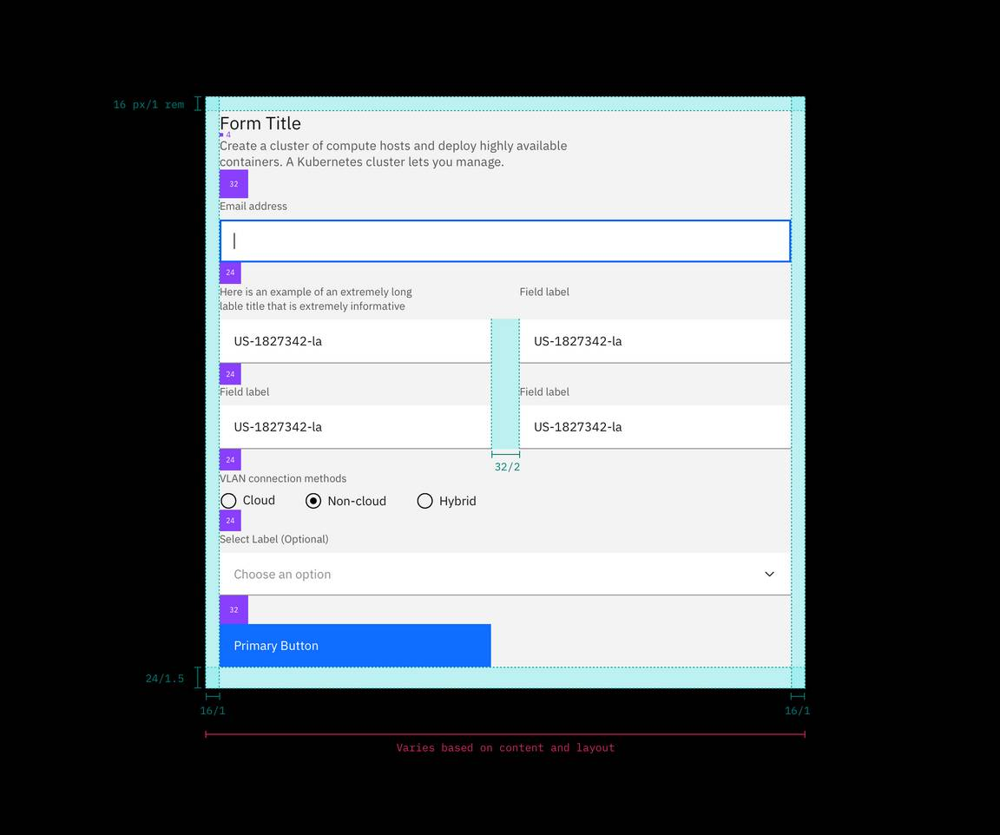

## Color

Inputs come in two different colors. The default input color is `$field-01` and
is used on `$ui-background` and `$ui-02` page backgrounds. The `--light` version
input color is `$field-02` and is used on `$ui-01` page backgrounds.

Refer to the [text input](/components/text-input/usage),
[dropdown](/components/dropdown/usage), [checkbox](/components/checkbox/usage),
[radio button](/components/radio-button/usage),
[toggle](/components/toggle/usage), and [button](/components/button/usage) pages
for specific typography details on each component.

<Caption>
  Example of light fields with $field-02 (left) and the default version with
  $field-01 (right)
</Caption>

## Typography

Form headings and labels should be set in sentence case with the first letter of
the first word capitalized. Refer to the
[text input](/components/text-input/usage),
[dropdown](/components/dropdown/usage), [checkbox](/components/checkbox/usage),
[radio button](/components/radio-button/usage),
[toggle](/components/toggle/usage), and [button](/components/button/usage) pages
for specific typography details on each component.

| Property                       | Font-size (px/rem) | Font-weight   | Type token        |
| ------------------------------ | ------------------ | ------------- | ----------------- |
| Heading                        | 28 / 1.75          | Regular / 400 | `$heading-03`     |
| `.bx--label`                   | 12 / 0.75          | Regular / 400 | `$label-01`       |
| `.bx--text-input`              | 14 / 0.875         | Regular / 400 | `$body-short-01`  |
| `.bx--text-input::placeholder` | 14 / 0.875         | Regular / 400 | `$body-short-01`  |
| `.bx--form-requirement`        | 12 / 0.75          | Regular / 400 | `$label-01`       |
| `.bx--form__helper-text`       | 12 / 0.75          | Regular / 400 | `$helper-text-01` |

## Structure

Forms are made up of several different components. The order in which these
elements are arranged is flexible, but should always follow the spacing
guidelines below.

Forms can be one column or two. The width of each column varies based on the
content and layout of the design. On mobile, forms can only have one column.

All icons can be found on the [icons](/guidelines/icons/library) library page.

### Recommended

| Element              | Property      | px / rem | Spacing token |
| -------------------- | ------------- | -------- | ------------- |
| Form items           | margin-bottom | 24 / 1.5 | `$spacing-06` |
| Title area           | margin-bottom | 32 / 2   | `$spacing-07` |
| Gutter between items | –             | 32 / 2   | `$spacing-07` |
| Buttons              | margin-top    | 32 / 2   | `$spacing-07` |

<Caption>
  Structure and spacing measurements for a double column form | px / rem
</Caption>

<Caption>Structure and spacing measurements</Caption>
