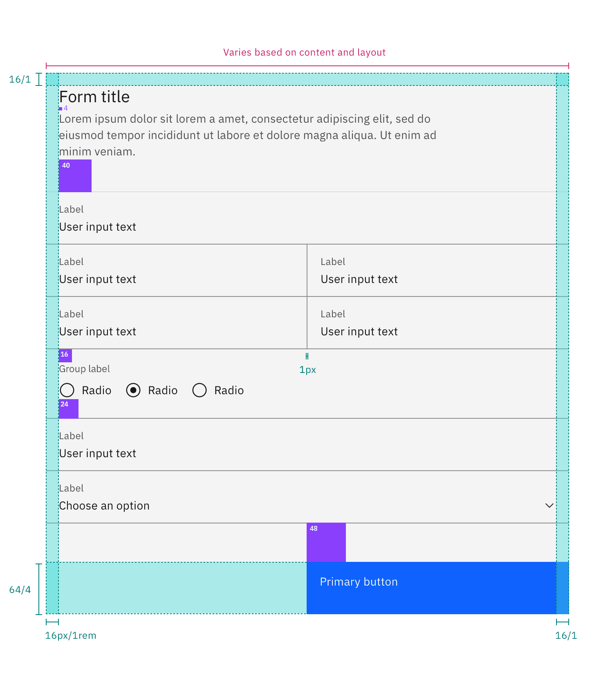

<PageDescription>

The following page documents visual specifications such as color, typography,
structure, and AI presence.

</PageDescription>

<AnchorLinks>

<AnchorLink>Color</AnchorLink>
<AnchorLink>Typography</AnchorLink>
<AnchorLink>Structure</AnchorLink>
<AnchorLink>AI presence</AnchorLink>

</AnchorLinks>

## Color

Refer to the [text input](/components/text-input/usage),
[dropdown](/components/dropdown/usage), [checkbox](/components/checkbox/usage),
[radio button](/components/radio-button/usage),
[toggle](/components/toggle/usage), and [button](/components/button/usage) pages
for specific typography details on each component.

## Typography

Form headings and labels should be set in sentence case with the first letter of
the first word capitalized. Refer to the
[text input](/components/text-input/usage),
[dropdown](/components/dropdown/usage), [checkbox](/components/checkbox/usage),
[radio button](/components/radio-button/usage),
[toggle](/components/toggle/usage), and [button](/components/button/usage) pages
for specific typography details on each component.

| Element       | Font-size (px/rem) | Font-weight   | Type token         |
| ------------- | ------------------ | ------------- | ------------------ |
| Heading       | 28 / 1.75          | Regular / 400 | `$heading-03`      |
| Label         | 12 / 0.75          | Regular / 400 | `$label-01`        |
| Field text    | 14 / 0.875         | Regular / 400 | `$body-compact-01` |
| Helper text   | 12 / 0.75          | Regular / 400 | `$helper-text-01`  |
| Error message | 12 / 0.75          | Regular / 400 | `$label-01`        |

## Structure

Forms are made up of several different components. The order in which these
elements are arranged is flexible and by default the vertical spacing between
elements follow the guidelines below. The vertical spacing in a default form can
be adjusted to be smaller than the default depending on the use case or layout.

Forms can be one column or two. The width of each column varies based on the
content and layout of the design. On mobile, forms can only have one column.

### Recommended for default forms

| Element              | Property      | px / rem | Spacing token |
| -------------------- | ------------- | -------- | ------------- |
| Form items           | margin-bottom | 32 / 2   | `$spacing-07` |
| Title area           | margin-bottom | 40 / 2.5 | `$spacing-08` |
| Gutter between items | –             | 32 / 2   | `$spacing-07` |
| Buttons              | margin-top    | 48 / 3   | `$spacing-09` |

<Caption fullwidth>
  Structure and spacing measurements for a double column form | px / rem
</Caption>

### Recommended for fluid forms

| Element              | Property      | px / rem | Spacing token |
| -------------------- | ------------- | -------- | ------------- |
| Form items           | margin-bottom | 0 px     | –             |
| Title area           | margin-bottom | 40 / 2.5 | `$spacing-08` |
| Gutter between items | –             | 1 px     | –             |
| Buttons              | margin-top    | 48 / 3   | `$spacing-09` |

<Caption>Structure and spacing measurements</Caption>

## AI presence

The following are the unique styles applied to the component when the AI label
is present. Unless specified, all other tokens in the component remain the same
as the non-AI variant. The AI styling spec of individual components inside of
the form can be found on their respective style tabs.

For more information on the AI style elements, see the
[Carbon for AI](/guidelines/carbon-for-ai/) guidelines.

| Element                    | Property         | Token / Size        |
| -------------------------- | ---------------- | ------------------- |
| Form:background            | background-color | `$layer` \*         |
|                            | box-shadow       | `$ai-drop-shadow`   |
|                            | inner-shadow     | `$ai-inner-shadow`  |
| Linear gradient:background | start            | `$ai-aura-start-sm` |
|                            | stop             | `$ai-aura-stop`     |
| Linear gradient:border     | top              | `$ai-border-start`  |
|                            | bottom           | `$ai-border-end`    |
| AI label                   | size             | large               |

<Row>
<Column colLg={8}>

<Caption>Structure and spacing measurements for an AI form.</Caption>

</Column>
</Row>
