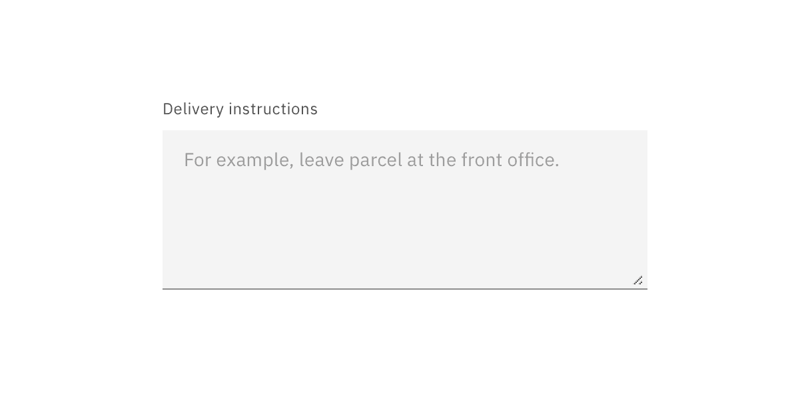
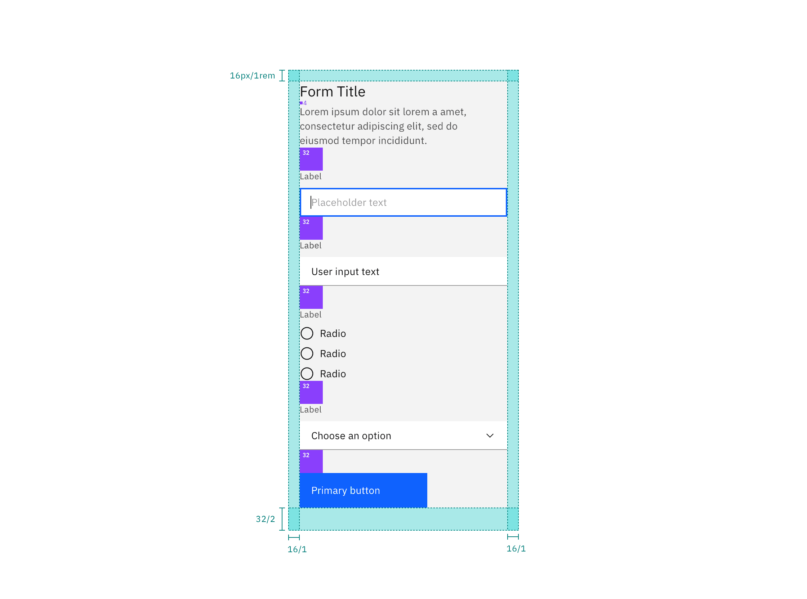
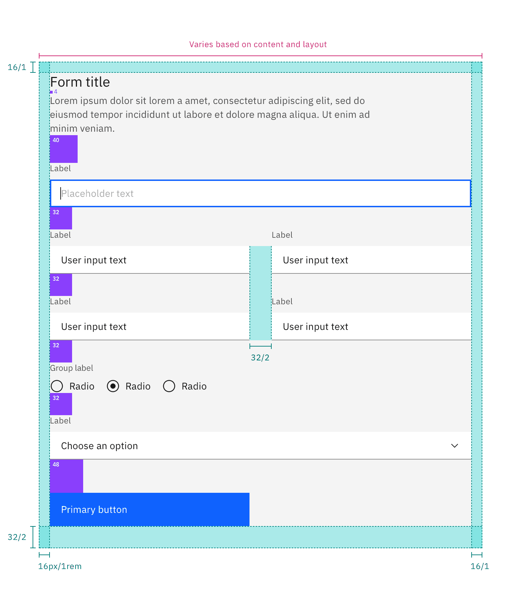

<AnchorLinks>

<AnchorLink>General guidance</AnchorLink>
<AnchorLink>Formatting</AnchorLink>
<AnchorLink>Content</AnchorLink>
<AnchorLink>Behavior</AnchorLink>
<AnchorLink>Accessibility</AnchorLink>
<AnchorLink>Variations</AnchorLink>
<AnchorLink>Style</AnchorLink>
<AnchorLink>Code</AnchorLink>
<AnchorLink>Feedback</AnchorLink>

</AnchorLinks>

## General guidance

Forms are used for submitting data so be as concise as possible when designing. Think about each field and what value the data will provide. What do you gain by collecting this information?

Begin by asking:

- Is this a piece of information that is valuable to us?
- Is this a piece of information that is so valuable that it's worth preventing the user from continuing if they choose not to provide it?

<ComponentCode
  name="Form"
  component="form"
  variation="form"
  hasReactVersion="form--default"
  hasVueVersion="form--default"
  codepen="oOxxRP"></ComponentCode>

## Formatting

### Structure

All forms are comprised of 6 elements:

- **Labels:** Inform users what the corresponding input fields mean.
- **Input fields:** Enable users to provide information. Information can be entered through a variety of different input fields ranging from text fields, checkboxes, and many other types.
- **Help text:** Provides assistance on how to fill out a field. Help text is optional.
- **Placeholder text:** Hints at what goes into a field. Placeholder text is optional.
- **Actions:** Allow users to submit a form.
- **Validation:** Ensures the data submitted by the user conforms to acceptable parameters.

<Row>
<Column colLg={8}>

</Column>
</Row>

### Input fields

Radio buttons are used when there is a list of two or more options that are mutually exclusive and the user must select exactly one choice. In other words, clicking a non-selected radio button will deselect whatever other button was previously selected in the list.

Checkboxes are used when there are lists of options and the user may select any number of choices, including zero, one, or several. In other words, each checkbox is independent of all other checkboxes in the list, so checking one box doesn’t uncheck the others. A stand-alone checkbox, or a toggle can be used for a single option that the user can turn on or off.

Select elements are used for fields in which a single selection is required and there are a large number of possible options.

<Row>
<Column colLg={8}>

</Column>
</Row>

### Optional vs. required fields

All fields in a form are assumed required, with optional fields being tagged as so.

<Row>
<Column colLg={8}>

</Column>
</Row>

### Button placement

On non-modal or in-page forms, align single buttons or Secondary / Primary button groups to the left. Buttons should align with the form controls regardless of the user‘s window width.

<Row>
<Column colLg={8}>

<Caption>Single button alignment in forms</Caption>

</Column>
</Row>

<Row>
<Column colLg={8}>

<Caption>Secondary / Primary button alignment in forms</Caption>

</Column>
</Row>

### Multi step forms

When the primary action implies a navigation step forward, as in a wizard, align single buttons or Secondary/Primary button groups to the right. This position conveys the “next step” intention.

<Row>
<Column colLg={8}>

<Caption>Single button aligment in a wizard</Caption>

</Column>
</Row>

<Row>
<Column colLg={8}>

<Caption>Secondary / Primary button pair alignment in a wizard</Caption>

</Column>
</Row>

## Content 

**Effective form labeling helps users understand what information to enter into a Text Input.** Using a placeholder text as a label is often applied as a space-saving method. However, this is not recommended because it hides context and presents accessibility issues.

**Help text is pertinent information that assists the user in completing a field.** Help text is always available when the input is focused and appears underneath the label. Use sentence-style capitalization, and in most cases, write the text as full sentences with punctuation.

**Placeholder text provides hints or examples of what to enter.** Placeholder text disappears after the user begins entering data into the Input and should not contain crucial information. Use sentence-style capitalization, and in most cases, write the text as a direct statement without punctuation.

**Effective error messaging can help the user to understand the problem and how to fix it.** First, inform the user what has happened, then provide guidance on next steps or possible resolutions. [Inline notifications](/components/notification) can be used to state the general problem with the users input, such as _“Please input the required fields.”_ Inline Notifications can occur pre or post submission, depending on the type of data the user is inputting.

## Behavior

**Where possible, add programmatic assistance.** Detect and pre-fill inputs to reduce errors and save time. When the software can't determine the value that belongs in an input, use type-ahead to make suggestions. Use sentence-case for default values, detected values, and auto-completion text.

**We recommend validating the users data before form submission.** Use visual cues to guide the user as to where the problem lies within the form. This will help to easily identify the elements that need to be corrected.

**The validation should appear when the user has clicked away from the text field.** Once the user corrects the errors within the text field, the validation should disappear once the data is rendered as valid.

**The validation label below the field should be as informative as possible when describing the issue with the users data.** For example, if password limitations require 16 characters, but the user inputs a password with only six characters, the text should read something like, _"Password must be at least 16 characters."_

<Row>
<Column colLg={8}>

</Column>
</Row>

## Accessibility

**Accessibility best practices for labels:**

- Labels must be visible when an input gets focus.
- Labels must be announced to the screen reader on focus.
- Ensure the helper text that appears under an input is read when an assistive technology user stops at an input using ARIA.
- Use sentence-style capitalization (only the first word in a phrase and any proper nouns capitalized).

## Variations 

## Style

### Color

Inputs come in two different colors. The default input color is `$field-01` and is used on `$ui-background` and `$ui-02` page backgrounds. The `--light` version input color is `$field-02` and is used on `$ui-01` page backgrounds.

Refer to the [text input](/components/text-input), [dropdown](/components/dropdown), [checkbox](/components/checkbox), [radio button](/components/radio-button), [toggle](/component/toggle), and [button](/component/button) pages for specific typography details on each component.

<Caption>
  Example of light fields with $field-02 (left) and the default version with
  $field-01 (right)
</Caption>

### Typography

Form headings and labels should be set in sentence case with the first letter of the first word capitalized. Refer to the [text input](/components/text-input), [dropdown](/components/dropdown), [checkbox](/components/checkbox), [radio button](/components/radio-button), [toggle](/component/toggle), and [button](/component/button) pages for specific typography details on each component.

| Property                       | Font-size (px/rem) | Font-weight   | Type token        |
| ------------------------------ | ------------------ | ------------- | ----------------- |
| Heading                        | 28 / 1.75          | Regular / 400 | `$heading-03`     |
| `.bx--label`                   | 14 / 0.875         | Regular / 400 | `$label-01`       |
| `.bx--text-input`              | 14 / 0.875         | Regular / 400 | `$body-short-01`  |
| `.bx--text-input::placeholder` | 14 / 0.875         | Regular / 400 | `$body-short-01`  |
| `.bx--form-requirement`        | 12 / 0.75          | Regular / 400 | `$label-01`       |
| `.bx--form__helper-text`       | 12 / 0.75          | Regular / 400 | `$helper-text-01` |

### Structure

Forms are made up of several different components. The order in which these elements are arranged is flexible, but should always follow the spacing guidelines below.

Forms can be one column or two. The width of each column varies based on the content and layout of the design. On mobile, forms can only have one column.

All icons can be found on the [iconography](/guidelines/iconography/library) library page.

#### Recommended

| Element              | Property      | px / rem | Spacing token |
| -------------------- | ------------- | -------- | ------------- |
| Form items           | margin-bottom | 24 / 1.5 | `$spacing-06` |
| Title area           | margin-bottom | 32 / 2   | `$spacing-07` |
| Gutter between items | –             | 32 / 2   | `$spacing-07` |
| Buttons              | margin-top    | 32 / 2   | `$spacing-07` |

<Caption>
  Structure and spacing measurements for a double column form | px / rem
</Caption>

<Caption>Structure and spacing measurements</Caption>

## Code

<ComponentDocs component="form"></ComponentDocs>

## Feedback
