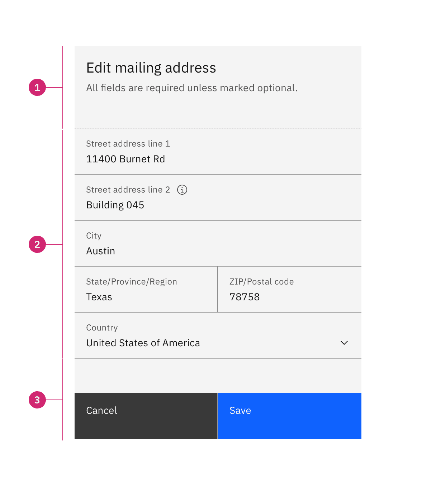
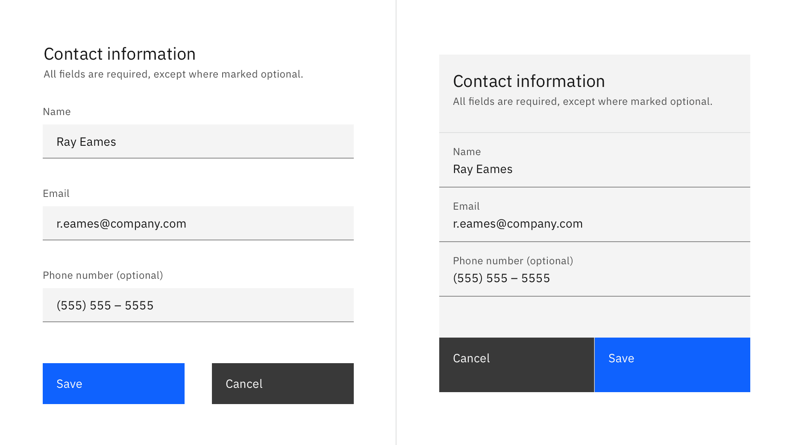
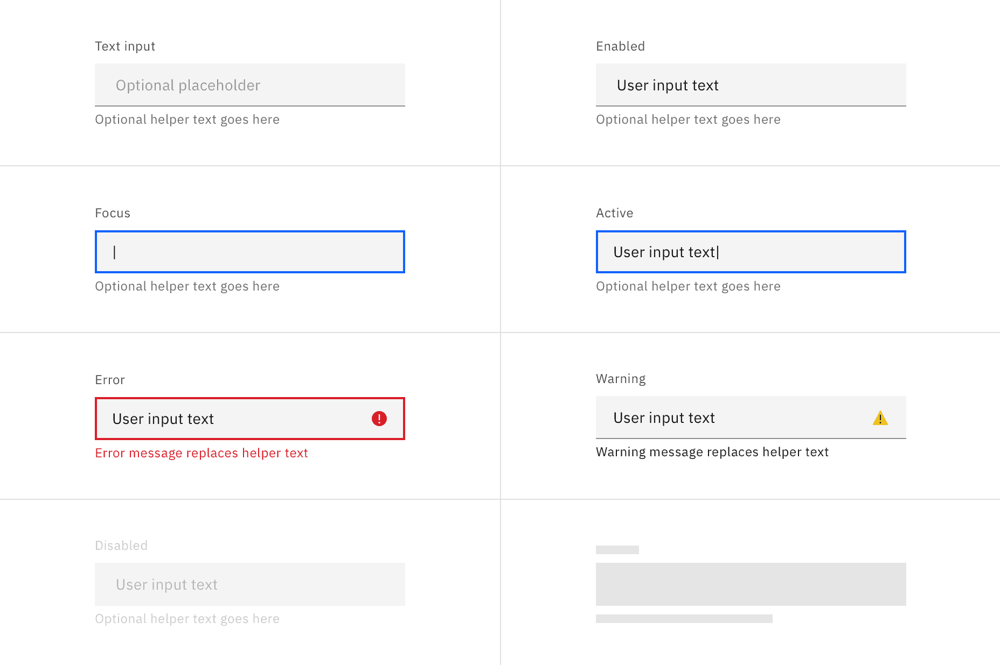
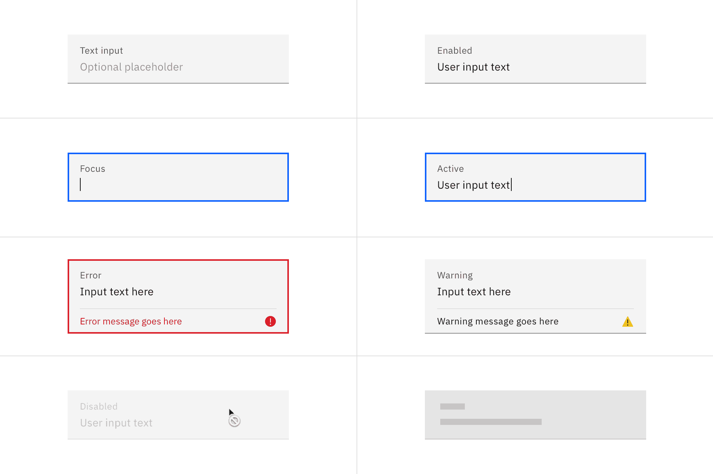
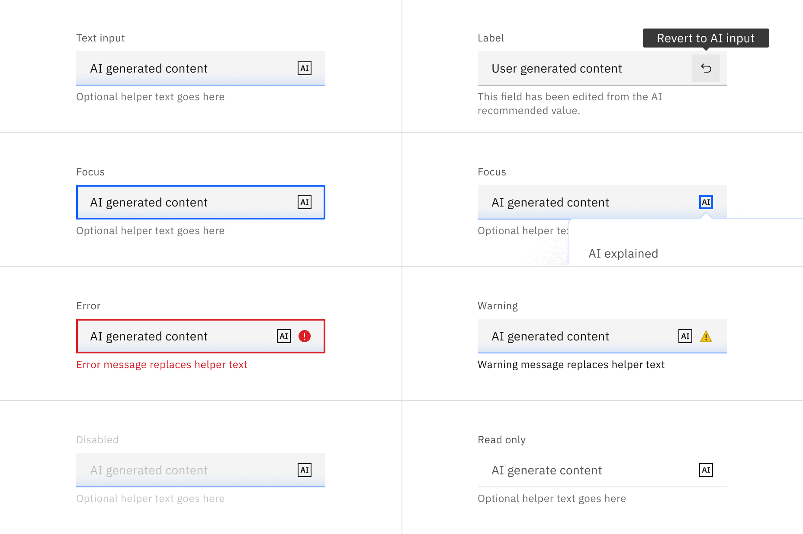
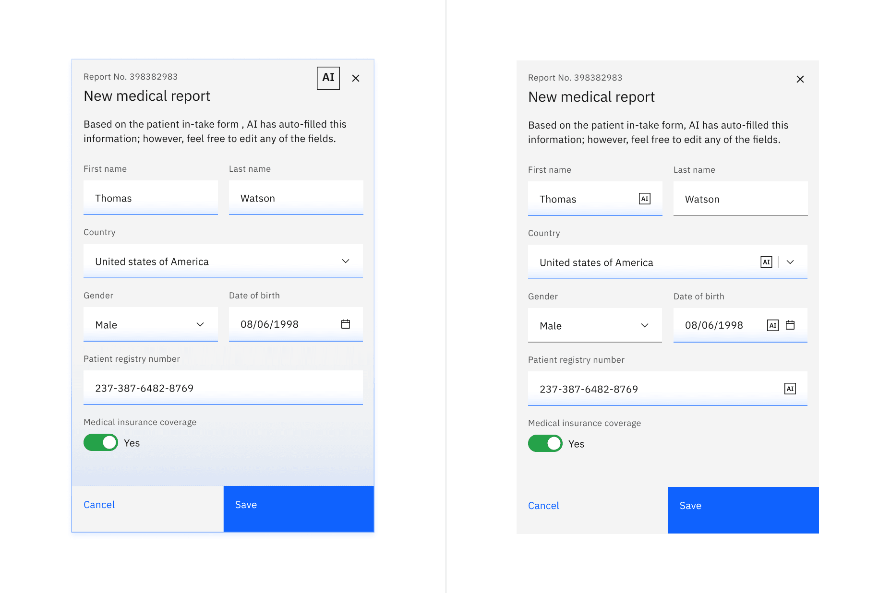

import A11yStatus from 'components/A11yStatus';

<PageDescription>

A form is a group of related input controls that allows users to provide data or
configure options.

</PageDescription>

<InlineNotification>

Form
[with AI label](https://react.carbondesignsystem.com/?path=/story/components-form--with-ai-label)
is now stable. This addition changes the visual appearance of the component and
introduces an AI explainability feature when AI is present in the component. See
the [AI presence](/components/form/usage/#ai-presence) section for more details.

</InlineNotification>

<AnchorLinks>

<AnchorLink>Live demo</AnchorLink>
<AnchorLink>Overview</AnchorLink>
<AnchorLink>Formatting</AnchorLink>
<AnchorLink>Content</AnchorLink>
<AnchorLink>Behaviors</AnchorLink>
<AnchorLink>Additional guidance</AnchorLink>
<AnchorLink>AI presence</AnchorLink>
<AnchorLink>Related</AnchorLink>
<AnchorLink>Feedback</AnchorLink>

</AnchorLinks>

## Live demo

<StorybookDemo
  themeSelector
  tall
  wide
  url="https://react.carbondesignsystem.com"
  variants={[
    {
      label: 'Default',
      variant: 'components-form--default',
    },
    {
      label: 'Fluid (unstable)',
      variant: 'experimental-fluid-components-fluidform--default',
    },
  ]}
/>

<A11yStatus
  layout="cards"
  components={['Form', 'Form group', 'Form label', 'Fluid form']}
/>

## Overview

The form component is configurable to fit various use cases and layouts. It is
purposely simple out of the box, and users are responsible for configuring it to
suit their needs. For in-depth design guidance on the different ways to
configure and extend a form, see the
[form pattern](/patterns/forms-pattern/#spacing).

## Formatting

### Anatomy

<Row>
<Column colLg={8}>

<Tabs>

<Tab label="Default">

</Tab>

<Tab label="Fluid">

</Tab>

</Tabs>

</Column>
</Row>

1. **Header** (optional): The addition of a title and description as a header
   that can provide the user with additional context or instructions.
2. **Form body**: Area where users provide information. Information can be
   entered through various input fields, including text fields, checkboxes, and
   many other types. Input components contain labels and helper text that the
   user submits correct data.
3. **Footer**: Provides actions that allow users to submit or cancel the data
   entered in the form.

### Styling

Forms can use two styles of inputs: default and fluid. They share the same
functionality but look visually different and have different alignment rules.

| Style   | Appearance                                                                                                                                                                                                         | Alignment                                                                         | Use case                                                                                                                                     |
| ------- | ------------------------------------------------------------------------------------------------------------------------------------------------------------------------------------------------------------------ | --------------------------------------------------------------------------------- | -------------------------------------------------------------------------------------------------------------------------------------------- |
| Default | Uses a traditional style of input where the label is positioned outside and above the input field. Default forms can use any of the three default input field sizes: small (32px), medium (40px), or large (48px). | Form inputs are equally stacked with 32px/2rem padding separating each component. | Use when white space is needed between input components, if smaller components are required, or in productive moments like in complex forms. |
| Fluid   | An alternative input style where the label is placed inside the input field and aligned with the user input text. Fluid inputs only have one size at the height of 64px.                                           | Form inputs are stacked flush to one another with 0px of padding between them.    | Use in expressive moments or where larger form components can aid in emphasizing the featured form.                                          |

<Row>
<Column colLg={12}>

</Column>
</Row>

### Alignment

In a form, input components should vertically align with all other form
components. Whether a form aligns flush to grid columns or hangs in the gutters
depends on the style of form input you are using as well as the gutter mode.
Default forms typically use a wide gutter mode and align flush to the grid
columns prioritizing vertical label alignment. Fluid forms use the condensed
grid and can hang into the gutter without causing label misalignment. Fluid
forms are architectural and remain cohesive by never allowing vertical or
horizontal space between inputs.

<DoDontRow>
  <DoDont type="do" caption="Do align default form inputs and labels to the grid columns using the wide gutter mode.">

  </DoDont>
  <DoDont type="dont" caption="Don’t hang default inputs into the grid gutters. Doing so will cause labels to misalign with other form elements.">

  </DoDont>
</DoDontRow>

<DoDontRow>
  <DoDont type="do" caption="Do stack fluid components flush to one another with no spacing between them using the condensed gutter mode.">

  </DoDont>
  <DoDont type="dont" caption="Don’t add vertical or horizontal space between fluid components. Fluid forms are architectural and should remain a cohesive unit.">

  </DoDont>
</DoDontRow>

### Two column forms

If a form has more than one column, then the columns should be proportional and
align to grid columns when possible. The space between form columns is
determined by the gutter mode you are using; default forms use the wide gutter
mode with 32px padding between form columns, versus fluid forms use the
condensed gutter mode with 1px padding. The narrow gutter mode (16px) is
typically not used in forms as it often places the text in the gutter.

<Row>
<Column colLg={8}>

</Column>
</Row>

When using two columns, the row should respond as a group. For example, if the
left column form item becomes invalid and pushes form content down to
accommodate space for an error message, then the accompanying right form item
will also grow to account for the needed space.

<Row>
<Column colLg={8}>

</Column>
</Row>

### Vertical spacing

The typical recommended vertical spacing between components is 32px. For all
guidance and recommendation for spacing for forms, see the
[form pattern](/patterns/forms-pattern/#spacing).

## Content

### Labels

Effective labeling helps users understand what information to enter into a text
input. Text fields should always have a label. There are rare instances where
the context of an input negates the need for a visible label, but we advise you
to consult an accessibility expert before proceeding with a label-less design.

#### Best practices for labels

- Use sentence-style capitalization for all labels except for product names and
  proper nouns.
- Keep the label short and concise.
- Do not use colons after label names.

### Default values

Where possible, add programmatic assistance. Detect and pre-fill inputs to
reduce errors and save time. When the software can’t determine the value that
belongs in an input, use type-ahead to make suggestions. Use sentence-case for
default values, detected values, and auto-completion text.

### Helper text

Optional helper text is pertinent information that assists the user in correctly
completing a field. Helper text should always be available when the input is
focused. It is often used to explain the correct data format. Helper text
appears as persistent text under a default input (helper text is not available
in fluid input, which uses tooltips instead). Helper text is the preferred
method of assisting users because it is always visible for the user to reference
without additional effort.

#### Best practices for helper text

- Use sentence-style capitalization, and in most cases, write the text as full
  sentences with punctuation.
- When used, helper text that appears persistently underneath the field is
  replaced by an error or warning message if a state change occurs.

### Tooltip help

Tooltips can be added inline with a form label if additional non-pertinent
information is needed to assist the user in correctly completing a field, such
as context setting. Tooltip content may include more in-depth information about
the field or the options the user is choosing from. Links to additional
information or references may also be included if needed. In certain situations
where complex instructions or additional context would be appropriate, tooltips
can be used in addition to the helper text. However, it is recommended that all
pertinent assistive information to form completion—such as format content—be
presented simply and directly as helper text under the field and not be in a
tooltip.

<Row>
<Column colLg={8}>

</Column>
</Row>

#### Tooltips in fluid components

Fluid inputs are an exception to the no critical information in tooltips rule.
Due to their architectural nature, fluid inputs do not provide the allotted
space under the field needed for helper text. All assistive text whether
pertinent or additional, is provided through a tooltip when using fluid inputs.

<Row>
<Column colLg={8}>

</Column>
</Row>

### Placeholder text

Optional placeholder text is text that appears inside an input field at a lower
contrast than the user input text. It provides hints or examples of what to
enter. Placeholder text disappears after the user begins entering data into the
input. As such, it should not be used as a replacement for a persistent label
nor should it contain crucial information. Sometimes providing an example of the
kind of thing the user might enter is useful. Using certain examples as
placeholder text is allowed but it still should not contain essential
information.

#### Best practices for placeholder text

- Use sentence-style capitalization, and in most cases, write the text as a
  direct statement without punctuation.
- Placeholder text is not required and by default not shown in text input
  fields.
- Placeholder text can be harmful to user interactions and should only be added
  when necessary.

<Row>
<Column colLg={8}>

</Column>
</Row>

### Further guidance

For further content guidance, see Carbon’s
[content guidelines](/guidelines/content/overview/).

## Behaviors

### Optional versus required fields

Forms items can be labeled as either optional or required depending on several
factors. A common distinction in IBM products for using required or optional is
the forms complexity.

1. **Simple forms** - generally shorter and/or user- or consumer-oriented; such
   as sign-up and contact forms and checkout screens. Most of the fields will
   tend to be required.
2. **Complex forms** - generally longer and product-oriented; contain properties
   and settings that are used to configure Enterprise software.  Although they
   will usually contain at least one required field, the majority of the fields
   will tend to be optional.

Note if the majority of the fields are **required** or **optional**, as the
overall number of form fields for your entire product should inform your
treatment. The pattern used should be consistent throughout your product, or at
minimum, consistent between all of the same types of form within your product.

- If the majority of the fields are required, mark **only** the optional field
  labels with _(optional)_.
- If the majority of the fields are optional, mark **only** the required field
  labels with _(required)_.

<Row>
<Column colLg={8}>

<Tabs>

<Tab label="Optional">

</Tab>

<Tab label="Required">

</Tab>

</Tabs>

</Column>
</Row>

### Form controls

Carbon provides a variety of data input components that enable a user to enter
or select data. The components are divided into three different interaction
types.

| Type                                                         | Overview                                                                                                                                                                                                            |
| ------------------------------------------------------------ | ------------------------------------------------------------------------------------------------------------------------------------------------------------------------------------------------------------------- |
| [Free form inputs](/patterns/forms-pattern/#text-inputs)     | Free-form text inputs are the most commonly used components in forms. They allow a user to enter any configuration of letters or numbers. Common free-form inputs include: text input and text area.                |
| [Selection controls](/patterns/forms-pattern/#data-inputs)   | Selection controls offer users a selection from pre-determined options. Common selection controls include: checkboxes, radio buttons, file uploaders, toggles, and select lists (combo box and multiselect).        |
| [Bound entry controls](/patterns/forms-pattern/#data-inputs) | Bound entry controls allow users to input numeric data, like dates and times and may restrict user input to a certain range. Common bound entry controls include: number input, date picker, and slider components. |

### States

The following are common states that can be applied to components when used in a
form.

| State       | When to use                                                                                                                                                                                                                                                       |
| ----------- | ----------------------------------------------------------------------------------------------------------------------------------------------------------------------------------------------------------------------------------------------------------------- |
| _Enabled_   | When a text input is live but a user is not directly interacting with it. This is commonly referred to as the default or normal state of the component. An enabled text input field can contain no content, placeholder text, or user generate content.           |
| _Active_    | When a user is actively typing content into the field.                                                                                                                                                                                                            |
| _Focus_     | When a user `tabs` to or clicks on the text input, it becomes focused, indicating the user has successfully navigated to the component.                                                                                                                           |
| _Error_     | When the user input is invalid or a required text input has not been filled in. It can also be triggered due to a system error. This state requires a user response before data can be submitted or saved.                                                        |
| _Warning_   | When you need to call the user's attention to an exception condition. The condition might not be an error but can cause problems if not resolved.                                                                                                                 |
| _Disabled_  | When the user is not allowed to interact with the text input due to either permissions, dependencies, or pre-requisites. The disabled state completely removes the interactive function from a component. The styling is not subject to WCAG contrast compliance. |
| _Skeleton_  | Use on an initial page load to indicate that the text input has not yet fully loaded.                                                                                                                                                                             |
| _Read-only_ | _Coming soon!_                                                                                                                                                                                                                                                    |

<Row>
<Column colLg={12}>

<Tabs>

<Tab label="Default">

</Tab>

<Tab label="Fluid">

</Tab>

<Tab label="AI">

</Tab>

</Tabs>

</Column>
</Row>

## Additional guidance

The form pattern provides additional and elaborative guidance to the information
found with the form component. Below is a list of key sections available in the
pattern.

| Topic                                                                             | Overview                                                                                                        |
| --------------------------------------------------------------------------------- | --------------------------------------------------------------------------------------------------------------- |
| [Buttons in forms](/patterns/forms-pattern/#buttons)                              | Provides guidance on button alignment, emphasis, placement, and naming in relation to a form.                   |
| [Errors and validation](/patterns/forms-pattern/#errors-and-validation)           | Effective and immediate error messaging can help the user to understand the problem and how to fix it.          |
| [Form layout](/patterns/forms-pattern/#designing-a-form)                          | Additional guidance around layout, spacing, and columns in a form.                                              |
| [Designing for longer forms](/patterns/forms-pattern/#designing-for-longer-forms) | Techniques to help make longer forms less overwhelming, including guidance for accordion and multistep forms.   |
| [Form variants](/patterns/forms-pattern/#variants)                                | Forms may be presented as dedicated pages, side panels, or dialogs depending on the use case and the situation. |

## AI presence

Form has a modification that takes on the AI visual styling when AI is present
in the form. The AI variants of a form function the same as the normal variants
except for the addition of the AI label, which is both a visual indicator and
the trigger for the explainability popover.

The AI presence in form can appear in two ways: broadly, over the whole form, or
focused, just in certain parts of the form. When the entire form is styled for
AI, it indicates to the user that AI is present in all aspects of the form. If
only a limited amount of the form content is generated by AI, then only those
components should receive the AI presence styling, not the entire form.

For more information on designing for AI, see the
[Carbon for AI](/guidelines/carbon-for-ai/) guidelines.

<Row>
<Column colLg={12}>

<Caption>
  Example of form with full AI presence on the left and component based AI
  presence on the right.
</Caption>

</Column>
</Row>

## Related

<Row>
<Column colSm={2} colMd={2} colLg={3}>

#### Components

- [Button](/components/button/usage)  
- [Checkbox](/components/checkbox/usage)  
- [Combo box](http://react.carbondesignsystem.com/?path=/story/combobox--default)
   
- [Multiselect](http://react.carbondesignsystem.com/?path=/story/multiselect--default)
   
- [Password input](http://react.carbondesignsystem.com/?path=/story/textinput--toggle-password-visibility)
   
- [Radio button](/components/radio-button/usage)  
- [Text area](http://react.carbondesignsystem.com/?path=/story/textarea--default)
   
- [Text input](/components/text-input/usage)  
- [Toggle](/components/toggle/usage)  

</Column>
<Column colSm={2} colMd={2} colLg={3}>

#### Patterns

- [Dialogs](/patterns/dialog-pattern)  
- [Notifications](/patterns/notification-pattern)  

</Column>
</Row>

## Feedback

Help us improve this component by providing feedback, asking questions, and
leaving any other comments on
[GitHub](https://github.com/carbon-design-system/carbon-website/issues/new?assignees=&labels=feedback&template=feedback.md).
