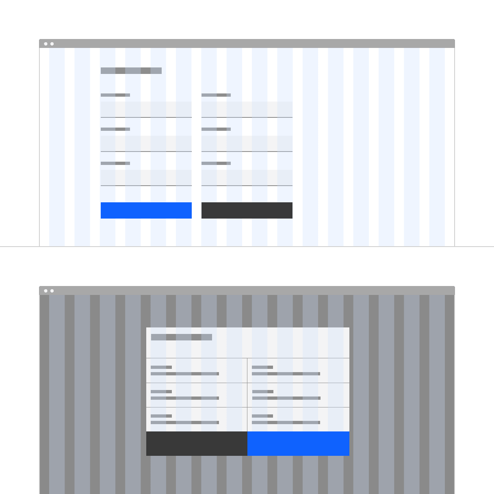
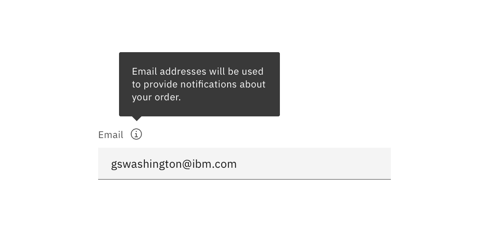
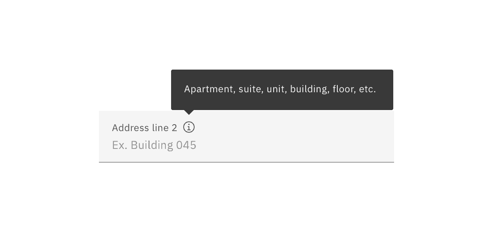

<PageDescription>

A form is a group of related input controls that allows users to provide data or
configure options.

</PageDescription>

<AnchorLinks>

<AnchorLink>Overview</AnchorLink>
<AnchorLink>Live demo</AnchorLink>
<AnchorLink>Formatting</AnchorLink>
<AnchorLink>Form logic</AnchorLink>
<AnchorLink>Validation and errors</AnchorLink>
<AnchorLink>Feedback</AnchorLink>

</AnchorLinks>

## Overview

Forms are used for submitting data so be as concise as possible when designing.
Keep it short. Think about each field and what value the data will provide. What
do you gain by collecting this information?

#### Begin by asking:

- Is this a piece of information that is valuable to us?
- Is this a piece of information that is so valuable that it's worth preventing
  the user from continuing if they choose not to provide it?

## Live demo

<ComponentDemo
  components={[
    {
      id: 'form',
      label: 'Form',
    },
  ]}>
  <ComponentVariant
    id="form"
    knobs={{
      TextInput: ['disabled', 'invalid', 'light', 'type'],
      TextArea: ['disabled', 'invalid', 'light'],
      Select: ['disabled', 'invalid', 'light', 'inline'],
      SelectItem: ['disabled', 'hidden'],
    }}
    links={{
      React: 'https://react.carbondesignsystem.com/?path=/story/form--default',
      Angular:
        'https://angular.carbondesignsystem.com/?path=/story/components-input--label',
      Vue:
        'http://vue.carbondesignsystem.com/?path=/story/components-cvform--default',
      Vanilla: 'https://the-carbon-components.netlify.com/?nav=form',
    }}>{`
  <Form>
  

    <TextInput
      helperText="Optional helper text here; if message is more than one line text should wrap (~100 character count maximum)"
      id="test2"
      invalidText="Invalid error message."
      labelText="Text input label"
      placeholder="Placeholder text"
    />
  

  

  <TextArea
    cols={50}
    helperText="Optional helper text here; if message is more than one line text should wrap (~100 character count maximum)"
    id="test5"
    invalidText="Invalid error message."
    labelText="Text area label"
    placeholder="Placeholder text"
    rows={4}
  />
  

  

    <Select
      defaultValue="placeholder-item"
      id="select-1"
      invalidText="This is an invalid error message."
      labelText="Select"
    >
      <SelectItem
        text="Option 1"
        value="option-1"
      />
      <SelectItem
        text="Option 2"
        value="option-2"
      />
      <SelectItem
        text="Option 3"
        value="option-3"
      />
    </Select>
  

  <Button
    kind="primary"
    tabIndex={0}
    type="submit"
  >
    Submit
  </Button>
</Form>
  `}</ComponentVariant>
</ComponentDemo>

## Formatting

All forms are comprised of six elements:

- **Labels:** Inform users what the corresponding input fields mean.
- **Input fields:** Enable users to provide information. Information can be
  entered through a variety of different input fields ranging from text fields,
  checkboxes, and many other types.
- **Helper text:** Provides assistance on how to fill out a field. Helper text
  is optional.
- **Placeholder text:** Hints at what goes into a field. Placeholder text is
  optional.
- **Actions:** Allow users to submit a form.
- **Validation:** Ensures the data submitted by the user conforms to acceptable
  parameters.

<Row>
<Column colLg={8}>

</Column>
</Row>

### Button placement

On non-modal or in-page forms, align single buttons or Secondary / Primary
button groups to the left. Buttons should align with the form controls
regardless of the user‘s window width.

<Row>
<Column colLg={8}>

<Caption>Single button alignment in forms</Caption>

</Column>
</Row>

<Row>
<Column colLg={8}>

<Caption>Secondary / Primary button alignment in forms</Caption>

</Column>
</Row>

### Multistep forms

When the primary action implies a navigation step forward, as in a wizard, align
single buttons or Secondary/Primary button groups to the right. This position
conveys the “next step” intention.

<Row>
<Column colLg={8}>

<Caption>Single button aligment in a wizard</Caption>

</Column>
</Row>

<Row>
<Column colLg={8}>

<Caption>Secondary / Primary button pair alignment in a wizard</Caption>

</Column>
</Row>

## Content

### Labels

Effective form labeling helps users understand what information to enter into a
Text Input. Using a placeholder text as a label is often applied as a
space-saving method. However, this is not recommended because it hides context
and presents accessibility issues.

#### Accessibility best practices for labels:

- Labels must be visible when an input gets focus.
- Labels must be announced to the screen reader on focus.
- Ensure the helper text that appears under an input is read when an assistive
  technology user stops at an input using ARIA.
- Use sentence-style capitalization (only the first word in a phrase and any
  proper nouns capitalized).

### Default values

Where possible, add programmatic assistance. Detect and pre-fill inputs to
reduce errors and save time. When the software can't determine the value that
belongs in an input, use type-ahead to make suggestions. Use sentence-case for
default values, detected values, and auto-completion text.

### Helper text

Helper text is pertinent information that assists the user in completing a
field. Helper text is always available when the input is focused and appears
underneath the label. Use sentence-style capitalization, and in most cases,
write the text as full sentences with punctuation.

### Placeholder text

Placeholder text provides hints or examples of what to enter. Placeholder text
disappears after the user begins entering data into the Input and should not
contain crucial information. Use sentence-style capitalization, and in most
cases, write the text as a direct statement without punctuation.

## Form logic

- **Radio buttons** are used when there is a list of two or more options that
  are mutually exclusive and the user must select exactly one choice. In other
  words, clicking a non-selected radio button will deselect whatever other
  button was previously selected in the list.
- **Checkboxes** are used when there are lists of options and the user may
  select any number of choices, including zero, one, or several. In other words,
  each checkbox is independent of all other checkboxes in the list, so checking
  one box doesn’t uncheck the others. A stand-alone checkbox, or a toggle can be
  used for a single option that the user can turn on or off.
- **Select elements** are used for fields in which a single selection is
  required and there are a large number of possible options.

<Row>
<Column colLg={8}>

</Column>
</Row>

## Validation and errors

### Error messaging

Effective error messaging can help the user to understand the problem and how to
fix it. First, inform the user what has happened, then provide guidance on next
steps or possible resolutions.
[Inline notifications](/components/notification/usage) can be used to state the
general problem with the users input, such as _“Please input the required
fields.”_ Inline Notifications can occur pre or post submission, depending on
the type of data the user is inputting.

### Form validation

We recommend validating the users data before form submission. Use visual cues
to guide the user as to where the problem lies within the form. This will help
to easily identify the elements that need to be corrected.

The validation should appear when the user has clicked away from the text field.
Once the user corrects the errors within the text field, the validation should
disappear once the data is rendered as valid.

The validation label below the field should be as informative as possible when
describing the issue with the users data. For example, if password limitations
require 16 characters, but the user inputs a password with only six characters,
the text should read something like, _"Password must be at least 16
characters."_

<Row>
<Column colLg={8}>

</Column>
</Row>

### Optional versus required fields

All fields in a form are assumed required, with optional fields being tagged as
so. It is recommended that an instruction precedes the form stating either "All
fields are required" or "All fields are required unless marked optional".

<Row>
<Column colLg={8}>

</Column>
</Row>

## Feedback

Help us improve this component by providing feedback, asking questions, and
leaving any other comments on
[GitHub](https://github.com/carbon-design-system/carbon-website/issues/new?assignees=&labels=feedback&template=feedback.md).
