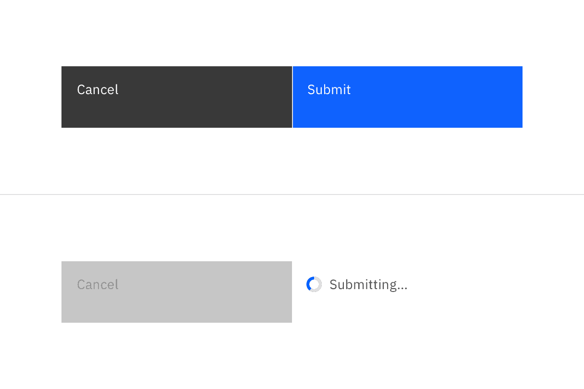
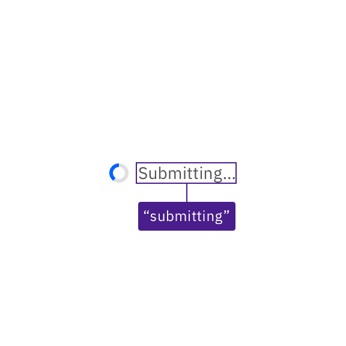
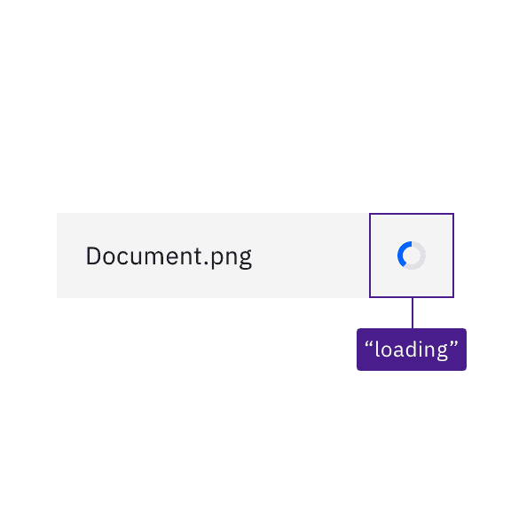

import {
  StructuredListWrapper,
  StructuredListHead,
  StructuredListBody,
  StructuredListRow,
  StructuredListInput,
  StructuredListCell,
  OrderedList,
  ListItem,
} from '@carbon/react';

<PageDescription>

Design annotations are needed for specific instances shown below, but for the
standard inline loading component, Carbon already incorporates accessibility.

</PageDescription>

<AnchorLinks>

<AnchorLink>What Carbon provides</AnchorLink>
<AnchorLink>Development considerations</AnchorLink>

</AnchorLinks>

## What Carbon provides

Carbon bakes keyboard operation into its components, improving the experience of
blind users and others who operate via keyboard. Carbon also incorporates other
accessibility considerations, some of which are described below.

### Keyboard interaction

The inline loading component is not itself keyboard operable; however, when inline loading is in an active state, it may temporarily replace or disable an associated component. For instance, if inline loading is showing the result of a button action, relevant input controls as well as other actions may be disabled (and so be inoperable) until the loading state changes to either error or complete.

<Row>
<Column colLg={8}>

<Caption>
  Inline loading components are not interactive, but may temporarily disable dependent
  components.
</Caption>

</Column>
</Row>

### Labelling and states

Where there is displayed text for the inline loading, Carbon provides that text as the status to assistive technologies like screen readers. Where there is no text, Carbon provides a text equivalent (“loading”) for the loading symbol.

<DoDontRow>
<DoDont
colMd={4} colLg={4}
caption="Inline loading text is provided to assistive technologies.">

</DoDont>
<DoDont
colMd={4} colLg={4}
caption="Where there is no text, Carbon provides a text equivalent for the loading symbol.">

</DoDont>
</DoDontRow>

## Development considerations

Keep these considerations in mind if you are modifying Carbon or creating a custom component.

- Carbon uses an `aria-live` region set to “polite” to surface inline loading text messages, where they are used.
- Where no text is displayed for inline loading, Carbon uses the SVG title of the status icon to surface the status (“active”, “finished”, “error”) to assistive technologies.