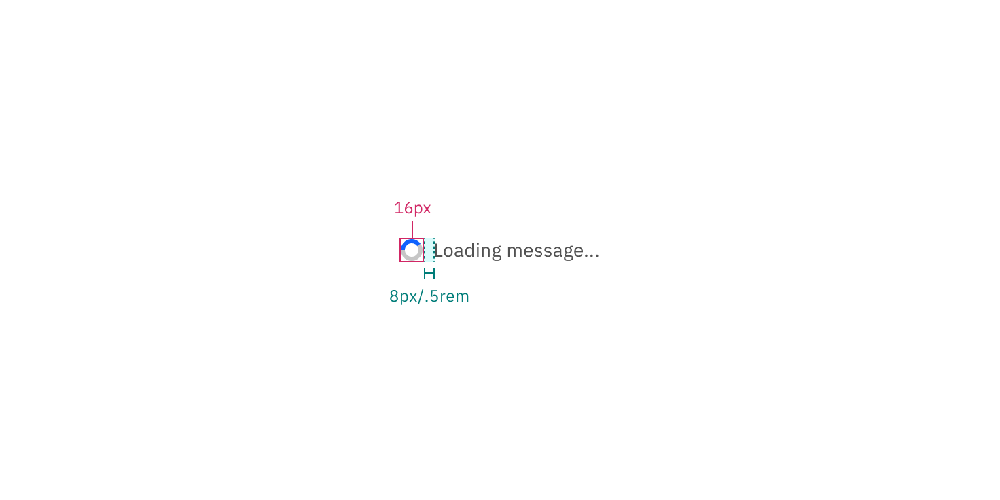
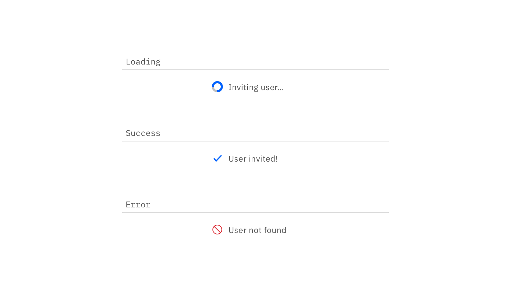

## Color

| Class                            | Property | Color token       |
| -------------------------------- | -------- | ----------------- |
| `.bx--loading__svg`              | stroke   | `$ui-03`          |
| `.bx--inline-loading__checkmark` | color    | `$interactive-01` |
| `.bx--inline-loading__text`      | color    | `$text-01`        |

## Typography

Button text should be set in sentence case, with only the first word in a phrase
and any proper nouns capitalized.

| Class                       | Font-size (px/rem) | Font-weight   | Type token       |
| --------------------------- | ------------------ | ------------- | ---------------- |
| `.bx--inline-loading__text` | 14 / 0.875         | Regular / 400 | `$body-short-01` |

## Structure

| Class     | Property      | px / rem | Spacing token |
| --------- | ------------- | -------- | ------------- |
| Spinner   | width, height | 16 / 1   | –             |
| Checkmark | width, height | 16 / 1   | –             |

<Caption>
  Structure measurements for small and large loading spinner | px / rem
</Caption>

### Placement

The inline loading component should appear during any user action loading. If
button is used to trigger the action, the inline loading component should
replace that button.

<Caption>Example of a inline loading in product context</Caption>
