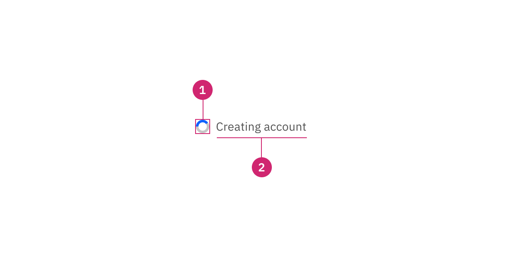
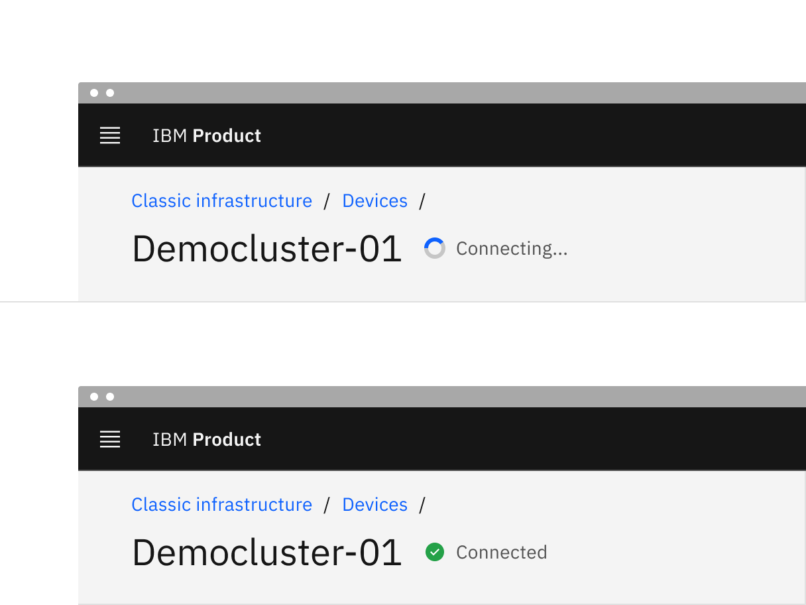
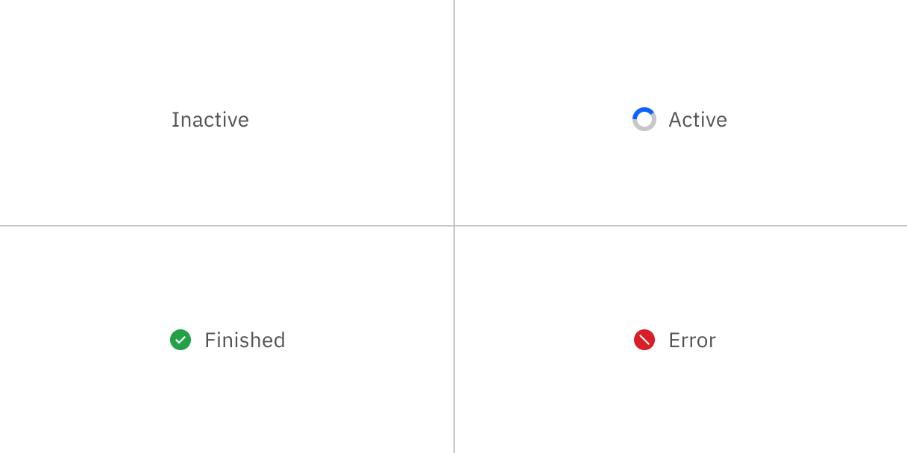
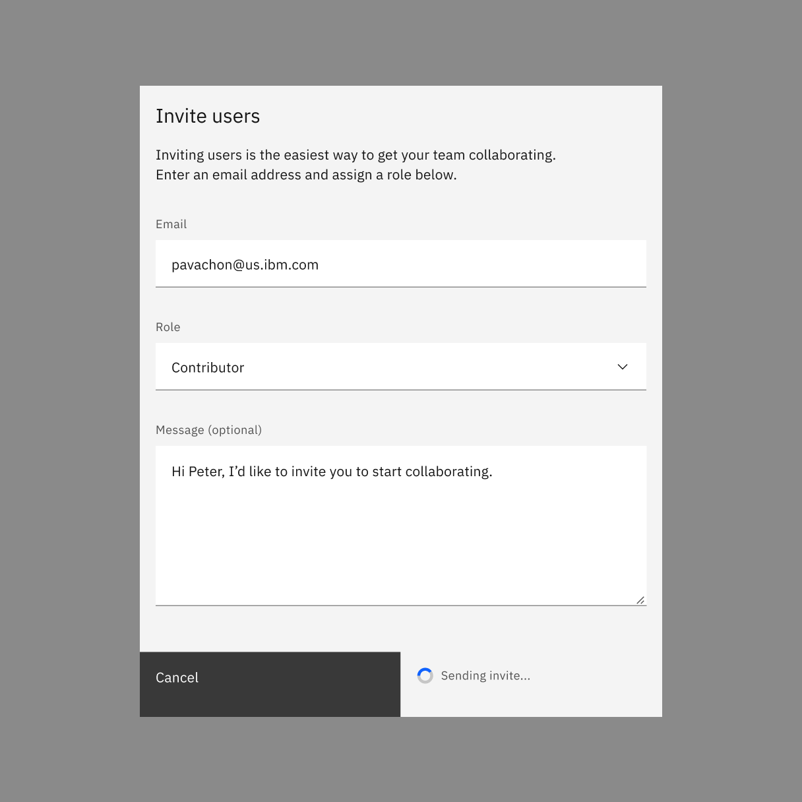

import A11yStatus from 'components/A11yStatus';

<PageDescription>

The inline loading component provides visual feedback that data is being
processed.

</PageDescription>

<AnchorLinks>

<AnchorLink>Live demo</AnchorLink>
<AnchorLink>Overview</AnchorLink>
<AnchorLink>Formatting</AnchorLink>
<AnchorLink>Content</AnchorLink>
<AnchorLink>Behaviors</AnchorLink>
<AnchorLink>Related</AnchorLink>
<AnchorLink>Feedback</AnchorLink>

</AnchorLinks>

## Live demo

<StorybookDemo
  themeSelector
  url="https://react.carbondesignsystem.com"
  variants={[
    {
      label: 'Default',
      variant: 'components-inlineloading--default',
    },
    {
      label: 'Ux example',
      variant: 'components-inlineloading--ux-example',
    },
  ]}
/>

<A11yStatus layout="cards" components="Inline loading" />

## Overview

Inline loading spinners are used to indicate that an action is being processed.
They inform users that their request is in progress, providing reassurance even
though they do not reveal specific details about the back-end process.

Common actions where inline loading is beneficial include create, update, or
delete operations that involve significant data processing. Inline loading can
appear in various contexts, such as within a table, after clicking a primary or
secondary button, or inside a modal.

### When to use

- Use an inline loading component for any action that cannot be performed
  instantly and will only require a short time to process.
- Use when retrieving or refreshing small data amounts, such as status.

### When not to use

- Don't use inline loading for full page loads, use skeleton states instead.
- Don't trigger inline loading on more than one item or action at a time, unless
  on initial page load or refresh.

## Formatting

### Anatomy

<Row>
<Column colLg={8}>

</Column>
</Row>

1. **Loading status**: indicates the state of the loading sequence (active,
   inactive, finished, error).
2. **Label (optional)**: assistive text that explains the loading status.

### Placement

When inline loading temporarily replaces content, it should appear in the same
spot as the content it replaced and maintain the same alignment.

<Row>
<Column colLg={8}>

</Column>
</Row>

## Content

### Main elements

#### Label (optional)

- Descriptive loading text for the action is optional, but encouraged. If you
  have limited room or find adding text to be unnecessary you can just run
  through the animations.
- The label should describe the state of the action being performed. For
  example, if the status is active while a form is being saved, then the label
  should say “Saving ...”.
- Once the loading status changes to finished, the label should change. For
  example, when saving is finished, it would read “Saved”.
- If the loading status changes to error, then the label should change to tell
  the user that an error or failure has occurred.

### Further guidance

For further content guidance, see Carbon's
[content guidelines](/guidelines/content/overview).

## Behaviors

### States

There are four states to inline loading: inactive, active, finished, and error.

<Row>
<Column colLg={8}>

</Column>
</Row>

#### Inactive

The inactive loading state is when no data is being loaded. Inactive has no
visual indicator.

#### Active

The active loading state indicates that the action is still in progress.

#### Finished

The finished loading state indicates that the action completed successfully. The
success state is active for 1.5 seconds before calling an optional function
`onSuccess`. Use the `onSuccess` function to refetch new data, close a modal, or
reset a form. If no function is specified the success state will last
indefinitely.

#### Error

The error loading state indicates that the action did not successfully complete.
If an error occurs, the inline loading component becomes inactive and an inline
notification or error handling within the form should appear.

### Interactions

Any interactive elements associated with the button should be disabled while it
is loading. For example, when a user clicks a button on a modal to submit
information, the button itself displays a loading state and is disabled until
the action is complete. This ensures users cannot interact with the button again
during the process.

<Row>
<Column colLg={8}>

</Column>
</Row>

### Modifiers

If an inline loading icon can gain context from an label, it can be used by
itself without a visible label. It is most commonly used this way inside a field
input.

<Row>
<Column colLg={8}>

</Column>
</Row>

## Related

- [Loading](/components/loading/usage)
- [Skeleton states](https://www.carbondesignsystem.com/patterns/loading-pattern#skeleton-states)
- [Loading pattern](/patterns/loading-pattern)
- [File uploader](/components/file-uploader/usage)

## Feedback

Help us improve this component by providing feedback, asking questions, and
leaving any other comments on
[GitHub](https://github.com/carbon-design-system/carbon-website/issues/new?assignees=&labels=feedback&template=feedback.md).
