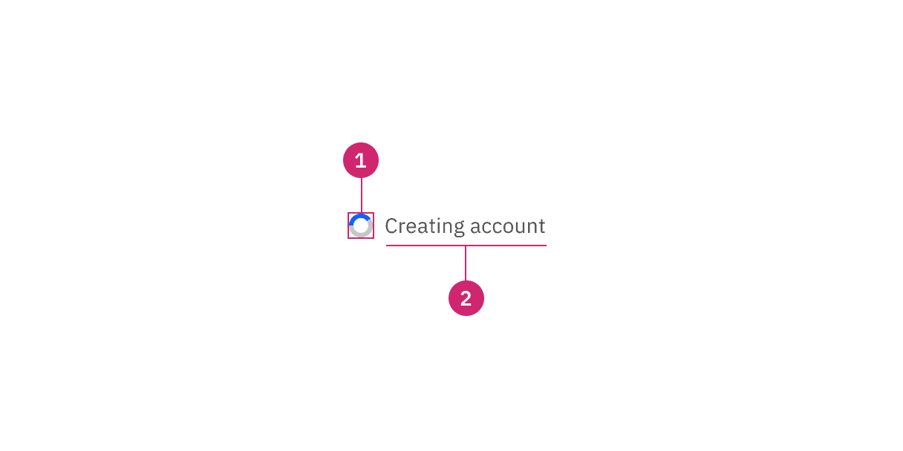
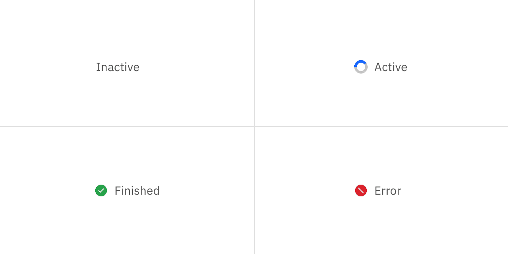
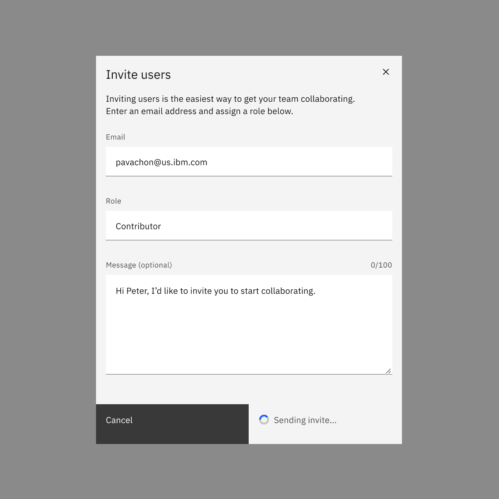
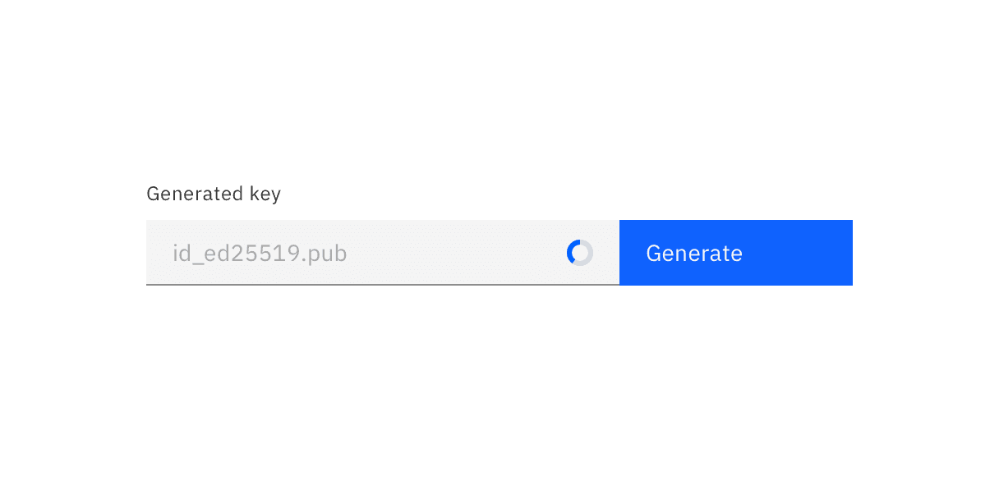

<PageDescription>

The inline loading component provides visual feedback that data is being
processed.

</PageDescription>

<AnchorLinks>

<AnchorLink>Overview</AnchorLink>
<AnchorLink>Live demo</AnchorLink>
<AnchorLink>Formatting</AnchorLink>
<AnchorLink>Content</AnchorLink>
<AnchorLink>Behaviors</AnchorLink>
<AnchorLink>Related</AnchorLink>
<AnchorLink>Feedback</AnchorLink>

</AnchorLinks>

## Overview

Inline loading spinners are used when performing actions. They notify to the
user that their request is being processed. Although they do not provide details
about what is occurring on the back-end, they reassure the user that their
action is being processed.

Common actions that benefit from inline loading include any create, update, or
delete actions that may have a lot of data to process. It can be used in a
table, after a primary or secondary button click, or even in a modal.

### When to use

- Use an inline loading component for any action that cannot be performed
  instantly and will only require a short time to process.
- Use when retrieving or refreshing small data amounts, such as status.

### When not to use

- Don't use inline loading for full page loads, use skeleton states instead.
- Don't trigger inline loading on more than one item or action at a time, unless
  on initial page load or refresh.

## Live demo

<ComponentDemo
  components={[
    {
      id: 'inline-loading',
      label: 'Inline loading',
    },
  ]}>
  <ComponentVariant
    id="inline-loading"
    knobs={{
      InlineLoading: ['status'],
    }}
    links={{
      React:
        'http://react.carbondesignsystem.com/?path=/story/inlineloading--inline-loading',
      Angular:
        'https://angular.carbondesignsystem.com/?path=/story/components-inline-loading--basic',
      Vue:
        'http://vue.carbondesignsystem.com/?path=/story/components-cvinlineloading--default',
      Vanilla: 'https://the-carbon-components.netlify.com/?nav=inline-loading',
    }}>{`
    <InlineLoading description="Loading..." />
  `}</ComponentVariant>
</ComponentDemo>

## Formatting

### Anatomy

<Row>
<Column colLg={8}>

</Column>
</Row>

1. **Loading status**: indicates the state of the loading sequence (active,
   inactive, finished, error).
2. **Label**: assistive text that explains the loading status.

### Placement

When inline loading temporarily replaces content, it should appear in the same
spot as the content it replaced and maintain the same alignment.

<Row>
<Column colLg={8}>

</Column>
</Row>

## Content

### Main elements

Descriptive loading text for the action is optional, but encouraged. If you have
limited room or find adding text to be unnecessary you can just run through the
animations.

#### Active loading label

This is the text that appears while the action is happening. The label should
tell the user what action is being performed. For example, if it appears while a
form is being save then it should say “Saving ...”.

#### Finished loading label

Once the action has finished, the label should change to tell the user that the
action was completed successfully. For example, when saving a form it would read
"Saved" upon completion.

#### Error loading label

If the action fails then the label should change to tell the user that an error
or failure has occurred.

### Further guidance

For further content guidance, see Carbon's
[content guidelines](/guidelines/content/overview).

## Behaviors

### States

There are four states to inline loading: inactive, active, success, and error.

<Row>
<Column colLg={8}>

</Column>
</Row>

#### Inactive

The inactive loading state is when no data is being loaded. Inactive has no
visual indicator.

#### Active

The active loading state indicates that the action is still in progress.

#### Success

The success loading state indicates that the action completed successfully. The
success state is active for 1.5 seconds before calling an optional function
`onSuccess`. Use the `onSuccess` function to refetch new data, close a modal, or
reset a form. If no function is specified the success state will last
indefinitely.

#### Error

The error loading state indicates that the action did not successfully complete.
If an error occurs, the inline loading component becomes inactive and an inline
notification or error handling within the form should appear.

### Interactions

Any interactive elements associated with the item that is loading should be
disabled until the loading is complete. For example, in a file uploader the item
that is loading is disabled until fully uploaded. If the inline loading is being
used to submit a form, the form fields should be disabled until the loading is
complete.

<Row>
<Column colLg={8}>

</Column>
</Row>

### Modifiers

A loading spinner can be used by itself without a label. It is most commonly
used this way inside a field input.

<Row>
<Column colLg={8}>

</Column>
</Row>

## Related

- [Loading](/components/loading/usage)
- [Skeleton states](https://www.carbondesignsystem.com/patterns/loading-pattern#skeleton-states)
- [Loading pattern](/patterns/loading-pattern)

## Feedback

Help us improve this component by providing feedback, asking questions, and
leaving any other comments on
[GitHub](https://github.com/carbon-design-system/carbon-website/issues/new?assignees=&labels=feedback&template=feedback.md).
