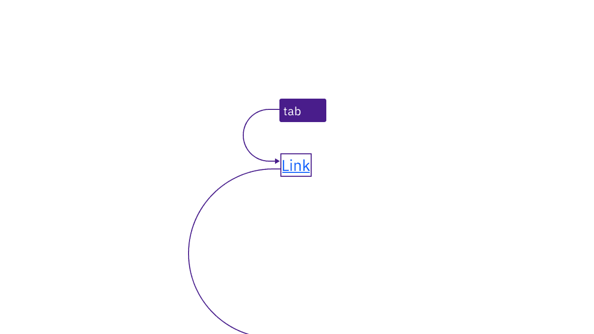

import A11yStatus from 'components/A11yStatus';

import {
  StructuredListWrapper,
  StructuredListHead,
  StructuredListBody,
  StructuredListRow,
  StructuredListInput,
  StructuredListCell,
  OrderedList,
  ListItem,
} from '@carbon/react';

<PageDescription>

Design annotations are needed for specific instances shown below, but for the
standard link component, Carbon already incorporates accessibility.

</PageDescription>

<AnchorLinks>
  <AnchorLink>What Carbon provides</AnchorLink>
  <AnchorLink>Design recommendations</AnchorLink>
  <AnchorLink>Development considerations</AnchorLink>
</AnchorLinks>

## What Carbon provides

Carbon bakes keyboard operation into its components, improving the experience of
blind users and others who operate via the keyboard. Carbon incorporates many
other accessibility considerations, some of which are described below.

### Keyboard interactions

No annotations for keyboard interactions are needed. All links are in the tab
order, and activated with standard keys. Where Carbon links are not persistently
underlined, they receive an underline on focus.

<Row>
<Column colLg={8}>

<Caption>
  Links are reached by Tab key and activated with the Enter key.
</Caption>

</Column>
</Row>

### Contrast

Carbon’s link text and visited link text colors meet the minimum contrast
requirement of 4.5:1 with its background. Carbon also uses a link color and a
visited link color that contrast 3:1 against body text, so that they are
distinguishable even without an underline.

<Row>
<Column colLg={8}>

<Caption>
  Link text has sufficient contrast with both its background and surrounding
  body text.
</Caption>

</Column>
</Row>

<Row>
<Column colLg={8}>

<Caption>
  Visited link text has sufficient contrast with both its background and
  surrounding body text.
</Caption>

</Column>
</Row>

## Design recommendations

### Ensure link context

If your design uses generic link names such as “read more,” consider making them
unique. Otherwise, annotate a connection with other text in the design that
provides context. This will allow developers to implement in a way that
increases accessibility. See the Equal Access Toolkit
[link text topic](https://www.ibm.com/able/toolkit/design/content/#link-text).

<Row>
<Column colLg={8}>

<Caption>
  Annotate the connection between generic links and text that gives context.
</Caption>

</Column>
</Row>

## Development considerations

Keep these considerations in mind if you are modifying Carbon or creating a
custom component.

- Associate generic links such as “read more” with other contextual text, using
  either `aria-describedby` or `aria-labelledby` (to concatenate multiple text
  strings). See the
  [Equal Access Toolkit guidance](https://www.ibm.com/able/toolkit/develop/text-and-non-text/#aria-labelling)
  for more details.
- See the [ARIA authoring practices](https://w3c.github.io/aria-practices/#link)
  for more considerations.

<A11yStatus layout="table" components="Link" />
