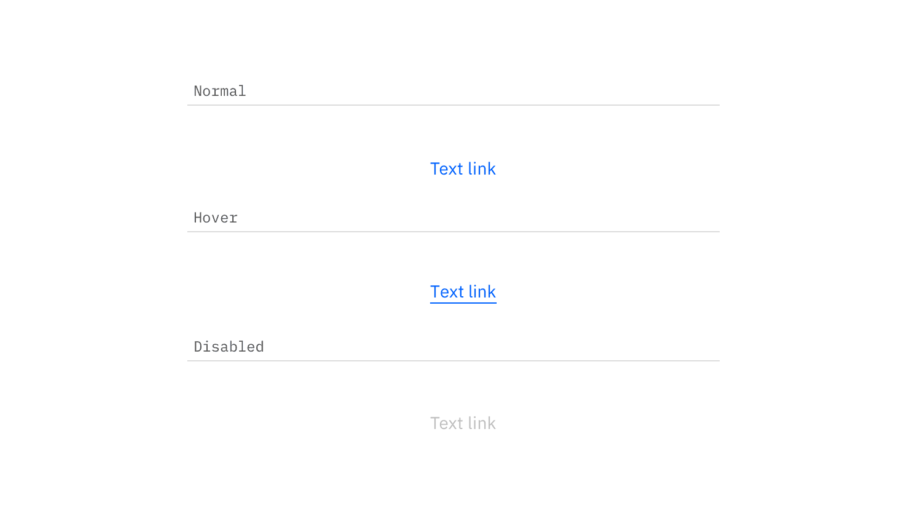
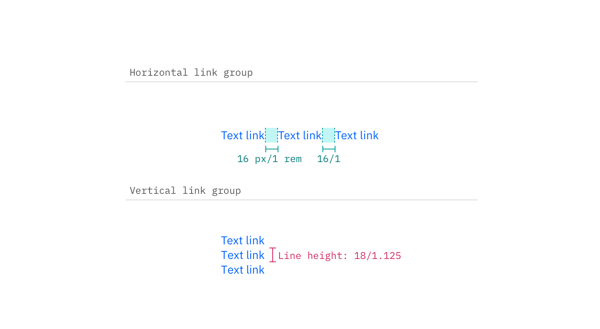

## Color

| Class       | Property | Color token |
| ----------- | -------- | ----------- |
| `.bx--link` | color    | `$link-01`  |

### Interactive states

| Class       | Property   | Color token           |
| ----------- | ---------- | --------------------- |
| `:hover`    | text color | `$hover-primary-text` |
| `:active`   | text color | `$text-01`            |
| `:focus`    | outline    | `$focus`              |
| `:visited`  | text color | `$visited-link`       |
| `:disabled` | text color | `$disabled-02`        |

<Caption>Normal, hover, disabled link states</Caption>

## Typography

Links should not exceed three words.

| Property    | Font-size (px/rem) | Font-weight   | Text style       |
| ----------- | ------------------ | ------------- | ---------------- |
| `.bx--link` | 14 / 0.875         | Regular / 400 | `$body-short-01` |

## Structure

### Recommended

Links can be grouped horizontally or vertically and must be underlined. The
following specs are not built into the Link component but are recommended by
design as the proper distance between grouped Links.

| Class       | Property      | px / rem | Spacing token |
| ----------- | ------------- | -------- | ------------- |
| `.bx--link` | padding-right | 16 / 1   | `$spacing-05` |

<Caption>Structure and spacing measurements for Link | px / rem</Caption>
