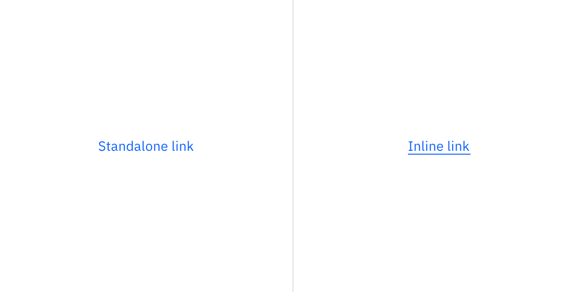
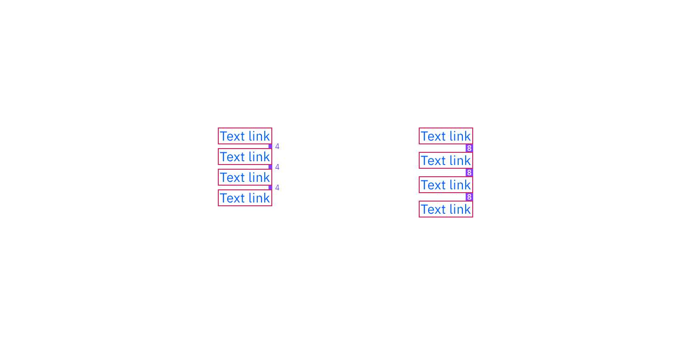

## Color

| Class       | Property | Color token |
| ----------- | -------- | ----------- |
| `.bx--link` | color    | `$link-01`  |

<Row>
<Column colLg={8}>

</Column>
</Row>

### Interactive states

| Class       | Property   | Color token           |
| ----------- | ---------- | --------------------- |
| `:hover`    | text color | `$hover-primary-text` |
| `:active`   | text color | `$text-01`            |
| `:focus`    | outline    | `$focus`              |
| `:visited`  | text color | `$visited-link`       |
| `:disabled` | text color | `$disabled-02`        |

<Row>
<Column colLg={8}>

</Column>
</Row>

## Typography

There are three size variants for the link component: default, small, and large.

| Property        | Font-size (px/rem) | Font-weight   | Text style        |
| --------------- | ------------------ | ------------- | ----------------- |
| `.bx--link`     | 14 / 0.875         | Regular / 400 | `$body-short-01`  |
| `.bx--link--sm` | 12 / 0.75          | Regular / 400 | `$helper-text-01` |
| `.bx--link--lg` | 16 / 1             | Regular / 400 | `$body-short-02`  |

<Row>
<Column colLg={8}>

</Column>
</Row>

## Structure

### Recommended

Links can be grouped horizontally or vertically. The following specs are not
built into the link component but are recommended by design as the proper
distance between grouped Links.

| Class       | Property       | px / rem | Spacing token |
| ----------- | -------------- | -------- | ------------- |
| `.bx--link` | padding-right  | 16 / 1   | `$spacing-05` |
| `.bx--link` | padding-bottom | 4 / 0.25 | `$spacing-02` |
| `.bx--link` | padding-bottom | 8 / 0.5  | `$spacing-03` |

<Caption>Structure and spacing measurements for Link | px / rem</Caption>
