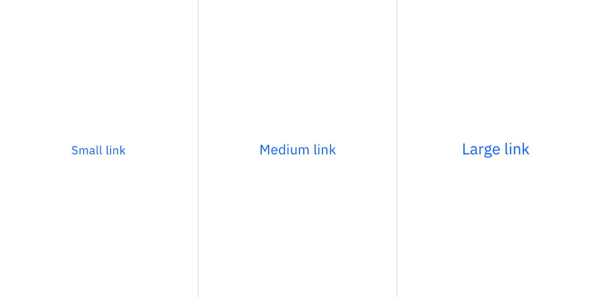
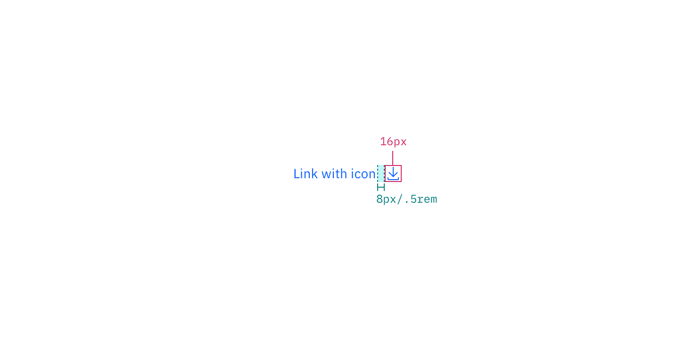

## Color

| Element | Property   | Color token     |
| ------- | ---------- | --------------- |
| Link    | text-color | `$link-primary` |

<Row>
<Column colLg={8}>

</Column>
</Row>

### Interactive states

| State    | Property   | Color token           |
| -------- | ---------- | --------------------- |
| Hover    | text-color | `$link-primary-hover` |
| Active   | text-color | `$text-primary`       |
| Focus    | border     | `$focus`              |
| Visited  | text-color | `$link-visited`       |
| Disabled | text-color | `$text-disabled`      |

<Row>
<Column colLg={8}>

</Column>
</Row>

## Typography

There are three size variants for the link component: small, medium, and large.

| Element | Font-size (px/rem) | Font-weight   | Type token         |
| ------- | ------------------ | ------------- | ------------------ |
| Small   | 12 / 0.75          | Regular / 400 | `$helper-text-01`  |
| Medium  | 14 / 0.875         | Regular / 400 | `$body-compact-01` |
| Large   | 16 / 1             | Regular / 400 | `$body-compact-02` |

<Row>
<Column colLg={8}>

</Column>
</Row>

## Structure

### Recommended

Links can be grouped horizontally or vertically. The following specs are not
built into the link component but are recommended by design as the proper
distance between grouped links.

| Element | Property       | px / rem | Spacing token |
| ------- | -------------- | -------- | ------------- |
| Link    | padding-right  | 16 / 1   | `$spacing-05` |
|         | padding-bottom | 4 / 0.25 | `$spacing-02` |
|         | padding-bottom | 8 / 0.5  | `$spacing-03` |
| Icon    | padding-left   | 8 / 0.5  | `$spacing-03` |

<Caption>Structure and spacing measurements for Link | px / rem</Caption>

<Caption>
  Structure and spacing measurements for Link with icon | px / rem
</Caption>
