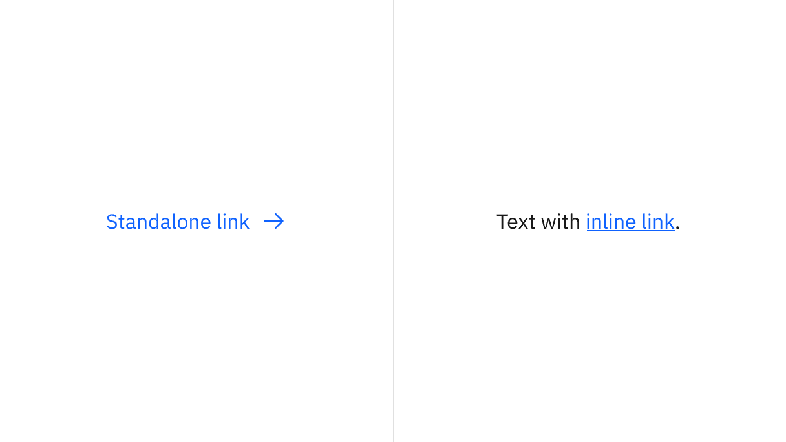
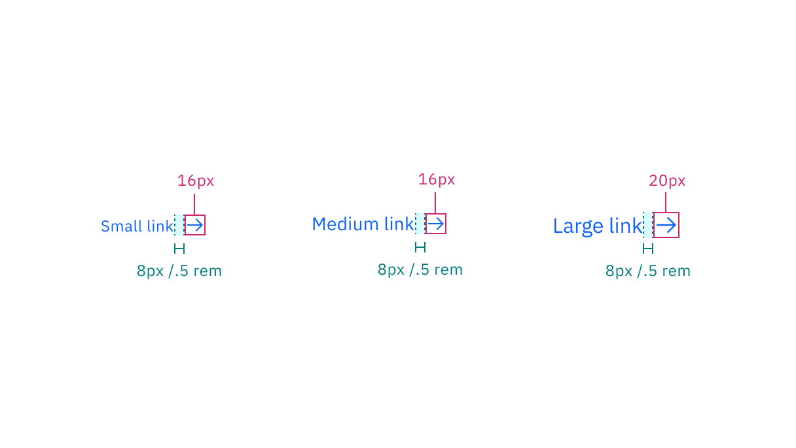

<PageDescription>

The following page documents visual specifications such as color, typography,
structure, and size.

</PageDescription>

<AnchorLinks>

<AnchorLink>Color</AnchorLink>
<AnchorLink>Typography</AnchorLink>
<AnchorLink>Structure</AnchorLink>
<AnchorLink>Size</AnchorLink>
<AnchorLink>Feedback</AnchorLink>

</AnchorLinks>

## Color

| Element | Property   | Color token     |
| ------- | ---------- | --------------- |
| Link    | text-color | `$link-primary` |
| Icon    | svg        | `$link-primary` |

<Row>
<Column colLg={8}>

</Column>
</Row>

### Interactive state color

| Element   | State    | Property   | Color token           |
| --------- | -------- | ---------- | --------------------- |
| Link text | Hover    | text-color | `$link-primary-hover` |
|           | Focus    | text-color | `$link-primary`       |
|           | Active   | text-color | `$text-primary`       |
|           | Visited  | text-color | `$link-visited`       |
|           | Disabled | text-color | `$text-disabled`      |
| Icon      | Hover    | svg        | `$link-primary-hover` |
|           | Focus    | svg        | `$link-primary`       |
|           | Active   | svg        | `$icon-primary`       |
|           | Visited  | svg        | `$link-visited`       |
|           | Disabled | svg        | `$icon-disabled`      |
| Border    | Focus    | border     | `$focus`              |
|           | Active   | border     | `$focus`              |

<Row>
<Column colLg={8}>

</Column>
</Row>

## Typography

There are three sizes for links: small, medium, and large.

| Element | Font-size (px/rem) | Font-weight   | Type token         |
| ------- | ------------------ | ------------- | ------------------ |
| Small   | 12 / 0.75          | Regular / 400 | `$helper-text-01`  |
| Medium  | 14 / 0.875         | Regular / 400 | `$body-compact-01` |
| Large   | 16 / 1             | Regular / 400 | `$body-compact-02` |

<Row>
<Column colLg={8}>

</Column>
</Row>

## Structure

There are three link sizes—large, medium, and small. However, the width of a
link is determined by the length of the link's text.

Links can be grouped vertically or horizontally. The following specs are not
developed for the link component but are recommended by design as the proper
distance between grouped links.

| Element                     | Property       | px / rem | Spacing token |
| --------------------------- | -------------- | -------- | ------------- |
| Link text                   | padding-right  | 16 / 1   | `$spacing-05` |
|                             | padding-bottom | 4 / 0.25 | `$spacing-02` |
|                             | padding-bottom | 8 / 0.5  | `$spacing-03` |
| Icon: small and medium link | svg            | 16 x 16  | –             |
| Icon: large link            | svg            | 20 x 20  | –             |

<Caption fullwidth>
  Structure and spacing measurements for Link with icon | px / rem
</Caption>

<Caption>Structure and spacing measurements for Link grouping | px</Caption>

## Size

There are three fixed heights of links—small (16px), medium (18px), and large
(22px).

| Size   | Height     |
| ------ | ---------- |
| Small  | 16 / 1     |
| Medium | 18 / 1.125 |
| Large  | 22 / 1.375 |

<Row>
<Column colLg={8}>

</Column>
</Row>

<Caption>Sizing applies to both standalone and inline links</Caption>

## Feedback

Help us improve this component by providing feedback, asking questions, and
leaving any other comments on
[GitHub](https://github.com/carbon-design-system/carbon-website/issues/new?assignees=&labels=feedback&template=feedback.md).
