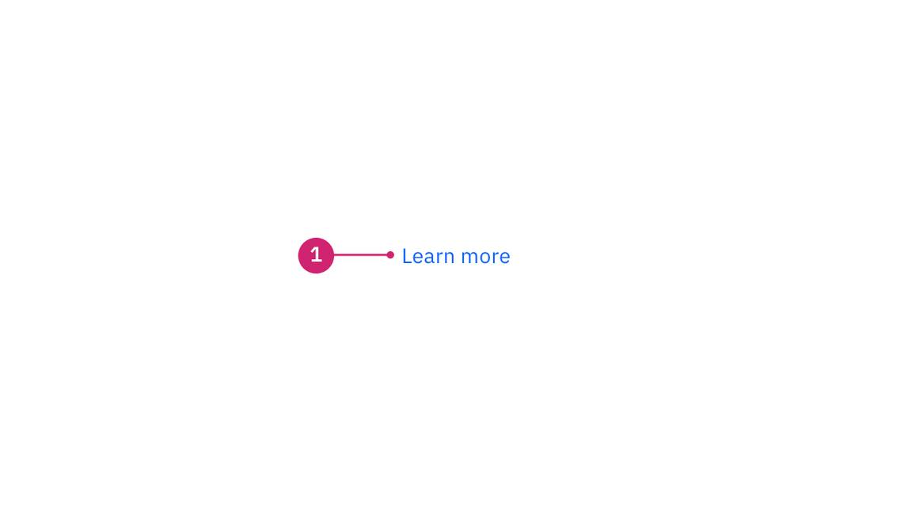
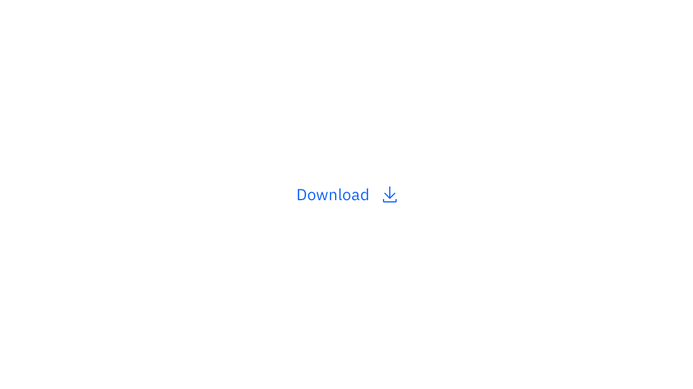

<PageDescription>

Links are used as navigational elements. They may appear on their own, within a
sentence or paragraph, or directly following the content.

</PageDescription>

<AnchorLinks>

<AnchorLink>Overview</AnchorLink>
<AnchorLink>Live demo</AnchorLink>
<AnchorLink>Formatting</AnchorLink>
<AnchorLink>Content</AnchorLink>
<AnchorLink>Behaviors</AnchorLink>
<AnchorLink>Link variants</AnchorLink>
<AnchorLink>Modifiers</AnchorLink>
<AnchorLink>Related</AnchorLink>
<AnchorLink>Feedback</AnchorLink>

</AnchorLinks>

## Overview

Links are used as navigational elements and can be used on their own or inline
with text. They provide a lightweight option for navigation but like other
interactive elements, too many links will clutter a page and make it difficult
for users to identify their next steps. This is especially true for inline
links, which should be used sparingly.

### When to use

Use links when you want users to:

- Navigate to a different page within the application
- Navigate to an entirely different site
- Jump to an element on the same page
- Link to emails or phone numbers

### When not to use

Use a button instead of a link for actions that will change data or manipulate
how it is displayed, change a state, or trigger an action. Buttons should never
be used for navigational actions.

### Variants

| Variant                        | Usage                                                                                                                                                               |
| ------------------------------ | ------------------------------------------------------------------------------------------------------------------------------------------------------------------- |
| [Standalone](#standalone-link) | These links are the default link variant. They are used on their own or directly following content and they do not use underlines. They can be paired with an icon. |
| [Inline](#inline-link)         | Inline links are used within a sentence or paragraph and are styled with an underline. They should not be paired with an icon.                                      |

## Live demo

<ComponentDemo
  components={[
    {
      id: 'link',
      label: 'Link',
    },
  ]}>
  <ComponentVariant
    id="link"
    knobs={{ Link: ['disabled', 'inline'] }}
    links={{
      React: 'https://react.carbondesignsystem.com/?path=/story/link--default',
      Angular:
        'https://angular.carbondesignsystem.com/?path=/story/components-link--basic',
      Vue:
        'http://vue.carbondesignsystem.com/?path=/story/components-cvlink--a',
      Vanilla: 'https://the-carbon-components.netlify.com/?nav=link',
    }}>{`
  <Link href="#">Link</Link>
  `}</ComponentVariant>
</ComponentDemo>

## Formatting

### Anatomy

<Row>
<Column colLg={8}>

</Column>
</Row>

1. **Label:** Communicates what is being linked to.

## Content

We recommend links be three words or fewer. Because links take users to a new
location, it is important that their labels accurately reflect the content users
will find at the link destination. Use meaningful labels for links and avoid
terms like "click here" or the web address itself.

Links need to be clear enough to be understood by the user, but should not be so
long that the text wraps unless used inline.

For further content guidance, see IBM Accessibility on
[link purpose](https://www.ibm.com/able/guidelines/ci162/link_purpose.html).

## Behaviors

### Interactions

#### Mouse

Users can open a link by clicking anywhere along the link text or on the
associated icon.

#### Keyboard

Users can open a link by pressing `Enter` while the link has focus. For
additional keyboard interactions, see the Accessibility tab.

#### Screen readers

VoiceOver: Users can open a link by pressing `Control-Option-Space` or `Enter`.

JAWS: Users can open a link by pressing `Enter`.

NVDA: Users can open a link by pressing `Enter`.

For additional information, see
[screen reader tests](accessibility/#macos-screen-reader-tests).

## Link variants

### Standalone link

Standalone links are used on their own directly following content. They should
not be used within sentences or paragraphs. Standalone links are the default
link style for Carbon and only have an underline in the hover state.

The standalone link component can be paired with an icon. Use 16px icons and
place them to the right of the link. Icons should always be the same color as
the link text.

<Row>
<Column colLg={8}>

</Column>
</Row>

### Inline link

Inline links are used in sentences or paragraphs of text. The inline link
behaves the same as the standalone link but it is styled with an underline. This
helps differentiate them from the text they are placed next to and makes it
clear users can interact with them.

Inline links should not be used on their own and should not be paired with
icons.

<Row>
<Column colLg={8}>

</Column>
</Row>

## Modifiers

### Visited style

By default, the link component does not use a visited style. Visited links
indicate that a user has already opened the link so they can be a helpful
indicator during task completion. Visited styles should be used sparingly
because they often clutter the the page and add further visual noise as users
are trying to navigate a product. They can be used if it is important that a
user knows they have already clicked on a link.

### Links that trigger actions

Some links trigger actions to aid task completion in addition to navigation.
These links should still serve a navigation purpose. A common example is linking
phone numbers so clicking the website automatically opens and calls the phone
number when clicked. The label and any accompanying icons should make it clear
what action will be triggered and where the user will be directed.

## Related

- [Button component](https://www.carbondesignsystem.com/components/button/usage/)

## Feedback

Help us improve this component by providing feedback, asking questions, and
leaving any other comments on
[GitHub](https://github.com/carbon-design-system/carbon-website/issues/new?assignees=&labels=feedback&template=feedback.md).
