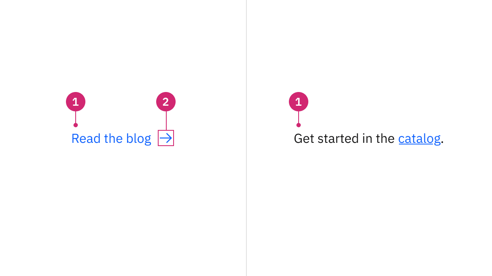
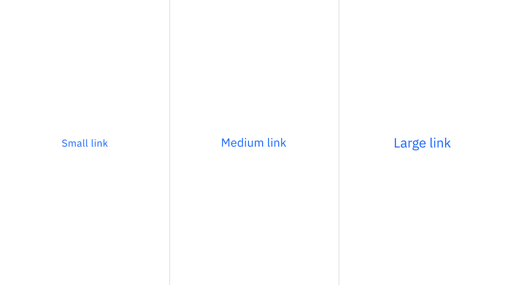
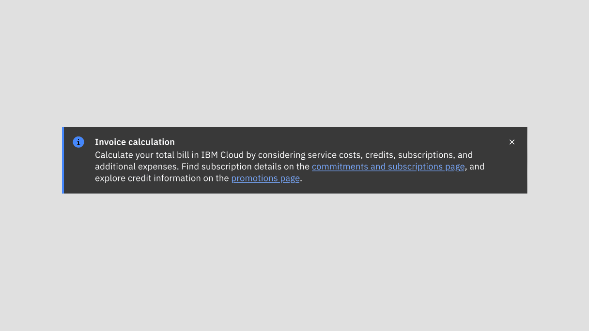
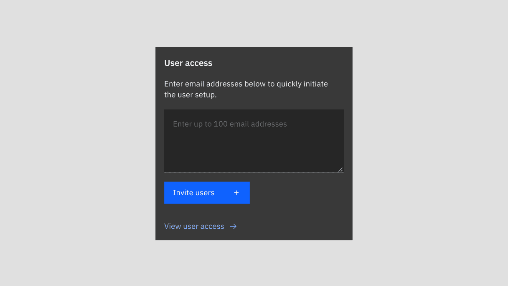
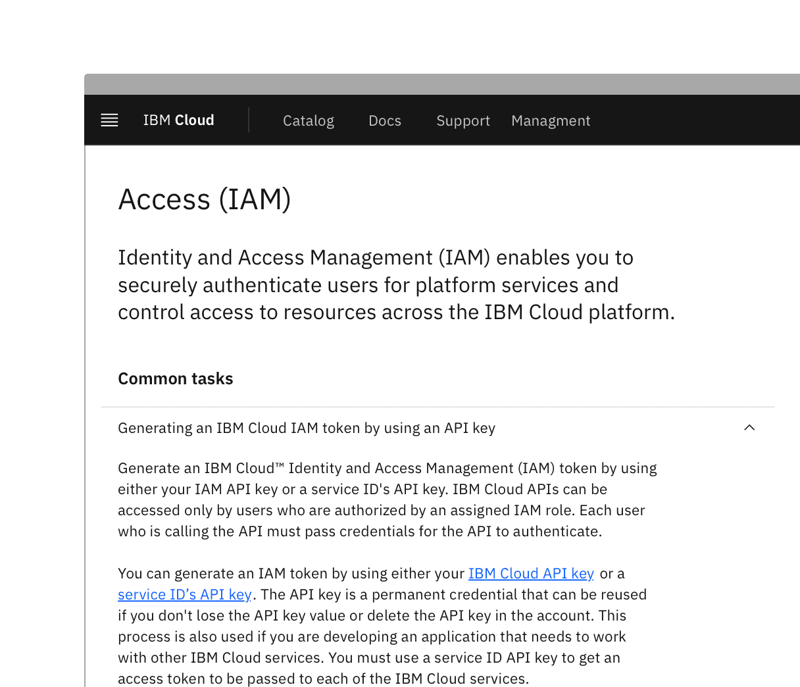
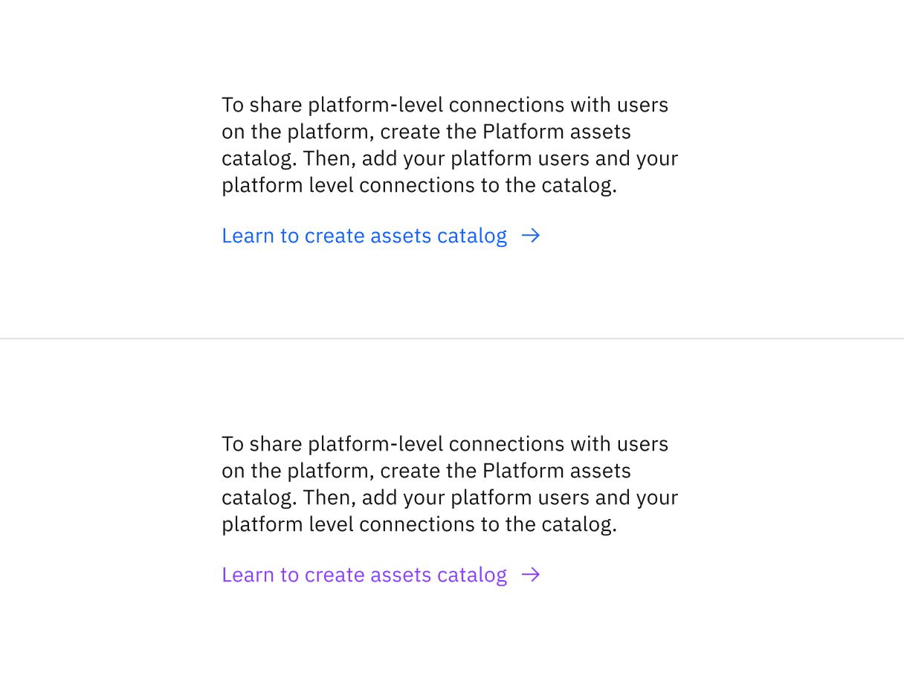
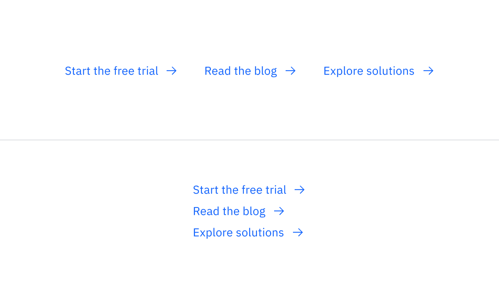

import A11yStatus from 'components/A11yStatus';

<PageDescription>

Links are used as navigational elements. They navigate users to another
location, such as a different site, resource, or section within the same page.

</PageDescription>

<AnchorLinks>

<AnchorLink>Live demo</AnchorLink>
<AnchorLink>Overview</AnchorLink>
<AnchorLink>Formatting</AnchorLink>
<AnchorLink>Content</AnchorLink>
<AnchorLink>Universal behaviors</AnchorLink>
<AnchorLink>Standalone link</AnchorLink>
<AnchorLink>Inline link</AnchorLink>
<AnchorLink>Modifiers</AnchorLink>
<AnchorLink>Related</AnchorLink>
<AnchorLink>Reference</AnchorLink>
<AnchorLink>Feedback</AnchorLink>

</AnchorLinks>

## Live demo

<StorybookDemo
  themeSelector
  url="https://react.carbondesignsystem.com"
  variants={[
    {
      label: 'Default',
      variant: 'components-link--default',
    },
    {
      label: 'Paired with icon',
      variant: 'components-link--paired-with-icon',
    },
  ]}
/>

<A11yStatus layout="cards" components="Link" />

## Overview

Links are used as navigational elements and can be used on their own or inline
with text. They provide a lightweight option for navigation, but like other
interactive elements, too many links will clutter a page and make it difficult
for users to identify their next steps. This is especially true for inline
links, which should be used sparingly.

### When to use

Use links when you want users to:

- Navigate to a different page within the application
- Navigate to an entirely different site
- Jump to an element on the same page
- Link to emails or phone numbers

### When not to use

Do not use links for actions that will change data or manipulate how it is
displayed, change a state, or trigger an action. Instead, use
[buttons](https://carbondesignsystem.com/components/button/usage/) to guide
users to specific actions.

Do not use images as links. Instead, use a
[tile](https://carbondesignsystem.com/components/tile/usage/) that can contain
an image and additional information such as links.

### Variants

| Variant                        | Usage                                                                                                        |
| ------------------------------ | ------------------------------------------------------------------------------------------------------------ |
| [Standalone](#standalone-link) | Used on their own or directly following content and do not use underlines. They can be paired with an icon.  |
| [Inline](#inline-link)         | Used within a sentence or paragraph and is styled with an underline. They should not be paired with an icon. |

## Formatting

### Anatomy

<Row>
<Column colLg={8}>

</Column>
</Row>

1. **Link text:** Communicates what is being linked to.
2. **Icon (optional)** Indicates the destination or type of content being.
   referenced

### Sizing

There are three size variants for the link component: small, medium, and large.
Inline link sizes should match the type size of the text it is inline with.
Standalone link sizes should match the default body copy size of the page.

| Size   | Height (px / rem) |
| ------ | ----------------- |
| Small  | 16 / 1            |
| Medium | 18 / 1.125        |
| Large  | 22 / 1.375        |

<Row>
<Column colLg={8}>

</Column>
</Row>

<Caption>Sizing applies to both standalone and inline links</Caption>

### Placement

Inline links usually sit within a sentence or paragraph, while standalone links
can sit on their own, separated from other text. Consider reducing the number of
inline links in a single sentence to simplify the message.

<Row>
<Column colLg={8}>

</Column>
</Row>

<Caption>Example of inline link in a notification</Caption>

<Row>
<Column colLg={8}>

</Column>
</Row>

<Caption>Example of standalone link in a card</Caption>

## Content

#### Link text

- Use distinctive and meaningful link text.
- Ensure that links accurately reflect the content users will find at the link
  destination.
- If your design uses generic link names such as “read more,” consider making
  them unique. See the
  [Accessibility](https://carbondesignsystem.com/components/link/accessibility#ensure-link-context)
  tab for more information.
- Avoid using the same link text for different destinations on the same page and
  try to differentiate between links by using unique text for each.
- Ensure links are understandable but not excessively long, especially if they
  wrap.

#### Icon indicator

Use the appropriate icon to convey the link destination. It’s common to use the
“launch” icon for external links and the “arrow right” icon for internal links.
Whatever icons you choose to use, ensure that the same icons are used
consistently for navigating to or launching new pages.

### Further guidance

For further content guidance, see Carbon's
[Content guidelines](https://carbondesignsystem.com/guidelines/content/overview/).

## Universal behaviors

## States

List has six main states – enabled (unvisited), hover, focus, active, visited,
and disabled. Learn more about states on the
[Style](https://carbondesignsystem.com/components/link/style) tab.

| State               | When to use                                                                                                                       |
| ------------------- | --------------------------------------------------------------------------------------------------------------------------------- |
| Enabled (unvisited) | This is the default state of a link. When the user has not clicked on a link yet.                                                 |
| Hover               | When the user hovers the cursor over a link.                                                                                      |
| Focus               | When the user tabs to or clicks on the link, it becomes focused, indicating the user has successfully navigated to the component. |
| Active              | When the user is clicking on a link.                                                                                              |
| Visited             | When the user has previously clicked on unvisited links. There’s a change in the color token as `$link-visited`.                  |
| Disabled            | When a user cannot interact with the link. Links could be temporarily inactive or unavailable.                                    |

### Interactions

#### Mouse

Users can open a link by clicking anywhere on the link text or on the associated
icon.

#### Keyboard

Users can open a link by pressing `Enter` while the link has focus. For
additional keyboard interactions, see the
[Accessibility](https://carbondesignsystem.com/components/link/accessibility#keyboard-interactions)
tab.

### Responsive behavior

Clicking or activating on a link can:

- Open up a modal with read-only information
- Navigate the user to a new page, changing the URL and causing a browser
  refresh
- Support jumps to different sections within the same page
- Open web resources such as images, videos, or HTML documents

### Clickable areas

Both standalone and inline links are clickable across the entire width of the
text. Standalone link with an icon has an expanded clickable area that includes
the icon.

<Row>
<Column colLg={8}>

</Column>
</Row>

<Caption>Standalone and inline links with their clickable areas</Caption>

## Standalone link

Standalone links are used on their own directly following content. They should
not be used within sentences or paragraphs. Standalone links are the default
link style for Carbon and only have an underline in the hover state, focus
state, and active state.

The standalone link component can be paired with an icon. Icons should always be
the same color as the link text. When necessary, utilize appropriate icons to
distinguish them from ghost buttons or inline links when they appear within the
same context or page.

<Row>
<Column colLg={8}>

</Column>
</Row>

<Caption>Example shows the standalone link within context</Caption>

### Inline link

Inline links are used in sentences or paragraphs of text. The inline link
behaves the same as the standalone link but it is styled with an underline. This
helps differentiate them from the text they are placed next to and makes it
clear users can interact with them.

Inline links should not be used on their own and should not be paired with
icons.

<Row>
<Column colLg={8}>

</Column>
</Row>

<Caption>Example shows inline links within the body text</Caption>

## Modifiers

### Visited style

By default, the link component does not use a visited style. Visited links
indicate that a user has already opened the link so they can be a helpful
indicator during task completion. Visited styles should be used sparingly
because they often clutter the page and add further visual noise as users are
trying to navigate a product. They can be used to show users they have already
clicked on a link if it's important.

<Row>
<Column colLg={8}>

</Column>
</Row>

<Caption>Example shows unvisited and visited links</Caption>

### Links that trigger actions

Some links trigger actions to aid task completion in addition to navigation.
These links should still serve a navigation purpose. A common example is linking
phone numbers, so clicking the website automatically opens and calls the phone
number when clicked. The link text and any accompanying icons should clarify
what action will be triggered and where the user will be directed.

<Row>
<Column colLg={8}>

</Column>

</Row>

<Caption>Example shows inline links for email</Caption>

<DoDontRow>
  <DoDont type="do" caption="Do use links when actions navigate users to resources">

  </DoDont>
  <DoDont type="dont" caption="Do not use buttons when actions serve as a navigation purpose">

  </DoDont>
</DoDontRow>

### Link grouping

<InlineNotification>

**Code unavailability** The following specs are not developed for the link
component but are recommended by design as the proper distance between grouped
links. View the [Style](https://carbondesignsystem.com/components/link/style/)
tab for details.

</InlineNotification>

Links can be grouped horizontally or vertically. One variation displays links in
a horizontal row with an icon and is typically used within the main body of the
page. Vertical links are typically used for resource links on the side of the
main page content or additional links in tiles.

<Row>
<Column colLg={8}>

</Column>
</Row>

<Caption>Example shows horizontal and vertical grouping of links</Caption>

## Related

#### Button

Buttons are used to initialize an action. Button labels express what action will
occur when the user interacts with it. For further guidance, see Carbon’s
[button](https://www.carbondesignsystem.com/components/button/usage/).

#### Tile

Tiles are a highly flexible component for displaying a wide variety of content,
including information, getting started, how-to, next steps, and more. For
further guidance, see Carbon’s
[tile](https://carbondesignsystem.com/components/tile/usage/).

## Reference

Jakob Nielsen,
[Guidelines for Visualizing Links](https://www.nngroup.com/articles/guidelines-for-visualizing-links/),
(Nielsen Norman Group, 2004)

## Feedback

Help us improve this component by providing feedback, asking questions, and
leaving any other comments on
[GitHub](https://github.com/carbon-design-system/carbon-website/issues/new?assignees=&labels=feedback&template=feedback.md).
