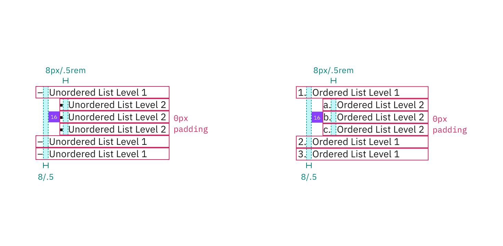

<PageDescription>

The following page documents visual specifications such as color, typography,
and structure.

</PageDescription>

<AnchorLinks>

<AnchorLink>Color</AnchorLink>
<AnchorLink>Typography</AnchorLink>
<AnchorLink>Structure</AnchorLink>
<AnchorLink>Feedback</AnchorLink>

</AnchorLinks>

## Color

Both the unordered and ordered list variants share the same color properties.

| Element | Property   | Color token     |
| ------- | ---------- | --------------- |
| Item    | text-color | `$text-primary` |

<Row>
<Column colLg={8}>

</Column>
</Row>

<Caption>Example of unordered and ordered list color</Caption>

## Typography

List items should use sentence case, that is, only the first word and any proper
nouns are capitalized. In IBM product, use the 14px options below. For IBM.com,
use the larger expressive 16px options.

| Element                   | Font-size (px/rem) | Font-weight   | Type token |
| ------------------------- | ------------------ | ------------- | ---------- |
| Item                      | 14 / 0.875         | Regular / 400 | `$body-01` |
| Item: nested              | 14 / 0.875         | Regular / 400 | `$body-01` |
| Item (expressive)         | 16 / 1             | Regular / 400 | `$body-02` |
| Item: nested (expressive) | 16 / 1             | Regular / 400 | `$body-02` |

## Structure

There are two types of lists: **unordered** and **ordered**. In unordered lists,
level 1 markers are dashes, while level 2 markers are squares. In ordered lists,
level 1 markers are numbers, and level 2 markers are letters. Both follow the
same structural properties.

| Element       | Property      | px / rem | Spacing token |
| ------------- | ------------- | -------- | ------------- |
| Item: Level 1 | margin-bottom | 0        | –             |
| Item: Level 2 | margin-bottom | 0        | –             |
|               | padding-left  | 16 / 1   | `$spacing-05` |

<Caption>
  Structure and spacing measurements for an unordered and an ordered list | px /
  rem
</Caption>

## Feedback

Help us improve this component by providing feedback, asking questions, and
leaving any other comments on
[GitHub](https://github.com/carbon-design-system/carbon-website/issues/new?assignees=&labels=feedback&template=feedback.md).
