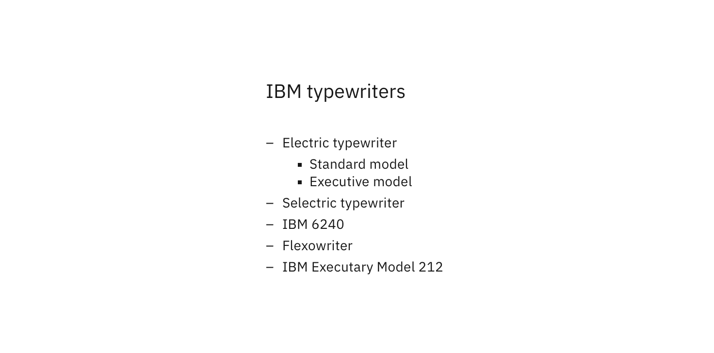

<ComponentDemo
  components={[
    {
      id: "ordered",
      label: "Ordered list",
    },
    {
      id: "unordered",
      label: "Unordered list",
    },
  ]}
>
  <ComponentVariant
    id="ordered"
    links={{
      React:
        "https://react.carbondesignsystem.com/?path=/story/orderedlist--default",
      Angular:
        "https://angular.carbondesignsystem.com/?path=/story/components-list--basic",
      Vue:
        "http://vue.carbondesignsystem.com/?path=/story/components-cvlist--default",
      Vanilla: "https://the-carbon-components.netlify.com/?nav=list",
    }}
  >{`
    <OrderedList>
      <ListItem>
        Ordered List level 1
      </ListItem>
      <ListItem>
        Ordered List level 1
        <OrderedList nested>
          <ListItem>
            Ordered List level 2
          </ListItem>
          <ListItem>
            Ordered List level 2
          </ListItem>
          <ListItem>
            Ordered List level 2
          </ListItem>
        </OrderedList>
      </ListItem>
      <ListItem>
        Ordered List level 1
      </ListItem>
    </OrderedList>
  `}</ComponentVariant>
  <ComponentVariant
    id="unordered"
    links={{
      React:
        "https://react.carbondesignsystem.com/?path=/story/unorderedlist--default",
      Angular:
        "https://angular.carbondesignsystem.com/?path=/story/components-list--basic",
      Vue:
        "http://vue.carbondesignsystem.com/?path=/story/components-cvlist--default",
      Vanilla: "https://the-carbon-components.netlify.com/?nav=list",
    }}
  >{`
      <UnorderedList>
        <ListItem>
          Unordered List level 1
        </ListItem>
        <ListItem>
          Unordered List level 1
          <UnorderedList nested>
            <ListItem>
              Unordered List level 2
            </ListItem>
            <ListItem>
              Unordered List level 2
            </ListItem>
            <ListItem>
              Unordered List level 2
            </ListItem>
          </UnorderedList>
        </ListItem>
        <ListItem>
          Unordered List level 1
        </ListItem>
      </UnorderedList>
  `}</ComponentVariant>
</ComponentDemo>

## General guidance

_Lists_ consist of related content grouped together and organized vertically.

## Variations

| List type       | Purpose                                                                            |
| --------------- | ---------------------------------------------------------------------------------- |
| Unordered lists | To present content of equal status or value.                                       |
| Ordered lists   | Imply sequence and order, and are commonly used when giving a set of instructions. |

## Content

#### Length

Generally, lists should be used to present simple pieces of information. For more complex sets of data, consider using a [data table](/components/data-table/usage).

#### Order

Arrange list items in a logical way. For example, if the list is about resource use, the default order might be highest resource use to lowest. Grouping items in categories into smaller, more specific lists might be more meaningful in some contexts. Alternatively, organize in alphabetical or numeric order.

#### Text

Use list items that are grammatically parallel. For example, do not mix passive voice with active voice or declarative sentences (statements) with imperative sentences (direct command).

<Row>
<Column colLg={8}>

</Column>
</Row>
