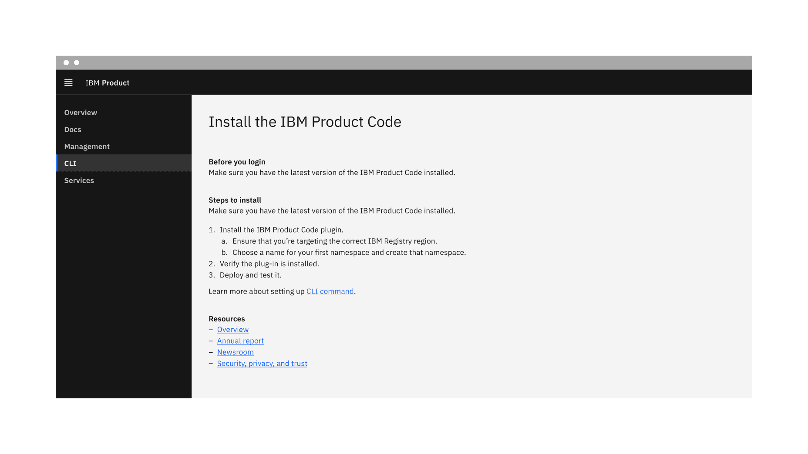
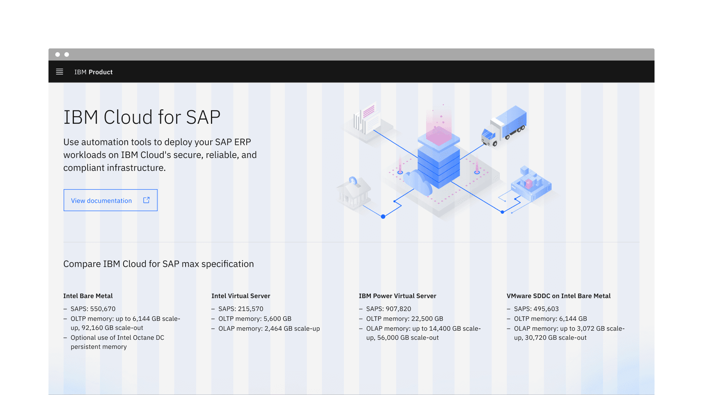
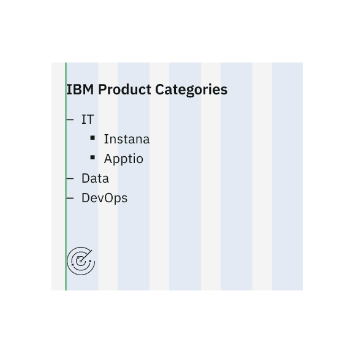
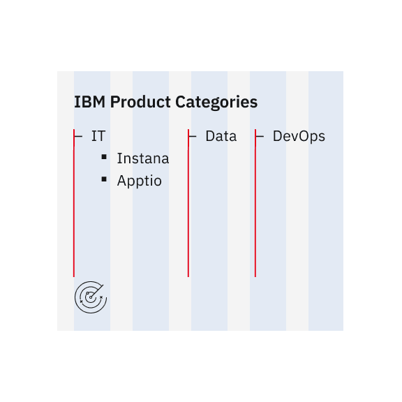
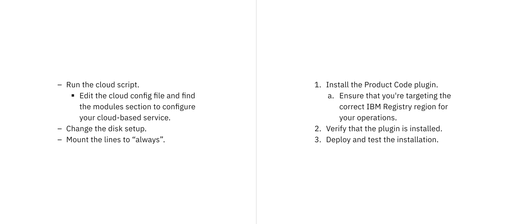
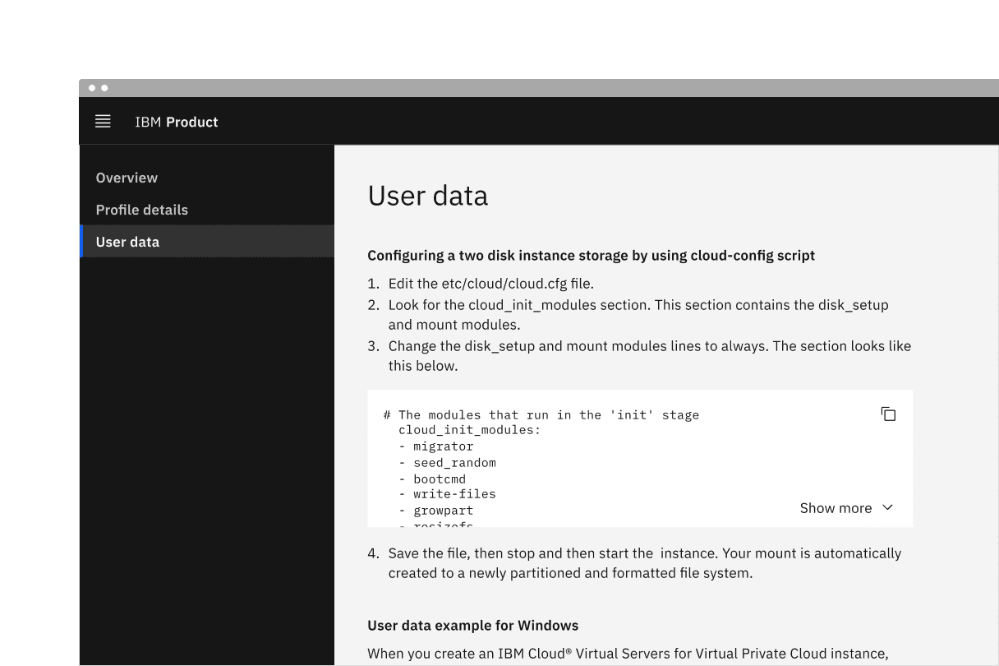

import A11yStatus from 'components/A11yStatus';

<PageDescription>

Lists are vertical groupings of related content. List items begin with either a
number or a bullet.

</PageDescription>

<AnchorLinks>

<AnchorLink>Live demo</AnchorLink>
<AnchorLink>Overview</AnchorLink>
<AnchorLink>Formatting</AnchorLink>
<AnchorLink>Content</AnchorLink>
<AnchorLink>Unordered list</AnchorLink>
<AnchorLink>Ordered list</AnchorLink>
<AnchorLink>Related</AnchorLink>
<AnchorLink>Feedback</AnchorLink>

</AnchorLinks>

## Live demo

<StorybookDemo
  themeSelector
  url="https://react.carbondesignsystem.com"
  variants={[
    {
      label: 'Unordered list',
      variant: 'components-unorderedlist--default',
    },
    {
      label: 'Unordered list nested',
      variant: 'components-unorderedlist--nested',
    },
    {
      label: 'Ordered list',
      variant: 'components-orderedlist--default',
    },
    {
      label: 'Ordered list native list styles',
      variant: 'components-orderedlist--native-list-styles',
    },
    {
      label: 'Ordered list nested',
      variant: 'components-orderedlist--nested',
    },
  ]}
/>

<A11yStatus layout="cards" components={['Ordered list', 'Unordered list']} />

## Overview

The list component displays related content in a structured and scannable
format. It helps users easily navigate and understand grouped information. Lists
can be styled as unordered (bulleted) or ordered (numbered) based on their
content hierarchy and importance. They are commonly used for navigation menus,
data presentations, and form-related elements.

<Row>
<Column colLg={12}>

</Column>
</Row>

<Caption>Example of the list component in a UI</Caption>

### When to use

- To display a simple, related set of items.
- To provide structure and clarity in the content.

### When not to use

- Avoid using a list for complex data or when advanced features like sorting,
  filtering, or selection are required. If the content requires multiple columns
  and rows within a component, consider using a
  [data table](/components/data-table/usage/) instead.
- If a basic hierarchy with tables or dividers is required, use the
  [structured list](/components/structured-list/usage/) or
  [contained list](/components/contained-list/usage/) components instead.

### Variants

| Variant                           | Purpose                                                                     |
| --------------------------------- | --------------------------------------------------------------------------- |
| [Unordered list](#unordered-list) | Used to display items of equal importance without a specific order.         |
| [Ordered list](#ordered-list)     | Use to indicate a clear sequence or hierarchy, often used for instructions. |

## Formatting

### Anatomy

Unordered and ordered lists are both comprised of a marker and a list item.

<Row>
<Column colLg={12}>

</Column>
</Row>

<Caption>Anatomy of unordered and ordered list variants</Caption>

<Row>
<Column colSm={2} colMd={4} colLg={4}>

#### 1. Unordered list

A. Marker (level 1)   B. Marker (level 2)   C. List item
(level 1)  D. List item (level 2)  

</Column>
<Column colSm={2} colMd={4} colLg={4}>

#### 2. Ordered list

A. Marker (level 1)   B. Marker (level 2)   C. List item
(level 1)  D. List item (level 2)  

</Column>
</Row>

### Sizing

The list is available in two type sizes: **productive** and **expressive**. The
productive list utilizes `$body-01`, while the expressive list uses `$body-02`.
The productive list is best suited for functional, task-oriented experiences,
whereas the expressive list is designed for more visual, engaging experiences.
In most product designs, the productive list will likely be the preferred
choice.

<Row>
<Column colLg={8}>

</Column>
</Row>

<Caption>Productive and expressive type sizes for list</Caption>

### Alignment

Lists are typically presented in a vertical format to maintain readability and
clarity. Avoid placing individual list items horizontally, as it misaligns with
the grid and reduces readability. However, separate list groups can be placed
side by side if they align with grid columns.

<Row>
<Column colLg={12}>

</Column>
</Row>

<Caption>Example shows the list with a large number of list items</Caption>

<DoDontRow>
  <DoDont type="do" caption="Do align the list vertically for clarity.">

  </DoDont>
  <DoDont type="dont" caption="Do not align the list horizontally, as it disrupts readability.">

  </DoDont>
</DoDontRow>

For ordered lists with two-digit (10+) or more digit items, align numbers either
left or right to maintain a clear structure without misalignment. By default,
numbers are left-aligned, but there is an option to switch between the two.

<Row>
<Column colLg={8}>

</Column>
</Row>

<Caption>
  Number alignment in ordered lists for two or more digit items.
</Caption>

#### Nested items

Lists can include nested items to indicate hierarchy or subcategories, with
indentation distinguishing each level.

<Row>
<Column colLg={8}>

</Column>
</Row>

<Caption>Unordered and ordered lists with nested items</Caption>

### Placement

List items should be concise, aligning with grid columns to maintain a
structured layout. Avoid overly long sentences; if content exceeds the available
space, it should wrap to multiple lines rather than forcing excessive width.

<DoDontRow>
  <DoDont type="do" caption="Do align list markers flush with the grid.">

  </DoDont>
  <DoDont type="dont" caption="Do not let list markers hang into the grid gutters.">

  </DoDont>
</DoDontRow>
## Content

### Main elements

#### List item

- Represents an individual entry within a list.
- Can contain text, links, or other inline elements.
- Supports multi-line wrapping for longer content while maintaining alignment.
- Lists should present simple pieces of information; for complex data, consider
  using a [data table](/components/data-table/usage) instead.
- Level 1 list items define the main structure, while Level 2 (nested) list
  items provide hierarchy or subcategories.
- Arrange ordered list items logically, such as ranking by importance, highest
  to lowest values, or in alphabetical/numeric order.
- Ensure list items are grammatically parallel by maintaining consistent
  sentence structures (e.g., avoid mixing passive and active voice).

#### Marker

- Markers should be top-aligned with the first list item for clarity and
  consistency.
- Unordered list level 1 items are marked with dashes and level 2 items are
  marked with squares.
- Ordered list level 1 items are marked with numbers and level 2 items are
  marked with letters.

### Overflow content

Text in a list should wrap below the marker, keeping it top-aligned with the
first list item to ensure readability. Truncation should be avoided and text
should instead wrap to multiple lines.

<Row>
<Column colLg={12}>

</Column>
</Row>

<Caption>Text wrapping for unordered and ordered lists</Caption>

### Further guidance

For further content guidance, see Carbon's
[content guidelines](https://carbondesignsystem.com/guidelines/content/overview/).

## Unordered list

Unordered list is a collection of items presented without a specific order. Each
list item begins with an en dash, making it ideal for non-sequential content.

<Row>
<Column colLg={8}>

</Column>
</Row>

<Caption>Example of the unordered list variant in a UI</Caption>

## Ordered list

Ordered list is a collection of items presented without a specific order. List
item begins with a number, indicating its position, making it suitable for
sequential content.

<Row>
<Column colLg={8}>

</Column>
</Row>

<Caption>Example of the ordered list variant in a UI</Caption>

## Related

- [Contained list](/components/contained-list/usage/)
- [Data table](/components/data-table/usage/)
- [Structured list](/components/Structured-list/usage/)

## Feedback

Help us improve this component by providing feedback, asking questions, and
leaving any other comments on
[GitHub](https://github.com/carbon-design-system/carbon-website/issues/new?assignees=&labels=feedback&template=feedback.md).
