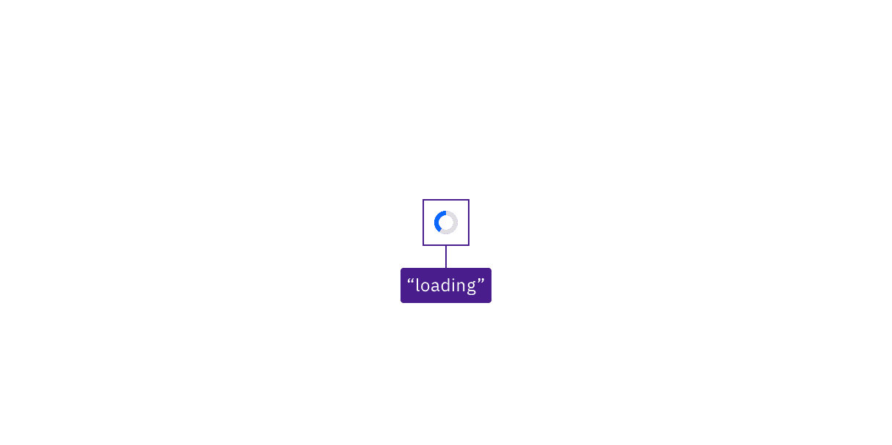

import {
  StructuredListWrapper,
  StructuredListHead,
  StructuredListBody,
  StructuredListRow,
  StructuredListInput,
  StructuredListCell,
  OrderedList,
  ListItem,
} from '@carbon/react';

<PageDescription>

Design annotations are needed for specific instances shown below, but for the standard loading component, Carbon already incorporates accessibility.

</PageDescription>

<AnchorLinks>

<AnchorLink>What Carbon provides</AnchorLink>
<AnchorLink>Design recommendations</AnchorLink>
<AnchorLink>Development considerations</AnchorLink>

</AnchorLinks>

## What Carbon provides

The loading component has no keyboard accessibility considerations since it is intentionally not operable or navigable. However, Carbon incorporates other accessibility considerations, some of which are described below.

### Status updates

The primary accessibility consideration for the loading component is to convey its meaning to assistive technologies so users are aware of changes in status. Carbon achieves this by exposing the `title` value (normally “loading”) of the spinning wheel SVG image.

<Row>
<Column colLg={8}>

<Caption>
  Screen readers hear “loading” when a spinning icon appears on the screen.
</Caption>

</Column>
</Row>

## Design recommendations

Design annotations are needed for the following instance.

### Convey when loading has completed

When the loading indicator disappears, it conveys a second meaning, which is ‘not loading’ or ‘finished’. However, a user who cannot see the icon disappear needs to be made aware the system is no longer “loading.”

There are several ways to do this. If new content takes focus when the loading is completed, then users will understand the system is no longer unavailable. Annotating what component takes focus will ensure this is properly implemented. 

Where no other content changes happen as the loading icon disappears, the change can also be surfaced to users through a non-displayed status message that can be conveyed to users through assistive technology. 

## Development considerations

Keep these considerations in mind if you are modifying Carbon or creating a custom component.

- Carbon uses `aria-live` set to “assertive” to immediately surface a loading status to assistive technologies.
- Carbon provides an SVG `title` value for the loading icon, which is exposed through the `aria-live` section.
- The completion of the loading state should be conveyed to assistive technologies. A non-visible status message such as "system available" could be put in the `aria-live` section or exposed through a `role="status"`. Alternatively, focus could be set to an appropriate element. 
- See the [Equal Access Toolkit](https://www.ibm.com/able/toolkit/develop/dynamic-updates/#role-status) for information on status messages.