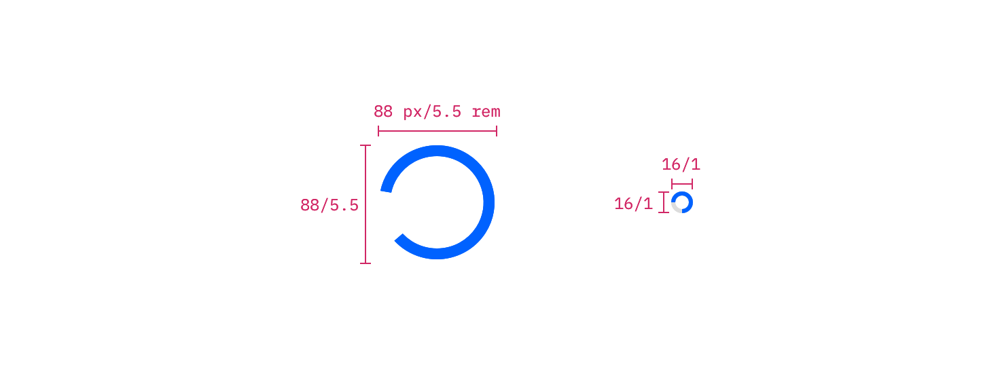

## Color

| Class                  | Property         | Color token         |
| ---------------------- | ---------------- | ------------------- |
| `.bx--loading__svg`    | stroke           | `$interactive-04`   |
| `.bx--loading--small`  | stroke           | `$interactive-04`   |
| `.bx--loading-overlay` | background-color | `rgba($ui-02, 0.6)` |

## Structure

| Class                 | Property      | px / rem | Spacing token |
| --------------------- | ------------- | -------- | ------------- |
| `.bx--loading`        | height, width | 88 / 5.5 | –             |
| `.bx--loading--small` | height, width | 16 / 1   | –             |

<Caption>
  Structure measurements for small and large loading spinner | px / rem
</Caption>

### Placement

The large loading spinner should appear centered over a page or content that it
is loading. Please note that the top-level navigation is not included in the
page loading overlay.

<Caption>Example of a large loading spinner in product context</Caption>
