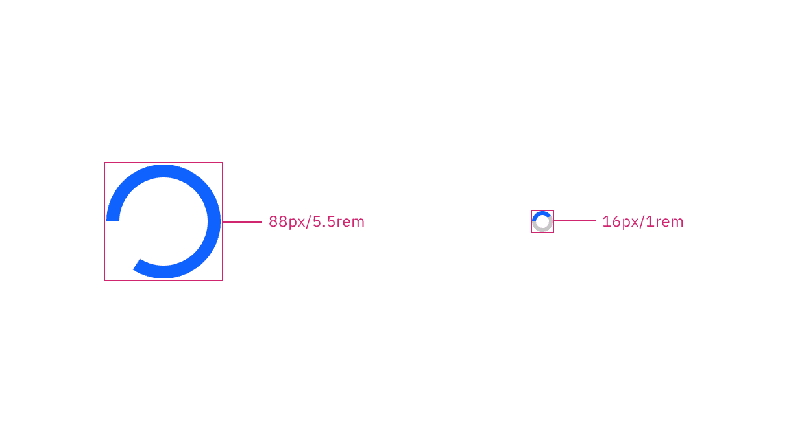

<PageDescription>

The following page documents visual specifications such as color, typography,
and size.

</PageDescription>

<AnchorLinks>

<AnchorLink>Color</AnchorLink>
<AnchorLink>Typography</AnchorLink>
<AnchorLink>Size</AnchorLink>
<AnchorLink>Feedback</AnchorLink>

</AnchorLinks>

## Color

| Element         | Property         | Color token        |
| --------------- | ---------------- | ------------------ |
| Large indicator | stroke           | `$interactive`     |
| Small indicator | stroke           | `$interactive`     |
|                 | background-color | `$layer-accent` \* |
| Page overlay    | background-color | `$overlay`         |

<Caption fullWidth>
  \* Denotes a contextual color token that will change values based on the layer
  it is placed on.
</Caption>

<Row>
<Column colLg={8}>

<Tabs>

<Tab label="Large">

</Tab>

<Tab label="Small">

</Tab>

</Tabs>

</Column>
</Row>

## Typography

Label text is not included with the loading indicator by default. If including
text, it is recommended to use `body-compact-01` with the large indicator or
with the small indicator. See more specific typography guidance on the inline
loading [Style](/components/inline-loading/style) tab.

## Size

There are two loading indicator sizes: **large** and **small**. For more
information about specific use cases for each loading indicator size, see the
[sizing](/components/loading/usage/#sizing) section on the Usage tab.

| Element   | Size       | Height (px/rem) |
| --------- | ---------- | --------------- |
| Indicator | Large (lg) | 88 / 5.5        |
|           | Small (sm) | 16 / 1          |

<Caption>Large and small indicator sizes</Caption>

## Feedback

Help us improve this component by providing feedback, asking questions, and
leaving any other comments on
[GitHub](https://github.com/carbon-design-system/carbon-website/issues/new?assignees=&labels=feedback&template=feedback.md).
