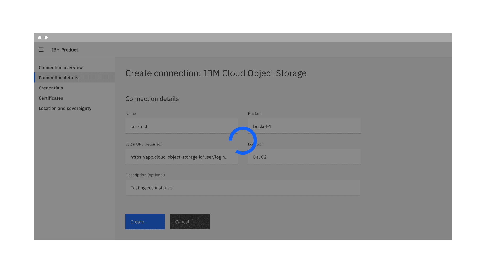
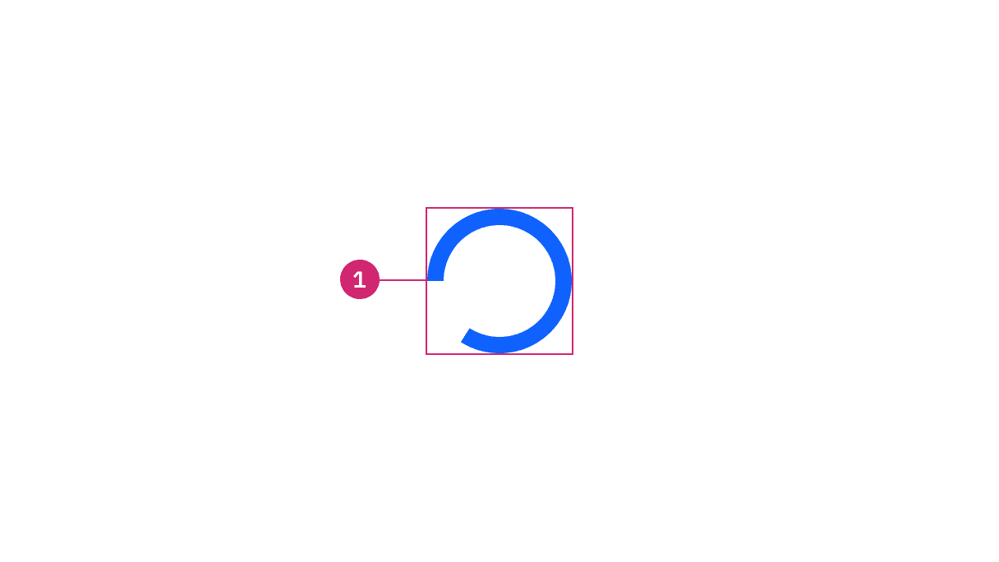
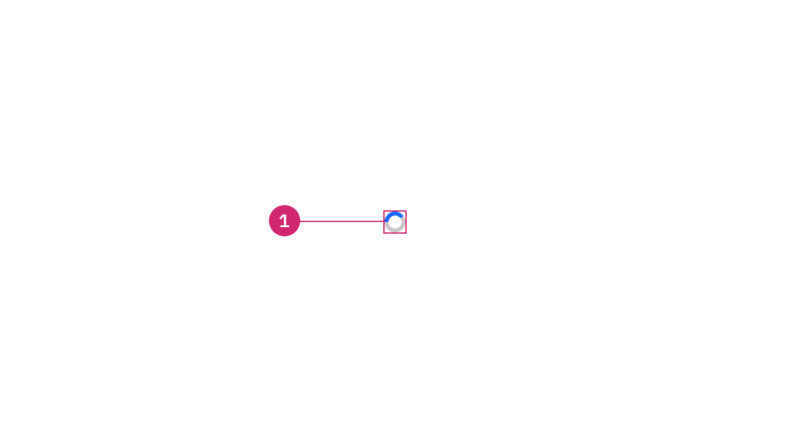
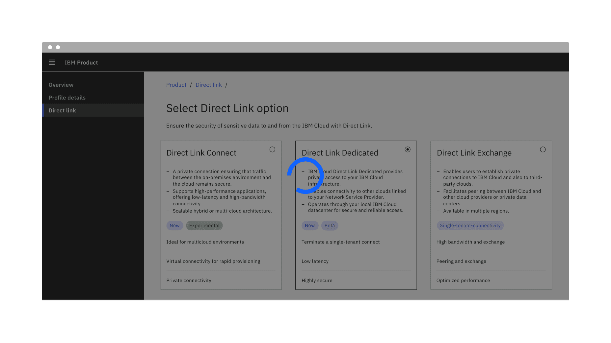
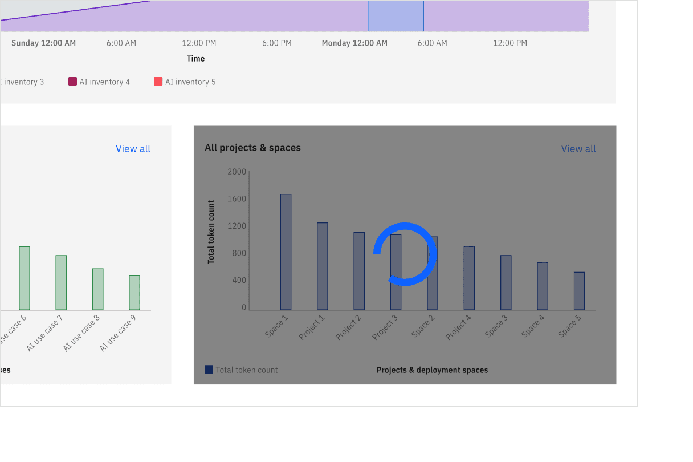
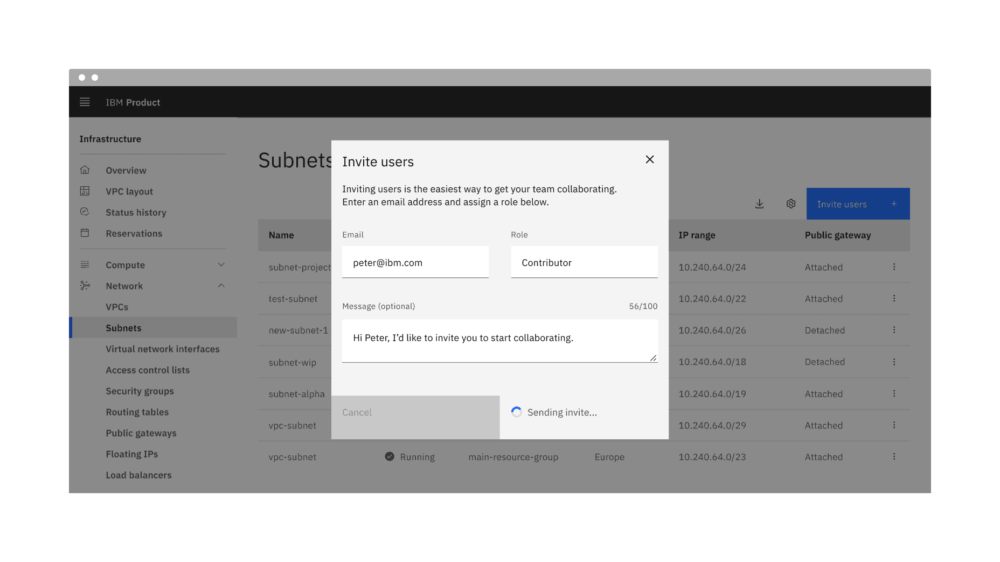
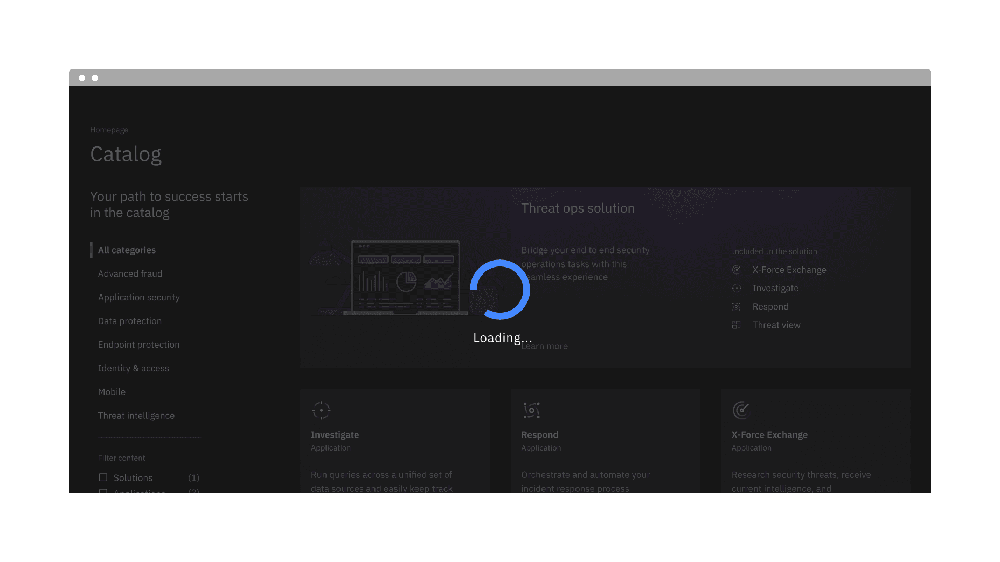

import A11yStatus from 'components/A11yStatus';

<PageDescription>

Loading indicators are used when retrieving data or performing slow
computations, and help to notify users that loading is underway.

</PageDescription>

<AnchorLinks>

<AnchorLink>Live demo</AnchorLink>
<AnchorLink>Overview</AnchorLink>
<AnchorLink>Formatting</AnchorLink>
<AnchorLink>Content</AnchorLink>
<AnchorLink>Behaviors</AnchorLink>
<AnchorLink>Related</AnchorLink>
<AnchorLink>Feedback</AnchorLink>

</AnchorLinks>

## Live demo

<StorybookDemo
  themeSelector
  url="https://react.carbondesignsystem.com"
  variants={[
    {
      label: 'Default',
      variant: 'components-loading--default',
    },
  ]}
/>

<A11yStatus layout="cards" components="Loading" />

## Overview

Loading indicators are used when retrieving data or performing slow
computations. They notify to the user that their request is being processed.
Although they do not provide details about what is occurring on the back-end,
they reassure the user that their action is being processed.

Use a loading indicators whenever the wait time is anticipated to be longer than
three seconds.

<Caption>Example of the loading component in a UI</Caption>

### When to use

- Use when retrieving data or performing slow computations to indicate that a
  request is being processed.
- Use when the entire page or a key section is processing, such as after a user
  submits or saves data.

### When not to use

- Avoid loading indicators for progressively displaying content; use skeleton
  states for a better experience.
- Do not use loading indicators if user interaction is required to proceed; use
  alternatives like [tooltips](/components/tooltip/usage),
  [progress indicators](/components/progress-indicator/usage), or
  [notifications](/components/notification/usage) instead.
- For full-screen loads, skeleton states are preferred over indicators to create
  a smoother experience.
- Refrain from using multiple loading indicators simultaneously, as it may
  overwhelm users.

## Formatting

### Anatomy

<Row>
<Column colLg={8}>

<Tabs>

<Tab label="Large">

</Tab>

<Tab label="Small">

</Tab>

</Tabs>

</Column>
</Row>

**Loading indicator:** A circular animated icon indicating that a process is
underway. It serves as the primary visual cue for the loading state.

### Sizing

The Loading component is available in two sizes: **large** and **small**. The
large loading indicator size is the default size.

<Row>
<Column colLg={8}>

</Column>
</Row>

<Caption>Large and small sizes of loading component</Caption>

#### Large size

The large loading indicator is most commonly used to display loading in
full-screen takeover situations. It can also appear on sections within a page,
in [modals](/components/tile/usage/#loading), and on individual
[tiles](/components/tile/usage). A background overlay is typically placed behind
the large loading indicator so the user can not interact with the elements
currently in the loading state.

<Row>

<Column colLg={8}>
<GifPlayer color='light'>

</GifPlayer>
</Column>
</Row>

<Caption>Example of the large loading component in a UI</Caption>

#### Small size

The small loading indicator is best suited for contextual or localized loading
experiences within a specific UI element, particularly in inline loading
scenarios. It works well for quick-loading tasks and can be placed within or
near the triggering element—such as a
[button](/components/button/usage/#loading)—to indicate that a process is
underway. Common examples include saving after a button click, uploading a file,
or placing the indicator beside a text label to communicate loading status. For
detailed guidance, refer to the inline loading component
[Usage](/components/inline-loading/usage/) tab.

<Row>

<Column colLg={8}>
<GifPlayer color='light'>

</GifPlayer>
</Column>
</Row>

<Caption>Example of the small loading component in a UI</Caption>

### Placement

#### Large loading placement

The large loading indicator is commonly used for full-screen and component-level
loading scenarios.

For full-screen loading, place the indicator at the center of the viewport and
apply a semi-transparent overlay to signal that the entire interface is
inactive.

<Row>
<Column colLg={8}>

</Column>
</Row>

<Caption>
  Example of large loading indicator placement for full-screen loading with
  overlay
</Caption>

When used within a component—such as a modal, tile, or side panel—center the
indicator in that space and use an overlay to prevent interaction with the
content while it is loading.

<Row>
<Column colLg={8}>

</Column>
</Row>

<Caption>
  Example of large loading indicator placement for component-level loading with
  overlay
</Caption>

#### Small loading placement

The small loading indicator is ideal for inline or localized loading within
elements like buttons or compact content areas. It should appear inline with or
adjacent to the related action, without using overlays. During the loading
state, any related action buttons—such as “Cancel”—should be disabled. For more
information about inline loading, refer to the inline loading component
[Usage](/components/inline-loading/usage/) tab.

<Row>
<Column colLg={8}>

</Column>
</Row>

<Caption>
  Example of small loading indicator placement for inline loading
</Caption>

## Content

### Main elements

The loading indicator can be paired with optional text to provide additional
context during a loading state.

For **large loading** indicators, adding a brief status message below the
indicator as “Loading data…”—can help set expectations for users. This text is
not included by default in the component and should be added manually if needed.

<Caption>Example of large loading indicator with label</Caption>

For **small loading** indicators, especially in inline use, content should be
concise and placed near the related action. For more detailed guidance, refer to
the inline loading component’s
[Content](/components/inline-loading/usage/#content) section.

### Further guidance

For further content guidance, see Carbon's
[content guidelines](/guidelines/content/overview).

## Behaviors

### States

There are two states to the loading component: **inactive**, and **active**. For
detailed visual information about the various states for this component, see the
[Style](/components/loading/style/) tab.

| State    | When to use                                                                             |
| -------- | --------------------------------------------------------------------------------------- |
| Inactive | The inactive loading state is when no data is being loaded, it has no visual indicator. |
| Active   | The active loading state indicates that the action is still in progress.                |

<Row>
<Column colLg={8}>

<Tabs>

<Tab label="Large">

</Tab>

<Tab label="Small">

</Tab>

</Tabs>

</Column>
</Row>

### Interactions

For large loading indicators, a semi-transparent overlay is applied over the
page or component, blocking all interaction. During this state, users should not
be able to interact with any elements, as the overlay indicates the interface is
temporarily unavailable.

For small loading indicators used in inline loading scenarios, interactive
elements like buttons should be temporarily disabled while loading is in
progress. This prevents repeated actions and ensures a smooth user experience.
Learn more in the inline loading –
[Interactions](/components/inline-loading/usage/#interactions) section.

## Related

<Row>
<Column colSm={2} colMd={2} colLg={3}>

#### Components

- [Button](/components/button/usage)  
- [File uploader](/components/file-uploader/usage)  
- [Inline loading](/components/inline-loading/usage)  
- [Modal](/components/modal/usage)  
- [Notification](/components/notification/usage)  
- [Progress indicator](/components/progress-indicator/usage)  
- [Tile](/components/tile/usage)  

</Column>
<Column colSm={2} colMd={2} colLg={3}>

#### Patterns

- [Forms](/patterns/forms-pattern)  
- [Loading](/patterns/loading-pattern)  

</Column>
</Row>

## Feedback

Help us improve this component by providing feedback, asking questions, and
leaving any other comments on
[GitHub](https://github.com/carbon-design-system/carbon-website/issues/new?assignees=&labels=feedback&template=feedback.md).
