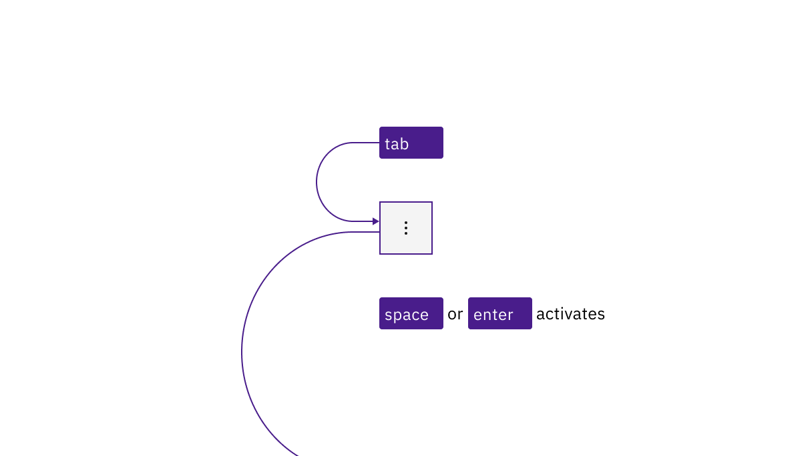
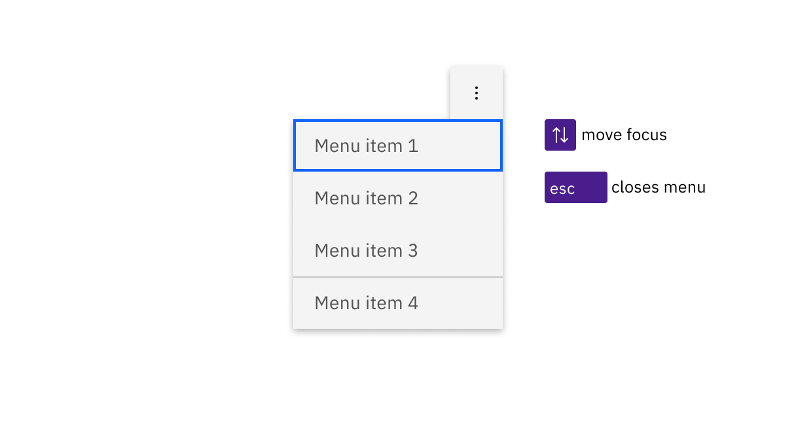

import A11yStatus from 'components/A11yStatus';

<PageDescription>

No accessibility annotations are needed for overflow menus, but keep these
considerations in mind if you are modifying Carbon or creating a custom
component.

</PageDescription>

<InlineNotification>

**Coming soon!** The accessibility information for the menu button and combo
button is going to be updated soon.

</InlineNotification>

<AnchorLinks>

<AnchorLink>What Carbon provides</AnchorLink>
<AnchorLink>Development considerations</AnchorLink>

</AnchorLinks>

## What Carbon provides

Carbon bakes keyboard operation into its components, improving the experience of
blind users and others who operate via keyboard. Carbon also incorporates other
accessibility considerations, some of which are described below.

### Keyboard interaction

Each overflow menu is in the tab order and is activated by `Space` or `Enter`.
When the menu is open, the first item takes focus. Focus is moved between menu
items with the `Up` and `Down` arrow keys. `Space` or `Enter` activates the item
with focus (which causes focus to go somewhere else and the menu to close).
`Esc` collapses the menu and puts focus onto the menu button.

<Row>
<Column colLg={8}>

<Caption>
  Overflow menus are reached by Tab. Space and Enter keys open the menu as well
  as activating menu items with focus.
</Caption>

</Column>
</Row>

<Row>
<Column colLg={8}>

<Caption>
  When opened, the first item in the menu takes focus. Arrow keys move focus,
  Esc closes the menu.
</Caption>

</Column>
</Row>

## Development considerations

Keep these considerations in mind if you are modifying Carbon or creating a
custom component.

- Overflow menus are buttons with `aria-haspopup` set to "true".
- The overflow menu is named with `aria-label`.
- Each menu item is an `li` in a `ul`.
- Each list item contains a button with `role="menuitem"` and `tabindex="-1"`.
  See the
  [ARIA authoring practices on menubutton](https://w3c.github.io/aria-practices/#menubutton)
  for more considerations.

<A11yStatus layout="table" components="Menu buttons" />
