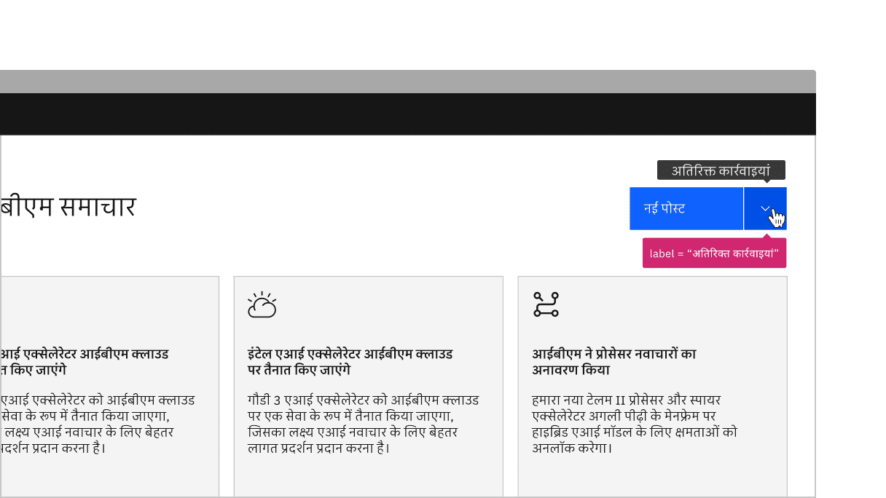

import A11yStatus from 'components/A11yStatus';

<PageDescription>

Design annotations are needed for specific instances shown below, but for the
standard menu button, combo button, and overflow menu, Carbon already
incorporates accessibility.

</PageDescription>

<AnchorLinks>

<AnchorLink>What Carbon provides</AnchorLink>
<AnchorLink>Design recommendations</AnchorLink>
<AnchorLink>Development considerations</AnchorLink>

</AnchorLinks>

## What Carbon provides

Carbon bakes keyboard operation into its components, improving the experience of
blind users and others who operate via keyboard. Carbon incorporates other
accessibility considerations, some of which are described below.

### Keyboard interaction

#### Menu button

The menu button is set in the tab order and is activated by `Space` or `Enter`.
When the menu is open, the first item takes focus. Focus is moved between menu
items with the `Up` and `Down` arrow keys. `Space` or `Enter` activates the item
with focus, which causes focus to go somewhere else and the menu to close. `Esc`
collapses the menu and puts focus back onto the menu button.

<Row>
<Column colLg={8}>

<Caption>
  Menu button is reached by Tab. Space and Enter keys open the menu as well as
  activating menu items with focus.
</Caption>

</Column>
</Row>

<Row>
<Column colLg={8}>

<Caption>
  When opened, the first item in the menu takes focus. Arrow keys move focus and
  Esc closes the menu.
</Caption>

</Column>
</Row>

#### Combo button

The combo button is set in the tab order where the first tab brings focus on the
primary button and the second tab brings focus on the icon button that contains
the menu. The respective buttons are activated by `Space` or `Enter`. When the
menu is open, the first item takes focus. Focus is moved between menu items with
the `Up` and `Down` arrow keys. `Space` or `Enter` activates the item with
focus, which causes focus to go somewhere else and the menu to close. `Esc`
collapses the menu and puts focus back onto the icon button.

<Row>
<Column colLg={8}>

<Caption>
  Combo button items are reached by two Tab stops. Space and Enter keys open the
  menu as well as activating menu items with focus.
</Caption>

</Column>
</Row>

<Row>
<Column colLg={8}>

<Caption>
  When opened, the first item in the menu takes focus. Arrow keys move focus and
  Esc closes the menu.
</Caption>

</Column>
</Row>

#### Overflow menu

Each overflow menu is in the tab order and is activated by `Space` or `Enter`.
When the menu is open, the first item takes focus. Focus is moved between menu
items with the `Up` and `Down` arrow keys. `Space` or `Enter` activates the item
with focus, which causes focus to go somewhere else and the menu to close. `Esc`
collapses the menu and puts focus onto the menu button.

<Row>
<Column colLg={8}>

<Caption>
  Overflow menus are reached by Tab. Space and Enter keys open the menu as well
  as activating menu items with focus.
</Caption>

</Column>
</Row>

<Row>
<Column colLg={8}>

<Caption>
  When opened, the first item in the menu takes focus. Arrow keys move focus and
  Esc closes the menu.
</Caption>

</Column>
</Row>

## Design recommendations

Design annotations are needed for the following instances.

### Labeling

#### Combo button

Combo button has a prop that can be used to change the tooltip label and is only
intended to be changed to translate _"Additional actions"_ into other languages.
If translation is required, the translation must be annotated with a label that
is exposed on hover or focus.

<Row>
<Column colLg={8}>

<Caption>
  Annotate the label for combo button so the proper tooltip appears, which
  should only be used for translation purposes.
</Caption>

</Column>
</Row>

#### Overflow menu

Overflow menu’s
[custom icon variant](https://react.carbondesignsystem.com/?path=/story/components-overflowmenu--render-custom-icon)
has a prop that can be used to change the tooltip label. If the tooltip label is
changed, they must be annotated with a label that will be exposed on hover or
focus.

<Row>
<Column colLg={8}>

<Caption>
  Annotate the label for overflow menu’s custom icon variant so the proper
  tooltip appears.
</Caption>

</Column>
</Row>

## Development considerations

Keep these considerations in mind if you are modifying Carbon or creating a
custom component.

- Menu button, combo button, and the overflow menu are buttons with
  `aria-haspopup` set to "true".
- The menu button, combo button, and the overflow menu is named with
  `aria-label`.
- Each menu item across menu button, combo button, and overflow menu is an `li`
  in a `ul`.
- Each list item across menu button, combo button, and overflow menu contains a
  button with `role="menuitem"` and `tabindex="-1"`. See the
  [ARIA authoring practices on menubutton](https://w3c.github.io/aria-practices/#menubutton)
  for more considerations.
- Combo button and overflow menu has an `iconDescription` prop that can be used
  to change the tooltip label. See the
  [design recommendations](#design-recommendations) for more guidelines on
  tooltip labels.
- For combo button, the menu is given an `id`. When the menu is open, the icon
  button is given `aria-controls` with a value of the menu `id`. `aria-expanded`
  is also set based on the open state.
- When the combo button menu is open, the element (`div`) wrapping the entire
  combo button is given `aria-owns` with a value of the menu `id`.

<A11yStatus layout="table" components="Menu buttons" />
