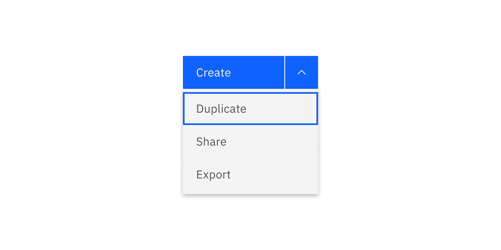
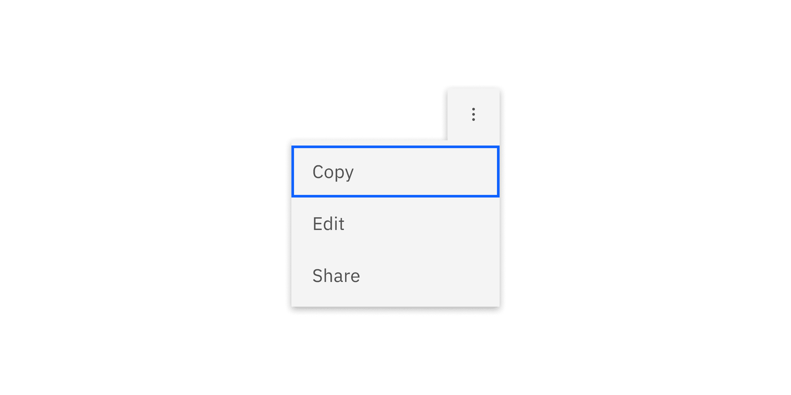
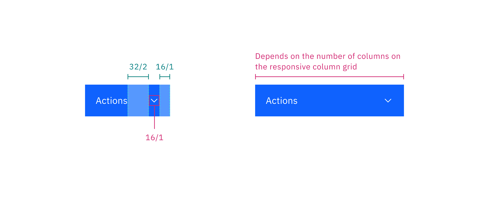
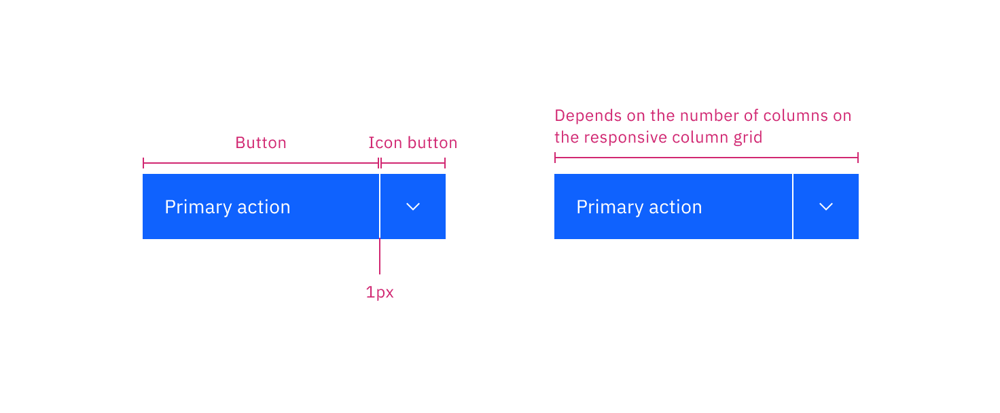

## Color

Enabled and interactive states of menu buttons follow the
[button style](https://carbondesignsystem.com/components/button/style)
guidelines. Menu buttons can use primary, tertiary, or ghost buttons. Combo
buttons can only use a primary button. Overflow menu can only use a ghost
button.

The menu used in menu buttons should follow the [menu style].

### Menu button

<Row>
<Column colLg={8}>

</Column>
</Row>

<Caption>Example of menu button using three different types of buttons</Caption>

### Combo button

<Row>
<Column colLg={8}>

</Column>
</Row>

<Caption>Example of a combo button using a primary button</Caption>

### Overflow menu

<Row>
<Column colLg={8}>

</Column>
</Row>

<Caption>
  Overflow menu appears as a ghost button when closed and once it opens the
  color changes to the correct $layer color token to match the menu.
</Caption>

## Typography

| Element          | Font-size (px/rem) | Font-weight   | Type token         |
| ---------------- | ------------------ | ------------- | ------------------ |
| Button text      | 14 / 0.875         | Regular / 400 | `$body-compact-01` |
| Menu option text | 14 / 0.875         | Regular / 400 | `$body-compact-01` |

## Structure

The structure of menu buttons should follow the
[button style](https://carbondesignsystem.com/components/button/style)
guidelines.

### Menu button

<Caption>
  Menu button in default width (left) and menu button in fluid width (right)
</Caption>

### Combo button

<Caption>
  Combo button in default width (left) and menu button in fluid width (right)
</Caption>

## Sizes

There are three
[button](https://carbondesignsystem.com/components/button/style/#sizes) sizes:
small, medium, and large.

| Elements | Size        | Height (px/rem) |
| -------- | ----------- | --------------- |
| Button   | Small (sm)  | 32/2            |
|          | Medium (md) | 40/2.5          |
|          | Large (lg)  | 48/3            |

