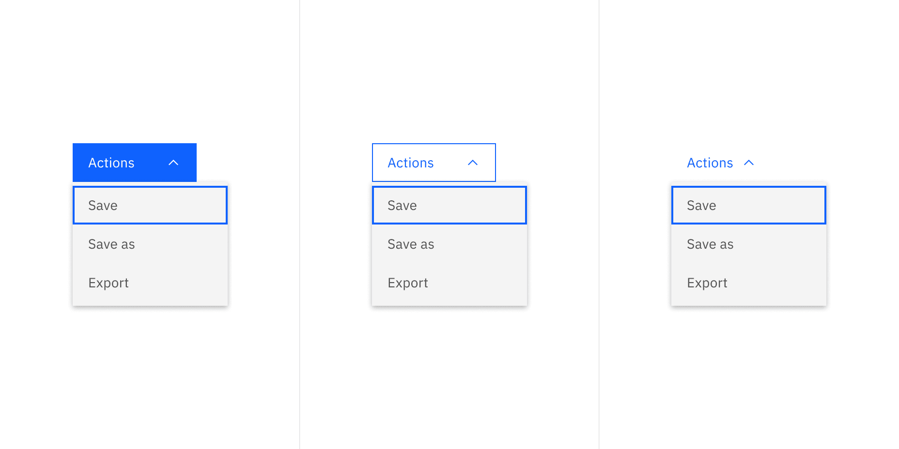
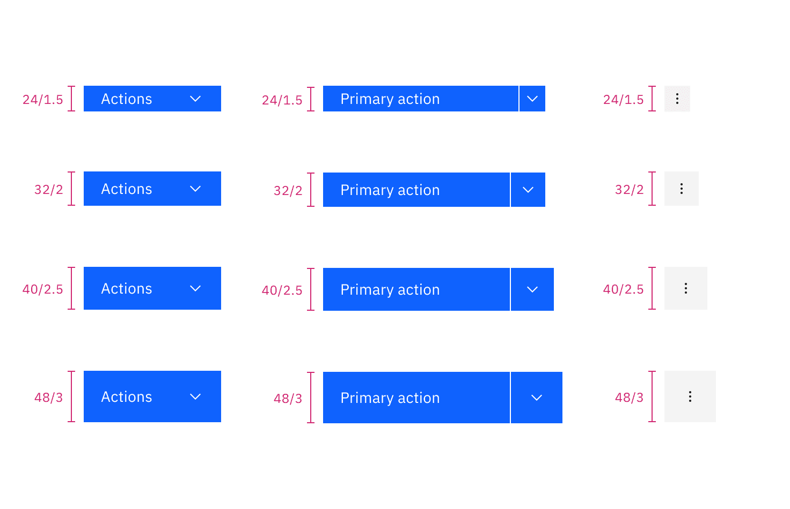

<PageDescription>

The following page documents visual specifications such as color, typography,
structure, and size.

</PageDescription>

<AnchorLinks>

<AnchorLink>Color</AnchorLink> <AnchorLink>Typography</AnchorLink>
<AnchorLink>Structure</AnchorLink> <AnchorLink>Size</AnchorLink>
<AnchorLink>Feedback</AnchorLink>

</AnchorLinks>

## Color

Enabled and interactive states of menu buttons follow the
[button style](https://carbondesignsystem.com/components/button/style)
guidelines. Menu buttons can use primary, tertiary, or ghost buttons. Combo
buttons can only use a primary button. Overflow menu can only use a ghost
button.

The menu used in menu buttons should follow the
[menu style](/components/menu/style).

### Menu button color

<Row>
<Column colLg={12}>

</Column>
</Row>

<Caption>Example of menu button using three different types of buttons</Caption>

### Combo button color

<Row>
<Column colLg={8}>

</Column>
</Row>

<Caption>Example of a combo button using a primary button</Caption>

### Overflow menu color

<Row>
<Column colLg={8}>

</Column>
</Row>

<Caption>
  Overflow menu appears as a ghost button when closed and once it opens the
  color changes to the correct `$layer` color token to match the menu.
</Caption>

## Typography

| Element          | Font-size (px/rem) | Font-weight   | Type token         |
| ---------------- | ------------------ | ------------- | ------------------ |
| Button text      | 14 / 0.875         | Regular / 400 | `$body-compact-01` |
| Menu option text | 14 / 0.875         | Regular / 400 | `$body-compact-01` |

## Structure

The structure of menu buttons should follow the
[button style](https://carbondesignsystem.com/components/button/style)
guidelines.

### Menu button

<Caption>
  Menu button in default width (left) and menu button in fluid width (right)
</Caption>

### Combo button

<Caption>
  Combo button in default width (left) and menu button in fluid width (right)
</Caption>

## Size

Menu buttons come in four sizes: **extra small**, **small**, **medium**, and
**large**. When using menu buttons, the height of each item in the menu reflects
the same size of the trigger button being used.

| Elements | Size             | Height (px/rem) |
| -------- | ---------------- | --------------- |
| Button   | Extra small (xs) | 24 / 1,5        |
|          | Small (sm)       | 32 / 2          |
|          | Medium (md)      | 40 / 2.5        |
|          | Large (lg)       | 48 / 3          |

## Feedback

Help us improve this component by providing feedback, asking questions, and
leaving any other comments on
[GitHub](https://github.com/carbon-design-system/carbon-website/issues/new?assignees=&labels=feedback&template=feedback.md).
