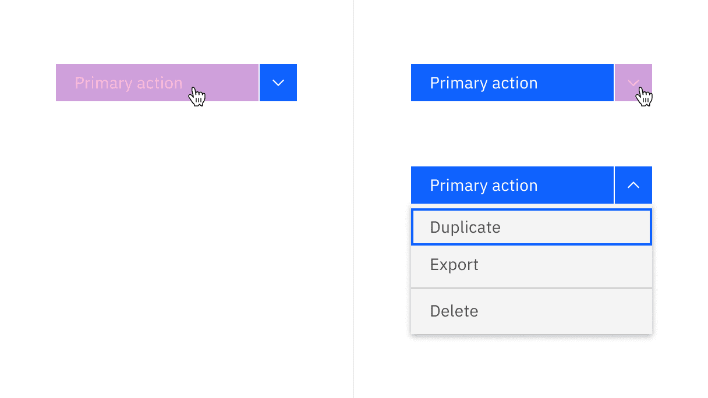

<InlineNotification>

**New in v11!** Apart from the overflow menu, the menu button and combo button
components have been added to our system and they are only available in v11.

</InlineNotification>

<AnchorLinks>

<AnchorLink>Overview</AnchorLink>
<AnchorLink>Live demo</AnchorLink>
<AnchorLink>Formatting</AnchorLink>
<AnchorLink>Content</AnchorLink>
<AnchorLink>Universal behaviors</AnchorLink>
<AnchorLink>Menu buttons</AnchorLink>
<AnchorLink>Combo buttons</AnchorLink>
<AnchorLink>Overflow menu</AnchorLink>
<AnchorLink>Modifiers</AnchorLink>
<AnchorLink>Related</AnchorLink>
<AnchorLink>References</AnchorLink>
<AnchorLink>Feedback</AnchorLink>

</AnchorLinks>

## Overview

There are three variants of menu buttons: menu button, combo button, and
overflow menu button. Menu buttons comprise a button and a [menu](), which can
be clicked to trigger an action or selected to initiate an action from a menu.

### When to use

#### Hiding extra actions in limited screen space

Menu button, combo button, and overflow menu are useful when you need to show
numerous options but have limited screen space available to display them. By
hiding less frequently used or advanced options until the user needs them, it
avoids cluttering the main interface with too many options.

| Variant                         | Purpose                                                                                                                      |
| ------------------------------- | ---------------------------------------------------------------------------------------------------------------------------- |
| [Menu button](#menu-button)     | When all actions in the menu list share the same level of importance. Usually used in the page header.                       |
| [Combo button](#combo-button)   | Where screen real estate is limited and one of the actions has particular importance. Usually used in the page header.       |
| [Overflow menu](#overflow-menu) | When additional options are available to the user and there is a space constraint. Usually used in tiles or data table rows. |

## Live demo

<ComponentDemo
  components={[
    {
      id: 'modal',
      label: 'Modal',
    },
    {
      id: 'scrolling-content',
      label: 'With scrolling content',
    },
    {
      id: 'with-one-button',
      label: 'With one button',
    },
    {
      id: 'with-three-buttons',
      label: 'With three buttons',
    },
  ]}
>
  <ComponentVariant
    id="modal"
    knobs={{
      ModalWrapper: ['passiveModal', 'danger', 'disabled', 'size'],
    }}
    links={{
      React:
        'https://react.carbondesignsystem.com/?path=/story/components-modal--default',
      Angular:
        'https://angular.carbondesignsystem.com/?path=/story/components-modal--basic',
      Vue: 'http://vue.carbondesignsystem.com/?path=/story/components-cvmodal--default',
      'Web Components':
        'https://web-components.carbondesignsystem.com/?path=/story/components-modal--default',
    }}
  >
    {`
    <ModalWrapper
      buttonTriggerText="Launch modal"
      modalHeading="Modal heading"
      modalLabel="Label"
    >
      
 Lorem ipsum dolor sit amet, consectetur adipiscing elit. Suspendisse cursus fermentum risus, sit amet fringilla nunc pellentesque quis. Duis quis odio ultrices, cursus lacus ac, posuere felis. Donec dignissim libero in augue mattis, a molestie metus vestibulum. Aliquam placerat felis ultrices lorem condimentum, nec ullamcorper felis porttitor. 

    </ModalWrapper>
`}
  </ComponentVariant>
  <ComponentVariant
    id="scrolling-content"
    links={{
      React:
        'https://react.carbondesignsystem.com/?path=/story/components-modal--default',
      Angular:
        'https://angular.carbondesignsystem.com/?path=/story/components-modal--basic',
      Vue: 'http://vue.carbondesignsystem.com/?path=/story/components-cvmodal--default',
      'Web Components':
        'https://web-components.carbondesignsystem.com/?path=/story/components-modal--default',
    }}
  >
    {`
    <ModalWrapper
      hasScrollingContent
      size="sm"
      buttonTriggerText="Launch modal"
      modalHeading="Modal heading"
      modalLabel="Label"
    >
      <>
        

          Lorem ipsum dolor sit amet, consectetur adipiscing elit. Aenean id accumsan augue. Phasellus consequat augue vitae tellus tincidunt posuere. Curabitur justo urna, consectetur vel elit iaculis, ultrices condimentum risus. Nulla facilisi. Etiam venenatis molestie tellus. Quisque consectetur non risus eu rutrum. 
        

        

          Lorem ipsum dolor sit amet, consectetur adipiscing elit. Aenean id accumsan augue. Phasellus consequat augue vitae tellus tincidunt posuere. Curabitur justo urna, consectetur vel elit iaculis, ultrices condimentum risus. Nulla facilisi. Etiam venenatis molestie tellus. Quisque consectetur non risus eu rutrum. 
        

        

          Lorem ipsum dolor sit amet, consectetur adipiscing elit. Aenean id accumsan augue. Phasellus consequat augue vitae tellus tincidunt posuere. Curabitur justo urna, consectetur vel elit iaculis, ultrices condimentum risus. Nulla facilisi. Etiam venenatis molestie tellus. Quisque consectetur non risus eu rutrum. 
        

        <h3>
          Lorem ipsum
        </h3>
        

          Lorem ipsum dolor sit amet, consectetur adipiscing elit. Aenean id accumsan augue. Phasellus consequat augue vitae tellus tincidunt posuere. Curabitur justo urna, consectetur vel elit iaculis, ultrices condimentum risus. Nulla facilisi. Etiam venenatis molestie tellus. Quisque consectetur non risus eu rutrum. 
        

        

          Lorem ipsum dolor sit amet, consectetur adipiscing elit. Aenean id accumsan augue. Phasellus consequat augue vitae tellus tincidunt posuere. Curabitur justo urna, consectetur vel elit iaculis, ultrices condimentum risus. Nulla facilisi. Etiam venenatis molestie tellus. Quisque consectetur non risus eu rutrum. 
        

        

          Lorem ipsum dolor sit amet, consectetur adipiscing elit. Aenean id accumsan augue. Phasellus consequat augue vitae tellus tincidunt posuere. Curabitur justo urna, consectetur vel elit iaculis, ultrices condimentum risus. Nulla facilisi. Etiam venenatis molestie tellus. Quisque consectetur non risus eu rutrum. 
        

        

          Lorem ipsum dolor sit amet, consectetur adipiscing elit. Aenean id accumsan augue. Phasellus consequat augue vitae tellus tincidunt posuere. Curabitur justo urna, consectetur vel elit iaculis, ultrices condimentum risus. Nulla facilisi. Etiam venenatis molestie tellus. Quisque consectetur non risus eu rutrum. 
        

      </>
    </ModalWrapper>
`}
  </ComponentVariant>
  <ComponentVariant
    id="with-one-button"
    links={{
      React:
        'https://react.carbondesignsystem.com/?path=/story/components-modal--default',
      Angular:
        'https://angular.carbondesignsystem.com/?path=/story/components-modal--basic',
      Vue: 'http://vue.carbondesignsystem.com/?path=/story/components-cvmodal--default',
      'Web Components':
        'https://web-components.carbondesignsystem.com/?path=/story/components-modal--single-button',
    }}
  >
    {`
    <ModalWrapper
      buttonTriggerText="Launch modal"
      modalHeading="Modal heading"
      modalLabel="Label"
      secondaryButtonText={null}
    >
      
 Lorem ipsum dolor sit amet, consectetur adipiscing elit. Suspendisse cursus fermentum risus, sit amet fringilla nunc pellentesque quis. Duis quis odio ultrices, cursus lacus ac, posuere felis. Donec dignissim libero in augue mattis, a molestie metus vestibulum. Aliquam placerat felis ultrices lorem condimentum, nec ullamcorper felis porttitor. 

    </ModalWrapper>
`}
  </ComponentVariant>
  <ComponentVariant
    id="with-three-buttons"
    links={{
      React:
        'https://react.carbondesignsystem.com/?path=/story/components-modal--default',
      Angular:
        'https://angular.carbondesignsystem.com/?path=/story/components-modal--basic',
      Vue: 'http://vue.carbondesignsystem.com/?path=/story/components-cvmodal--default',
      'Web Components':
        'https://web-components.carbondesignsystem.com/?path=/story/components-modal--three-buttons',
    }}
  >
    {`
    <ModalWrapper
      buttonTriggerText="Launch modal"
      modalHeading="Modal heading"
      modalLabel="Label"
      secondaryButtons={
        [
          {
            buttonText: 'Keep both',
            onClick: () => {},
          },
          {
            buttonText: 'Rename',
            onClick: () => {},
          }
        ]
      }
    >
      
 Lorem ipsum dolor sit amet, consectetur adipiscing elit. Suspendisse cursus fermentum risus, sit amet fringilla nunc pellentesque quis. Duis quis odio ultrices, cursus lacus ac, posuere felis. Donec dignissim libero in augue mattis, a molestie metus vestibulum. Aliquam placerat felis ultrices lorem condimentum, nec ullamcorper felis porttitor. 

    </ModalWrapper>
`}
  </ComponentVariant>
</ComponentDemo>

## Formatting

### Anatomy

<Row>
<Column colLg={8}>

</Column>
</Row>

<Row>
<Column colSm={2} colMd={4} colLg={4}>

#### 1. Menu button

A. Primary button   C. Menu  

#### 2. Combo button

A. Primary button   B. Icon button   C. Menu  

#### 3. Overflow menu

A. Icon button   C. Menu  

</Column>
<Column colSm={2} colMd={4} colLg={4}>

### Sizing

#### Height

There are three sizes of menu buttons: small, medium, and large. See more in
[style](https://carbondesignsystem.com/components/menu-button/style). When using
a menu button trigger, the height of the
[menu](https://carbondesignsystem.com/components/menu/usage) items reflects the
size of the button being used.

<InlineNotification>

**Note** Currently, Carbon does not support the extra-small size for
[buttons](https://carbondesignsystem.com/components/button/usage/). Therefore,
this menu size cannot be utilized with contextual menu button triggers. However,
the extra-small menu size remains available for implementation in other contexts
if needed.

</InlineNotification>

| Modal size  | Height (px / rem) |
| ----------- | ----------------- |
| Extra small | 24 / 1.5          |
| Small       | 32 / 2            |
| Medium      | 40 / 2.5          |
| Large       | 48 / 3            |

<DoDontRow>
  <DoDont type="do" caption="Do match the height of the menu button trigger and the contextual menu">

  </DoDont>
  <DoDont type="dont" caption="Do not mix the height of the menu button trigger and the contextual menu">

  </DoDont>
</DoDontRow>

#### Width

For menu buttons and menu items with short labels, this could lead to a
condensed and narrow visual. For this reason, menus have a fixed minimum width
of 160px, to ensure menu items have sufficient horizontal space, while also
having a fixed maximum width of 288px.

<DoDontRow>
  <DoDont type="do" caption="Do use the minimum width for short titles in both contextual menu and its trigger">

  </DoDont>
  <DoDont type="dont" caption="Do not narrow the contextual menu to fit with other elements">

  </DoDont>
</DoDontRow>

Ghost buttons adhere to the button style. This is because enlarging the ghost
button's width to match the menu's width would result in the chevron appearing
disconnected from its associated button, especially when the menu button is in
its closed state.

<DoDontRow>
  <DoDont type="do" caption="Do use default ghost button in all cases">

  </DoDont>
  <DoDont type="dont" caption="Do not use fluid ghost button in any cases">

  </DoDont>
</DoDontRow>

### Alignment

#### Default

By default, combo button and menu button triggers share the same width as their
open menus. The overflow menu button trigger stays on the left or right side of
the menu when it is open, depending on the available space and layout.

<Row>
<Column colLg={8}>

</Column>
</Row>

<Caption>Menu default alignment with menu buttons</Caption>

#### Alternatives

Alternatively, open menus can be positioned to the left or right of its
associated menu button trigger, depending on the available space and layout.

<Row>
<Column colLg={8}>

</Column>
</Row>

<Row>
<Column colLg={8}>

</Column>
</Row>

<Row>
<Column colLg={8}>

</Column>
</Row>

### Placement

#### Menu and combo buttons

These buttons are ideal for page headers, where multiple, distinct, actions may
impact the page content, and where real-estate is limited. In the page header
component, multiple buttons in the header will become an action button at
smaller screen sizes. They should only be used when the actions affect a full
page or a large object on a page (examples include a canvas UI, diagram or whole
data table).

<Row>
<Column colLg={8}>

</Column>
</Row>

#### Overflow menu

When actions affect a smaller proportion of a page, such as a table rows or
cards, use an overflow menu.

<Row>
<Column colLg={8}>

</Column>
</Row>

## Content

### Main elements

#### Label

The text label of the button is important to communicate the action that is
triggered when the user interacts with it. The text label must accurately
describe the button action or indicate that interacting with it displays a list
of possible actions.

### Further guidance

For further content guidance, see Carbon's
[content guidelines](/guidelines/content/overview).

## Universal behaviors

### States

Menu buttons’ states should follow the
[button style](https://carbondesignsystem.com/components/button/style) guidance.

- Menu buttons come in three different button types: primary, tertiary, and
  ghost.
- Combo buttons are available only as primary buttons.
- Overflow menu is treated as the ghost button, displaying only an icon and
  following its designated color and style.

<Row>
<Column colLg={8}>

</Column>
</Row>
<Caption>States of menu button variants</Caption>

### Interactions

#### Menu button

Users can reveal the menu by:

- Clicking anywhere on the field of a menu button
- Or tabbing into the menu button and pressing `Return` or `Enter`

<Row>
<Column colLg={8}>

</Column>
</Row>

<Caption>Mouse and keyboard interactions for menu button</Caption>

#### Combo button

Users can reveal the menu by:

- Clicking anywhere on the field of the primary button or the icon button
- Or tabbing into the combo button which will focus on the primary button first
  then the icon button. Then, pressing the `Return` or `Enter` to trigger the
  action of the primary button or menu under icon button.

<Row>
<Column colLg={8}>

</Column>
</Row>

<Caption>Mouse interactions for combo button</Caption>

<Row>
<Column colLg={8}>

</Column>
</Row>

<Caption>Keyboard interactions for combo button</Caption>

#### Overflow menu

Users can reveal the overflow menu by:

- Clicking anywhere on the field of the icon button
- Or tabbing into the icon button and pressing `Return` or `Enter`

<Row>
<Column colLg={8}>

</Column>
</Row>

<Caption>Keyboard interactions for overflow menu</Caption>

## Menu button

Menu buttons group actions that share the same level of importance. The icon
used within the menu button should always be a chevron in order to visually
convey to the user that there are options to select from. There are three main
use cases where using a menu button is recommended.

Grouping objects with the same common action Actions related to a common title
Distinct actions applied to the same object/page

Menu button and combo button come in three different button types: primary,
tertiary, and ghost.

<Row>
<Column colLg={8}>

</Column>
</Row>

### Best practices

#### Grouping objects with the same common action

Menu buttons are effective when a single action affects multiple distinct
objects. This is particularly applicable when users need to Create or Add
various objects, and all these objects are equally relevant options.

The shared action should not be repeated in the menu list. This adds unnecessary
clutter and makes each option less distinct at a glance.

<DoDontRow>
  <DoDont type="do" caption="Do add distinct items for the action">

  </DoDont>
  <DoDont type="dont" caption="Do not repeat the action in the action item">

  </DoDont>
</DoDontRow>

#### Actions associated with a shared label

Another common use of a menu button is grouping actions related to a common
title. An example of this is when users have multiple approaches to execute an
action, all of which are presented as choices within the menu button.

<Row>
<Column colLg={8}>

</Column>
</Row>

### Distinct actions applied to the same object or page

In many cases, actions on a page may not use the same verb or have a shared
label for the menu button. When grouped actions remain distinct, consider
labeling the menu button as 'Actions' to encompass all available choices.

<Column colLg={12}>

<Row>

</Column>
</Row>
<Caption>Example shows the menu button with possible actions that could influence the data within tab contents</Caption>

## Combo button

A combo button is composed of two buttons: the left is the default option (the
most commonly used selection), and the right (chevron icon) shows the rest of
the available options. A combo button provides quick access to a default action
while also offering a list of related actions or options.

The combo button is expected to have less use than the menu button, as the
additional actions are more hidden than they would be in menu button. However,
this button does have particular use where screen real estate is limited and one
of the actions has particular importance.

Combo button has only one button type: primary.

<Row>
<Column colLg={8}>

</Column>
</Row>

### Best practices

#### Chose a default action

Remember to choose the default, primary action that will be displayed in the
primary button so it is not hidden within the menu of additional actions. The
primary default action is typically the most commonly used action there is to
take.

<Row>
<Column colLg={8}>

</Column>
</Row>

<Caption>
  Example shows that users mostly choose to save records, while less common
  options are hidden as extra actions.
</Caption>

#### Reduce visual complexity on a page

Combo buttons reduce visual complexity by grouping similar commands together.
For example, how navigation menus group together related options to enable
conceptual understanding of the site information structure.

<Row>
<Column colLg={8}>

</Column>
</Row>

<Caption>
  Example shows that many actions (ghost buttons) applying to the same data can
  be replaced by the combo button.
</Caption>

## Overflow menu

Overflow menu is also another option that is available to the user when there is
a space constraint, usually used in data table rows or in tiles. Overflow menu
has the ghost button style only.

<Row>
<Column colLg={8}>

</Column>
</Row>

### Best practices

#### Overflow menu in cards

When there are more than three interactive icons, consider moving less important
ones into the overflow menu. The overflow menu then takes the place of a third
action.

<Row>
<Column colLg={8}>

</Column>
</Row>

#### Overflow menu icon

Overflow icon can be customized to align with the product's requirements.
However, it's advisable to make minimal changes to the overflow button's icons
to maintain consistency across the product and ensure a consistent user
experience.

<Row>
<Column colLg={8}>

</Column>
</Row>

#### Overflow versus tab tip(popover)

Overflow menu employs the menu component to display extra options, typically
utilized within data table rows, tiles, or cards. In contrast,
[tab tip popovers](https://carbondesignsystem.com/components/popover/usage/#tab-tip)
appear as nested elements on a page, tethered to a toolbar or header area.

## Related

#### Menu

To learn more about the details of how to use the menu component correctly, see
[menu buttons](/components/menu/usage)

#### Dropdown

To understand how the menu component can be used differently from the dropdown
component, see [dropdown](/components/dropdown/usage).

#### Popover

The popover component is visually similar to menu, but is used for different
purposes. See [popover](/components/dropdown/usage) for more information.

## References

- Anna Kaley,
  [Contextual Menus: Delivering Relevant Tools for Tasks](https://www.nngroup.com/articles/contextual-menus/)
  (Nielsen Norman Group, 2019)

- Page Laubheimer,
  [Split Buttons: Definition](https://www.nngroup.com/articles/split-buttons/)
  (Nielsen Norman Group, 2019)

## Feedback

Help us improve this component by providing feedback, asking questions, and
leaving any other comments on
[GitHub](https://github.com/carbon-design-system/carbon-website/issues/new?assignees=&labels=feedback&template=feedback.md).
