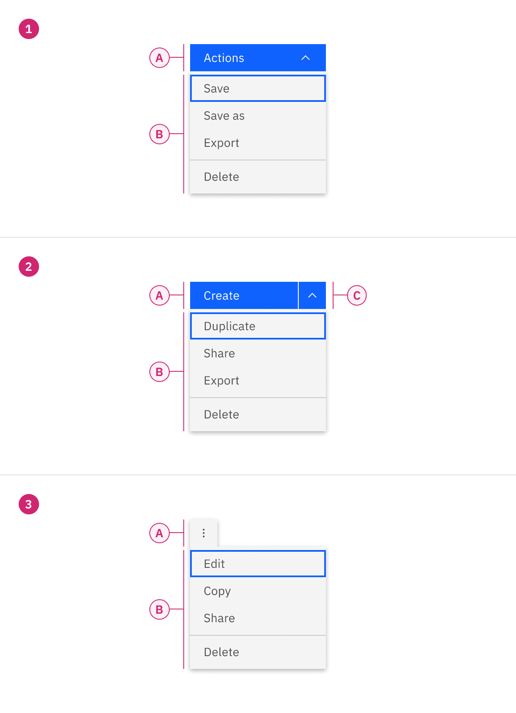
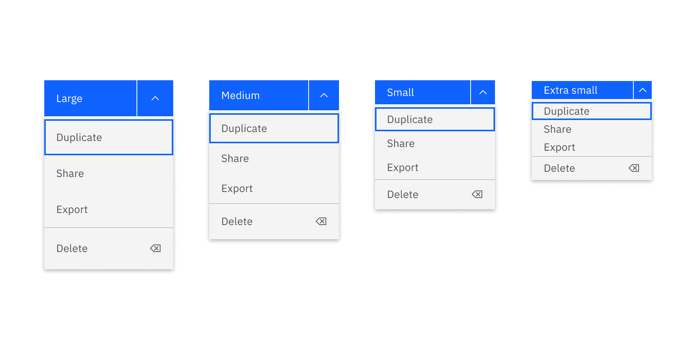
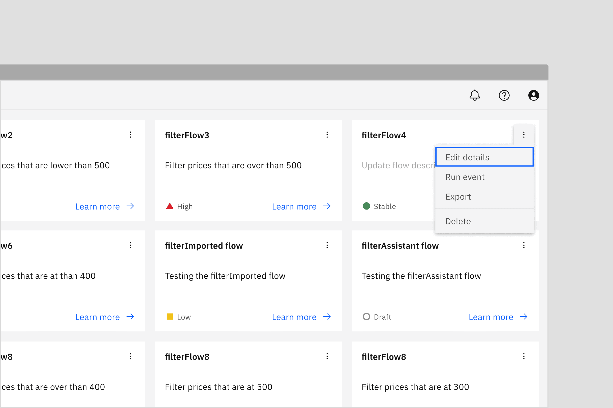
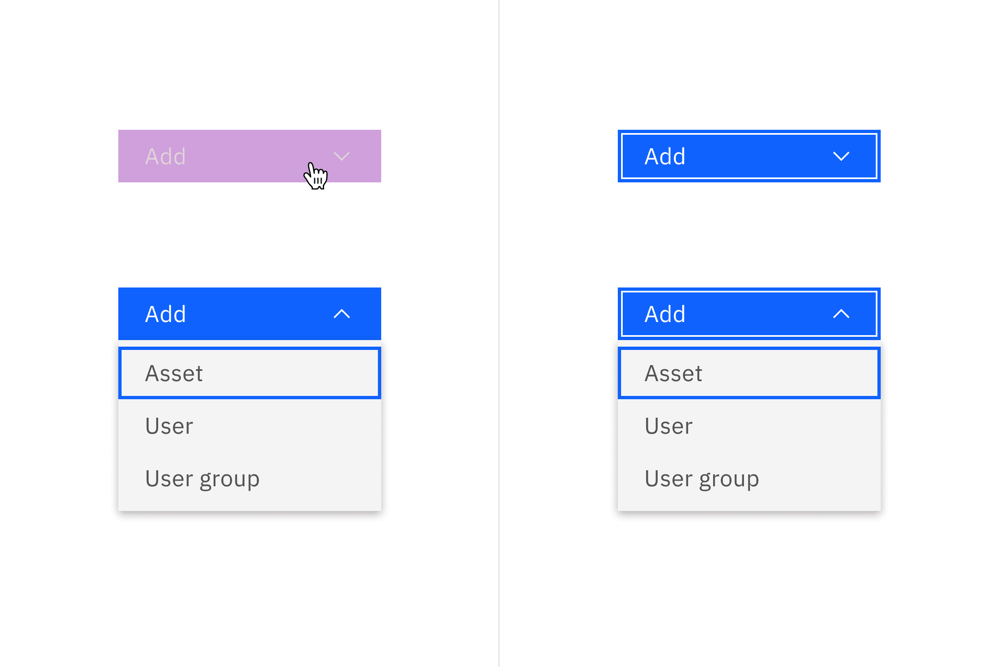
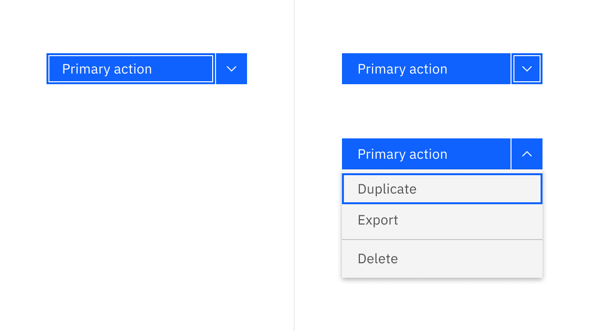
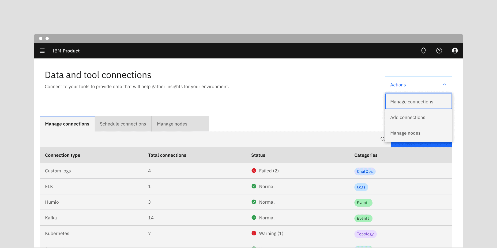
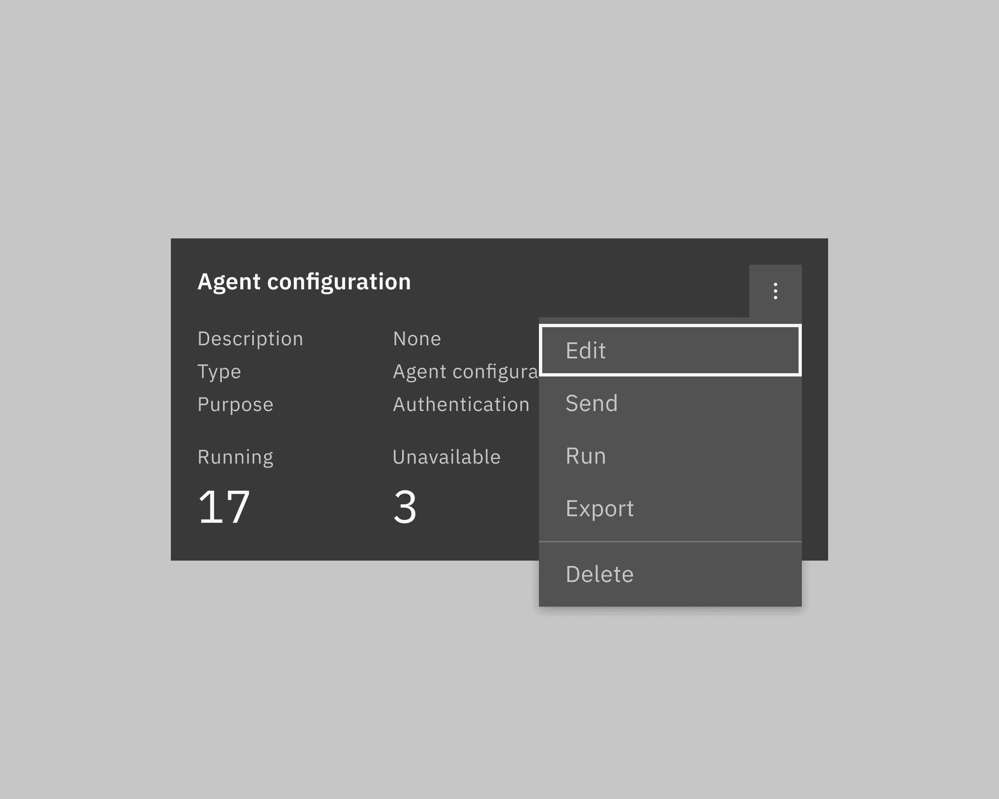

import A11yStatus from 'components/A11yStatus';
import { Tag } from '@carbon/react';

<PageDescription>

<Tag type="blue">Feature flag</Tag>

Menu buttons, including menu buttons, combo buttons, and overflow menus, open a
menu with a list of interactive options.

</PageDescription>

<AnchorLinks>

<AnchorLink>Live demo</AnchorLink>
<AnchorLink>Overview</AnchorLink>
<AnchorLink>Formatting</AnchorLink>
<AnchorLink>Content</AnchorLink>
<AnchorLink>Universal behaviors</AnchorLink>
<AnchorLink>Menu button</AnchorLink>
<AnchorLink>Combo button</AnchorLink>
<AnchorLink>Overflow menu</AnchorLink>
<AnchorLink>Related</AnchorLink>
<AnchorLink>References</AnchorLink>
<AnchorLink>Feedback</AnchorLink>

</AnchorLinks>

## Live demo

<StorybookDemo
  themeSelector
  url="https://react.carbondesignsystem.com"
  short
  variants={[
    {
      label: 'Menu button',
      variant: 'components-menubutton--default',
    },
    {
      label: 'Combo button',
      variant: 'components-combobutton--default',
    },
    {
      label: 'Overflow menu',
      variant: 'components-overflowmenu--default',
    },
  ]}
/>

<A11yStatus
  layout="cards"
  components={['Menu button', 'Combo button', 'Overflow menu']}
/>

## Overview

There are three variants of menu buttons (or menu triggers): menu button, combo
button, and overflow menu button. Menu buttons are comprised of a button and a
[menu](/components/menu/usage/), which can be clicked to trigger an action or
selected to initiate an action from a menu.

<Row>
<Column colLg={12}>

</Column>
</Row>

### When to use

#### Hiding extra actions in limited screen space

Menu button, combo button, and overflow menu are useful when you need to show
numerous options but have limited screen space available to display them. By
hiding less frequently used or advanced options until the user needs them, it
avoids cluttering the main interface with too many options.

### Variants

| Variant                         | Purpose                                                                                                                                           |
| ------------------------------- | ------------------------------------------------------------------------------------------------------------------------------------------------- |
| [Menu button](#menu-button)     | Use a menu button when all actions in the menu list share the same level of importance. They are usually used in the page header.                 |
| [Combo button](#combo-button)   | Use a combo button when screen real estate is limited and one of the actions has particular importance. They are usually used in the page header. |
| [Overflow menu](#overflow-menu) | Use an overflow menu when additional options are available to the user and there is a space constraint. They are usually used in rows or cards.   |

### Feature flags

A [feature flag](/components/overview/feature-flags/) has been added to the
overflow menu variant of menu buttons to improve accessibility and changes parts
of its functionality, not its visual appearance. For code-specific feature flag
information, refer to the [Code](/components/menu-buttons/code/) tab. The
current overflow menu is not being deprecated, but teams are encouraged to use
the feature flag overflow menu for their products moving forward. Once the next
major release (v12) is released in the future, this feature flag will become the
default version of the component.

## Formatting

### Anatomy

<Row>
<Column colLg={8}>

</Column>
</Row>

<Row>
<Column colSm={2} colMd={4} colLg={4}>

#### 1. Menu button

A. Primary button   B. Menu  

#### 2. Combo button

A. Primary button   B. Menu   C. Icon button  

</Column>

<Column colSm={2} colMd={4} colLg={4}>

#### 3. Overflow menu

A. Icon button   B. Menu  

</Column>
</Row>

### Sizing

#### Height

Menu buttons come in four sizes: **extra small**, **small**, **medium**, and
**large**. When using menu buttons, the height of each item in the menu reflects
the same size of the trigger button being used. See more about size
specifications on the [Style](/components/menu-buttons/style/) tab.

| Size        | Height (px / rem) |
| ----------- | ----------------- |
| Extra small | 24 / 1.5          |
| Small       | 32 / 2            |
| Medium      | 40 / 2.5          |
| Large       | 48 / 3            |

<Row>
<Column colLg={8}>

</Column>
</Row>

<DoDontRow>
  <DoDont type="do" caption="Do match the height of the menu buttons and the menu">

  </DoDont>
  <DoDont type="dont" caption="Do not mix the height of the menu buttons and the menu">

  </DoDont>
</DoDontRow>

#### Width

By default, the [menu button](/components/menu-buttons/usage/#menu-button) and
[combo button](/components/menu-buttons/usage/#combo-button) follow the
[button structure style](https://carbondesignsystem.com/components/button/style#structure),
and the menu maintains a minimum width of 160px to prevent a narrow appearance.

<Row>
<Column colLg={12}>

<Caption>
  Menu default width when both button label and menu option labels are short
</Caption>

</Column>
</Row>

If the menu item labels become longer, the menu button and combo button remain
the same size while the menu component can expand up to a maximum of 288px.
Conversely, if the button labels become longer, the menu component should not
appear narrower but should extend to match the width of the menu buttons.

If you opt for
[fluid-width default buttons](https://carbondesignsystem.com/components/button/usage/#alignment),
both the menu button (or the combo button) and the menu should have the same
width.

<DoDontRow>
  <DoDont type="do" caption="Do use the minimum width">

  </DoDont>
  <DoDont type="dont" caption="Do not narrow the menu to fit with other elements">

  </DoDont>
</DoDontRow>

<DoDontRow>
  <DoDont type="do" caption="Do match the width when the menu or combo button label becomes longer">

  </DoDont>
  <DoDont type="dont" caption="Do not make the menu appear shorter than the menu or combo buttons">

  </DoDont>
</DoDontRow>

Ghost buttons only adhere to the
[button](https://carbondesignsystem.com/components/button/style/) style. This is
because enlarging the ghost button's width to match the menu's width would
result in the caret appearing disconnected from its associated button,
especially when the menu button is in its closed state.

<DoDontRow>
  <DoDont type="do" caption="Do use default ghost button in all cases">

  </DoDont>
  <DoDont type="dont" caption="Do not use fluid ghost button in any cases">

  </DoDont>
</DoDontRow>

### Alignment

#### Default

By default, combo button, menu button, or overflow button remains positioned at
the top, to the left or right side of the menu when it is open, depending on the
available space and layout.

<Row>
<Column colLg={8}>

</Column>
</Row>

#### Alternatives

Alternatively, open menus can be positioned at the bottom, to the left or right
of its associated menu button trigger, depending on the available space and
layout.

<Row>
<Column colLg={8}>

</Column>
</Row>

### Placement

#### Menu and combo buttons

These buttons are ideal for page headers, where multiple, distinct actions may
impact the page content, and where real-estate is limited. In the page header
component, multiple buttons will become a single action button at smaller screen
sizes. These buttons should only be used when the actions affect a full page or
a large object on a page (examples include a canvas UI, diagram, or whole data
table).

<Row>
<Column colLg={8}>

</Column>
</Row>

#### Overflow menu

When actions affect a smaller proportion of a page, such as table rows or cards,
use an overflow menu.

<Row>
<Column colLg={8}>

</Column>
</Row>

## Content

### Main elements

#### Label

The text label of the button is important to communicate the action that is
triggered when the user interacts with it. The text label must accurately
describe the button action or indicate that interacting with it displays a list
of possible actions.

### Further guidance

For further content guidance, see Carbon's
[content guidelines](/guidelines/content/overview).

## Universal behaviors

### States

The default and interactive states of menu buttons should follow the button
[style](https://carbondesignsystem.com/components/button/style) guidelines.

- Combo buttons are available only as primary buttons.
- Menu buttons come in three different button types: primary, tertiary, and
  ghost.
- The icon button of overflow menu is treated as the ghost button, displaying
  only an icon and following its designated color and style.

### Interactions

#### Menu button

Users can reveal the menu by:

- Clicking anywhere on the container of a menu button
- Or tabbing into the menu button and pressing `Return` or `Enter`

<Row>
<Column colLg={8}>

<Caption>Mouse and keyboard interactions for menu button</Caption>
</Column>
</Row>

#### Combo button

Users can reveal the menu by:

- Clicking anywhere on the container of the primary button or the icon button.
  If clicking on the primary button, this will apply to certain elements,
  depending on user interaction.
- Or tabbing into the combo button which will focus on the primary button first
  then the icon button. Then, pressing the `Return` or `Enter` to trigger the
  action of the primary button or menu under the icon button.

<Row>
<Column colLg={8}>

<Caption>Mouse interactions for combo button</Caption>
</Column>
</Row>

<Row>
<Column colLg={8}>

<Caption>Keyboard interactions for combo button</Caption>
</Column>
</Row>

#### Overflow menu

Users can reveal the overflow menu by:

- Clicking anywhere on the container of the icon button
- Or tabbing into the icon button and pressing `Return` or `Enter`

<Row>
<Column colLg={8}>

<Caption>Keyboard interactions for overflow menu</Caption>
</Column>
</Row>

## Menu button

Menu buttons group actions that share the same level of importance. The icon
used within the menu button should always be a caret in order to visually convey
to the user that there are options to select from. There are three main use
cases where using a menu button is recommended:

- Grouping objects with the same common action
- Actions related to a common label
- Distinct actions applied to the same object or page

Menu button comes in three different button types: primary, tertiary, and ghost.
For detailed visuals, visit the
[Style](/components/menu-buttons/style/#menu-button-color) tab.

<Row>
<Column colLg={8}>

</Column>
</Row>

### Best practices

#### Grouping objects with the same common action

Menu buttons are effective when a single action affects multiple distinct
objects. This is particularly applicable when users need to Create or Add
various objects, and all these objects are equally relevant options.

The shared action should not be repeated in the menu list. This adds unnecessary
clutter and makes each option less distinct at a glance.

<DoDontRow>
  <DoDont type="do" caption="Do add distinct items for the action">

</DoDont>
<DoDont type="dont" caption="Do not repeat the action in the action item">

  </DoDont>
</DoDontRow>

#### Actions associated with a shared label

Another common use of a menu button is grouping actions related to a common
label. An example of this is when users have multiple approaches to execute an
action, all of which are presented as choices within the menu button.

<Row>
<Column colLg={8}>

</Column>
</Row>

#### Distinct actions applied to the same object or page

In many cases, actions on a page may not use the same verb or have a shared
label for the menu button. When grouped actions remain distinct, consider
labeling the menu button as 'Actions' to encompass all available choices.

<Row>
<Column colLg={12}>

<Caption>Example shows the menu button with possible actions that could influence the data within tab contents</Caption>
</Column>
</Row>

## Combo button

A combo button is composed of two buttons: the left is the default option (the
most commonly used selection), and the right (chevron icon) shows the rest of
the available options. A combo button provides quick access to a default action
while also offering a list of related actions or options.

The combo button is expected to have less use than the menu button, as the
additional actions are more hidden than they would be in menu button. However,
this button does have particular use where screen real estate is limited and one
of the actions has particular importance.

Combo button has only one button type: primary.

<Row>
<Column colLg={8}>

</Column>
</Row>

### Best practices

#### Choose a default action

Remember to choose the default, primary action that will be displayed in the
primary button so it is not hidden within the menu of additional actions. The
primary default action is typically the most commonly used action there is to
take.

<Row>
<Column colLg={8}>

<Caption>
  Example shows that users mostly choose to save records, while less common
  options are hidden as extra actions.
</Caption>
</Column>
</Row>

#### Reduce visual complexity on a page

Combo buttons reduce visual complexity by grouping similar commands together.
For example, how navigation menus group together related options to enable
conceptual understanding of the site information structure.

<Row>
<Column colLg={8}>

<Caption>
  Example shows that many actions (ghost buttons) applying to the same data can
  be replaced by the combo button.
</Caption>
</Column>
</Row>

## Overflow menu

Overflow menu is also another option that is available to the user when there is
a space constraint, usually used in data table rows or in cards. Overflow menu
has the ghost button style only.

<Row>
<Column colLg={8}>

</Column>
</Row>

### Best practices

#### Overflow menu in cards

When there are more than three interactive icons, consider moving less important
ones into the overflow menu. The overflow menu then takes the place of a third
action.

<Row>
<Column colLg={8}>

</Column>
</Row>

#### Overflow menu icon

The overflow icon can be customized to align with the product's requirements.
However, it's advisable to make minimal changes to the overflow menu's icon to
maintain consistency across the product and ensure a consistent user experience.

<Row>
<Column colLg={8}>

</Column>
</Row>

#### Overflow versus tab tip (popover)

Overflow menu displays extra options with simple text, typically utilized within
data table rows or cards. The
[tab tip](https://carbondesignsystem.com/components/popover/usage/#tab-tip)
popover allows the user to include more complex inputs such as a checkbox group
or a radio button group, usually connected to a data table toolbar.

<Row>
<Column colLg={4}>

<Caption>Use overflow menus in data table row</Caption>
</Column>

<Column colLg={4}>

<Caption>Use a popover in the data table toolbar</Caption>
</Column>
</Row>

## Related

#### Menu

To learn more about the details of how to use the menu component correctly, see
[menu buttons](/components/menu-buttons/usage).

#### Dropdown

To understand how the menu component can be used differently from the dropdown
component, see [dropdown](/components/dropdown/usage).

#### Popover

The popover component is visually similar to menu, but is used for different
purposes. See [popover](/components/dropdown/usage) for more information.

## References

- Anna Kaley,
  [Contextual Menus: Delivering Relevant Tools for Tasks](https://www.nngroup.com/articles/contextual-menus/)
  (Nielsen Norman Group, 2019)

- Page Laubheimer,
  [Split Buttons: Definition](https://www.nngroup.com/articles/split-buttons/)
  (Nielsen Norman Group, 2019)

## Feedback

Help us improve this component by providing feedback, asking questions, and
leaving any other comments on
[GitHub](https://github.com/carbon-design-system/carbon-website/issues/new?assignees=&labels=feedback&template=feedback.md).
