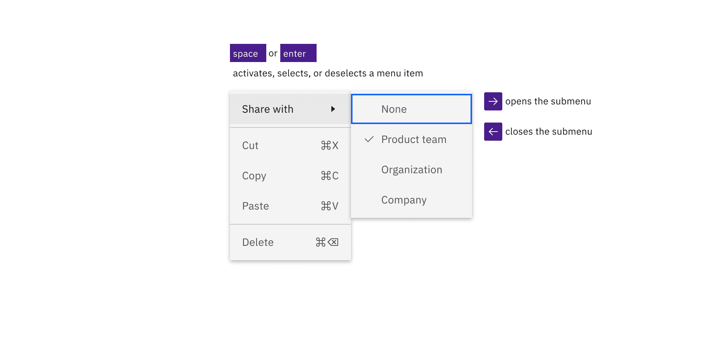

import A11yStatus from 'components/A11yStatus';

<PageDescription>

No accessibility annotations are needed for menus, but keep these considerations
in mind if you are modifying Carbon or creating a custom component.

</PageDescription>

<AnchorLinks>

<AnchorLink>What Carbon provides</AnchorLink>
<AnchorLink>Development considerations</AnchorLink>

</AnchorLinks>

## What Carbon provides

Carbon bakes keyboard operation into its components, improving the experience of
blind users and others who operate via keyboard. Carbon incorporates many other
accessibility considerations, some of which are described below.

### Keyboard interaction

The menu is reached by `Tab`. When the menu is open, the first item takes focus.
Use the `Up` and `Down` arrow keys to navigate between menu items.

<Row>

<Column colLg={8}>

<Caption>
  Menu is reached by Tab and when opened, the first menu item takes focus. Arrow
  keys move focus.
</Caption>

</Column>
</Row>

Pressing `Space` or `Enter` on a focused menu item activates it and collapses the 
menu. Pressing `Space` or `Enter` on a submenu opens it. A submenu can also be 
opened and closed using the right and left arrow key respectively. When the menu or 
submenu is open, the first item takes focus. An activated menu item can have 
different results depending on its functionality. If the item is a link, it launches
the selection. If the item is selectable, it selects or deselects the item. The menu 
item retains its selected or unselected state when the menu is opened again.

<Row>
<Column colLg={8}>

<Caption>
  Space and Enter keys activates, selects, or deselects the menu item with
  focus.
</Caption>

</Column>
</Row>

## Development considerations

Keep these considerations in mind if you are modifying Carbon or creating a
custom component.

- Each menu, including nested menus, are `ul` elements with `role="menu"`.
- Menu items are `li` elements with `role="menuitem"`.
- If a Menu item contains a sub-menu, it is given `aria-haspopup="true"` and
  `aria-expanded` of true or false depending on if the sub-menu is open/visible.
- Selectable menu items are given `role="menuitemcheckbox"`.
- Menu item groups are `li` elements with `role="group"`.
- Menu item radio groups get `role="menuitemradio"`.
- Menu items with really long labels can get truncated depending on the screen
  size. This label will be exposed by a browser rendered tooltip on hover or
  focus.
- Menu implements the
  [menu design pattern](https://www.w3.org/WAI/ARIA/apg/patterns/menubar/)
  defined in the ARIA Authoring Practices Guide (APG).

<A11yStatus layout="table" components="Menu" />
