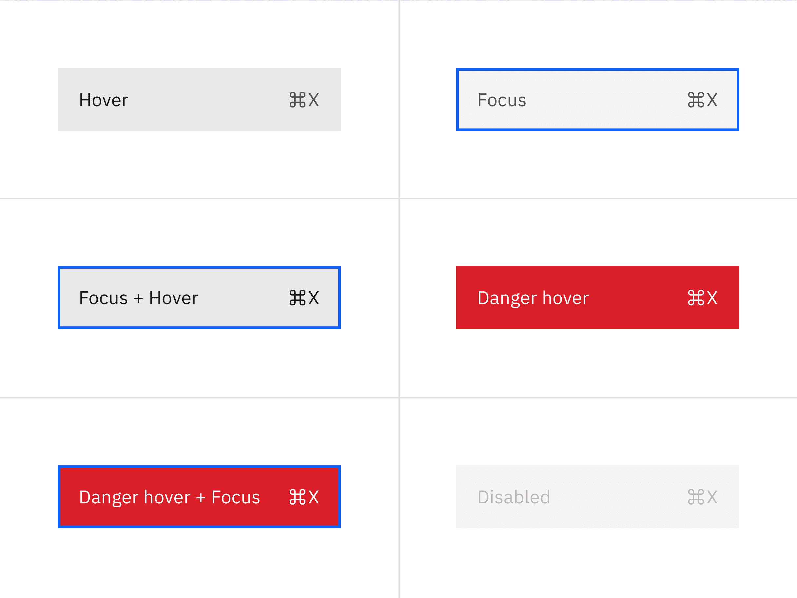
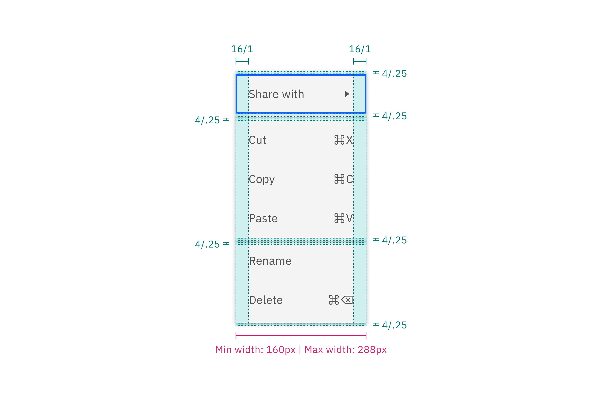
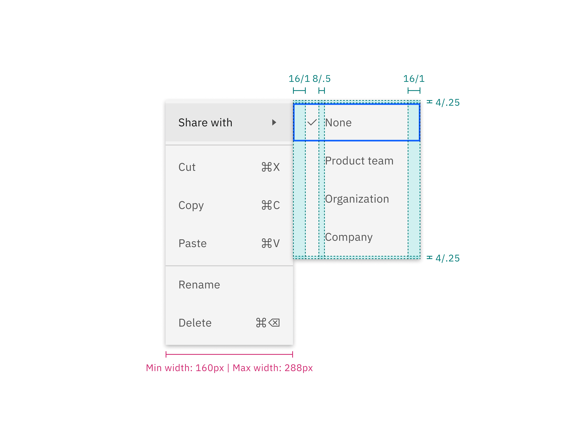
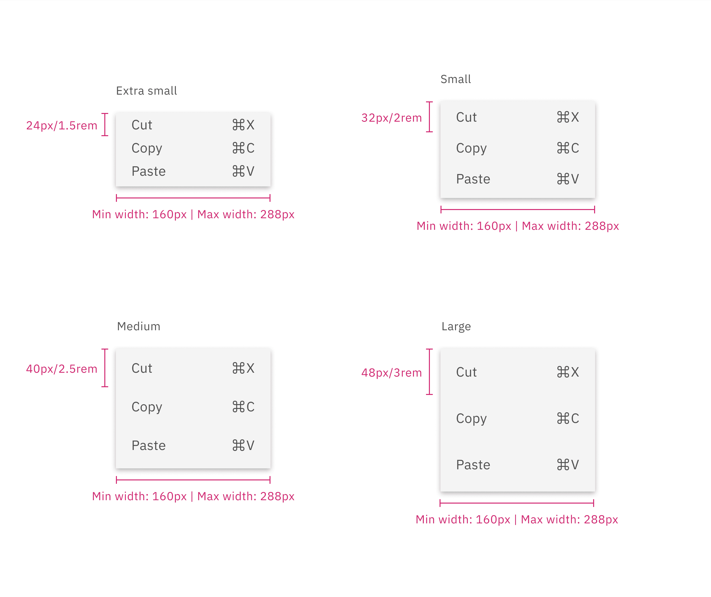

<PageDescription>

The following page documents visual specifications such as color, typography,
structure, and size.

</PageDescription>

<AnchorLinks>

<AnchorLink>Color</AnchorLink> <AnchorLink>Typography</AnchorLink>
<AnchorLink>Structure</AnchorLink> <AnchorLink>Size</AnchorLink>
<AnchorLink>Feedback</AnchorLink>

</AnchorLinks>

## Color

| Elements      | Property         | Color token                |
| ------------- | ---------------- | -------------------------- |
| Menu option   | background-color | `$layer` \*                |
|               | text-color       | `$text-secondary`          |
|               | border-top       | `$border-subtle` \*        |
| Caret icon    | svg              | `$icon-secondary`          |
| Shortcut icon | svg              | `$icon-secondary`          |
| Container     | box-shadow       | 0 2px 6px 0 rgba(0,0,0,.2) |

<Caption fullWidth>
  \* Denotes a contextual color token that will change values based on the layer
  it is placed on.
</Caption>

<Row>
<Column colLg={8}>

</Column>
</Row>

### Interactive state color

| State                  | Element     | Property         | Color token       |
| ---------------------- | ----------- | ---------------- | ----------------- |
| Hover                  | Menu option | background-color | `$layer-hover` \* |
|                        | Menu option | text-color       | `$text-primary`   |
|                        | Icon        | svg              | `$icon-primary`   |
| Focus                  | Menu option | background-color | `$layer`\*        |
|                        | Menu option | border           | `$focus`          |
| Focus and hover        | Menu option | background-color | `$layer-hover` \* |
|                        | Menu option | text-color       | `$text-primary`   |
|                        | Icon        | svg              | `$icon-primary`   |
|                        | Menu option | border           | `$focus`          |
| Danger hover           | Menu option | background-color | `$support-error`  |
|                        | Menu option | text-color       | `$text-on-color`  |
|                        | Icon        | svg              | `$icon-on-color`  |
| Danger hover and focus | Menu option | background-color | `$support-error`  |
|                        | Menu option | text-color       | `$text-on-color`  |
|                        | Menu option | border           | `$focus`          |
|                        | Icon        | svg              | `$icon-on-color`  |
| Disabled               | Menu option | background-color | `$layer` \*       |
|                        | Menu option | text-color       | `$text-disabled`  |
|                        | Icon        | svg              | `$icon-disabled`  |

<Caption fullWidth>
  \* Denotes a contextual color token that will change values based on the layer
  it is placed on.
</Caption>

<Row>
<Column colLg={8}>

</Column>
</Row>

## Typography

| Element          | Font-size (px/rem) | Font-weight   | Type token         |
| ---------------- | ------------------ | ------------- | ------------------ |
| Menu option text | 14 / 0.875         | Regular / 400 | `$body-compact-01` |

## Structure

| Element                            | Property                     | px / rem         | Spacing token                |
| ---------------------------------- | ---------------------------- | ---------------- | ---------------------------- |
| Icon                               | icon size                    | 16 / 1           | –                            |
| Option (default)                   | padding-right, padding-left  | 16 / 1           | `$spacing-05`                |
| Option (selectable but unselected) | padding-right, padding-left  | 16 / 1, 40 / 2.5 | `$spacing-05`, `$spacing-08` |
| Option (selectable and selected)   | padding-right, padding-left  | 16 / 1           | `$spacing-05`                |
| Option (next to the divider)       | margin-top, or margin-bottom | 4 / .25          | `$spacing-02`                |
| Option (first and last)            | margin-top, or margin-bottom | 4 / .25          | `$spacing-02`                |
| Divider                            | margin-top                   | 1px              | –                            |

### Default menu structure

<Caption>Structure and spacing measurements for main menu</Caption>

### Submenu structure

<Caption>Structure and spacing measurements for submenu</Caption>

### Menu option structure

<Caption>
  Structure and spacing measurements for individual menu options
</Caption>

## Size

There are four menu option sizes: extra small, small, medium, and large. The
height of a menu is determined by a
[menu button](/components/menu-buttons/style/). Menus have a fixed minimum width
of 160px (or 10rem), to ensure menu items have sufficient horizontal space,
while also having a fixed maximum width of 288px (or 18rem).

| Elements    | Size             | Height (px/rem) |
| ----------- | ---------------- | --------------- |
| Menu option | Extra small (xs) | 24 / 1.5        |
|             | Small (sm)       | 32 / 2          |
|             | Medium (md)      | 40 / 2 .5       |
|             | Large (lg)       | 48 / 3          |

## Feedback

Help us improve this component by providing feedback, asking questions, and
leaving any other comments on
[GitHub](https://github.com/carbon-design-system/carbon-website/issues/new?assignees=&labels=feedback&template=feedback.md).
