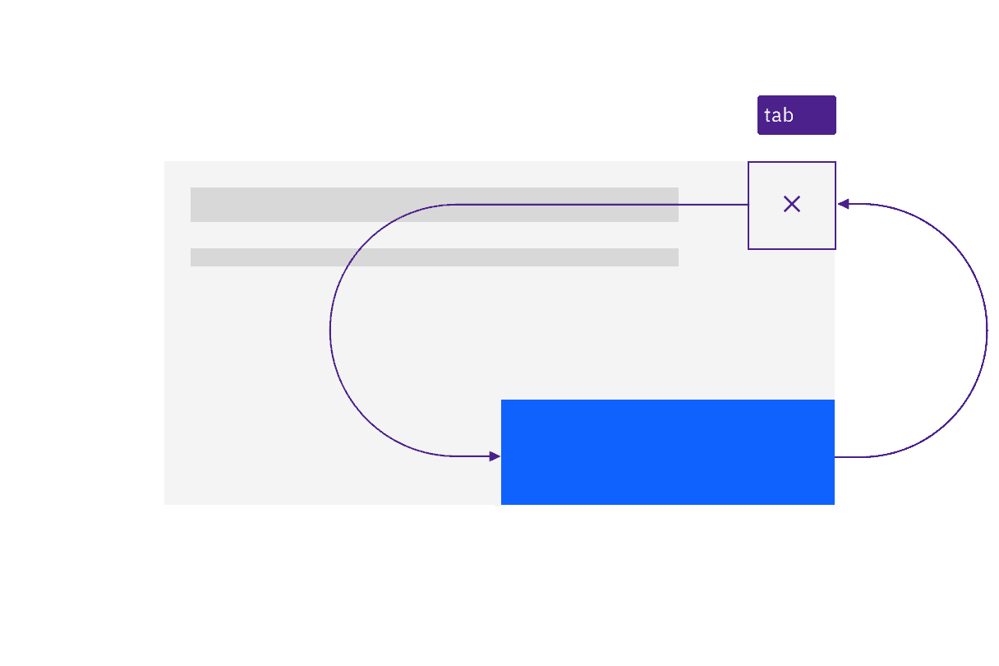
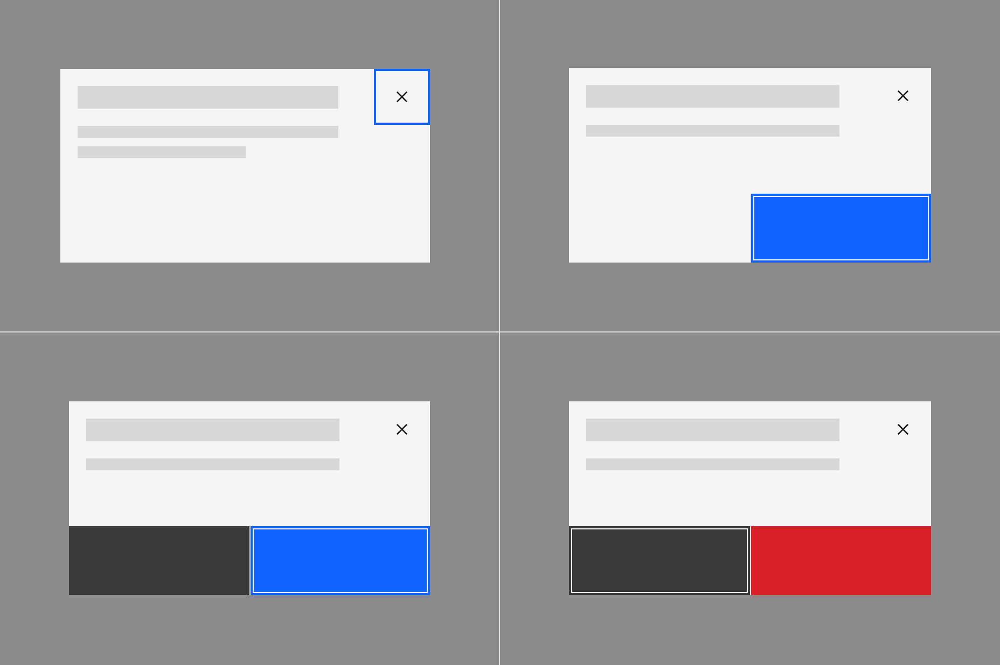

import {
  StructuredListWrapper,
  StructuredListHead,
  StructuredListBody,
  StructuredListRow,
  StructuredListInput,
  StructuredListCell,
  OrderedList,
  ListItem,
} from '@carbon/react';

<PageDescription>

Design annotations are needed for specific instances shown below, but for the
standard modal dialog component, Carbon already incorporates accessibility.

</PageDescription>

<AnchorLinks>
  <AnchorLink>What Carbon provides</AnchorLink>
  <AnchorLink>Design recommendations</AnchorLink>
  <AnchorLink>Development considerations</AnchorLink>
</AnchorLinks>

## What Carbon provides

Carbon bakes keyboard operation into its components, improving the experience of
blind users and others who operate via the keyboard. Carbon incorporates many
other accessibility considerations, some of which are described below.

### Keyboard interactions

Modal dialogs take focus on appearance, and the tab order is constrained to the modal’s controls until the modal is closed by choosing one of the buttons with `Enter` or `Space`, or is dismissed by pressing `Esc`.

<Row>
<Column colLg={8}>

<Caption>
  Keyboard navigation is constrained to the dialog. Tab cycles through the components that take focus.
</Caption>

</Column>
</Row>

<Row>
<Column colLg={8}>

<Caption>
  The dialog is resolved by the user pressing Esc or activating a button.
</Caption>

</Column>
</Row>

When the dialog appears, the first item that gets focus depends on the type of dialog. Passive dialogs only contain a close button (X), so that takes focus. For dialogs which prompt for confirmation or user decision, the primary button takes focus. For destructive interactions, the “cancel” button takes focus, not the red danger/delete button. 
The tab order should proceed left and down from whichever item has focus before wrapping back to the Close button (X).

<Row>
<Column colLg={8}>

<Caption>
  The first item with focus varies depending on dialog type.
</Caption>

</Column>
</Row>

## Design recommendations

### Designate the first input to take focus in a transactional
The only time the starting focus would not be on a button is where a dialog contains input fields. For such transactional dialogs, designers should annotate that the first input field should receive focus. Note that text links are not considered a user input in this context.

<Row>
<Column colLg={8}>

<Caption>
  Annotate the connection between generic links and text that gives context.
</Caption>

</Column>
</Row>

## Development considerations

Keep these considerations in mind if you are modifying Carbon or creating a
custom component.

- Associate generic links such as “read more” with other contextual text, using
  either `aria-describedby` or `aria-labelledby` (to concatenate multiple text
  strings). See the
  [Equal Access Toolkit guidance](https://www.ibm.com/able/toolkit/develop/text-and-non-text/#aria-labelling)
  for more details.
- See the [ARIA authoring practices](https://w3c.github.io/aria-practices/#link)
  for more considerations.
