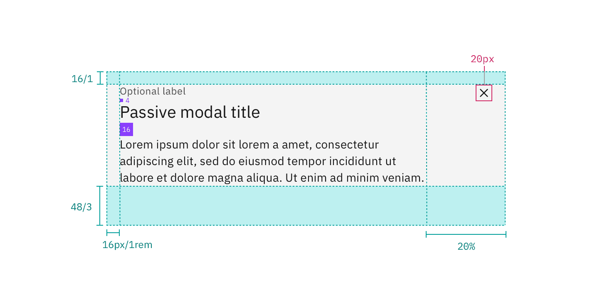
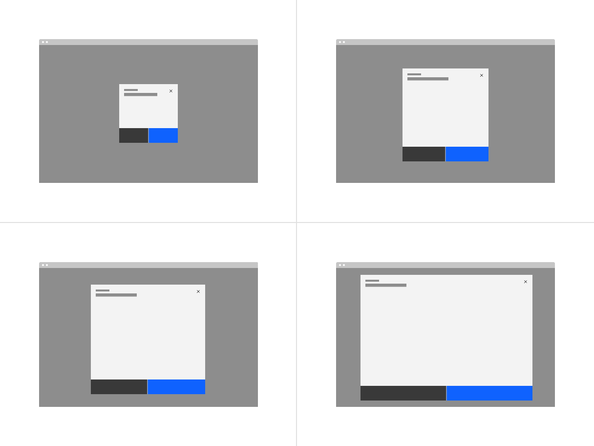

## Color

Refer to the [button](/components/button/style) for primary and secondary button
styling in the transactional modal.

| Elements         | Property         | Color token       |
| ---------------- | ---------------- | ----------------- |
| Container        | background-color | `$layer` \*       |
| Header label     | text color       | `$text-secondary` |
| Header           | text color       | `$text-primary`   |
| Content          | text color       | `$text-primary`   |
| Close icon       | fill             | `$icon-primary`   |
| Close icon:hover | background-color | `$layer-hover` \* |
| Page overlay     | color            | `$overlay`        |

<Caption>
  * Denotes a contextual color token that will change values based on the layer
  it is placed on.
</Caption>

## Typography

Modal labels and headings should be set in sentence case. Keep all labels and
headings concise and to the point. Modal labels are optional.

| Element | Font-size (px/rem) | Font-weight   | Type token    |
| ------- | ------------------ | ------------- | ------------- |
| Label   | 12 / 0.75          | Regular / 400 | `$label-01`   |
| Heading | 20 / 1.25          | Regular / 400 | `$heading-03` |
| Content | 14 / 0.875         | Regular / 400 | `$body-01`    |

## Structure

| Element      | Property                  | px / rem | Spacing token |
| ------------ | ------------------------- | -------- | ------------- |
| Close button | height, width             | 48 x 48  | –             |
| Close icon   | height, width             | 16 x 16  | –             |
| Header label | margin-bottom             | 4 / 0.25 | `$spacing-02` |
| Header       | padding top, padding left | 16 / 1   | `$spacing-05` |
|              | margin-bottom             | 16 / 1   | `$spacing-05` |
| Content      | padding-left              | 16 / 1   | `$spacing-05` |
|              | padding-right             | 20%      | –             |
|              | margin-bottom             | 48 / 3   | `$spacing-09` |

<Caption>
  Structure and spacing measurements for a passive modal | px / rem
</Caption>

<Caption>
  Structure and spacing measurements for a transactional modal | px / rem
</Caption>

### Margin-right

Modals that are 36% width and larger have a `margin-right: 20%` (margin
percentage is based off the width of the modal window). If the modal is smaller
than 36% then it has a fixed `margin-right: 16px/1rem`. Body copy, including
titles, in a modal always follows the 20% margin-right rule. However, inputs and
other components may still expand to the full width of a modal window.

<Caption>
  Margin-right for modals less than 36% (left) and greater than 36% (right).
</Caption>

### Button structure

| Number of buttons | Percentage width of modal | Positioning                 |
| ----------------- | ------------------------- | --------------------------- |
| 1                 | 50%                       | Flush right                 |
| 2                 | 50% each                  | Full bleed                  |
| 3                 | 25% each                  | Flush right                 |
| 3                 | 25% each                  | 1 flush left, 2 flush right |

<Row>
<Column colLg={8}>

</Column>
</Row>

## Sizes

There are four modal sizes: extra small, small, medium, and large. Each modal
size has a responsive width that changes based on the browser size. As the
browser decreases, the modal width percentage increases thus maintaining a
proper ratio between the modal and browser. Modal widths are defined as
percentages of the browser but will still align to columns on the 2x grid.

<Row>
<Column colLg={8}>

</Column>
</Row>

### Extra small (xs)

| Breakpoint | Percentage width | Column span | Margin-right |
| ---------- | ---------------- | ----------- | ------------ |
| 1584       | 24%              | 4 of 16     | 16px / 1rem  |
| 1312       | 24%              | 4 of 16     | 16px / 1rem  |
| 1056       | 32%              | 5 of 16     | 16px / 1rem  |
| 672        | 48%              | 4 of 8      | 16px / 1rem  |
| 320        | 100%             | 4 of 4      | 16px / 1rem  |

### Small (sm)

| Breakpoint | Percentage width | Column span | Margin-right |
| ---------- | ---------------- | ----------- | ------------ |
| 1584       | 36%              | 6 of 16     | 20%          |
| 1312       | 36%              | 6 of 16     | 20%          |
| 1056       | 42%              | 7 of 16     | 16px / 1rem  |
| 672        | 60%              | 5 of 8      | 16px / 1rem  |
| 320        | 100%             | 4 of 4      | 16px / 1rem  |

### Medium (md)

| Breakpoint | Percentage width | Column span | Margin-right |
| ---------- | ---------------- | ----------- | ------------ |
| 1584       | 48%              | 8 of 16     | 20%          |
| 1312       | 48%              | 8 of 16     | 20%          |
| 1056       | 60%              | 10 of 16    | 20%          |
| 672        | 84%              | 7 of 8      | 20%          |
| 320        | 100%             | 4 of 4      | 16px / 1rem  |

### Large (lg)

| Breakpoint | Percentage width | Column span | Margin-right |
| ---------- | ---------------- | ----------- | ------------ |
| 1584       | 72%              | 12 of 16    | 20%          |
| 1312       | 72%              | 12 of 16    | 20%          |
| 1056       | 84%              | 14 of 16    | 20%          |
| 672        | 96%              | 8 of 8      | 20%          |
| 320        | 100%             | 4 of 4      | 16px / 1rem  |

### Max sizes

Each modal size has a max height in order to maintain a proper window ratio.

| Modal size       | Max-height |
| ---------------- | ---------- |
| Extra small (xs) | 48%        |
| Small (sm)       | 72%        |
| Medium (md)      | 84%        |
| Large (lg)       | 96%        |

<Row>
<Column colLg={8}>

</Column>
</Row>

### Mobile

On mobile devices, at the smaller break points the max-height does not apply.
The height may either be 100% of the screen or maintain the height defined by
the content while sticking to the bottom of the mobile screen.

<Row>
<Column colLg={8}>

</Column>
</Row>
