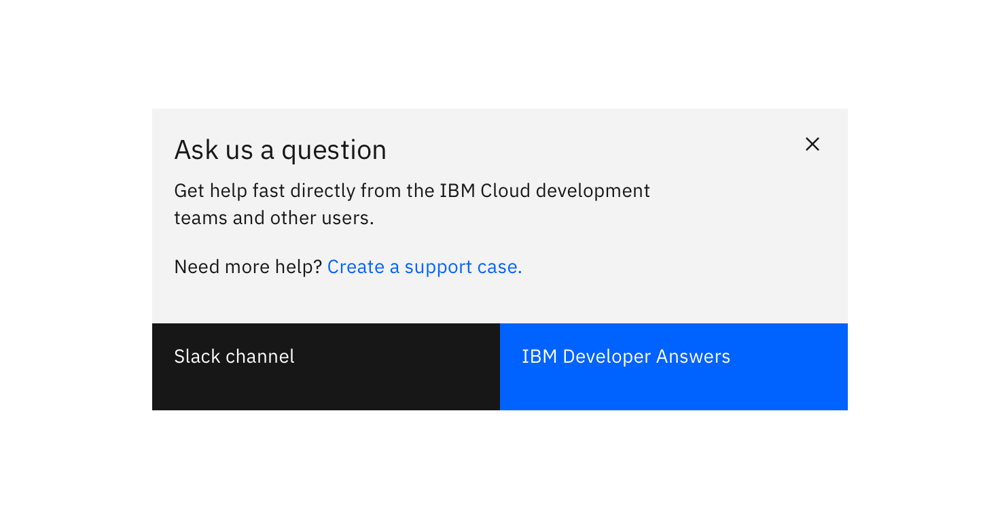
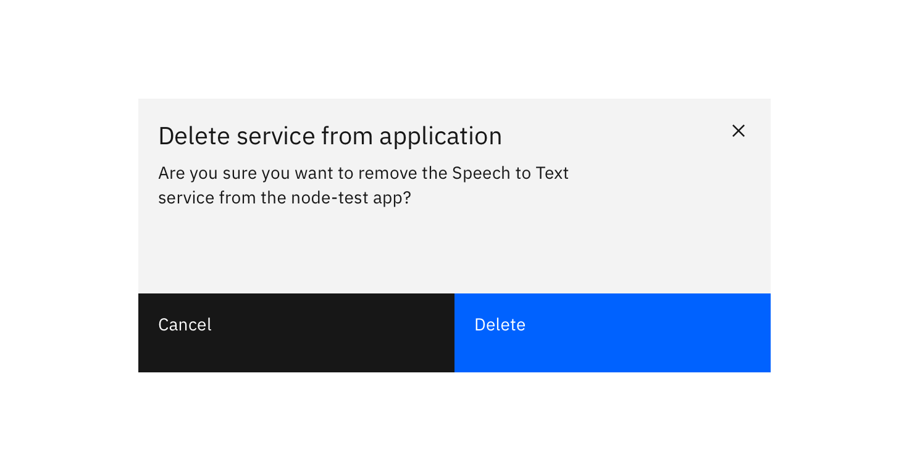
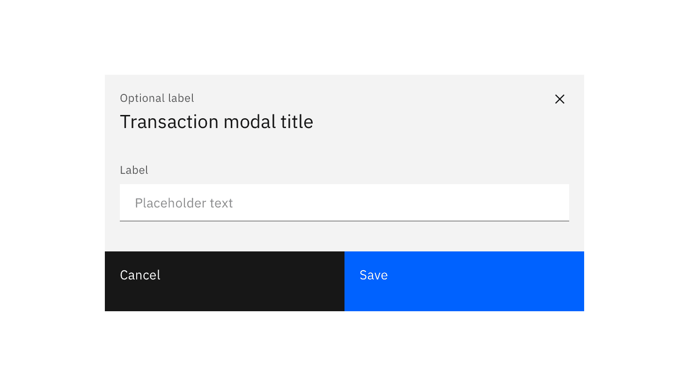
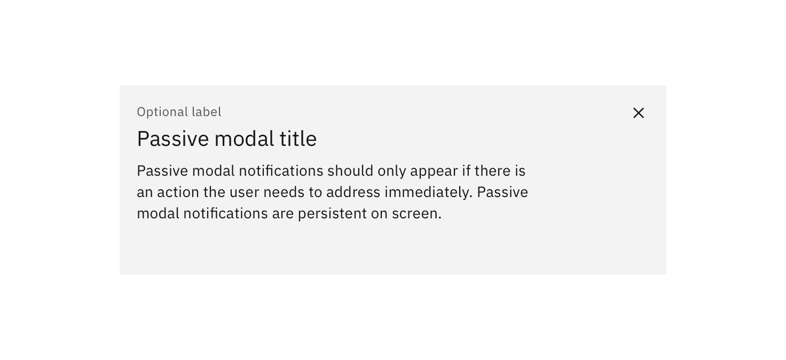

<PageDescription>

Modals communicate information via a secondary window and allow the user to maintain the context of a particular task.

</PageDescription>

<AnchorLinks>

<AnchorLink>General guidance</AnchorLink>
<AnchorLink>Format</AnchorLink>
<AnchorLink>Variations</AnchorLink>

</AnchorLinks>

## General guidance

Modals interrupt user workflow by design. They are most effective when a task must be completed before a user can continue. While effective when used correctly, modals should be used sparingly to limit disruption to a user experience.

#### Dismissal

Modals may be dismissed in 3 ways:

- Using the “✕” in the upper right-hand corner of the modal
- Pressing the `ESC` key
- Clicking or touching outside of the modal

## Format

The modal is composed of three distinct zones: A header, the body, and a footer. Components (eg. data table, form, progress indicator) can occupy the full width of the modal.

#### Header

The header of your modal should mirror the action that launched the modal. Headers must include a close button “✕” in the upper right-hand corner of the modal. You can also include an optional label above your header text. This is an opportunity to offer additional context.

#### Body

A modal should have minimal body content. Components that may be used in modals include: form fields, text area, select, and radio buttons. Text, including the paragraph component, should only be 75% of the modal's width.

#### Footer

The footer area of a modal typically contains either one or two [buttons](/components/button/code). Do not include three buttons in the footer of your modal. If you need to include a “help” or other non-primary action, include it as a link in the modal's body.

<Row>
<Column colLg={8}>

</Column>
</Row>

<Row>
<Column colLg={8}>

</Column>
</Row>

## Variations

### Transactional modal

Transactional modals are used to validate user decisions or to gain secondary confirmation from the user. Typically, the modal requests either a 'yes' or 'no' response.

<Row>
<Column colLg={8}>

</Column>
</Row>

### Input modal

Modals used in this case include input areas that the user may interact with. These may include but are not limited to forms, dropdowns, selectors, and links.

<Row>
<Column colLg={8}>

</Column>
</Row>

### Passive modal

The passive modal is a style of notification. Passive modals are highly disruptive to a user experience, and should only be used if a user must address something immediately.

Passive modal notifications are persistent on-screen. Users must either engage with or dismiss the notification.

<Row>
<Column colLg={8}>

</Column>
</Row>
