import A11yStatus from 'components/A11yStatus';
import { Tag } from '@carbon/react';

<PageDescription>

<Tag type="blue">Feature flag</Tag>

Modals focus the user’s attention exclusively on one task or piece of
information by using a window that is displayed on top of the page content.

</PageDescription>

<InlineNotification>

Modal
[with AI label](https://react.carbondesignsystem.com/?path=/story/components-modal--with-ai-label)
is now stable. This addition changes the visual appearance of the component and
introduces an AI explainability feature when AI is present in the component. See
the [AI presence](/components/modal/usage/#ai-presence) section for more
details.

</InlineNotification>

<AnchorLinks>

<AnchorLink>Live demo</AnchorLink>
<AnchorLink>Overview</AnchorLink>
<AnchorLink>Formatting</AnchorLink>
<AnchorLink>Content</AnchorLink>
<AnchorLink>Universal behaviors</AnchorLink>
<AnchorLink>Modal variants</AnchorLink>
<AnchorLink>AI presence</AnchorLink>
<AnchorLink>Related</AnchorLink>
<AnchorLink>Feedback</AnchorLink>

</AnchorLinks>

## Live demo

<StorybookDemo
  themeSelector
  url="https://react.carbondesignsystem.com"
  tall
  variants={[
    {
      label: 'Default',
      variant: 'components-modal--default',
    },
    {
      label: 'Danger modal',
      variant: 'components-modal--danger-modal',
    },
    {
      label: 'Full width',
      variant: 'components-modal--full-width',
    },
    {
      label: 'Passive modal',
      variant: 'components-modal--passive-modal',
    },
    {
      label: 'With state manager',
      variant: 'components-modal--with-state-manager',
    },
    {
      label: 'With AI label',
      variant: 'components-modal--with-ai-label',
    },
  ]}
/>

<A11yStatus layout="cards" components={['Modal', 'Composed modal']} />

## Overview

Modals are a type of [dialog](/patterns/dialog-pattern) because it is a
conversation between the user and the system. Use a modal to present critical
information or request user input that's needed to complete a user’s workflow.
Modals interrupt a user’s workflow for short and non-frequent tasks, such as
editing or management tasks. When the modal is open, the user is blocked from
the on-page content and can't return to their previous workflow until the modal
task is completed or the user dismisses the modal. While effective when used
correctly, modals should be used sparingly to limit disrupting the user.
Therefore, if a user needs to repeatably perform a task, consider making the
task completable on the main page.

### When to use

#### Require an immediate response from the user

Use a dialog to request information that is preventing the system from
continuing a user-initiated process.

#### Notify the user of urgent information

Use a modal to notify the user of urgent information concerning their current
work. Modals are commonly used to report system errors or convey a consequence
of a user’s action.

#### Confirm a user decision

Use a modal to confirm user decisions. Clearly describe the action being
confirmed and explain any potential consequences that it may cause. Both the
title and the button should reflect the action that will occur. If the action is
destructive or irreversible, then use a transactional danger modal.

### Variants

| Variant                                                        | Usage                                                                                                                                                          |
| -------------------------------------------------------------- | -------------------------------------------------------------------------------------------------------------------------------------------------------------- |
| [Passive](/components/modal/usage#passive-modal)               | Presents information the user needs to be aware of concerning their current workflow. Contains no actions for the user to take.                                |
| [Transactional](/components/modal/usage#transactional-modal)   | Requires an action to be taken for the modal to be completed and closed. Contains a cancel and primary action buttons.                                         |
| [Danger](/components/modal/usage#danger-modal)                 | A specific variant of transactional modal used for destructive or irreversible actions.                                                                        |
| [Acknowledgment](/components/modal/usage#acknowledgment-modal) | System requires an acknowledgement of the information from the user. Contains only a single button, commonly **OK**.                                           |
| [Progress](/components/modal/usage#progress-modal)             | Requires several steps to be completed before it can be closed. Contains a cancel, previous, and next or completion buttons, such as **Complete** or **Done**. |

### Feature flags

A [feature flag](/components/overview/feature-flags/) was added to the modal
component to improve accessibility and changes parts of its functionality, not
its visual appearance. For code-specific feature flag information, refer to the
[Code](/components/modal/code/) tab. The current modal is not being deprecated,
but teams are encouraged to use the feature flag modal for their products moving
forward. Once the next major release (v12) is released in the future, this
feature flag will become the default version of the component.

## Formatting

### Anatomy

<Row>
<Column colLg={8}>

</Column>
</Row>

The modal has three distinct zones: A header, the body, and a footer.
Components, for example a data table, form or, progress indicator, can occupy
the full width of the modal.

1. **Header**: Includes a title, optional label, and the close icon.

2. **Body**: Contains the information and controls, or both that are needed to
   complete the modal's task. It can include message text and components.

3. **Footer**: Contains the main actions needed to complete or cancel the modal
   task. Button groupings change based on the modal variant.

4. **x**: The close **x** icon will close the modal without submitting any data.

5. **Overlay**: Screen overlay that obscures the on-page content.

### Sizing

There are four responsive [modal sizes](/components/modal/style#sizes): extra
small, small, medium, and large. Choose a size that works best for the amount of
modal content you have. Modals with brief text should be extra small or small to
avoid long single lines; for complex components, like a data table, the default
or large modal is more suitable.

<Row>
<Column colLg={8}>

</Column>
</Row>

#### Max heights

To maintain a proper window ratio, each modal size has a
[maximum height](/components/modal/style#max-sizes). If your modal has too much
scrolling because of a maximum height limitation, consider using the next modal
size up. If the large modal height is still not enough space then a full page
might be needed instead.

<Row>
<Column colLg={8}>

</Column>
</Row>

### Alignment

In a modal that has larger breakpoints and
[larger breakpoints](/components/modal/style#margin-right), body copy, including
titles, use a 20% margin-right. However, form inputs and other components expand
the entire width of a modal.

<Row>
<Column colLg={8}>

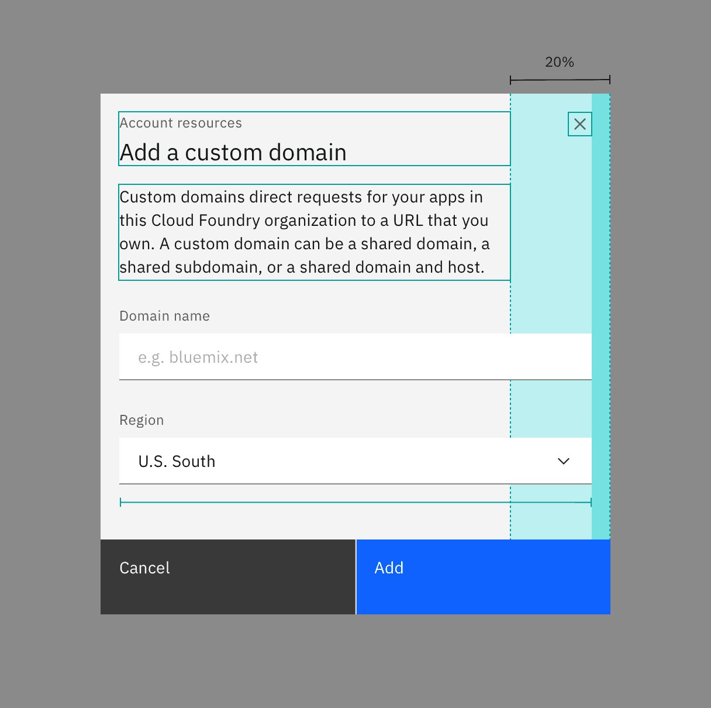

</Column>
</Row>

#### Full-width content

Certain components, such as a structure list or table, can expand into the
margins of the modal and align flush to the container edges. These components
typically have border dividers or containers that extend beyond the text or
icon. Labels or text of any kind should never be in the modal margins.

<Row>
<Column colLg={8}>

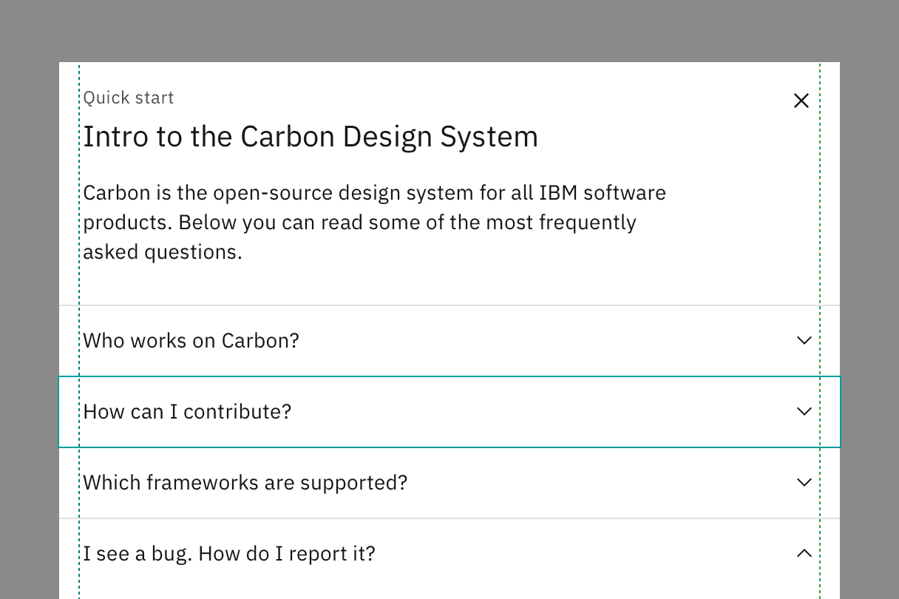

</Column>
</Row>

## Content

In IBM Style, the modal is referred to as a dialog.

### Title

- Use a brief verb phrase that describes the modal’s task or purpose.
- If the modal is accessed by clicking a button, use the button label for the
  modal title:
  - For example, if the user clicks the **Create access group** button to open
    the modal, _Create access group_ is the modal title. Modals might also be
    accessed by clicking a menu item or an icon.
  - Be aware of situations where there’s a tendency to mix and match button or
    icon labels and modal titles. For example, if the icon name is **New user**,
    use _New user_ as the modal title, not _Create user_.
- If your product has a more conversational tone, use articles (a, an, the) in
  the modal title even though the button label doesn't include the article, for
  example _Create an access group_.
- Sometimes, you might need to provide contextual information for the modal,
  such as when the actions performed using the modal apply to a specific item
  and you want to make it clear which item the actions apply to.
  - In this case, you can use the optional label that is displayed above the
    title.
  - For example, if the user needs to know the path to the object that they are
    editing, you might put the path in the optional label.

### Modal description

If the purpose or goal of the modal is not readily apparent, provide a sentence
or two of embedded assistance to help the user understand the modal or to
provide examples to explain how to use the modal. If the title and the purpose
are clear, such as _Edit object_ for the title when the purpose of the modal is
to edit an object, a description is not needed.

### Body content

- Include only fields, components, and embedded assistance that are relevant to
  completing the current task.
- Ensure that the text is 80% of the modal’s width. The components can span 100%
  of the width.
- To add a link to IBM Documentation, include it as a link in the body of the
  modal.
  - Use a clear label, such as _Learn more about topic_ or _IBM Docs_.
  - Ensure that the URL is easy to update

### Buttons

- For action button labels, use active words that describe the purpose of the
  modal, such as **Add**, **Delete**, and **Save**. For a list of approved
  action labels, see
  [the Carbon content guidelines](https://www.carbondesignsystem.com/guidelines/content/action-labels).

- Avoid vague or passive words, such as **Done** or **OK**.

### Overflow content

When the modal content is longer than the modal height then the body section
should scroll vertically with the header and footer remaining fixed in place.
The content should visibly fade at the end of the modal body area to indicate
there is additional content out of view.

Modal content should never scroll horizontally; instead, use a larger size
modal.

<Row>
<Column colLg={8}>

</Column>
</Row>

### Title as message

For short, direct messages the title can include the whole message to add visual
clarity to an otherwise repetitive title and body message. When using this
style, no other body copy may be included.

<Row>
<Column colLg={8}>

</Column>
</Row>

### Further guidance

For further content guidance, see Carbon's
[content guidelines](/guidelines/content/overview).

## Universal behaviors

### Trigger

Modals are triggered as a result of a user’s action and are not system
generated. Common components that can trigger a modal include, button, link, or
icon. On a keyboard, selecting `Enter` or `Space` should launch the modal.

### Focus

Once the modal is open, set the initial focus to the first location that accepts
user input. For example, if the modal contains a form then the focus should
automatically be set to the first field when opened. If it is a transactional
modal without form inputs in the body section then the first focus should be on
the primary button.

Focus should then remain trapped in the dialog until it is closed. When
navigating by keyboard, `Tab` and `Shift-Tab` do not move the focus outside of
the modal.

<Row>
<Column colLg={8}>

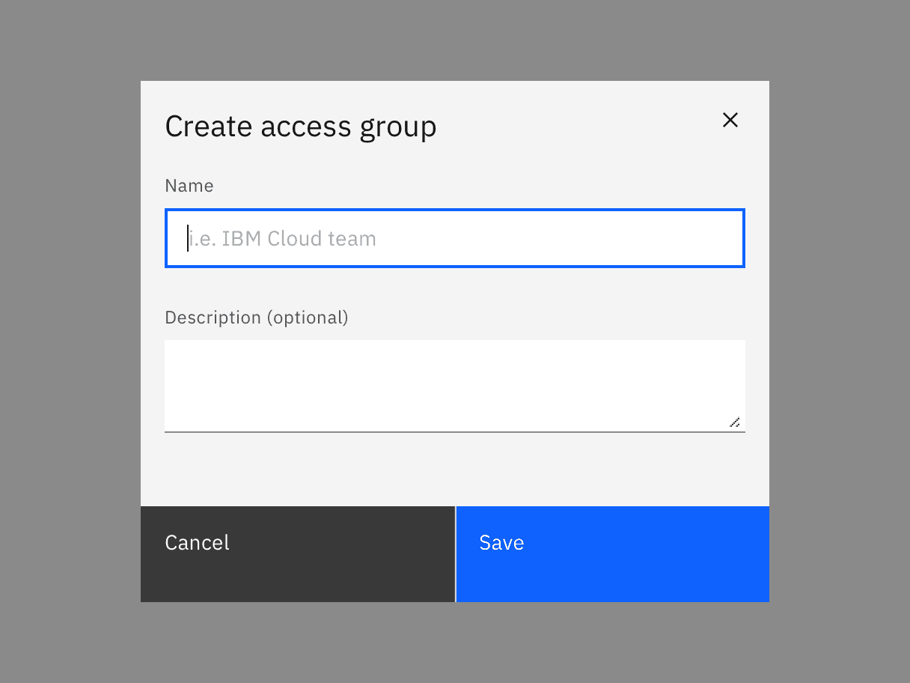

</Column>
</Row>

### Loading

The task completion action should take place immediately. If a longer loading
period is needed, a [loading spinner](/components/loading/usage) and overlay
should appear on top of the modal body area with content disabled. The primary
action button should be disabled while loading is in progress.

If a quick loading period is needed, use an
[inline loading](/patterns/loading-pattern#inline-loading) behavior on the
primary button to indicate the data is being processed.

<Row>
<Column colLg={12}>

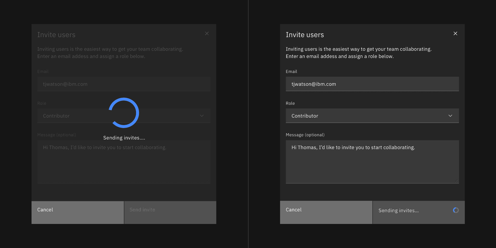

</Column>
</Row>

### Validation

Validate a user’s entries before the modal is closed. If any entry is invalid
then the modal should remain open with the entry marked in an error state and
include an inline error message. The message should inform the user what has
happened and provide guidance on next steps or possible resolutions. Effective
and immediate error messaging can help the user to understand the problem and
how to fix it.

When possible, validate the user’s data before submission. This kind of inline
validation (aka client-side validation) should happen as soon as the field loses
focus. This will help easily identify the elements that need to be corrected.
In-field error messages should disappear when the form criteria is met. If the
data was not able to be submitted due to server-side issues, an inline
notification should appear.

<Row>
<Column colLg={8}>

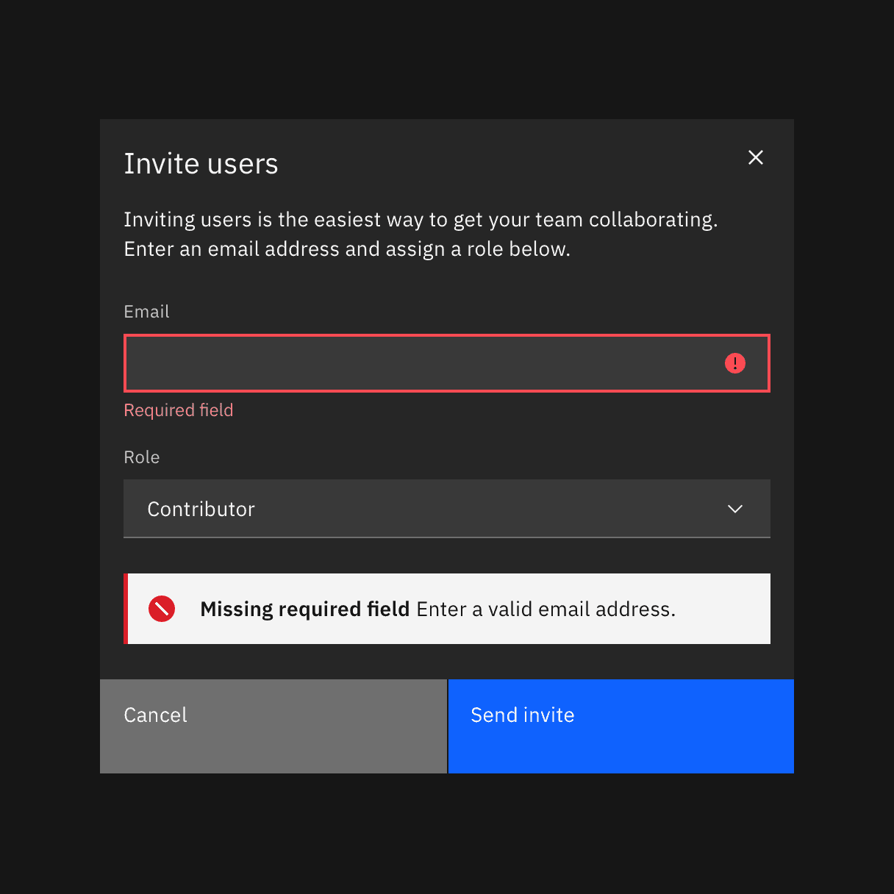

</Column>
</Row>

## Modal variants

### Passive modal

Passive modals presents information the user needs to be aware of concerning
their current workflow. It contains no actions for the user to take and should
not include any data that needs to be submitted. They serve as a type of
notification alerting the user to urgent information such as reporting system
errors or conveying a consequence of a user's action.

#### Dismissing a passive modal

Passive modals are persistent until dismissed in one of the following ways.

- **x**: Clicking the close **x** icon in the upper right will close the modal
  without submitting any data and return the user to its previous context.
- **Click elsewhere**: Clicking outside the passive modal area will
  automatically close the modal.
- **Esc**: Pressing `ESC` on the keyboard

<Row>
<Column colLg={12}>

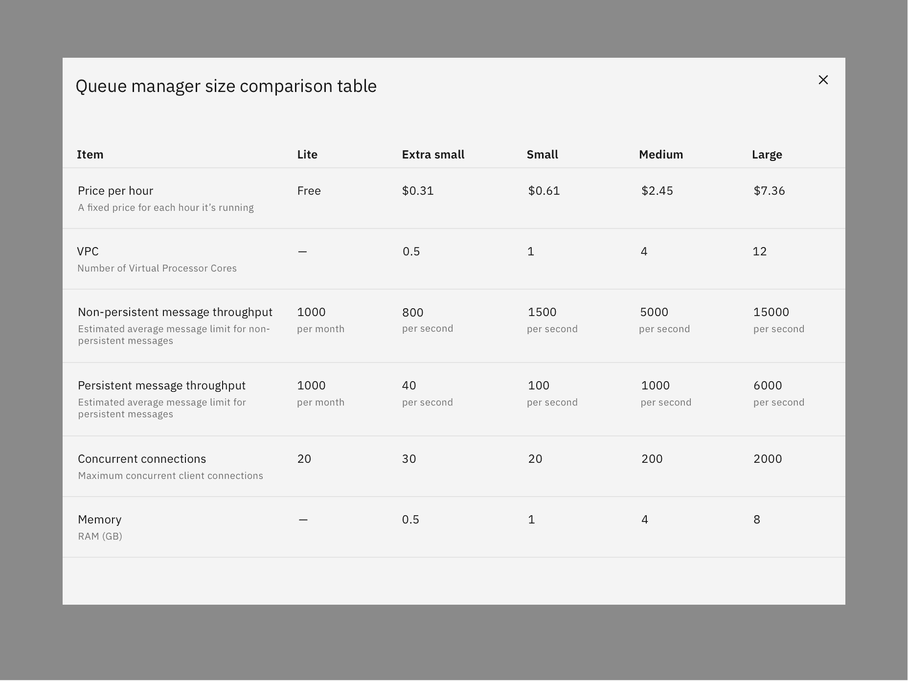

</Column>
</Row>

### Transactional modal

Transactional modals are used to validate user decisions or to gain secondary
confirmation from the user. Transactional modals require an action to be taken
in order for the modal to be completed and closed. It contains a cancel and
primary action buttons.

#### Dismissing a transactional modal

Transactional modals are persistent until dismissed in one of the following
ways.

- **Task completion**: Clicking the primary action will complete the task and
  automatically close the modal.
- **Cancel button**: Clicking the cancel button will close the modal and return
  the user to its previous context. Cancel undoes all applied changes.
- **x**: Clicking the close **x** icon in the upper right will close the modal
  without submitting any data and return the user to its previous context.
- **Esc**: Press ESC on the keyboard.

#### Two buttons

When using two buttons, the secondary button is on the left and the primary
button is placed on the right. Each button spans 50% of the modal and are full
bleed to the edge.

<Row>
<Column colLg={8}>

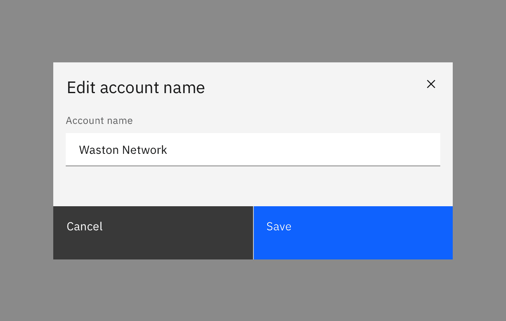

</Column>
</Row>

#### Three buttons

In the rare case where three buttons are needed, each is 25% of the modal width
and aligned to the right side of the modal. Only the outmost right button is
allowed to be a primary button with the other two being secondary buttons. If
all three actions have the same weight, all three should be secondary buttons.

<Row>
<Column colLg={8}>

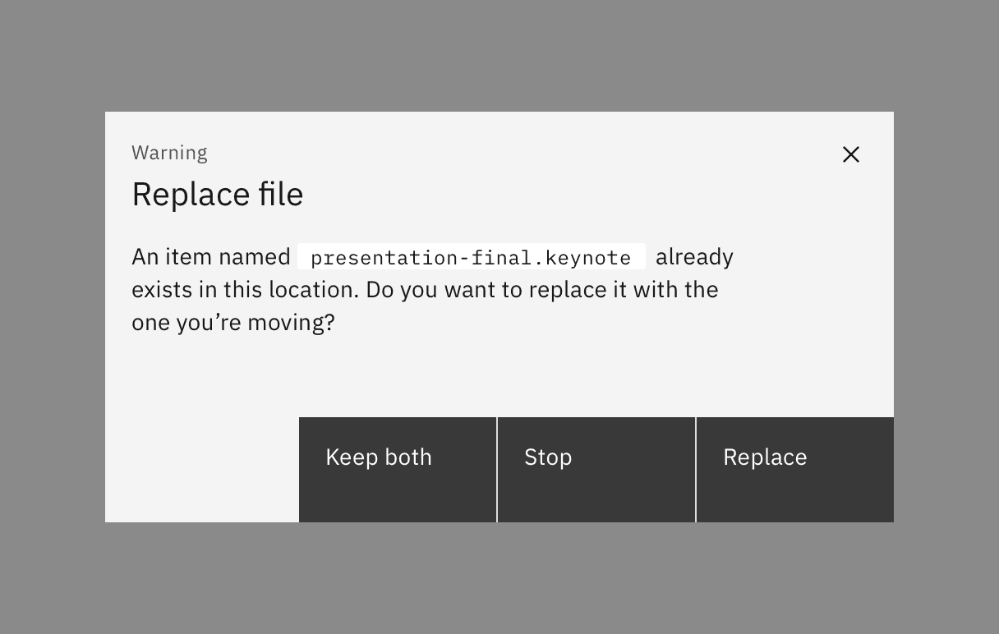

</Column>
</Row>

### Danger modal

Danger modal is a specific kind of
[transactional modal](/components/modal/usage#transactional-modal) used for
destructive or irreversible actions. In danger modal, the primary button is
replaced by a danger button. They are commonly used in high impact moments as a
confirmation for an action that would result in a significant data loss if done
accidentally.

<Row>
<Column colLg={8}>

</Column>
</Row>

### Acknowledgment modal

Acknowledgment modals are used when the system requires the user to acknowledge
the presented information. It contains only a single button, commonly **OK**. 
Acknowledgment is confirmed when the user clicks the primary button.

#### Dismissing an acknowledgment modal

Acknowledgment modals are persistent until dismissed in one of the following
ways.

- **Task completion**: Clicking the primary action will complete the task and
  automatically close the modal.
- **x**: Clicking the close **x** icon in the upper right will close the modal
  without submitting the user's acknowledgement and return the user to the
  previous context.
- **Esc**: Press `ESC` on the keyboard.

#### Single button

Single buttons are placed on the right side, span 50% of the modal, and bleed to
the edge. In most scenarios, a primary button is used when one button is needed.

<Row>
<Column colLg={8}>

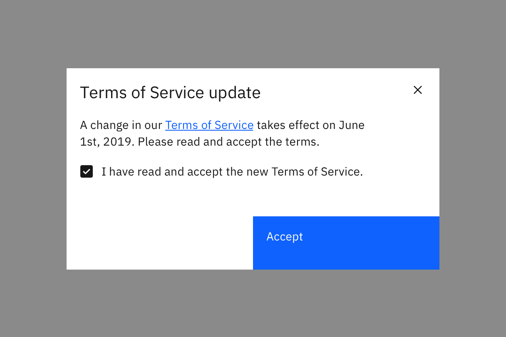

</Column>
</Row>

### Progress modal

For longer tasks, use a progress modal to give the user a sense of completion
and orientation within the focused flow. For complex flows with complex choices,
consider using a full page instead of a modal. A progress modal is not a
solution for excess modal content. It should only be used to present information
in more consumable and focused chunks.

#### Dismissing a progress modal

Transactional modals are persistent until dismissed in one of the following
ways.

- **Task completion**: Clicking the primary action will complete the task and
  automatically close the modal.
- **Cancel button**: Clicking the **Cancel** button will close the modal and
  return the user to its previous context. Cancel undoes all applied changes.
- **x**: Clicking the close **x** icon in the upper right will close the modal
  without submitting any data and return the user to its previous context.
- **Esc**: Press `ESC` on the keyboard.

#### Button group

There are three buttons in the progress modal footer: **Cancel**, **Previous**,
**Next**. Each button’s width is 25% of the modal window and are full bleed.
**Previous** and **Next** are grouped together and placed on the right half of
the dialog, with **Previous** as a secondary button and **Next** as a primary
button. In the last step of the sequence, the **Next** button label should
change to reflect the final action. The **Cancel** button is aligned to left
side of the modal and uses a ghost button.

<Row>
<Column colLg={12}>

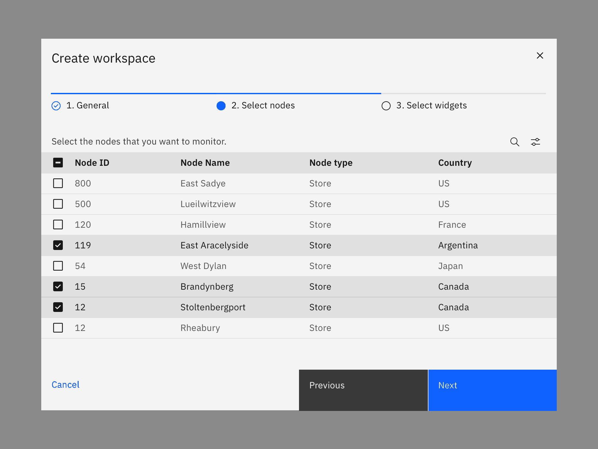

</Column>
</Row>

## AI presence

The modal component has a modification that takes on the AI visual styling when
AI is present in the entire container. The AI variants of a modal function the
same as the other modal variants except for the addition of the AI label, which
is both a visual indicator and the trigger for the explainability popover.

AI in modal can appear in two ways: broadly, over the whole modal, or focused,
just in certain parts of the modal. When the entire modal is styled for AI, it
indicates to the user that AI is present in all aspects of the modal. If only a
limited amount of the modal content is generated by AI, then only those
components should receive the AI presence styling, not the entire modal.

For more information on designing for AI, see the
[Carbon for AI](/guidelines/carbon-for-ai/) guidelines.

<Row>
<Column colLg={12}>

<Tabs>

<Tab label="Light mode">

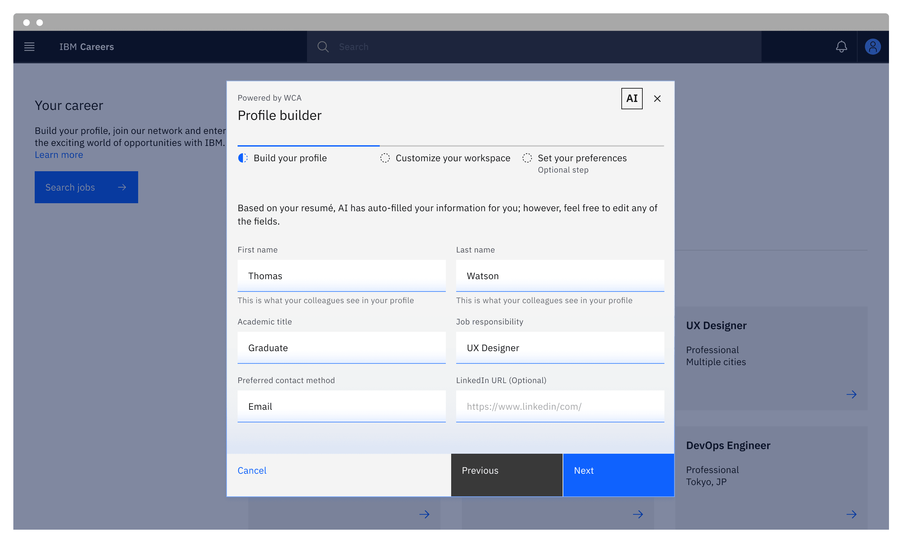

</Tab>

<Tab label="Dark mode">

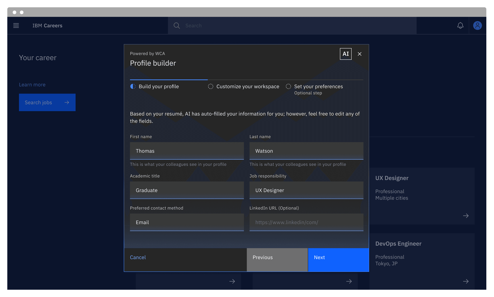

</Tab>

</Tabs>

</Column>
</Row>

## Related

#### Modal versus notification

Modals are highly disruptive and block tasks until dismissed by the user. A
modal should only be used as a form of notification if it provides the user with
critical information immediately related to their task. For non-critical
messaging, consider using a toast or inline notification instead of a modal.
Toast and inline notifications provide users with non-disruptive feedback or the
status of an action without breaking their workflow.

#### Components

- [Notification](/components/notification/usage)

#### Patterns

- [Dialogs](/patterns/dialog-pattern)
- [Notifications](/patterns/notification-pattern)

## Feedback

Help us improve this component by providing feedback, asking questions, and
leaving any other comments on
[GitHub](https://github.com/carbon-design-system/carbon-website/issues/new?assignees=&labels=feedback&template=feedback.md).
