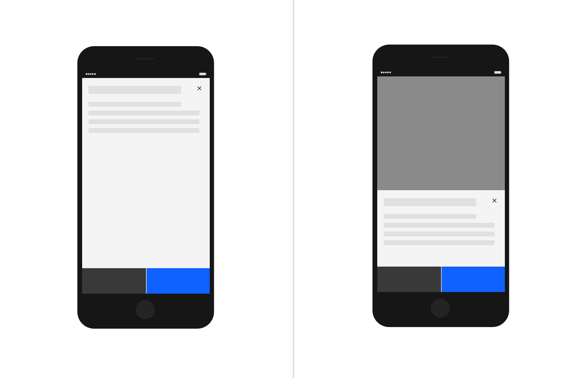
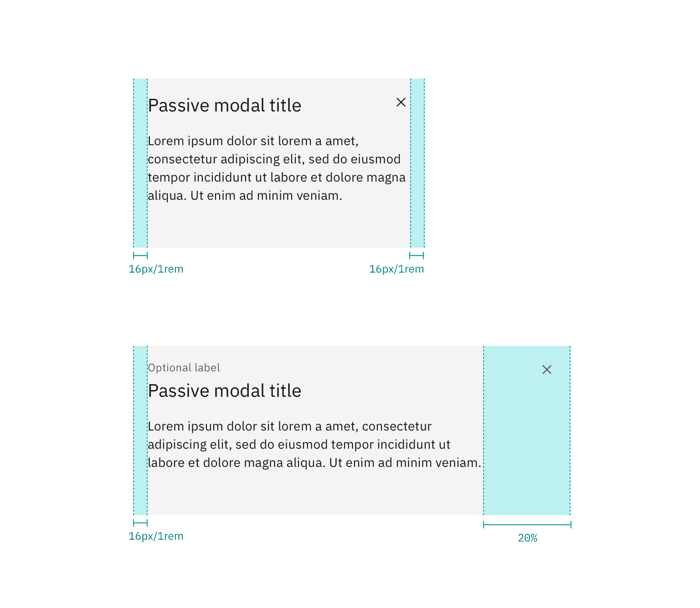

<AnchorLinks>

<AnchorLink>General guidance</AnchorLink>
<AnchorLink>Formatting</AnchorLink>
<AnchorLink>Content</AnchorLink>
<AnchorLink>Behavior</AnchorLink>
<AnchorLink>Accessibility</AnchorLink>
<AnchorLink>Variations</AnchorLink>
<AnchorLink>Style</AnchorLink>
<AnchorLink>Code</AnchorLink>
<AnchorLink>Feedback</AnchorLink>

</AnchorLinks>

## General guidance

Modals communicate information via a secondary window and allow the user to maintain the context of a particular task. They are most effective when a task must be completed before a user can continue. While effective when used correctly, modals should be used sparingly to limit disruption to a user experience.

## Formatting

The modal is composed of three distinct zones: A header, the body, and a footer. Components (eg. data table, form, progress indicator) can occupy the full width of the modal.

**The header of your modal should mirror the action that launched the modal.** Headers must include a close button “✕” in the upper right-hand corner of the modal. You can also include an optional label above your header text. This is an opportunity to offer additional context.

**A modal should have minimal body content.** Components that may be used in modals include: form fields, text area, select, and radio buttons. Text, including the paragraph component, should only be 75% of the modal's width.

**The footer area of a modal typically contains either one or two [buttons](/components/button).** Do not include three buttons in the footer of your modal. If you need to include a “help” or other non-primary action, include it as a link in the modal's body. [^1]
[^1]: this seems like a good place to talk more about button placement

<Row>
<Column colLg={8}>

</Column>
</Row>

<Row>
<Column colLg={8}>

</Column>
</Row>

## Content 

## Behavior

**Modals may be dismissed in 3 ways:**

- Using the “✕” in the upper right-hand corner of the modal
- Pressing the `ESC` key
- Clicking or touching outside of the modal

## Accessibility

## Variations 

| Modal type          | Purpose                                                    |
| ------------------- | ---------------------------------------------------------- |
| Transactional modal | Confirm user decisions                                     |
| Input modal         | Enable users to input and interact with information        |
| Passive modal       | Disrupt user experience to provide a critical notification |

### Transactional modal

Transactional modals are used to validate user decisions or to gain secondary confirmation from the user. Typically, the modal requests either a 'yes' or 'no' response.

<Row>
<Column colLg={8}>

</Column>
</Row>

### Input modal

Modals used in this case include input areas that the user may interact with. These may include but are not limited to forms, dropdowns, selectors, and links.

<Row>
<Column colLg={8}>

</Column>
</Row>

### Passive modal

The passive modal is a style of notification. Passive modals are highly disruptive to a user experience, and should only be used if a user must address something immediately.

Passive modal notifications are persistent on-screen. Users must either engage with or dismiss the notification.

<Row>
<Column colLg={8}>

</Column>
</Row>

## Style

### Color

Refer to the [button](/components/button/style) for primary and secondary button styling in the transactional modal.

| Class                        | Property         | Color token   |
| ---------------------------- | ---------------- | ------------- |
| `.bx--modal-container`       | background-color | `$ui-01`      |
| `.bx--modal-header__label`   | text color       | `$text-02`    |
| `.bx--modal-header__heading` | text color       | `$text-01`    |
| `.bx--modal-content`         | text color       | `$text-01`    |
| `.bx--modal-close__icon`     | fill             | `$icon-01`    |
| `.bx--modal-close:hover`     | background-color | `$hover-ui`   |
| Overlay                      | color            | `$overlay-01` |

### Typography

Modal titles and labels should be set in sentence case. Keep all titles and labels concise and to the point. Modal labels are optional.

| Class                        | Font-size (px/rem) | Font-weight   | Type token      |
| ---------------------------- | ------------------ | ------------- | --------------- |
| `.bx--modal-header__label`   | 12 / 0.75          | Regular / 400 | `$label-01`     |
| `.bx--modal-header__heading` | 20 / 1.25          | Regular / 400 | `$heading-03`   |
| `.bx--modal-content`         | 14 / 0.875         | Regular / 400 | `$body-long-01` |

### Structure

| Class                      | Property                  | px / rem | Spacing token |
| -------------------------- | ------------------------- | -------- | ------------- |
| `.bx--modal-close`         | height, width             | 48 x 48  | –             |
| `.bx--modal-close__icon`   | height, width             | 16 x 16  | –             |
| `.bx--modal-header__label` | margin-bottom             | 4 / 0.25 | `$spacing-02` |
| `.bx--modal-header`        | padding top, padding left | 16 / 1   | `$spacing-05` |
| `.bx--modal-header`        | margin-bottom             | 8 / 0.5  | `$spacing-03` |
| `.bx--modal-content`       | width                     | 75%      | –             |
| `.bx--modal-content`       | padding-left              | 16 / 1   | `$spacing-05` |
| `.bx--modal-content`       | margin-bottom             | 48 / 3   | `$spacing-09` |
| `.bx--btn--primary`        | width                     | 50%      | –             |
| `.bx--btn--secondary`      | width                     | 50%      | –             |

<Caption>
  Structure and spacing measurements for a passive modal | px / rem
</Caption>

<Caption>
  Structure and spacing measurements for a transactional modal | px / rem
</Caption>

<Caption>
  Structure and spacing measurements for a input modal | px / rem
</Caption>

#### Mobile

Modals should be full screen on mobile.

<Caption>Example of a modal on a mobile screen</Caption>

## Code

## Feedback
