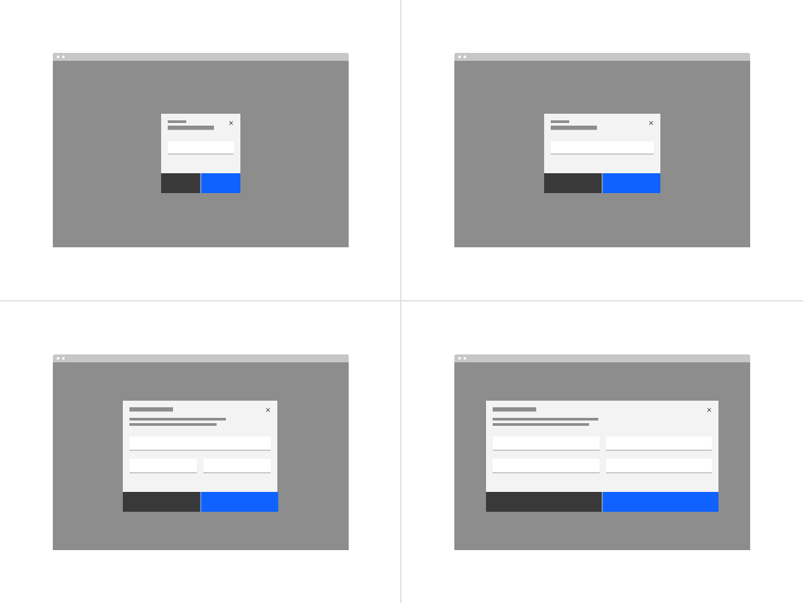
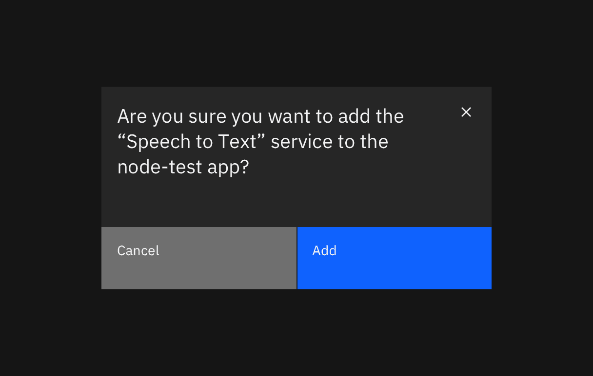

<PageDescription>

Modals focus the user’s attention exclusively on one task or piece of information via a window that sits on top of the page content.

</PageDescription>

<AnchorLinks>

<AnchorLink>General guidance</AnchorLink>
<AnchorLink>Anatomy</AnchorLink>
<AnchorLink>Modal sizes</AnchorLink>
<AnchorLink>Variations</AnchorLink>

</AnchorLinks>

## General guidance

Modals are a type of [dialog](/patterns/dialog-pattern) that are used to present critical information or request user input needed to complete a user’s workflow. Modals interrupt a user’s workflow by design. When active, a user is blocked from the on-page content and cannot return to their previous workflow until the modal task is completed or the user dismisses the modal. While effective when used correctly, modals should be used sparingly to limit disruption to the user.

Modal dialogs are commonly used for short and non-frequent tasks, such as editing or management tasks. If a user needs to repeatably preform a task, consider making the task do-able from the main page.

### When to use

#### An immediate response is required from the user

Use a dialog to request information that is preventing the system from continuing a user-initiated process.

#### Notify the user of urgent information

Use a modal dialog to notify the user of urgent information concerning their current work. Commonly used to report system errors or convey a consequence of a user’s action.

#### Confirm a user decision

Use a modal dialog to confirm user decisions. Clearly describe the action being confirmed and explain any potential consequences that it may cause. Both the title and the button should reflect the action that will occur. If the action is destructive or irreversible then use a transactional danger modal.

## Anatomy

<Row>
<Column colLg={8}>

</Column>
</Row>

The modal is composed of three distinct zones: A header, the body, and a footer. Components (eg. data table, form, progress indicator) can occupy the full width of the modal.

1. **Header**: Includes a title, optional label, and the close icon. The title should be brief and clearly describe the dialogs’s task or purpose. Use the optional label above the title set the context for the information in the dialog.

2. **Body**: Contains the information and/or controls needed to complete the modal's task. It can include message text and components. A modal should include only content relevant to completing the current task. Text should only be 80% of the modal’s width and components can span 100% of the width.

3. **Footer**: Contains the main actions needed to complete or cancel the dialog task. Button groupings change based on modal variant. Use descriptive words for the actions like Add, Delete, Save and avoid vague words like Done or OK. If you need to include a “docs” or other non-primary action, include it as a link in the modal’s body.

4. **x**: The close `x` icon will close the dialog without submitting any data.

5. **Overlay**: Screen overlay that obscures the on-page content.

## Modal sizes

There are four preset modal sizes: **xs, small, default, large**. They have responsive widths that change based on the screen size. Modal widths are defined as screen percentages that will complement columns on the 2x grid. See the modal spec for specifics.

Choose a size best for the amount of modal content you have. Modals with short messages should use a xs or small modal to avoid long single lines; for complex components, like data table the default or large modal will be more accommodating.

<Row>
<Column colLg={8}>

</Column>
</Row>

#### Title as message

For short, direct messages the title can include the whole message to add visual clarity to an otherwise repetitive title and body message. When using this style, no other body copy may be included.

<Row>
<Column colLg={8}>

</Column>
</Row>

### Max heights

Each modal size has a max height in order to maintain a proper window ratio. If your modal has too much scrolling due to a max height consider using the next modal size up. If the large modal height is still not enough space then this is an indicator that a full page may be needed instead.

<!--
| Modal size | Max height |
| ---------- | ---------- |
| XS         | 48% |
| Small | 72% |
| Default | 84% |
| Large | 96% |
-->

<Row>
<Column colLg={8}>

</Column>
</Row>

#### Scrolling behavior

When the modal content is longer than the modal height then the body section should scroll vertically with the header and footer remaining fixed in place. The content should visible fade at the end of the modal body area to indicate there is additional content out of view. Modal content should never horizontal scroll, instead use a larger size modal.

## Variations

There are four main variations of modal.

| Variant                                                        | Usage                                                                                                                           |
| -------------------------------------------------------------- | ------------------------------------------------------------------------------------------------------------------------------- |
| [Passive](/components/modal/usage#passive-modal)               | Presents information the user needs to be aware of concerning their current workflow. Contains no actions for the user to take. |
| [Transactional](/components/modal/usage#transactional-modal)   | Requires an action to be taken in order for the modal to be completed and closed. Contains a cancel and primary action buttons. |
| [Acknowledgment](/components/modal/usage#acknowledgment-modal) | System requires an acknowledgement of the information from the user. Contains only a single button, commonly "OK."              |
| [Progress](/components/modal/usage#progress-modal)             | Requires several steps to be completed before it can be closed. Contains a cancel, previous and next/completion buttons.        |

### Passive modal

Passive modals presents information the user needs to be aware of concerning their current workflow. It contains no actions for the user to take and should not include any data that needs to be submitted. They serve as a type of notification alerting the user to urgent information such as reporting system errors or conveying a consequence of a user's action.

#### Dismissing a passive modal

Passive modals are persistent until dismissed in one of the following ways.

- **x**: Clicking the close `x` icon in the upper right will close the modal without submitting any data and return the user to its previous context.
- **Click elsewhere**: Clicking outside the passive modal area will automatically close the modal.
- **Esc**: Press `ESC` on the keyboard

<Row>
<Column colLg={8}>

</Column>
</Row>

### Transactional modal

Transactional modals are used to validate user decisions or to gain secondary confirmation from the user. Transactional modals require an action to be taken in order for the modal to be completed and closed. It contains a cancel and primary action buttons.

#### Dismissing a transactional modal

Transactional modals are persistent until dismissed in one of the following ways.

- **Task completion**: clicking the primary action will complete the task and automatically close the modal.
- **Cancel button**: clicking the cancel button will close the modal and return the user to its previous context. Cancel undoes all applied changes.
- **x**: Clicking the close `x` icon in the upper right will close the modal without submitting any data and return the user to its previous context.
- **Esc**: Press `ESC` on the keyboard

#### Two buttons

When using two buttons, the secondary button is on the left and the primary button is placed on the right. Each button spans 50% of the dialog and are full bleed to the edge.

<Row>
<Column colLg={8}>

</Column>
</Row>

#### Three buttons

In the rare case where three buttons are needed, each is 25% of the dialog width and aligned to the right side of the modal. Only the outmost right button is allowed to be a primary button with the other two being secondary buttons. If all three actions have the same weight then all three should be secondary buttons.

<Row>
<Column colLg={8}>

</Column>
</Row>

#### Danger modal

Danger modal is a specific type of transactional modal used for destructive or irreversible actions. In danger modal, the primary button is replaced by a danger button. They are commonly used in high impact moments as a confirmation for an action that would result in a significant data loss if done accidentally.

<Row>
<Column colLg={8}>

</Column>
</Row>

### Acknowledgment modal

Acknowledgment modals are used when the system requires the user to acknowledge the presented information. It contains only a single button, commonly “OK.”  Acknowledgment is confirmed when the user clicks the primary button.

#### Dismissing an acknowledgment modal

Acknowledgment modals are persistent until dismissed in one of the following ways.

- **Task completion**: clicking the primary action will complete the task and automatically close the modal.
- **x**: Clicking the close `x` icon in the upper right will close the modal without submitting the user's acknowledgement and return the user to its previous context.
- **Esc**: Press `ESC` on the keyboard

#### Single button

Single buttons are placed on the right side, span 50% of the modal, and bleed to the edge. In most scenarios, a primary button is used when one button is needed.

<Row>
<Column colLg={8}>

</Column>
</Row>

### Progress modal

For longer tasks, use a progress modal to give the user a sense of completion and orientation within the focused flow. For complex flows with complex choices, consider using a full page instead of a modal. A progress modal is not a solution for excess modal content. It should only be used to present information in more consumable and focused chunks.

#### Dismissing a progress modal

Transactional modals are persistent until dismissed in one of the following ways.

- **Task completion**: clicking the primary action will complete the task and automatically close the modal.
- **Cancel button**: clicking the cancel button will close the modal and return the user to its previous context. Cancel undoes all applied changes.
- **x**: Clicking the close `x` icon in the upper right will close the modal without submitting any data and return the user to its previous context.
- **Esc**: Press `ESC` on the keyboard

#### Button group

There are three buttons in the progress modal footer: Cancel, Previous, Next. Each button’s width is 25% of the dialog window and are full bleed. Previous and Next are grouped together and placed on the right half of the dialog, with Previous as a secondary button and Next as a primary button. In the last step of the sequence, the Next button label should change to reflect the final action. The Cancel button is aligned to left side of the dialog and uses a ghost button.

<Row>
<Column colLg={8}>

</Column>
</Row>

## Related

<Column colMd={4} colLg={4} noGutterSm>
  <ResourceCard
    subTitle="Pattern"
    title="Dialog"
    actionIcon="launch"
    aspectRatio="2:1"
    href="/patterns/dialog-pattern"
  >

  </ResourceCard>
</Column>
