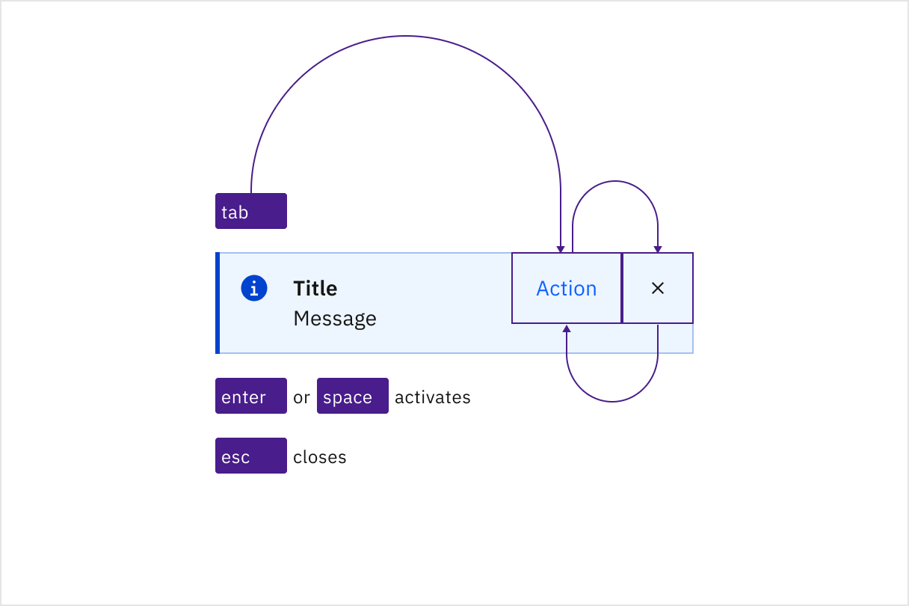
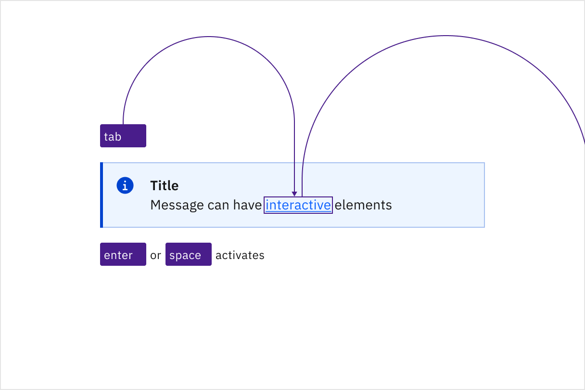

import A11yStatus from 'components/A11yStatus';

import {
  StructuredListWrapper,
  StructuredListHead,
  StructuredListBody,
  StructuredListRow,
  StructuredListInput,
  StructuredListCell,
  OrderedList,
  ListItem,
} from '@carbon/react';

<PageDescription>

No accessibility annotations are needed for notifications, but keep these
considerations in mind if you are modifying Carbon or creating a custom
component.

</PageDescription>

<AnchorLinks>
  <AnchorLink>What Carbon provides</AnchorLink>
  <AnchorLink>Design recommendations</AnchorLink>
  <AnchorLink>Development considerations</AnchorLink>
</AnchorLinks>

## What Carbon provides

Carbon bakes keyboard operation into its components, improving the experience of
blind users and others who operate via the keyboard. Carbon incorporates many
other accessibility considerations, some of which are described below.

### Keyboard interactions

Users can navigate through the interactive elements within the notification using the `Tab` key. 
Actions such as closing or activating buttons can be performed using the `Enter` or `Space` keys. 
Additionally, some notifications can optionally be closed by pressing the `Escape` key.

#### Inline and toast 

Inline and toast notifications do not contain interactive elements, and they do not receive focus.

#### Actionable

Actionable notifications may contain interactive elements such as links and buttons. 
This component grabs and traps focus until an action is taken or the notification is dismissed. 
Users can navigate through the interactive elements using the `Tab` key, and actions like closing 
or activating buttons can be performed using the `Enter` or `Space` keys. Additionally, the notification 
can be optionally closed by pressing the `Escape` key.

<Row>
<Column colLg={8}>

<Caption>
 Retaining focus until an action is taken or the notification is dismissed.
</Caption>

</Column>
</Row>

#### Callout

A callout can include interactive elements such as links, which users can navigate through using the `Tab` key. 
Actions on these links can be performed using the `Enter` or `Space` keys.

<Row>
<Column colLg={8}>

<Caption>
  Navigating through interactive elements using the Tab key.
</Caption>

</Column>
</Row>

## Development considerations

Keep these considerations in mind if you are modifying Carbon or creating a custom component.

- Use the roles `alert`, `log`, or `status` for notifications that do not require user action. 
- Use the role `alertdialog` for notifications that require user action.
- Callouts do not have an aria-live attribute, and are not automatically announced by screen readers.

Special care should be given to focus management for notifications with interactive elements or actions. 
It is not recommended to venture beyond using the roles `alert`, `log`, `status`, or `alertdialog` for 
event-driven notifications, as this can present unique challenges. If you choose to do so, there are two 
known approaches you may want to research further:

- Collect notifications in a persistent area in your application for users to be able to navigate to and take action on notifications.
- Render notifications in an already-existing `region` that can be accessed via a hotkey. Focus should jump to the notification region
  after the hotkey is invoked. Once the user has reached the end of the region, focus should return to the previously focused item in
  the document before the hotkey was invoked.

Neither approach is perfect, but in either case, ensure that notifications are properly announced, respect user timeout preferences, 
and are easily navigable by keyboard or screen reader for users to take action.
  

<A11yStatus layout="table" components="Notification" />
