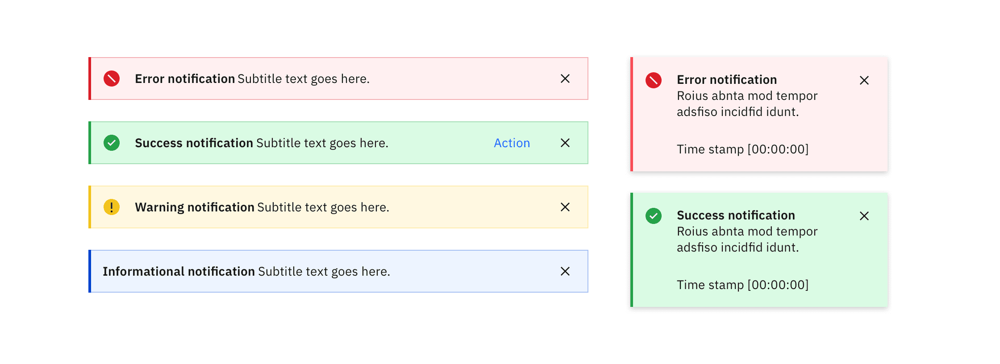
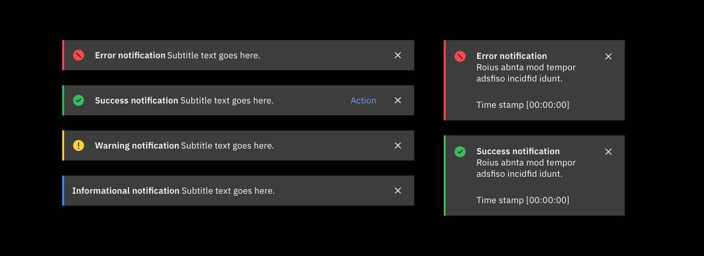
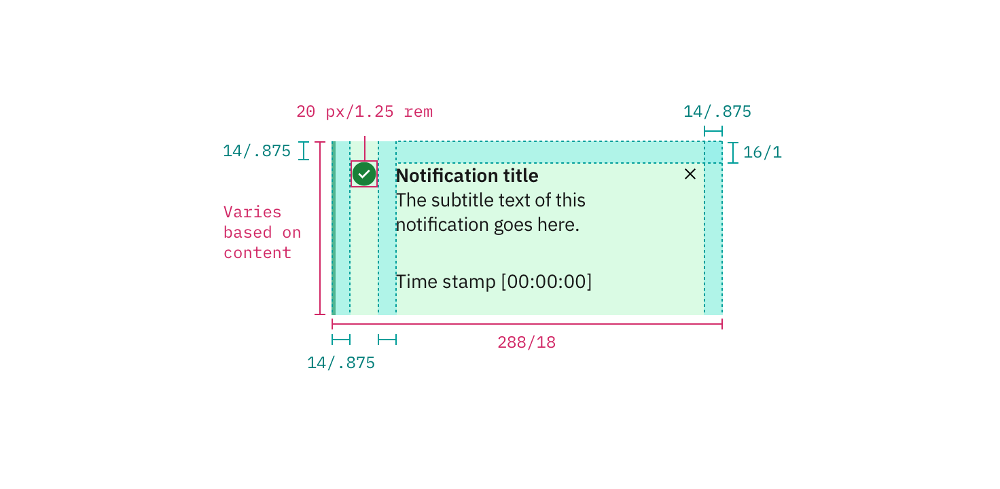
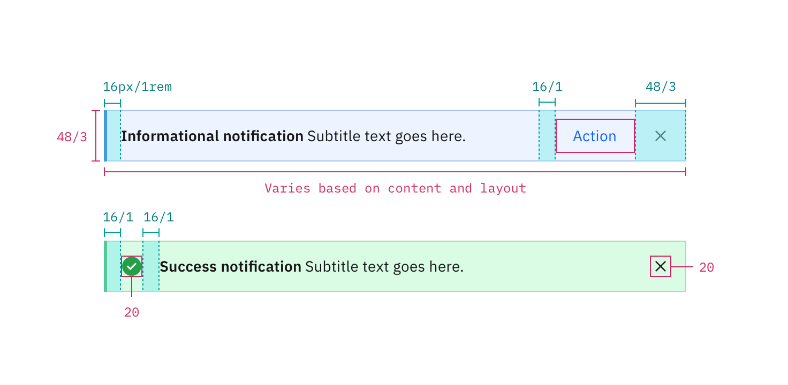

## Color

### Low contrast

<Caption>Low contrast notifications in the White theme</Caption>

| Class                                                                                   | Property   | Color token |
| --------------------------------------------------------------------------------------- | ---------- | ----------- |
| `.bx--inline-notification__title`   `.bx--toast-notification__title`               | text color | `$text-01`  |
| `.bx--inline-notification__subtitle`   `.bx--toast-notification__subtitle`         | text color | `$text-01`  |
| `.bx--inline-notification__close-button`   `.bx--toast-notification__close-button` | fill       | `$icon-01`  |
| `.bx--inline-notification__action-button`                                               | text color | `$link-01`  |

 

<Title> Error — low contrast </Title>

| Class                 | Property         | Color token                            |
| --------------------- | ---------------- | -------------------------------------- |
| `notification--error` | background-color | `$notification-error-background-color` |
| `notification--error` | border-left      | `$support-01`                          |
| `svg.error--filled`   | fill             | `$support-01`                          |

 

<Title> Success — low contrast </Title>

| Class                   | Property         | Color token                              |
| ----------------------- | ---------------- | ---------------------------------------- |
| `notification--success` | background-color | `$notification-success-background-color` |
| `notification--success` | border-left      | `$support-02`                            |
| `svg.checkmark-filled`  | fill             | `$support-02`                            |

 

<Title> Warning — low contrast </Title>

| Class                   | Property         | Color token                              |
| ----------------------- | ---------------- | ---------------------------------------- |
| `notification--warning` | background-color | `$notification-warning-background-color` |
| `notification--warning` | border-left      | `$support-03`                            |
| `svg.warning-filled`    | fill             | `$support-03`                            |

 

<Title> Info — low contrast </Title>

| Class                | Property         | Color token                           |
| -------------------- | ---------------- | ------------------------------------- |
| `notification--info` | background-color | `$notification-info-background-color` |
| `notification--info` | border-left      | `$support-04`                         |

### High contrast

<Caption>High contrast notifications in the White theme</Caption>

 

| Class                                                                                   | Property         | Color token   |
| --------------------------------------------------------------------------------------- | ---------------- | ------------- |
| `.bx--inline-notification__title`   `.bx--toast-notification__title`               | text color       | `$inverse-01` |
| `.bx--inline-notification__subtitle`   `.bx--toast-notification__subtitle`         | text color       | `$inverse-01` |
| `.bx--inline-notification__close-button`   `.bx--toast-notification__close-button` | fill             | `$inverse-01` |
| `.bx--inline-notification`   `.bx--toast-notification`                             | background-color | `$inverse-02` |

 

<Title> Error — high contrast </Title>

| Class                 | Property    | Color token           |
| --------------------- | ----------- | --------------------- |
| `notification--error` | border-left | `$inverse-support-01` |
| `svg.error--filled`   | fill        | `$inverse-support-01` |

 

<Title> Success — high contrast </Title>

| Class                   | Property    | Color token           |
| ----------------------- | ----------- | --------------------- |
| `notification--success` | border-left | `$inverse-support-02` |
| `svg.checkmark-filled`  | fill        | `$inverse-support-02` |

 

<Title> Warning — high contrast </Title>

| Class                   | Property    | Color token           |
| ----------------------- | ----------- | --------------------- |
| `notification--warning` | border-left | `$inverse-support-03` |
| `svg.warning-filled`    | fill        | `$inverse-support-03` |

 

<Title> Info — high contrast </Title>

| Class                | Property    | Color token           |
| -------------------- | ----------- | --------------------- |
| `notification--info` | border-left | `$inverse-support-04` |

## Typography

Notification text should be set in sentence case with only the first word
capitalized. Notification titles should be concise and to the point.

| Class                                                                          | Font-size (px/rem) | Font-weight    | Type token       |
| ------------------------------------------------------------------------------ | ------------------ | -------------- | ---------------- |
| `.bx--toast-notification__title`   `.bx--inline-notification__title`       | 14 / 0.875         | SemiBold / 600 | `$heading-01`    |
| `.bx--toast-notification__subtitle`   `.bx--inline-notification__subtitle` | 14 / 0.875         | Regular / 400  | `$body-short-01` |  |

## Structure

### Toast notification

| Property                                 | Property                 | px / rem | Spacing token |
| ---------------------------------------- | ------------------------ | -------- | ------------- |
| `.bx--toast-notification`                | width                    | 288 / 18 | –             |
| `.bx--toast-notification`                | border-left              | 3px      | –             |
| `.bx--toast-notification`                | padding-right            | 16 / 1   | `$spacing-05` |
| `.bx--toast-notification__title`         | margin-top               | 16 / 1   | `$spacing-05` |
| `.bx--toast-notification__subtitle`      | margin-bottom            | 24 / 1.5 | `$spacing-06` |
| `.bx--toast-notification__details`       | padding-right            | 16 / 1   | `$spacing-05` |
| `.bx--toast-notification__caption`       | margin-bottom            | 16 / 1   | `$spacing-05` |
| `.bx--inline-notification__close-button` | height, width            | 48 / 3   | –             |
| `close-icon`                             | margin-top, margin-right | 16 / 1   | `$spacing-05` |

<Caption>
  Structure and spacing measurements for a toast notification | px / rem
</Caption>

### Inline notification

The width of an _inline notification_ will vary based on content or layout.

| Property                                 | Property                    | px / rem  | Spacing token |
| ---------------------------------------- | --------------------------- | --------- | ------------- |
| `.bx--inline-notification`               | min-height                  | 48 / 3    | `$spacing-09` |
| `.bx--inline-notification`               | border-left                 | 3px       | –             |
| `.bx--inline-notification__details`      | margin-left, margin-right   | 16 / 1    | `$spacing-05` |
| `.bx--inline-notification__text-wrapper` | padding-top, padding-bottom | 12 / 0.75 | `$spacing-04` |
| `.bx--inline-notification__icon`         | margin-right                | 16 / 1    | `$spacing-05` |
| `.bx--inline-notification__close-button` | height, width               | 48 / 3    | –             |
| `close-icon`                             | icon size                   | 16 x 16   | –             |

<Caption>
  Structure and spacing measurements for a inline notification | px / rem
</Caption>
