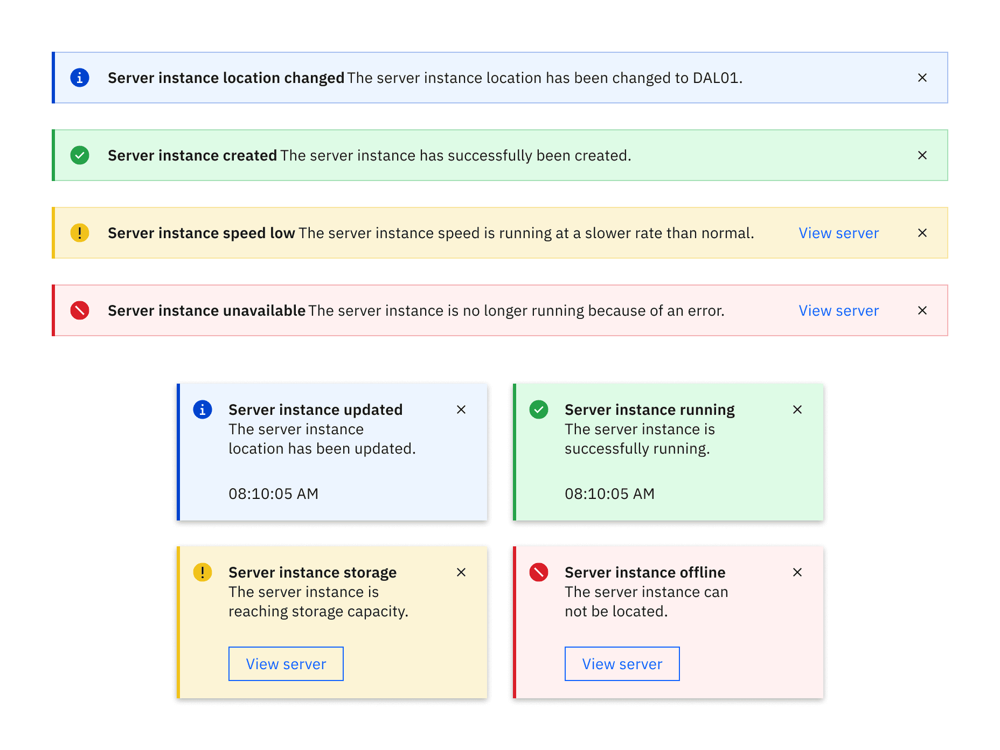
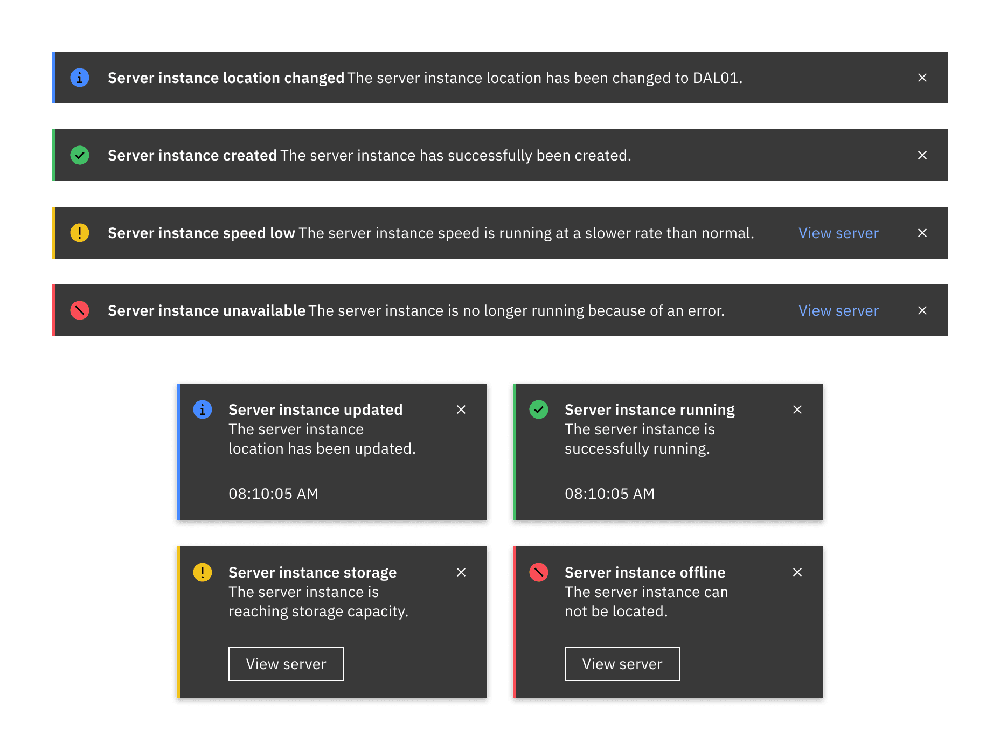
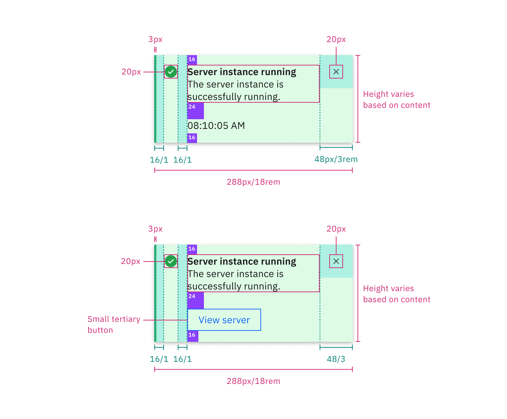
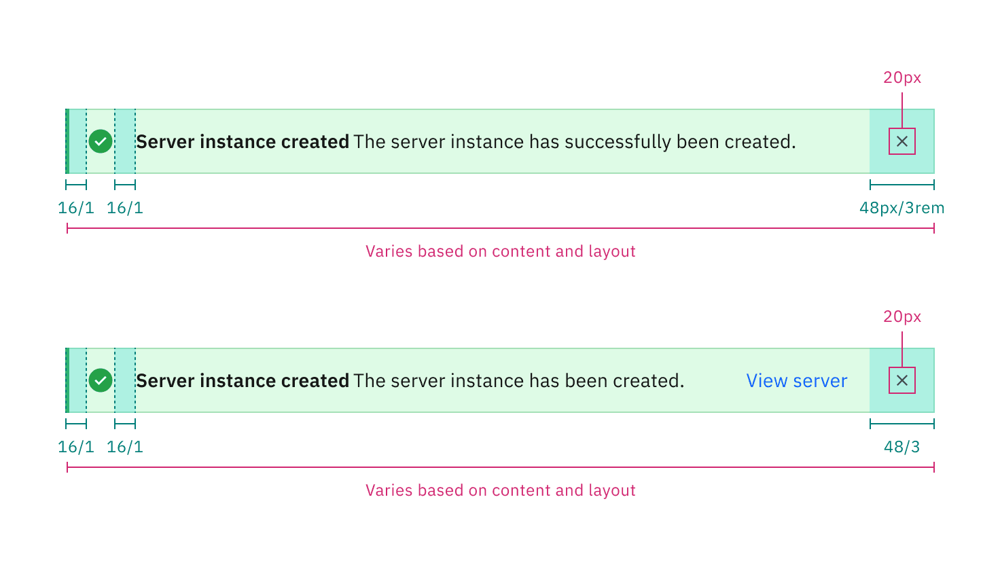
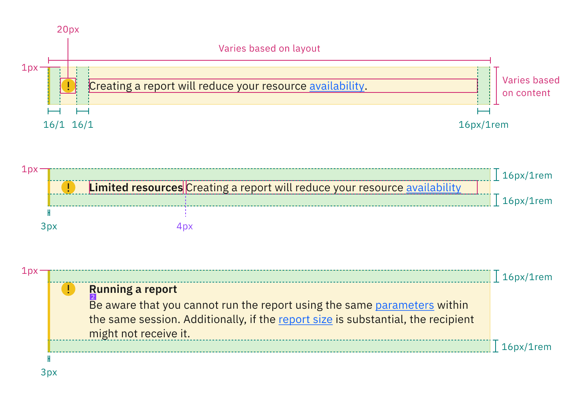

## Color

### Low contrast

<Caption>Low contrast notifications in the White theme</Caption>

| Element      | Property          | Color token                              |
| ------------ | ----------------- | ---------------------------------------- |
| Title        | text color        | `$text-primary`                          |
| Subtitle     | text color        | `$text-primary`                          |
| Close button | fill              | `$icon-primary`                          |
| Error        | background-color  | `$notification-error-background-color`   |
|              | border-left       | `$support-error`                         |
|              | svg               | `$support-error`                         |
| Success      | background-color. | `$notification-success-background-color` |
|              | border-left       | `$support-success`                       |
|              | svg               | `$support-success`                       |
| Warning      | background-color  | `$notification-warning-background-color` |
|              | border-left       | `$support-warning`                       |
|              | svg               | `$support-warning`                       |
| Information  | background-color  | `$notification-info-background-color`    |
|              | border-left       | `$support-info`                          |
|              | svg               | `$support-info`                          |

### High contrast

<Caption>High contrast notifications in the White theme</Caption>

 

| Element      | Property         | Color token                |
| ------------ | ---------------- | -------------------------- |
| Title        | text color       | `$text-inverse`            |
| Subtitle     | text color       | `$text-inverse`            |
| Close button | fill             | `$icon-inverse`            |
| Background   | background-color | `$background-inverse`      |
| Error        | border-left      | `$support-error-inverse`   |
|              | svg              | `$support-error-inverse`   |
| Success      | border-left      | `$support-success-inverse` |
|              | svg              | `$support-success-inverse` |
| Warning      | border-left      | `$support-warning-inverse` |
|              | svg              | `$support-warning-inverse` |
| Information  | border-left      | `$support-info-inverse`    |
|              | svg              | `$support-info-inverse`    |

## Typography

Write notifications in sentence case, which means only the first word is
capitalized. Notification titles should be concise and to the point.

| Element  | Font-size (px/rem) | Font-weight    | Type token            |
| -------- | ------------------ | -------------- | --------------------- |
| Title    | 14 / 0.875         | SemiBold / 600 | `$heading-compact-01` |
| Subtitle | 14 / 0.875         | Regular / 400  | `$body-compact-01`    |

## Structure

### Toast

| Element      | Property                 | px / rem | Spacing token |
| ------------ | ------------------------ | -------- | ------------- |
| Notification | width                    | 288 / 18 | –             |
|              | border-left              | 3px      | –             |
|              | padding-right            | 16 / 1   | `$spacing-05` |
| Title        | margin-top               | 16 / 1   | `$spacing-05` |
| Subtitle     | margin-bottom            | 24 / 1.5 | `$spacing-06` |
| Details      | padding-right            | 16 / 1   | `$spacing-05` |
| Caption      | margin-bottom            | 16 / 1   | `$spacing-05` |
| Close button | height, width            | 48 / 3   | –             |
| Close icon   | margin-top, margin-right | 16 / 1   | `$spacing-05` |

<Caption fullwidth>
  Structure and spacing measurements for a toast notification | px / rem
</Caption>

### Inline

The width of an _inline notification_ will vary based on content or layout.

| Element             | Property                    | px / rem  | Spacing token |
| ------------------- | --------------------------- | --------- | ------------- |
| Inline notification | min-height                  | 48 / 3    | `$spacing-09` |
|                     | border-left                 | 3px       | –             |
| Details             | margin-left, margin-right   | 16 / 1    | `$spacing-05` |
| Text-wrapper        | padding-top, padding-bottom | 12 / 0.75 | `$spacing-04` |
| Icon                | margin-right                | 16 / 1    | `$spacing-05` |
| Close button        | height, width               | 48 / 3    | –             |
| Close icon          | icon size                   | 16 x 16   | –             |

<Caption fullwidth>
  Structure and spacing measurements for an inline notification | px / rem
</Caption>

### Callout

The width of a _callout_ will vary based on content or layout.

| Element      | Property                    | px / rem  | Spacing token |
| ------------ | --------------------------- | --------- | ------------- |
| Callout      | min-height                  | 48 / 3    | `$spacing-09` |
|              | border-left                 | 3px       | –             |
| Details      | margin-left, margin-right   | 16 / 1    | `$spacing-05` |
| Text-wrapper | padding-top, padding-bottom | 12 / 0.75 | `$spacing-04` |
| Icon         | margin-right                | 16 / 1    | `$spacing-05` |

<Caption>Structure and spacing for a callout | px / rem</Caption>
