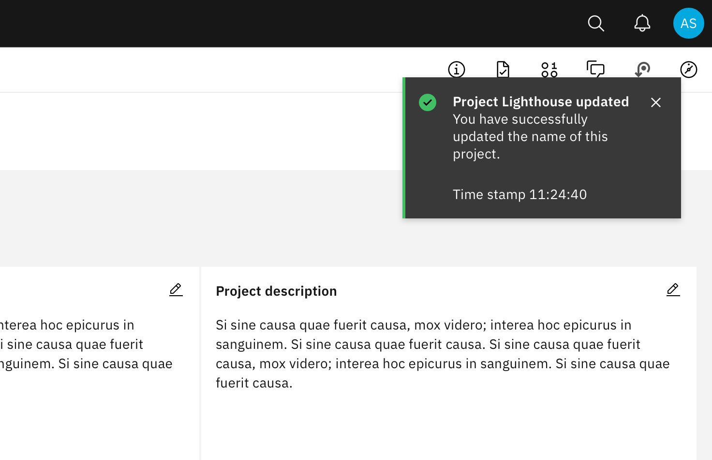

<PageDescription>

Notifications are messages that communicate information to the user. The two main types of notifications are toast notifications and inline notifications.

</PageDescription>

<AnchorLinks>

<AnchorLink>Overview</AnchorLink>
<AnchorLink>Formatting</AnchorLink>
<AnchorLink>Behavior</AnchorLink>
<AnchorLink>Content</AnchorLink>
<AnchorLink>Modifiers</AnchorLink>
<AnchorLink>Related</AnchorLink>
<AnchorLink>Feedback</AnchorLink>

</AnchorLinks>

## Overview

### When to use

Use notifications to inform users of updates or changes to system status. Communicating with users and providing immediate feedback are important for building trust. While notifications are an effective method of communicating with users, they are disruptive and should be used sparingly.

For more context on when to use each notification type, including modals, refer to the [notifications pattern](/patterns/notification-pattern/). Carbon currently only supports inline, toast, and modal notification types, although some product teams also support banners and notification centers.

### Variations

| Type   | Purpose                                                                                                                                                               |
| ------ | --------------------------------------------------------------------------------------------------------------------------------------------------------------------- |
| Inline | Inline notifications show up in task flows to inform users of the status of an action. They usually appear at the top of the primary content area.                    |
| Toast  | Toasts are a non-modal, time-based window elements used to display short messages. They usually appear at the bottom of the screen and disappear after a few seconds. |

## Formatting

### Anatomy

<Row>
<Column colLg={8}>

</Column>
</Row>

1. **Icon:** Informs users of the type of notification at a glance.
2. **Title:** Gives users a quick overview of the notification.
3. **Message (optional):** Provides additional detail and actionable steps for the user to take.
4. **Action (optional):** Allows users to address the notification or navigates them to a page with further details.
5. **Dismissal (optional):** Closes the notification.

### Sizing

#### Inline notifications

The width of inline notifications varies based on content and layout. They can expand to the fill the container or content area they relate to. Their height is based on the content length, which should not exceed two lines of text.

#### Toast notifications

Toasts notifications use a fixed width and their height depends on the length of the notification message. Limit toast notifications to two lines of text.

### Placement

#### Inline notifications

Inline notifications appear near their related items. In forms, we recommend placing the inline notification at the bottom of the form, right before the submission buttons. Depending on the context of the page, inline notifications can appear above the content as well.

<Row>
<Column colLg={8}>

</Column>
</Row>

#### Toast notifications

Toast notifications slide in and out from the top right of the screen. They align to the edge of the last column and can stack with `$spacing-03` in-between. New toast notifications should appear at the top of the list, with older notifications being pushed down until they are dismissed.
Actionable toast notifications do not appear on mobile screen widths.

<Row>
<Column colLg={8}>

</Column>
</Row>

## Behavior

### Dismissal

We recommend that toast notifications automatically disappear after five seconds. Inline notifications are persistent until the user dismisses them. All notifications have at least one method of dismissal which is typically a small “x” in the upper right hand corner.

### Overflow

Notification messages should be kept short. For toast notifications, the timestamp is optional and can be removed if a third line of content is needed.

If a toast or inline notification requires a message of longer than three lines, include a short message with a “View more” link that takes the user to a view of the full notification message. This can be either a full page with more details or a modal.

## Content

Notifications provide limited space for content, and therefore the content must be concise. A user should be able to quickly scan the notification, be apprised of the situation, and know what to do next.

### Title

- The title should be short and descriptive, explaining the most important piece of information.
- When possible, communicate the main message using just the title.
- Use a period only if the title is a full sentence.

### Body content

- The body of the notification should be no more than two lines.
- Be concise and avoid repeating or paraphrasing the title.
- Explain how to resolve the issue by including any troubleshooting actions or next steps. You can include links within the notification body that redirect the user to next steps.

### Action

- Keep labels consice and clearly indicate the action the user can take.
- Limit action labels to two words or less.

### Timestamp

- The timestamp reflects the time the toast notification was sent. Timestamps should be localized to the user's timezone or preferences.

For further content guidance, see Carbon's [content guidelines](/guidelines/content/general).

## Modifiers

### High and low contrast

Carbon supports high and low constrast style notifications. High-contrast notifications are best for critical messaginging while low-contrast notifications are less visually disruptive for users.

It's' up to the product team to decide which notification style to use in their product. Inline and toast notifications can use different styles but you should never mix styles within each notification type. When in doubt, use low-contrast notifications.

<Row>
<Column colLg={8}>

</Column>
</Row>

### Action

**Inline notification**

Inline notifications have an optional ghost button action that is right aligned. This button should allow users to take further action on the notification.

**Toast notifications**

Toast notifications can include a link at the end of their body content. This link should be short and navigate users to a page or modal where they can take action to address the notification or find further information. Because toast notifications automatically dismiss, it is important that there are alternative routes to navigate to the link destination.

### Timestamp

Toast notifications include a timestamp at the bottom the container. The timestamp shows the time the notification was sent. Using timestamps is optional but toasts should be consistent across the product so either all toasts should include timestamps or none of them should.

## Related

- Modals
- Notification pattern

## Feedback
