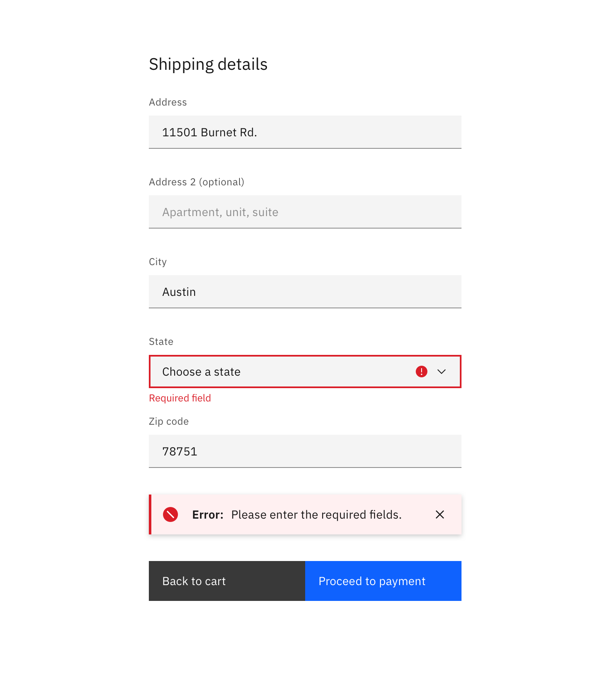
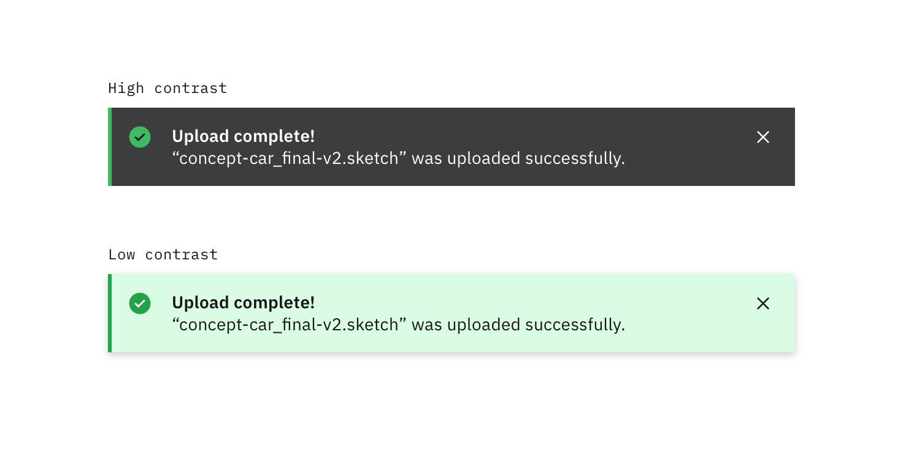

<PageDescription>

Notifications are messages that communicate information to the user. The two main types of notifications are toast notifications and inline notifications.

</PageDescription>

<AnchorLinks>

<AnchorLink>Overview</AnchorLink>
<AnchorLink>Formatting</AnchorLink>
<AnchorLink>Behavior</AnchorLink>
<AnchorLink>Content</AnchorLink>
<AnchorLink>Modifiers</AnchorLink>
<AnchorLink>Related</AnchorLink>
<AnchorLink>Feedback</AnchorLink>

</AnchorLinks>

## Overview

### When to use

Brief explanation of when to use notifications

For more context on when to use each notification type, refer to the [notifications pattern](/patterns/notification-pattern/). Carbon currently only supports inline, toast, and modal notification types, although some subsystems support

### Variations

| Type   | Purpose                                                                                                                                                                  |
| ------ | ------------------------------------------------------------------------------------------------------------------------------------------------------------------------ |
| Inline | Inline notifications show up in task flows, to notify users of the status of an action. They usually appear at the top of the primary content area.                      |
| Toast  | Toasts are a non-modal, time-based window elements used to display short messages; they usually appear at the bottom of the screen and disappear after a few seconds.    |
| Modal  | Highly disruptive notifications that provide users with critical information that needs their attention or action. See [Modal](/components/modal/code) for more details. |

## Formatting

### Anatomy

Highlighting anything that is self-contained within the component.

### Sizing

### Placement

In a broader context:

- alongside other notificaitons (especially with toast)
- within the grid

### Inline notifications

Inline notifications appear near its related item. In forms, we recommend placing the inline notification at the bottom of the form, right before the submission buttons. Depending on the context of the page, inline notifications can appear above the content as well.

<Row>
<Column colLg={8}>

</Column>
</Row>

### Toast notifications

Toast notifications slide in and out a page from the top-right corner. Actionable notifications do not appear on mobile screen widths.

<Row>
<Column colLg={8}>

</Column>
</Row>

## Behavior

- Overflow
- Motion
- Dismissal

#### Dismissal

We recommend that toast notifications automatically disappear after five seconds. Inline notifications are persistent until the user dismisses them. All notifications have at least one method of dismissal (typically, it is a small “x” in the upper right hand corner).

## Content

#### Title

All notifications have subject titles, which should be short and descriptive. (Example: “Tester-app-02 has crashed.”)

#### Message

We recommend the body of the notification be contained within two lines. Be descriptive and include any troubleshooting actions or next steps. When possible, communicate the main message using just the title. You can include links within the notification body that redirect the user to next steps.

## Modifiers

### High and low contrast

Use high-contrast style notifications for critical messaging. Low-contrast notifications are best used for supplemental messaging and are less visually disruptive to users. When in doubt, use the low contrast style.

Inline and toast notifications can use different styles but you should never mix styles within the variations.

<Row>
<Column colLg={8}>

</Column>
</Row>

## Related

- Modals
- Notification pattern

## Feedback
