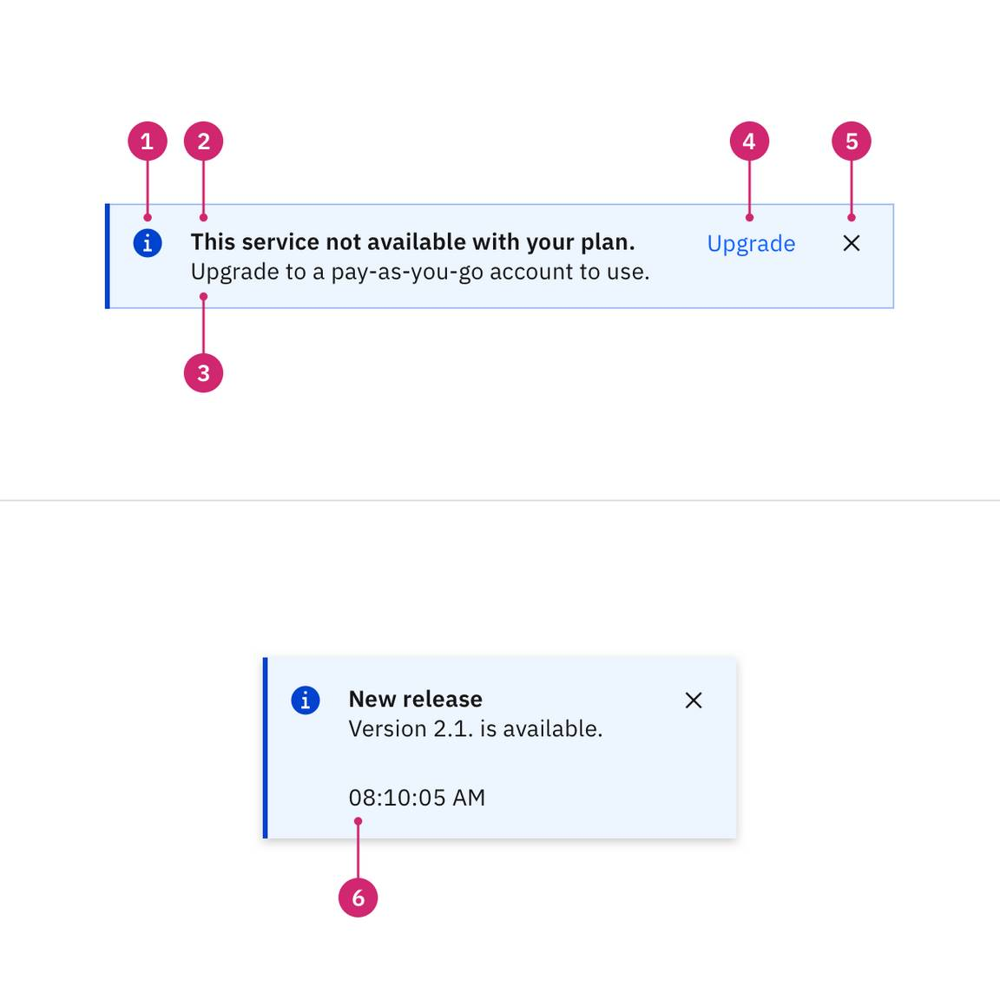
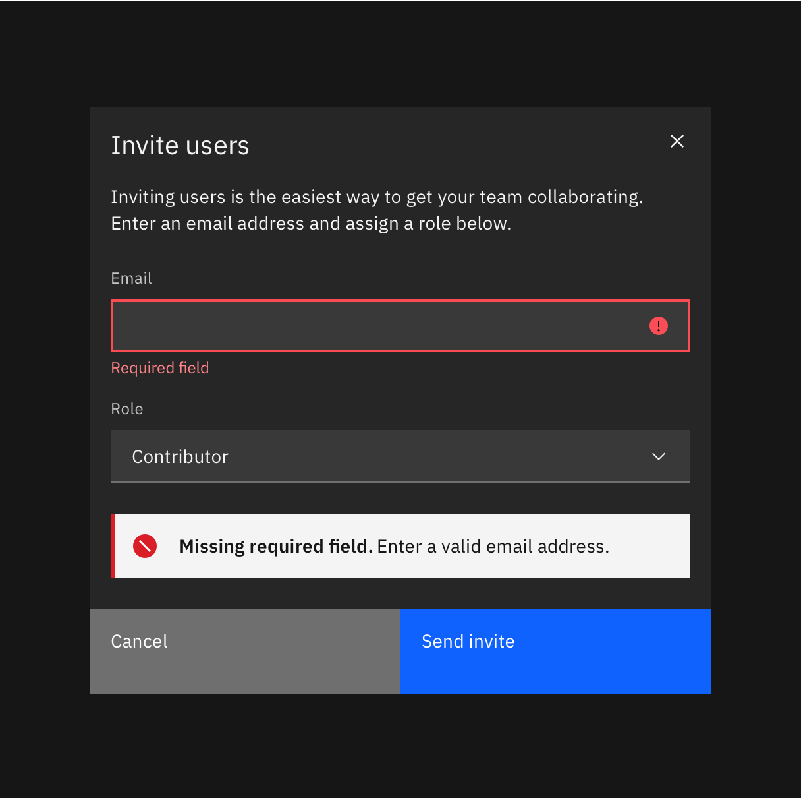
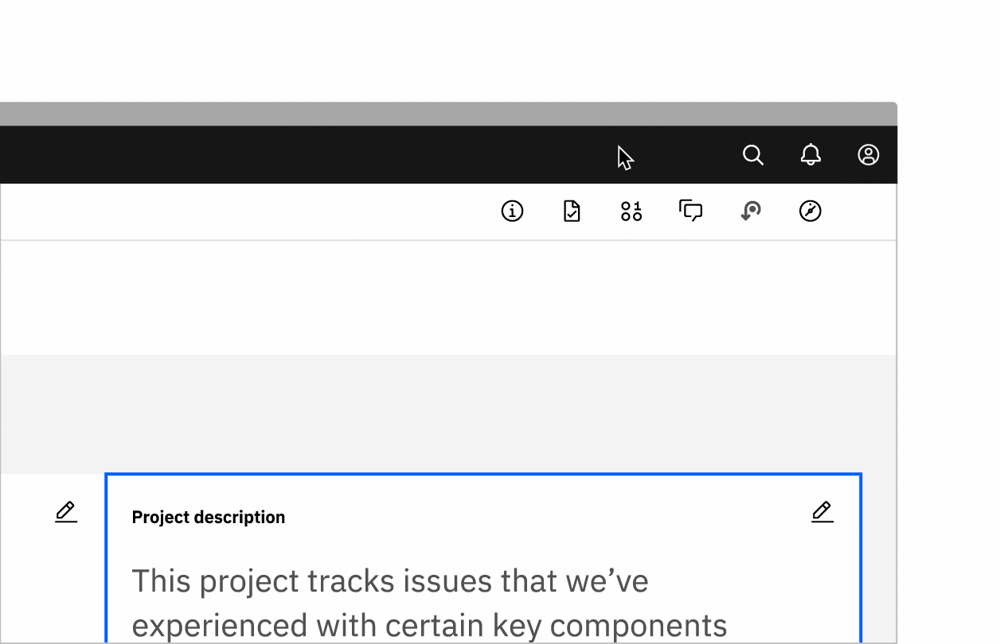
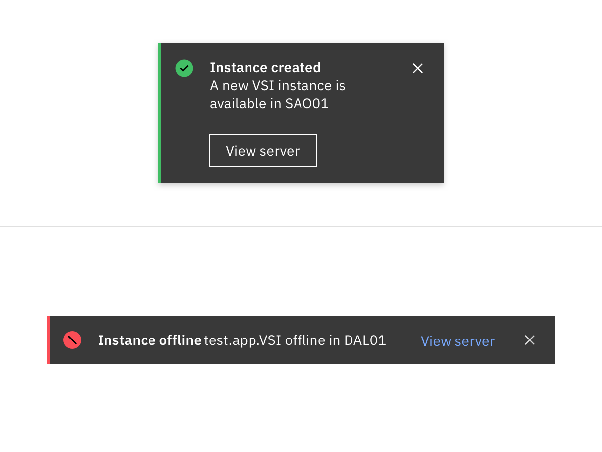
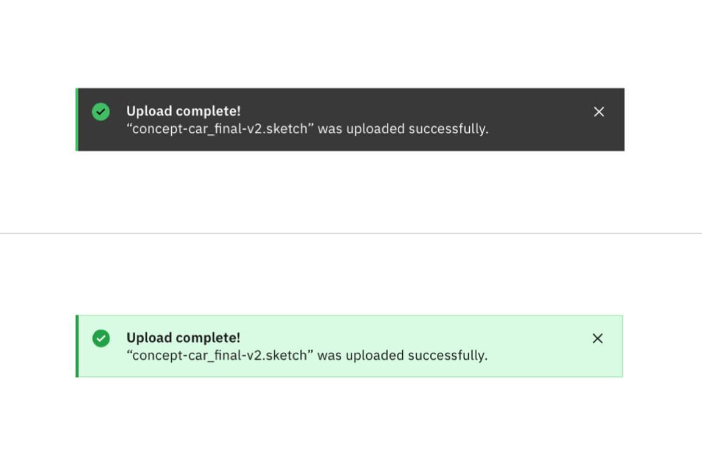

<PageDescription>

Notifications are messages that communicate information to the user. The three
variants of notifications are toast notifications, inline notifications, and
actionable notifications.

</PageDescription>

<InlineNotification>

**v11 update:** An actionable variant has been added to the notification
component. Actionable notifications allow for interactive elements within a
notification, like buttons. Toast and inline notification no longer allow any
interactive elements. For v10 implementation guidance, go to
[v10 Notification](https://v10.carbondesignsystem.com/components/notification/usage/).

</InlineNotification>

<AnchorLinks>

<AnchorLink>Overview</AnchorLink>
<AnchorLink>Live demo</AnchorLink>
<AnchorLink>Formatting</AnchorLink>
<AnchorLink>Content</AnchorLink>
<AnchorLink>Inline notifications</AnchorLink>
<AnchorLink>Toast notifications</AnchorLink>
<AnchorLink>Actionable notifications</AnchorLink>
<AnchorLink>Universal behaviors</AnchorLink>
<AnchorLink>Modifiers</AnchorLink>
<AnchorLink>Related</AnchorLink>
<AnchorLink>Feedback</AnchorLink>

</AnchorLinks>

## Overview

### When to use

Use notifications to inform users of updates or changes to system status.
Communicating with users and providing immediate feedback are important for
building trust. While notifications are an effective method of communicating
with users, they are disruptive and should be used sparingly.

For more context on when to use each notification variant, including modals,
refer to the [notifications pattern](/patterns/notification-pattern/). Carbon
only supports inline, toast, actionable, and modal notification variants,
although some product teams also support banners and notification centers.

### Variants

| Variant                                | Purpose                                                                                                                                                          |
| -------------------------------------- | ---------------------------------------------------------------------------------------------------------------------------------------------------------------- |
| [Inline](#inline-notifications)        | Inline notifications show up in task flows, to notify users of the status of an action. They usually appear at the top of the primary content area.              |
| [Toast](#toast-notifications)          | Toasts are non-modal, time-based window elements used to display short messages; they usually appear at the top of the screen and disappear after a few seconds. |
| [Actionable](#actionable-notification) | Actionable notifications allow for interactive elements within a notification styled like an inline or toast notification.                                       |

## Live demo

<ComponentDemo
  components={[
    {
      id: 'toast',
      label: 'Toast notification',
    },
    {
      id: 'inline',
      label: 'Inline notification',
    },
  ]}
>
  <ComponentVariant
    id="toast"
    knobs={{
      ToastNotification: ['hideCloseButton', 'kind', 'lowContrast'],
    }}
    links={{
      React:
        'https://react.carbondesignsystem.com/?path=/story/components-notifications-toast--default',
      'Web Components':
        'https://web-components.carbondesignsystem.com/?path=/story/components-notifications-toast--default',
      Angular:
        'https://angular.carbondesignsystem.com/?path=/story/components-notification--toast',
      Vue: 'http://vue.carbondesignsystem.com/?path=/story/components-cvtoastnotification--default',
    }}
  >
    {`
    

      <ToastNotification
        caption="00:00:00 AM"
        iconDescription="describes the close button"
        subtitle={Subtitle text goes here. <a href="#example">Example link</a>}
        timeout={0}
        title="Notification title"
      />
    

`}
  </ComponentVariant>
  <ComponentVariant
    id="inline"
    knobs={{
      InlineNotification: ['hideCloseButton', 'lowContrast'],
    }}
    links={{
      React:
        'https://react.carbondesignsystem.com/?path=/story/components-notifications-inline--default',
      'Web Components':
        'https://web-components.carbondesignsystem.com/?path=/story/components-notifications-inline--default',
      Angular:
        'https://angular.carbondesignsystem.com/?path=/story/components-notification--basic',
      Vue: 'http://vue.carbondesignsystem.com/?path=/story/components-cvinlinenotification--default',
    }}
  >
    {`
  

    <InlineNotification
      kind="info"
      actions={<NotificationActionButton>Action</NotificationActionButton>}
      iconDescription="describes the close button"
      subtitle={Subtitle text goes here. <a href="#example">Example link</a>}
      title="Notification title"
    />
  

`}
  </ComponentVariant>
</ComponentDemo>

## Formatting

### Anatomy

<Row>
<Column colLg={8}>

</Column>
</Row>

1. **Icon:** Informs users of the kind of notification at a glance.
2. **Title:** Gives users a quick overview of the notification.
3. **Action (actionable only):** Ghost or tertiary button that allows users to
   address the notification or navigates them to a page with further details.
4. **Close button (optional):** Closes the notification.
5. **Message:** Provides additional detail and actionable steps for the user to
   take.
6. **Timestamp (optional for toast):** Shows the time the toast notification was
   sent.

## Content

Notifications provide limited space for content, and therefore the content must
be short and concise. A user should be able to quickly scan the notification, be
apprised of the situation, and know what to do next.

### Main elements

#### Title

- The title should be short and descriptive, explaining the most important piece
  of information.
- When possible, communicate the main message using just the title.
- Use a period only if the title is a full sentence.
- When using rich text, such as in a title, a screen reader will read aloud the
  entire message as one sentence. Since the message will be read as one string,
  make sure that any text styling does not convey meaning.

#### Body content

- Be concise and avoid repeating or paraphrasing the title.
- Limit content to one or two short sentences.
- Explain how to resolve the issue by including any troubleshooting actions or
  next steps. You can include links within the notification body that redirect
  the user to next steps by using an actionable notification.

#### Action (actionable only)

- Only actionable notifications can contain interactive elements such as a link
  or button.
- Keep labels concise and clearly indicate the action the user can take.
- Limit action labels to one or two words. For a list of recommended action
  labels, see Carbon's
  [content guidelines](https://www.carbondesignsystem.com/guidelines/content/action-labels).

### Overflow

If a toast or inline notification requires a message longer than two lines, use
an actionable notification and include a short message with a “View more” link
that takes the user to a view of the full notification message. This can be
either a full page with more details or a modal.

### Further guidance

For further content guidance, see Carbon's
[content guidelines](/guidelines/content/overview).

## Inline notifications

Inline notifications show up in task flows, to notify users of the status of an
action or system. They usually appear at the top of the primary content area or
close to the item needing attention.

### Inline formatting

<Row>
<Column colLg={8}>

</Column>
</Row>

#### Sizing

The width of inline notifications varies based on content and layout. They can
expand to the fill the container or content area they relate to. Their height is
based on the content length, which should not exceed two lines of text.

#### Placement

Inline notifications appear near their related items. They can expand to fill
the width of the container or content area they are in and should align to the
grid columns.

We recommend placing inline notifications at the bottom of forms, just above the
submission and cancel buttons. When error notifications apply to individual text
inputs, they should supplement the error state on that specific input field.

<Row>
<Column colLg={8}>

<Caption>
  Example of an inline notification supporting an error message on a form
</Caption>

</Column>
</Row>

### Dismissal

Inline notifications do not dismiss automatically. They persist on the page
until the user dismisses them or takes action that resolves the notification.

A small "x" in the top right corner is used to dismiss inline notifications.
Including the close button is optional and should not be included if it is
critical for a user to read or interact with the notification.

## Toast notifications

Toasts are non-modal, time-based window elements used to display short messages;
they usually appear at the top of the screen and disappear after a few seconds.

### Toast formatting

<Row>
<Column colLg={8}>

</Column>
</Row>

#### Time stamp

Toast notifications can include a time stamp at the bottom the container. The
time stamp shows the time the notification was sent. Using time stamps is
optional but toasts should be consistent across the product so either all toasts
should include time stamps or none of them should. The time stamp is optional
and can be removed if a third line of content is needed.

#### Sizing

Toast notifications use a fixed width and their height depends on the length of
the notification message. As noted in the content guidelines, limit toast
notifications to two lines of text.

#### Placement

Toast notifications slide in and out from the top right of the screen. They
stack with `$spacing-03` in-between. New toast notifications should appear at
the top of the list, with older notifications being pushed down until they are
dismissed.

<Row>
<Column colLg={8}>

</Column>
</Row>

### Dismissal

Toast notifications persist by default. Toasts do have the option to timeout and
dismiss automatically after five seconds on the screen. They can also include a
close button so users can dismiss them sooner. Toasts cover content on the
screen so they should always be easily dismissed. Because toast notifications
can dismiss automatically, users should be able to access them elsewhere after
the toast disappears. This allows them to be accessible for users who need more
time reading the notification or who may want to refer back to the notification.

## Actionable notifications

Actionable notifications allow for interactive elements within a notification
styled like an inline or toast notification. Actionable notifications, since
they require user interaction, take focus when triggered and can be highly
disruptive to screen readers and keyboard users. With actionable notifications,
only one action is allowed per notification. This action frequently takes users
to a flow or page related to the message, where they can resolve the
notification. Consider using a notification center where a user can revisit and
act on past notifications.

### Formatting

#### Inline

Actionable inline notifications have a ghost button action that is adjacent to
the title and body content. On mobile screens the action button wraps under the
body content. This button should allow users to take further action on the
notification.

#### Toast

Actionable toast notifications can include a button at the end of their body
content. This button should be short and navigate users to a page or modal where
they can take action to address the notification or find further information.
Because toast notifications automatically dismiss, it is important that there
are alternative routes to navigate to the link destination.

<Row>
<Column colLg={8}>

<Caption>
  Actionable toast notification (top); actionable inline notification (bottom)
</Caption>

</Column>
</Row>

### Dismissal

All notifications, including actionable, persist by default until a user
dismissed them. If using inline styling refer to
[inline notifications](#inline-notifications) for inline dismissal. If using
toast styling for an actionable notification, then the notification should
remain on screen until the user dismisses it. With the notification remaining
open, the user has enough time to interact with the button without the toast
closing too soon. Refer to [toast notifications](#toast-notifications) for
further information.

## Universal behaviors

### Interactions

#### Mouse

Notifications are system generated. A user can close a dismissible notification
by clicking the close `x`

#### Keyboard

For actionable notifications, the action gets focus first. Use `Tab` to move
between action and the close `x`. To close notifications, press `Enter`
or `Space` while the close `x` has focus or use the `Esc` key.

#### Screen readers

VoiceOver: To close notifications, press `Enter` or `Space` while the close `x`
has focus or use the `Esc` key.

JAWS: To close notifications, press `Enter` or `Space` while the close `x` has
focus or use the `Esc` key.

NVDA: To close notifications, press `Enter` or `Space` while the close `x` has
focus or use the `Esc` key.

## Modifiers

### High and low contrast

Carbon supports high and low contrast style notifications. High-contrast
notifications are best for critical messaging while low-contrast notifications
are less visually disruptive for users.

It's up to the product team to decide which notification style to use in their
product. Inline and toast notifications can use different styles but you should
never mix styles within each notification variant. When in doubt, use
low-contrast notifications.

<Row>
<Column colLg={8}>

<Caption>
    High contrast notification (top); low contrast notification (bottom)
</Caption>
</Column>
</Row>

## Related

- [Modal component](https://www.carbondesignsystem.com/components/modal/usage/)
- [Notifications pattern](https://www.carbondesignsystem.com/patterns/notification-pattern)

## Feedback

Help us improve this component by providing feedback, asking questions, and
leaving any other comments on
[GitHub](https://github.com/carbon-design-system/carbon-website/issues/new?assignees=&labels=feedback&template=feedback.md).
