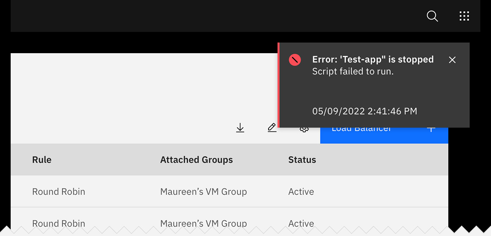
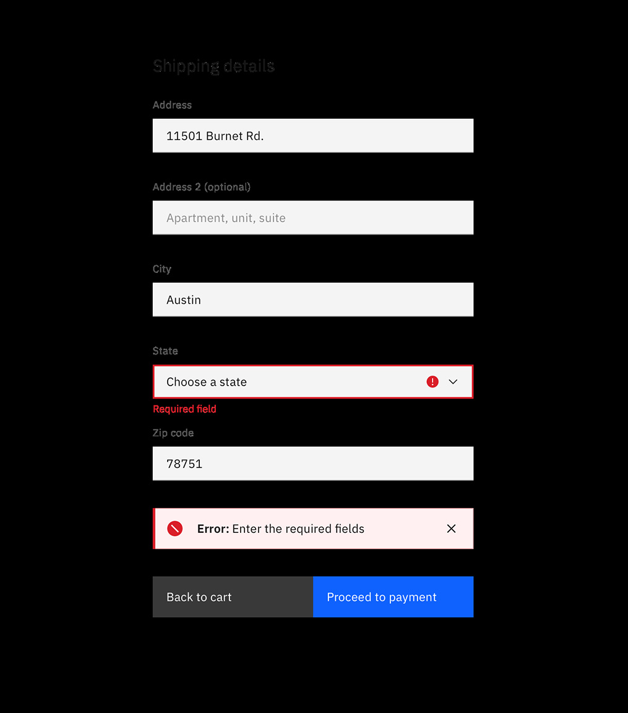

## General guidance

_Notifications_ are messages that communicate information to the user.

## Format

#### Title

All notifications have subject titles, which should be short and descriptive. (Example: “Tester-app-02 has crashed.”)

#### Message

We recommend the body of the notification be contained within two lines. Be descriptive and include any troubleshooting actions or next steps. When possible, communicate the main message using just the title. You can include [links](/components/link/code) within the notification body that redirect the user to next steps.

#### Dismissal

We recommend that toast notifications automatically disappear after five seconds. Inline notifications are persistent until the user dismisses them. All notifications have at least one method of dismissal (typically, it is a small “x” in the upper right hand corner).

#### Icons

Icons may provide additional clarity. Icons should be placed to the left of a title. These glyphs (16x16) can be found in the [icons](/guidelines/icons/library) library.

<Row>
<Column colLg={8}>

</Column>
</Row>

## Variations

| Notification type     | Purpose                                                                                                                                                               |
| --------------------- | --------------------------------------------------------------------------------------------------------------------------------------------------------------------- |
| _Toast notification_  | Toasts are a non-modal, time-based window elements used to display short messages; they usually appear at the bottom of the screen and disappear after a few seconds. |
| _Inline notification_ | Inline notifications show up in task flows, to notify users of the status of an action. They usually appear at the top of the primary content area.                   |

### High vs. low contrast

Use high-contrast style notifications for critical messaging. Low-contrast notifications are best used for supplemental messaging and are less visually disruptive to users. When in doubt, use the low contrast style.

Inline and toast notifications can use different styles but you should never mix styles within the variations.

<Row>
<Column colLg={8}>

</Column>
</Row>

## Placement

#### Toast notifications

Toast notifications slide in and out a page from the top-right corner. Actionable notifications do not appear on mobile screen widths.

<Row>
<Column colLg={8}>

</Column>
</Row>

#### Inline notifications

Inline notifications appear near its related item. In [forms](/components/form/code), we recommend placing the inline notification at the bottom of the form, right before the submission buttons. Depending on the context of the page, inline notifications can appear above the content as well.

<Row>
<Column colLg={8}>

</Column>
</Row>
