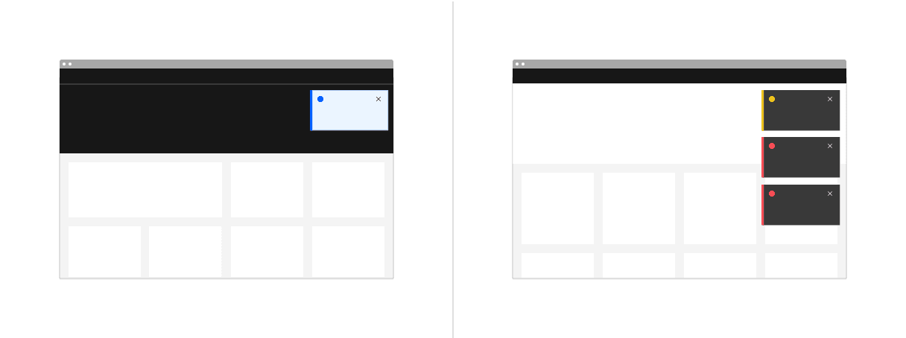
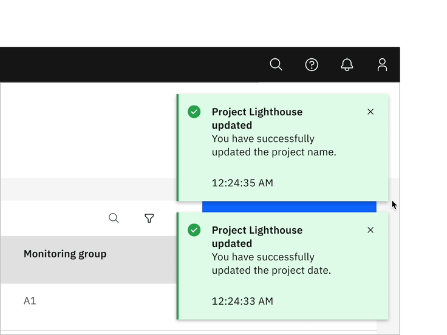
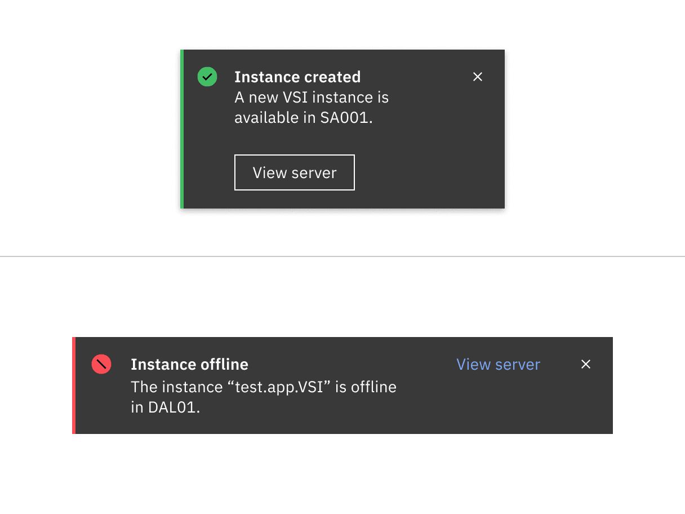
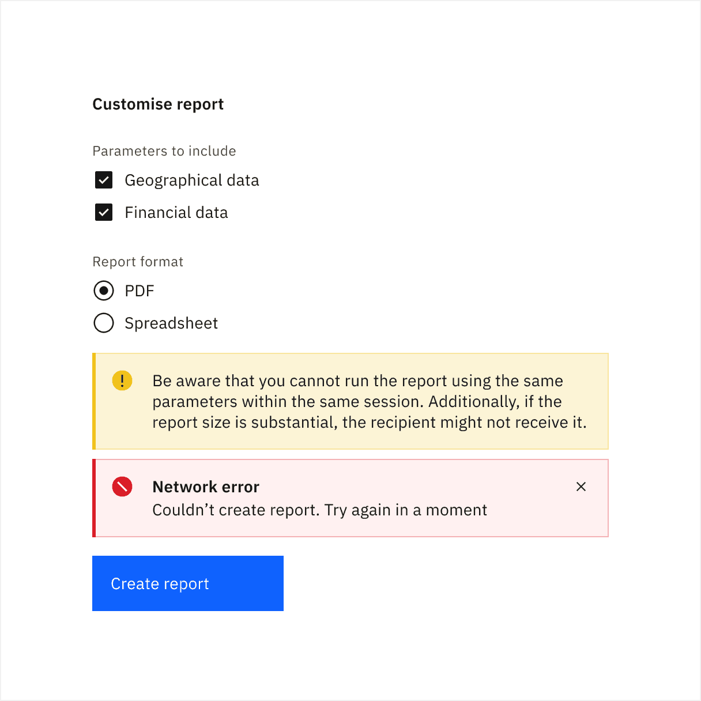
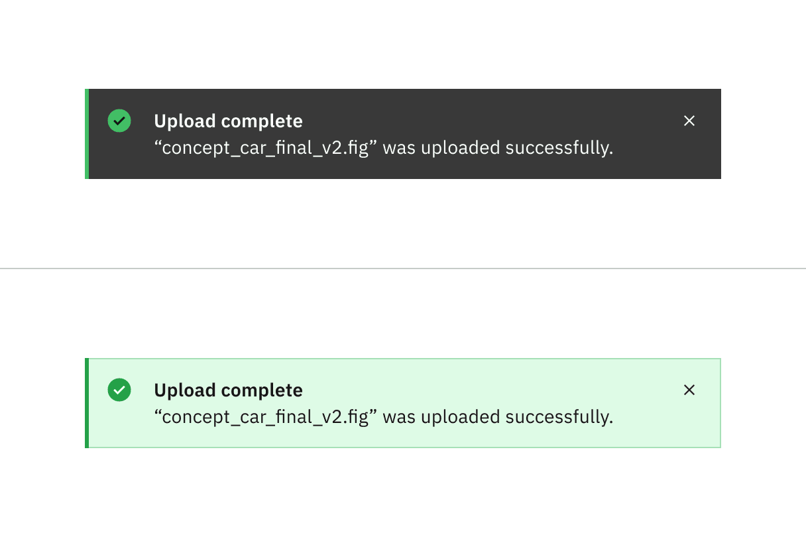

import A11yStatus from 'components/A11yStatus';
import { Tag } from '@carbon/react';

<PageDescription>

<Tag type="blue">Feature flag</Tag>

Notifications are messages that communicate information to the user. The four
variants of notifications are toast, inline, actionable, and callout.

</PageDescription>

<AnchorLinks>

<AnchorLink>Live demo</AnchorLink>
<AnchorLink>Overview</AnchorLink>
<AnchorLink>Formatting</AnchorLink>
<AnchorLink>Content</AnchorLink>
<AnchorLink>Inline</AnchorLink>
<AnchorLink>Toast</AnchorLink>
<AnchorLink>Actionable</AnchorLink>
<AnchorLink>Callout</AnchorLink>
<AnchorLink>Universal behaviors</AnchorLink>
<AnchorLink>Modifiers</AnchorLink>
<AnchorLink>Related</AnchorLink>
<AnchorLink>Feedback</AnchorLink>

</AnchorLinks>

## Live demo

<StorybookDemo
  themeSelector
  url="https://react.carbondesignsystem.com"
  variants={[
    {
      label: 'Actionable',
      variant: 'components-notifications-actionable--default',
    },
    {
      label: 'Inline',
      variant: 'components-notifications-inline--default',
    },
    {
      label: 'Toast',
      variant: 'components-notifications-toast--default',
    },
  ]}
/>

<A11yStatus layout="cards" components="Notification" />

## Overview

Notifications provide a method for communicating with users and sharing
feedback. They come in four statuses which when combined with the right variants
make notifications that are relevant, timely, and informative for each use case.
Their status signifies the purpose of the information being conveyed and allow
you to tailor the disruptiveness of the notification to the specific situation.

### When to use

Use notifications to inform users of updates or changes to system status.
Communicating with users and providing immediate feedback are important for
building trust. While notifications are an effective method of communicating
with users, they are disruptive and should be used sparingly.

For more context on when to use each notification variant, including modals,
refer to the [notifications pattern](/patterns/notification-pattern/). Carbon
supports only inline, toast, actionable, and modal notification variants,
although some product teams also support banners and notification centers.

### Variants

| Variant                   | Purpose                                                                                                                                                                       |
| ------------------------- | ----------------------------------------------------------------------------------------------------------------------------------------------------------------------------- |
| [Inline](#inline)         | Inline notifications show up in task flows, to notify users of the status of an action. They usually appear at the top of the primary content area.                           |
| [Toast](#toast)           | Toast notifications are non-modal, time-based window elements used to display short messages; they usually appear at the top of the screen and disappear after a few seconds. |
| [Actionable](#actionable) | Actionable notifications allow for interactive elements within a notification styled like an inline or toast notification.                                                    |
| [Callout](#callout)       | Callouts are used to highlight important information that loads with the contents of the page, is placed contextually, and cannot be dismissed.                               |

### Feature flags

A [feature flag](/components/overview/feature-flags/) has been added to the
actionable notification variant to improve accessibility and changes parts of
its functionality, not its visual appearance. For code-specific feature flag
information, refer to the [Code](/components/notification/code/) tab. The
current actionable notification is not being deprecated, but teams are
encouraged to use the feature flag notification for their products moving
forward.

## Formatting

### Anatomy

<Row>
<Column colLg={12}>

</Column>
</Row>

<Row>
<Column colSm={2} colMd={4} colLg={4}>

#### 1. Inline

A. Icon   B. Title   C. Body content   D. Close button  

#### 3. Actionable (inline and toast)

A. Icon   B. Title   C. Body content   D. Close button   E.
Action button  

</Column>
<Column colSm={2} colMd={4} colLg={4}>

#### 2. Toast

A. Icon   B. Title   C. Body content   D. Close button  

#### 4. Callout

A. Icon   B. Title   C. Body content   F. Link  

</Column>
</Row>

### Notification status

Notification statuses are designed to convey the emotional tone of the
information being communicated. Each status is associated with a specific color
and icon, ensuring a consistent and universal user experience

<Row>
<Column colLg={12}>

<Caption>Notification status for the inline variant</Caption>

</Column>
</Row>

 

<Title> Deciding what to use </Title>

When choosing between the various notification statuses, consider the context
and the emotion that needs to be conveyed. All notification variants, except for
callout, typically serve as feedback after an action or task is completed. The
callout variant is unique, as it provides guidance before users begin a task or
take action and, therefore, does not include success or error statuses.

| Status        | Usage                                                                                                                        | Color  | Icon                 | Variants                           |
| ------------- | ---------------------------------------------------------------------------------------------------------------------------- | ------ | -------------------- | ---------------------------------- |
| Informational | Provide additional information to users that may not be tied to their current action or task                                 | Blue   | `information filled` | Inline, Toast, Actionable, Callout |
| Success       | Confirm a task was completed as expected                                                                                     | Green  | `checkmark filled`   | Inline, Toast, Actionable          |
| Warning       | Inform users that they are taking actions that are not desirable or might have unexpected results                            | Yellow | `warning filled`     | Inline, Toast, Actionable, Callout |
| Error         | Inform users of an error or critical failure and optionally block the user from proceeding until the issue has been resolved | Red    | `error filled`       | Inline, Toast, Actionable          |

## Content

Notifications provide limited space for content and, therefore, the content must
be short and concise. Follow the guidance in
[IBM Style - Messages](https://ibmdocs-test.dcs.ibm.com/docs/en/ibm-style?topic=format-messages)
and write the message so the user can, by scanning the notification, be apprised
of the situation and quickly know what to do next.

### Main elements

#### Title

- The title should be short and descriptive, explaining the most important piece
  of information. For error messages, tell users what stopped or can't be done
  in the title, for example “Server instance unavailable”.
- Don't use a period to end a title.
- When using rich text, such as in a title, a screen reader will read aloud the
  entire message as one sentence. Because the message will be read as one
  string, do not depend on text styling to convey meaning.

#### Body content

- Be concise; limit the content to one or two short sentences.
- Don't repeat or paraphrase the title.
- Explain how to resolve the issue by including any troubleshooting actions or
  next steps. This is what IBM Style calls the “user action”. User actions are
  mandatory for error messages.
- When possible, use an actionable notification and include links in the
  notification body that redirect the user to where they resolve the problem.

#### Action button

- Keep labels concise and clearly indicate the action the user can take.
- Limit action labels to one or two words. For a list of recommended action
  labels, see Carbon's
  [content guidelines](https://www.carbondesignsystem.com/guidelines/content/action-labels).

#### Link

- They must be descriptive and meaningfully indicate the link’s destination.
- They don’t necessarily have to be at the end of the sentence—they can also be
  within the body content.

### Overflow

If a toast or inline notification requires a message longer than two lines, use
an actionable notification and include a short message with a “View more” link
that takes the user to a view of the full notification message. The target of
the “View more” link can be either a full page with more details or a modal.

### Further guidance

For further content guidance, see Carbon's
[content guidelines](/guidelines/content/overview).

## Inline

Inline notifications show up in task flows to notify users of the status of an
action or system. Inline notifications usually appear at the top of the primary
content area or close to the item needing attention.

### Inline formatting

<Row>
<Column colLg={8}>

</Column>
</Row>

#### Sizing

The width of inline notifications varies based on content and layout. They can
expand to the fill the container or content area they relate to. Their height is
based on the content length, which should not exceed two lines of text.

#### Placement

Inline notifications appear near their related items. They can expand to fill
the width of the container or content area they are in and should align to the
grid columns.

Place inline notifications at the bottom of forms, just above the submission and
cancel buttons. When error notifications apply to individual text inputs, they
should supplement the error state on that specific input field.

<Row>
<Column colLg={8}>

<Caption>
  Example of an inline notification supporting an error message on a form
</Caption>

</Column>
</Row>

### Dismissal

Inline notifications do not dismiss automatically. They persist on the page
until the user dismisses them or takes action that resolves the notification.

A small "x" in the top right corner is used to dismiss inline notifications.
Including the close button is optional and should not be included if it is
critical for a user to read or interact with the notification.

## Toast

Toast notifications are non-modal, time-based window elements used to display
short messages; they usually appear at the top of the screen and disappear after
a few seconds.

### Toast formatting

<Row>
<Column colLg={8}>

</Column>
</Row>

#### Time stamp

Toast notifications can include a time stamp at the bottom the container. The
time stamp shows the time the notification was sent. Using time stamps is
optional but toast notifications should be consistent across the product so
either all toast notifications should include time stamps or none of them
should. The time stamp is optional and can be removed if a third line of content
is needed.

#### Sizing

Toast notifications use a fixed width and their height depends on the length of
the notification message. As noted in the content guidelines, limit toast
notifications to two lines of text.

#### Placement

Toast notifications slide in and out from the top right of the screen. They
stack with `$spacing-03` in-between. New toast notifications should appear at
the top of the list, with older notifications being pushed down until they are
dismissed.

<Row>

<Column colLg={8}>
<GifPlayer color='dark'>

</GifPlayer>
</Column>
</Row>

### Dismissal

Toast notifications persist by default, but they can timeout and be coded to
dismiss automatically after five seconds on the screen. They can also include a
close button so users can dismiss them sooner. Toast notifications cover content
on the screen so they should always be easily dismissed. Because toast
notifications can dismiss automatically, users should be able to access them
elsewhere after the toast notification disappears if they need more time to read
the notification or who want to refer to it later.

## Actionable

Actionable notifications are inline or toast notifications that have interactive
elements. Because actionable notifications require user interaction, actionable
notifications come into focus when triggered and, therefore, they disrupt screen
readers and keyboard users. Only one action is allowed for each notification,
and this action frequently takes users to a flow or page related to the message
where they can resolve the notification.

Consider using a notification center where a user can revisit and act on past
notifications.

### Formatting

#### Inline

Actionable inline notifications have a ghost button action that is adjacent to
the title and body content. On mobile screens the action button wraps under the
body content. This button should allow users to take further action on the
notification.

#### Toast

Actionable toast notifications can include a tertiary button at the end of their
body content. This button should be short and should take users to a page or
modal where they can take action to address the notification or find further
information. Because toast notifications automatically dismiss, ensure there are
alternative routes to navigate to the link destination.

<Row>
<Column colLg={8}>

<Caption>
  Actionable toast notification (top); actionable inline notification (bottom)
</Caption>

</Column>
</Row>

### Dismissal

Actionable notifications persist until a user dismisses them. If you're using
inline styling, refer to [inline notifications](#inline-notifications) for
inline dismissal. If you're using toast-notification style for an actionable
notification, the notification should remain on screen until the user dismisses
it. Because the notification remains open, the user has enough time to interact
with the button without the toast closing too soon. For more information, see
[toast notifications](#toast-notifications).

### Links

If needed, actionable notifications can contain links. Links within an
actionable notification can be used to redirect the user to next steps.

### Actions

If needed, actionable notifications can include a ghost button for inline
notifications or a tertiary button for toast notifications. These action buttons
enable users to address the notification or navigate to a page for more details.

## Callout

Callouts are used to highlight important information contextually within the
contents of the page, and cannot be dismissed. Unlike other notification
components they are not triggered by the user or system, rather they load with
the contents of the page. They do not act as a feedback mechanism, they are
persistent, and always present on the screen to provide necessary information to
the user.

Callout can be used within forms, dashboard, articles, etc when there is a need
to highlight information. It’s designed to draw attention to important
information that can prevent a negative user experience. Additionally, it can be
used to emphasize details that guide users toward making informed decisions,
ultimately enhancing their overall experience.

### Callout formatting

<Row>
<Column colLg={8}>

</Column>
</Row>

#### Status

The callout variant only includes informational and warning statuses as they are
provided to complete a user journey successfully. Hence, it does not include
success and error statuses present in other notifications, which are reactive
and provided as feedback after a task has been completed.

#### Title

The title can be omitted on callouts when it is redundant and might break the
flow while reading through the information. Use a title only if it makes it
easier for people to scan through the content without diverting focus from the
task.

#### Sizing

The width of callout varies based on content and layout. They can expand to fill
the container or content area they relate to. Their height is based on the
content length.

#### Alignment

Avoid overloading a single page with multiple callouts, and refrain from
stacking them together. Callout should be used sparingly to emphasize
information that must not be overlooked. For all other content, use a standard
text component.

#### Placement

Callouts are related to a particular page element and should be positioned near
it to associate them more effectively.

- **With button or input:** If important information affects an action, place
  the callout above the relevant button or input. This highlighted message
  ensures that users feel confident about their action before proceeding.
- **With data or information:** Place the callout contextually, either before or
  after the data being viewed by users, depending on what fits best.
- **With inline notification:** When a callout and an inline notification need
  to coexist during a user journey, move the callout above the inline
  notification and position the short-lived inline notification closer to the
  button or input that triggered it.

<Row>
<Column colLg={8}>

<Caption>
  Example of how a callout is placed when an inline error notification appears
</Caption>

</Column>
</Row>

### Dismissal

Unlike other notifications, callouts do not dismiss because they are used to
highlight important information for the user that cannot be dismissed. They are
always present on the screen and load with the contents of the page.

### Links

If needed, callouts can contain links. Links on callout should be used only when
it provides additional context or relevant information necessary for the current
user journey. It should not be used to promote navigation to a separate user
journey.

### Actions

Unlike actionable notifications, callouts do not contain an action button of
their own. Place the callout near an action button instead as they are meant to
contextually provide information for users before they take an action.

## Universal behaviors

### Interactions

#### Mouse

A user can close a dismissible notification by clicking the close `x`

#### Keyboard

For actionable notifications, the action gets focus first. Use `Tab` to move
between action and the close `x`. To close notifications, press `Enter`
or `Space` while the close `x` has focus or use the `Esc` key.

#### Screen readers

VoiceOver: To close notifications, press `Enter` or `Space` while the close `x`
has focus or use the `Esc` key.

JAWS: To close notifications, press `Enter` or `Space` while the close `x` has
focus or use the `Esc` key.

NVDA: To close notifications, press `Enter` or `Space` while the close `x` has
focus or use the `Esc` key.

## Modifiers

### High and low contrast

Carbon supports high and low contrast style notifications. High-contrast
notifications are best for critical messaging while low-contrast notifications
are less visually disruptive for users.

It's up to the product team to decide which notification style to use in their
product. Callouts, inline, and toast notifications can use different styles, but
you should never mix styles within each notification variant. When in doubt, use
low-contrast notifications.

<Row>
<Column colLg={8}>

<Caption>
    High contrast notification (top); low contrast notification (bottom)
</Caption>
</Column>
</Row>

## Related

- [Modal component](https://www.carbondesignsystem.com/components/modal/usage/)
- [Notifications pattern](https://www.carbondesignsystem.com/patterns/notification-pattern)
- [Inline link](https://carbondesignsystem.com/components/link/usage/#inline-link)
- [Button](https://carbondesignsystem.com/components/button/usage/)
- [Form](https://carbondesignsystem.com/components/form/usage/)

## Feedback

Help us improve this component by providing feedback, asking questions, and
leaving any other comments on
[GitHub](https://github.com/carbon-design-system/carbon-website/issues/new?assignees=&labels=feedback&template=feedback.md).
