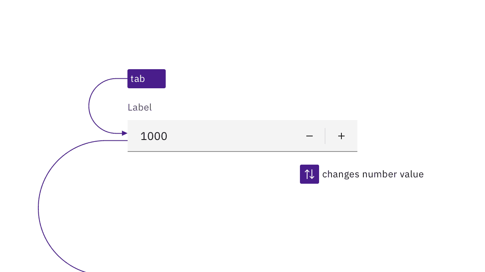
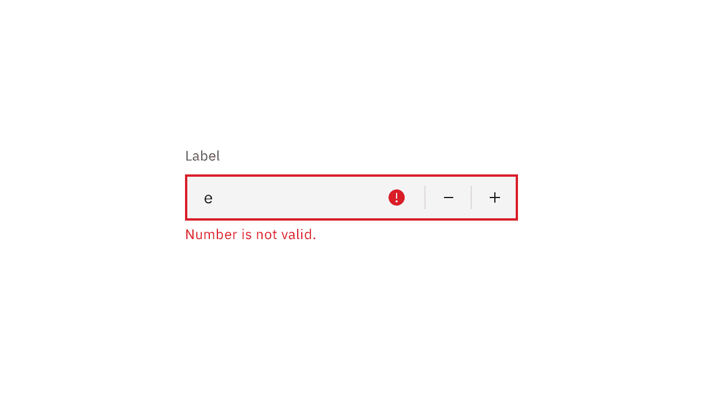
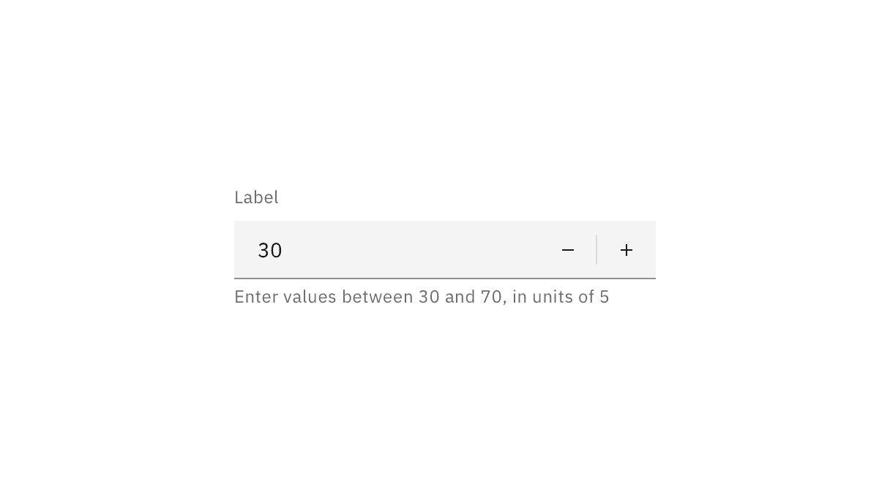

import {
  StructuredListWrapper,
  StructuredListHead,
  StructuredListBody,
  StructuredListRow,
  StructuredListInput,
  StructuredListCell,
  OrderedList,
  ListItem,
} from '@carbon/react';

<PageDescription>

Design annotations are needed for specific instances shown below, but for the
standard progress bar component, Carbon already incorporates accessibility.

</PageDescription>

<AnchorLinks>

<AnchorLink>What Carbon provides</AnchorLink>
<AnchorLink>Design recommendations</AnchorLink>
<AnchorLink>Development considerations</AnchorLink>

</AnchorLinks>

## What Carbon provides
Carbon bakes keyboard operation into its components, improving the experience of blind users and others who operate via the keyboard. Carbon incorporates many other accessibility considerations, some of which are described below.

### Keyboard interaction

The Carbon number input replicates the behavior of the stock HTML component. The number input takes a single tab stop. The +/- buttons are not in the tab order, but can take focus (when clicked). When the input has focus, the arrow keys give keyboard users the same ability to incrementally adjust the values. As well, users can directly type numeric values in the input. Only numerals are allowed to be entered.

<Row>
<Column colLg={8}>

<Caption>
  The number input is reachable by Tab and changed with the arrow keys or by directly entering a number.
</Caption>

</Column>
</Row>

### Error handling
Carbon provides errors and warning messages to assistive technology. This is an improvement on the stock HTML number input, which simply prevents the typing of alphabetic characters without explanation. Carbon also adds an error or warning icon and puts error messages in red as a further visual cue.

<Row>
<Column colLg={8}>

<Caption>
  Messages are surfaced to assistive technologies, and color alone is not used to visually signal errors.
</Caption>

</Column>
</Row>

## Design recommendations

Design annotations are needed for the following instance.

### Cue users for value and step
Carbon offers the ability for the author to set minimum and maximum values for the input. A step value can also be set, which causes the value to increment by any amount. When setting limits on number entry, designers should warn the user in advance, instead of users discovering limits through an error message. This is particularly important for step values other than 1 (which should be avoided, where possible), as if a user's typed value does not match the step increment, it will be disallowed for no apparent reason.

<Row>
<Column colLg={8}>

<Caption>
  Notify users of allowable input ranges through helper text.
</Caption>

</Column>
</Row>

### Reduce the width of the number input

Carbon’s default number input component is the same width as the default text input, yet numbers typically take up much less space. The + and - buttons are the primary user cue for a number input; however, people with low vision who use magnification may not see this cue if the buttons and label are not visible in their viewport at the same time. Where possible, reduce the width of the number field to improve its accessibility.

<Row>
<Column colLg={8}>

<Caption>
  Where possible reduce the width of number inputs.
</Caption>

</Column>
</Row>

## Development considerations

Keep this in mind if you’re modifying Carbon or creating a custom component.

- Carbon uses `aria-describedby` to associate the helper text and error messages with the input.
- The red error SVG icons have `aria-hidden="true"` set, since the helper text provides the same information.