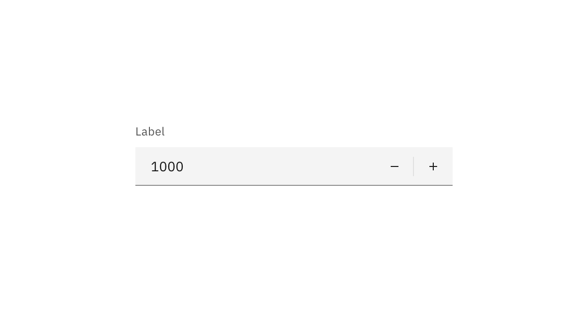
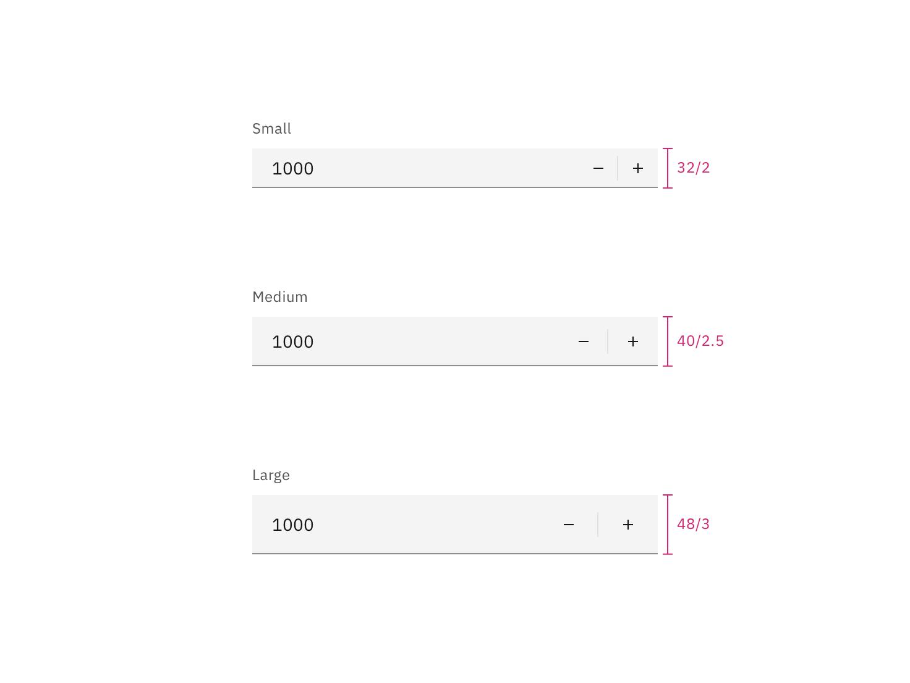

## Color

Inputs come in two different colors. The default input color is `$field` and is
used on `$background` and `$overlay` page backgrounds.

| Class                              | Property         | Color token         |
| ---------------------------------- | ---------------- | ------------------- |
| `.bx--label`                       | text color       | `$text-secondary`   |
| `.bx--number input[type='number']` | text color       | `$text-primary`     |
| `.bx--number`                      | background-color | `$field` \*         |
| `.bx--number`                      | border-bottom    | `$border-strong` \* |
| `.bx--number__controls`            | svg color        | `$icon-primary`     |

<Caption>
  * Denotes a contextual color token that will change values based on the layer
  it is placed on.
</Caption>

<Caption>Number input example</Caption>

### Interactive states

| Class                                       | Property         | Color token      |
| ------------------------------------------- | ---------------- | ---------------- |
| `.bx--number:focus`                         | border           | `$focus`         |
| `.bx--number__controls:focus`               | border           | `$focus`         |
| `[data-invalid]`                            | border           | `$support-error` |
| `[data-invalid]:focus`                      | color            | `$support-error` |
| `.bx--form-requirement`                     | text color       | `$support-error` |
| `.bx--label:disabled`                       | text color       | `$text-disabled` |
| `.bx--number:disabled`                      | background-color | `$field` \*      |
| `.bx--number:disabled`                      | border-bottom    | transparent      |
| `.bx--number input[type='number']:disabled` | text color       | `$text-disabled` |

## Typography

Number input labels should use sentence case, with only the first word in a
phrase and any proper nouns capitalized.

| Element       | Font-size (px/rem) | Font-weight   | Type token  |
| ------------- | ------------------ | ------------- | ----------- |
| Label         | 12 / 0.75          | Regular / 400 | `$label-01` |
| Field input   | 14 / 0.875         | Regular / 400 | `$code-02`  |
| Error message | 12 / 0.75          | Regular / 400 | `$label-01` |

## Structure

The add and subtract icons can be found in the
[icons](/guidelines/icons/library) library.

| Class                              | Property                    | px / rem | Spacing token |
| ---------------------------------- | --------------------------- | -------- | ------------- |
| `.bx--label`                       | margin-bottom               | 8 / 0.5  | `$spacing-03` |
| `.bx--number input`                | height                      | 40 / 2.5 | –             |
| `.bx--number input[type='number']` | padding-left                | 16 / 1   | `$spacing-05` |
| `.bx--number__controls`            | padding-left, padding-right | 16 / 1   | `$spacing-05` |
| `.bx--number`                      | border-bottom               | 1px      | –             |

<Caption>
  Structure and spacing measurements for a number input | px / rem
</Caption>

## Sizes

The height varies for each size variant and the the width varies based on
content, layout, and design.

| Element | Size        | Height (px/rem) |
| ------- | ----------- | --------------- |
| Field   | Small (sm)  | 32 / 2          |
|         | Medium (md) | 40 / 2.5        |
|         | Large (lg)  | 48 / 3          |

<Caption>Sizes for number input fields | px / rem</Caption>
