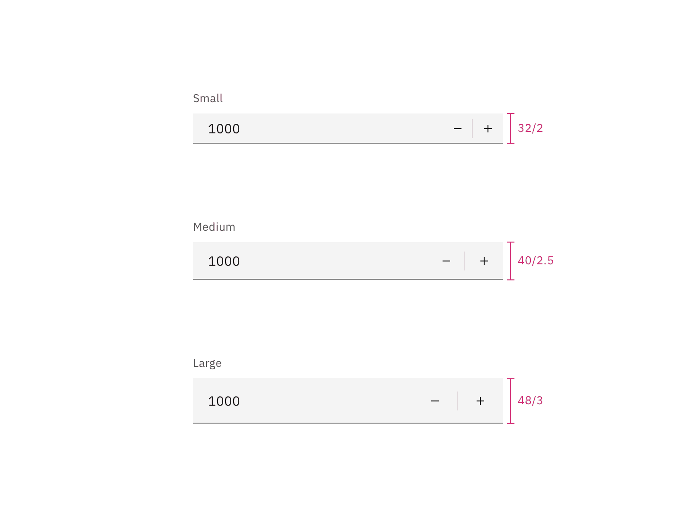

## Color

| Element  | Property         | Color token         |
| -------- | ---------------- | ------------------- |
| Label    | text color       | `$text-secondary`   |
| Number   | text color       | `$text-primary`     |
| Field    | background-color | `$field` \*         |
|          | border-bottom    | `$border-strong` \* |
| Controls | svg color        | `$icon-primary`     |

<Caption>
  * Denotes a contextual color token that will change values based on the layer
  it is placed on.
</Caption>

<Row>
<Column colLg={8}>

</Column>
</Row>

<Caption>Number input example.</Caption>

### Interactive states

| Element         | Property         | Color token       |
| --------------- | ---------------- | ----------------- |
| Controls:hover  | background-color | `field-hover`     |
| Field:focus     | border           | `$focus`          |
| Controls:focus  | border           | `$focus`          |
| Field:invalid   | border           | `$support-error`  |
| Error icon      | svg              | `$support-error`  |
| Error message   | text color       | `$text-error`     |
| Warning icon    | svg              | `support-warning` |
| Warning message | text color       | `text-primary`    |
| Label:disabled  | text color       | `$text-disabled`  |
| Field:disabled  | background-color | `$field` \*       |
|                 | border-bottom    | transparent       |
| Number          | text color       | `$text-disabled`  |

<Row>
<Column colLg={12}>

</Column>
</Row>

<Caption>Number input states example.</Caption>

## Typography

Number input labels should use sentence case, with only the first word in a
phrase and any proper nouns capitalized.

| Element       | Font-size (px/rem) | Font-weight   | Type token  |
| ------------- | ------------------ | ------------- | ----------- |
| Label         | 12 / 0.75          | Regular / 400 | `$label-01` |
| Field input   | 14 / 0.875         | Regular / 400 | `$code-02`  |
| Error message | 12 / 0.75          | Regular / 400 | `$label-01` |

## Structure

The add and subtract icons can be found in the
[icons](/guidelines/icons/library) library.

| Element         | Property                    | px / rem | Spacing token |
| --------------- | --------------------------- | -------- | ------------- |
| Label           | margin-bottom               | 8 / 0.5  | `$spacing-03` |
| Field (default) | height                      | 40 / 2.5 | –             |
|                 | border-bottom               | 1px      | –             |
| Number          | padding-left                | 16 / 1   | `$spacing-05` |
| Controls        | padding-left, padding-right | 16 / 1   | `$spacing-05` |

<Caption>
  Structure and spacing measurements for a number input | px / rem
</Caption>

## Sizes

The height varies for each size variant and the the width varies based on
content, layout, and design.

| Element | Size        | Height (px/rem) |
| ------- | ----------- | --------------- |
| Field   | Small (sm)  | 32 / 2          |
|         | Medium (md) | 40 / 2.5        |
|         | Large (lg)  | 48 / 3          |

<Caption>Sizes for number input fields | px / rem</Caption>
