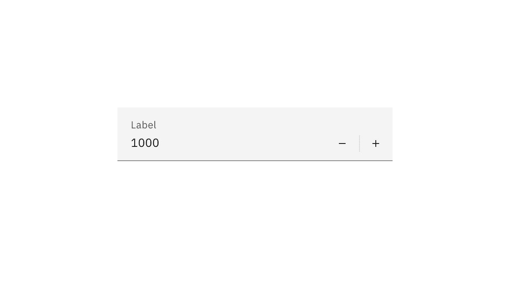
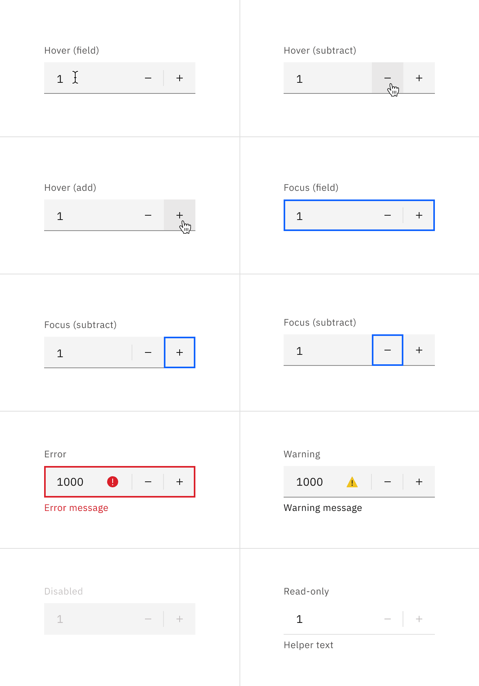
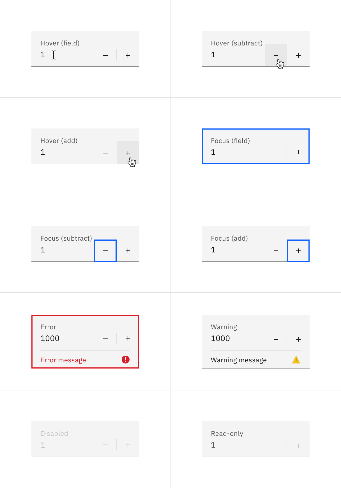
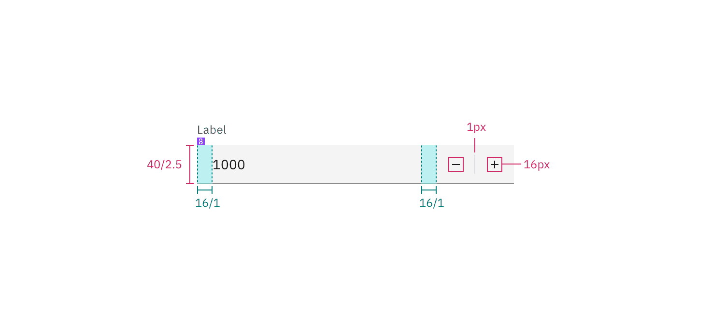
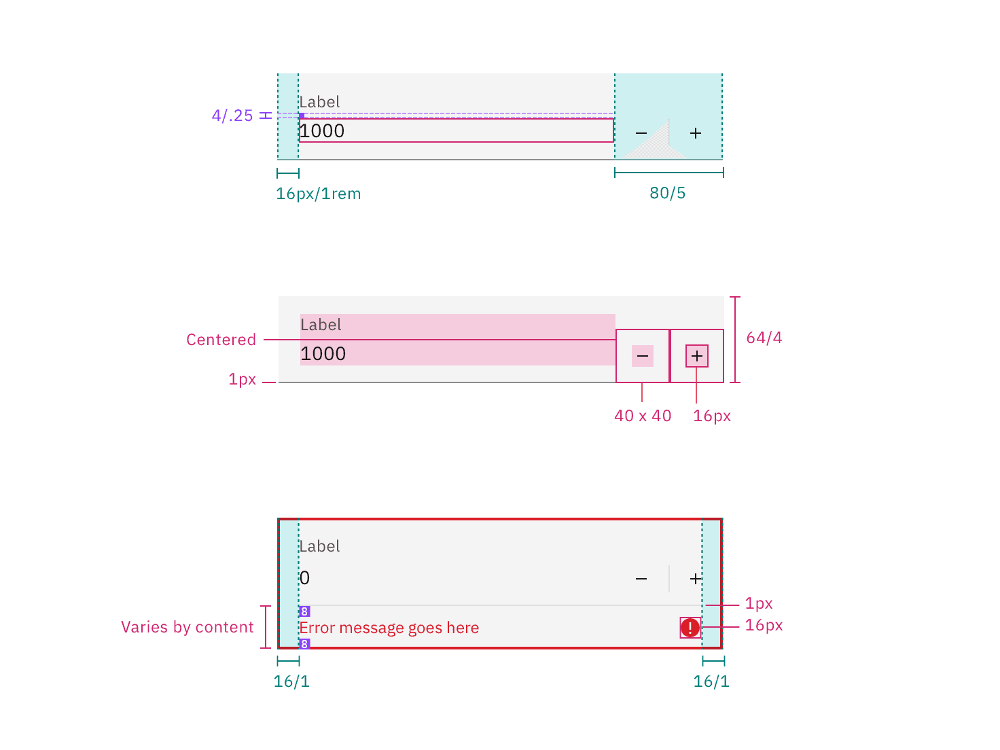

## Color

| Element  | Property         | Color token         |
| -------- | ---------------- | ------------------- |
| Label    | text color       | `$text-secondary`   |
| Number   | text color       | `$text-primary`     |
| Field    | background-color | `$field` \*         |
|          | border-bottom    | `$border-strong` \* |
| Controls | svg color        | `$icon-primary`     |

<Caption>
  * Denotes a contextual color token that will change values based on the layer
  it is placed on.
</Caption>

<Row>
<Column colLg={8}>

<Tabs>

<Tab label="Default">

</Tab>

<Tab label="Fluid">

</Tab>

</Tabs>

</Column>
</Row>

### Interactive states

| State     | Element         | Property                   | Color token         |
| --------- | --------------- | -------------------------- | ------------------- |
| Hover     | Controls        | background-color           | `field-hover` \*    |
| Focus     | Field           | border                     | `$focus`            |
|           | Controls        | border                     | `$focus`            |
| Invalid   | Field           | border                     | `$support-error`    |
|           | Error icon      | svg                        | `$support-error`    |
|           | Error message   | text color                 | `$text-error`       |
| Warning   | Warning icon    | svg                        | `support-warning`   |
|           | Warning message | text color                 | `text-primary`      |
| Disabled  | Label           | text color                 | `$text-disabled`    |
|           | Field           | background-color           | `$field` \*         |
|           |                 | border-bottom (default)    | transparent         |
|           |                 | border-bottom (fluid)      | `$border-subtle` \* |
|           | Number          | text color                 | `$text-disabled`    |
|           | Controls        | svg color                  | `$icon-disabled`    |
| Read-only | Field           | background-color (default) | transparent         |
|           |                 | background-color (fluid)   | `$field` \*         |
|           |                 | border-bottom              | `$border-subtle` \* |
|           | Number          | text color (default)       | `$text-primary`     |
|           |                 | text color (fluid)         | `$text-secondary`   |
|           | Controls        | svg color                  | `$icon-disabled`    |

<Row>
<Column colLg={8}>

<Tabs>

<Tab label="Default">

</Tab>

<Tab label="Fluid">

</Tab>

</Tabs>

</Column>
</Row>

<Caption>Number input states example.</Caption>

## Typography

Number input labels should use sentence case, with only the first word in a
phrase and any proper nouns capitalized.

| Element         | Font-size (px/rem) | Font-weight   | Type token         |
| --------------- | ------------------ | ------------- | ------------------ |
| Label           | 12 / 0.75          | Regular / 400 | `$label-01`        |
| Field input     | 14 / 0.875         | Regular / 400 | `$body-compact-01` |
| Error message   | 12 / 0.75          | Regular / 400 | `$label-01`        |
| Warning message | 12 / 0.75          | Regular / 400 | `$label-01`        |
| Helper text     | 12 / 0.75          | Regular / 400 | `$helper-text-01`  |

## Structure

### Default input

The add and subtract icons can be found in the
[icons](/guidelines/icons/library) library.

| Element         | Property                    | px / rem | Spacing token |
| --------------- | --------------------------- | -------- | ------------- |
| Label           | margin-bottom               | 8 / 0.5  | `$spacing-03` |
| Field (default) | height                      | 40 / 2.5 | –             |
|                 | border-bottom               | 1px      | –             |
| Number          | padding-left                | 16 / 1   | `$spacing-05` |
| Controls        | padding-left, padding-right | 16 / 1   | `$spacing-05` |

<Caption>
  Structure and spacing measurements for a default number input | px / rem
</Caption>

### Fluid input

| Element               | Property                    | px / rem    | Spacing token |
| --------------------- | --------------------------- | ----------- | ------------- |
| Label                 | padding-bottom              | 4 / 0.25    | `$spacing-02` |
| Field                 | height                      | 64 / 4      | `$spacing-10` |
|                       | padding-left, padding-right | 16 / 1      | `$spacing-05` |
|                       | padding-top, padding-bottom | 13 / 0.8125 | –             |
|                       | border-bottom               | 1px         | –             |
| Add or substract icon | height, width               | 16 / 1      | –             |
| Focus                 | border                      | 2px         | –             |
| Error                 | border                      | 2px         | –             |
|                       | padding-top, padding-bottom | 8 / 0.5     | `$spacing-03` |

<Caption>
  Structure and spacing measurements for a fluid number input | px / rem
</Caption>

## Sizes

### Default input heights

The height varies for each size variant and the width varies based on content,
layout, and design.

| Element | Size        | Height (px/rem) |
| ------- | ----------- | --------------- |
| Field   | Small (sm)  | 32 / 2          |
|         | Medium (md) | 40 / 2.5        |
|         | Large (lg)  | 48 / 3          |

<Caption>Sizes for number input fields | px / rem</Caption>
