import A11yStatus from 'components/A11yStatus';

<PageDescription>

Number input lets users enter a numeric value and incrementally increase or
decrease the value with a two-segment control.

</PageDescription>

<InlineNotification>

Number input
[with AI label](https://react.carbondesignsystem.com/?path=/story/components-numberinput--with-ai-label)
is now stable. This addition changes the visual appearance of the component and
introduces an AI explainability feature when AI is present in the component. See
the [AI presence](/components/number-input/usage/#ai-presence) section for more
details.

</InlineNotification>

<AnchorLinks>

<AnchorLink>Live demo</AnchorLink>
<AnchorLink>Overview</AnchorLink>
<AnchorLink>Formatting</AnchorLink>
<AnchorLink>Content</AnchorLink>
<AnchorLink>Behaviors</AnchorLink>
<AnchorLink>AI presence</AnchorLink>
<AnchorLink>Related</AnchorLink>
<AnchorLink>References</AnchorLink>
<AnchorLink>Feedback</AnchorLink>

</AnchorLinks>

## Live demo

<StorybookDemo
  themeSelector
  url="https://react.carbondesignsystem.com"
  variants={[
    {
      label: 'Default',
      variant: 'components-numberinput--default',
    },
    {
      label: 'Fluid (unstable)',
      variant: 'experimental-unstable-fluidnumberinput--default',
    },
    {
      label: 'With AI label',
      variant: 'components-numberinput--with-ai-label',
    },
  ]}
/>

<A11yStatus
  layout="cards"
  components={['Number input', 'Fluid number input']}
/>

## Overview

Number inputs are similar to text inputs, but are used to specify only a numeric
value. Number inputs incrementally increase or decrease the value with a
two-segment control. Number input reduces input efforts for adjusting small
values.

<Row>
<Column colLg={8}>

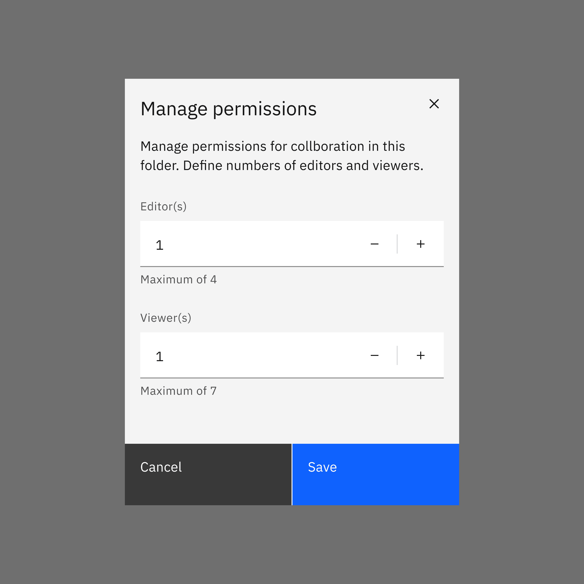

</Column>
</Row>

### When to use

- The user needs to input a numeric value
- Adjusting small values when increasing or decreasing them requires only a few
  clicks
- When users may not know exact values and only want to change the values that
  are relative to its current state

### When not to use

- It is best practice not to use number input if large value changes are
  expected. For example, when the value sets from 1 to 30, number input is not a
  great option because it requires many clicks to reach 30. In this case, use
  [slider](https://carbondesignsystem.com/components/slider/usage/) when numeric
  values are large or when there is a wide range of numeric options.
- It is also best to avoid number input for continuous variables such as prices,
  distances, lengths, or human heights. When the exact value is important to
  specify within a wide range, use
  [text input](https://carbondesignsystem.com/components/text-input/usage/)
  instead.

## Formatting

### Anatomy

<Row>
<Column colLg={8}>

<Tabs>

<Tab label="Default">

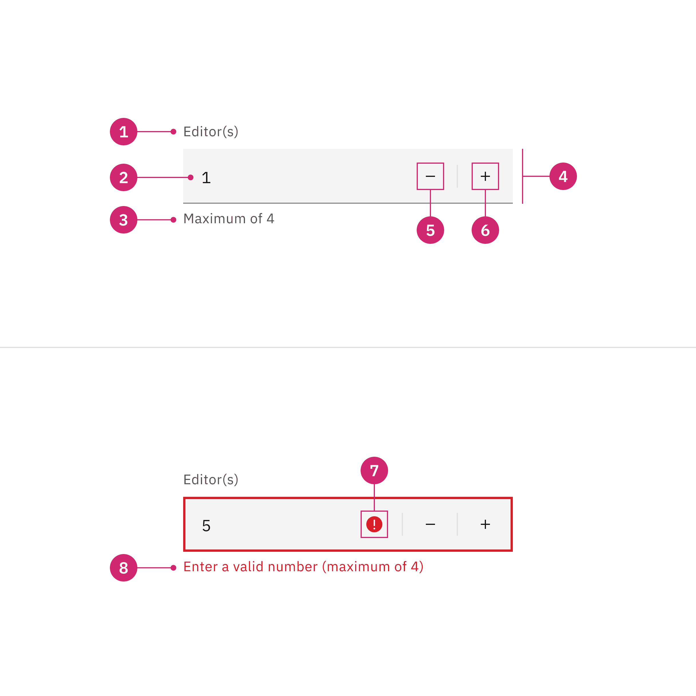

</Tab>

<Tab label="Fluid">

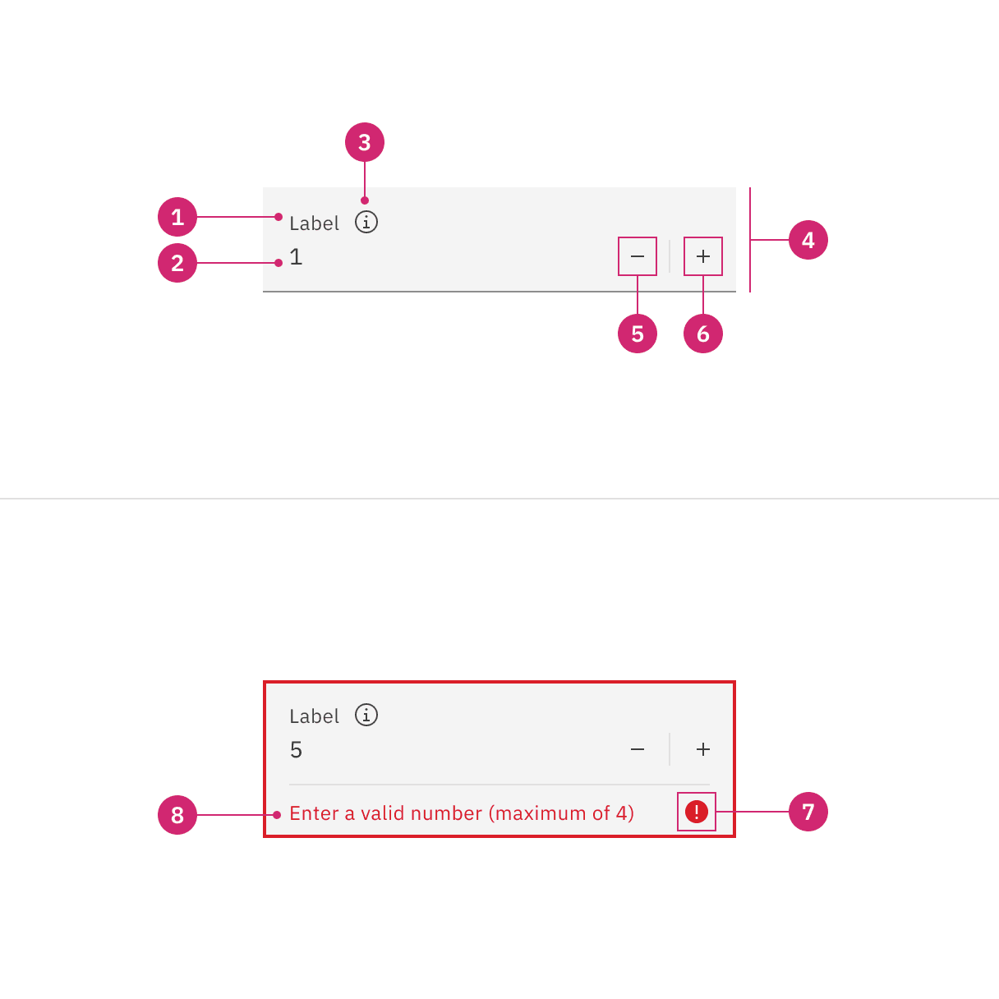

</Tab>

</Tabs>

</Column>
</Row>

1. **Label**: Text that informs the user about the content they need to enter in
   the field. It is required unless you get an approved accessibility exemption.
2. **Numeric value**: The value changes when user enters a value into the field
   or uses the subtract or add controls.
3. **Helper text**: Assistive text that can provide additional aid or context to
   the user. Often used to explain the correct data format.
4. **Field**: The container in which a user enters data.
5. **Subtract icon**: This icon triggers decremental values.
6. **Add icon**: This icon triggers incremental values.
7. **Status icon**: Indicates the state of the number input, either error or
   warning.
8. **Error or Warning text**: It replaces the helper text when an error or
   warning state appears.

### Styling

There are two styles of number inputs, default and fluid. They share the same
functionality but look visually different, influencing where to use them.

| Style   | Appearance                                                                                                               | Use case                                                                                                                                         |
| ------- | ------------------------------------------------------------------------------------------------------------------------ | ------------------------------------------------------------------------------------------------------------------------------------------------ |
| Default | A traditional style where the label is positioned outside and above the input field.                                     | Use when white space is needed between input components or in productive moments where space is at a premium, and smaller components are needed. |
| Fluid   | An alternative style where the label is placed inside of the input field and is stacked inline with the user input text. | Use in expressive moments, fluid forms, contained spaces, or attached to complex components, like a toolbar.                                     |

<Row>
<Column colLg={8}>

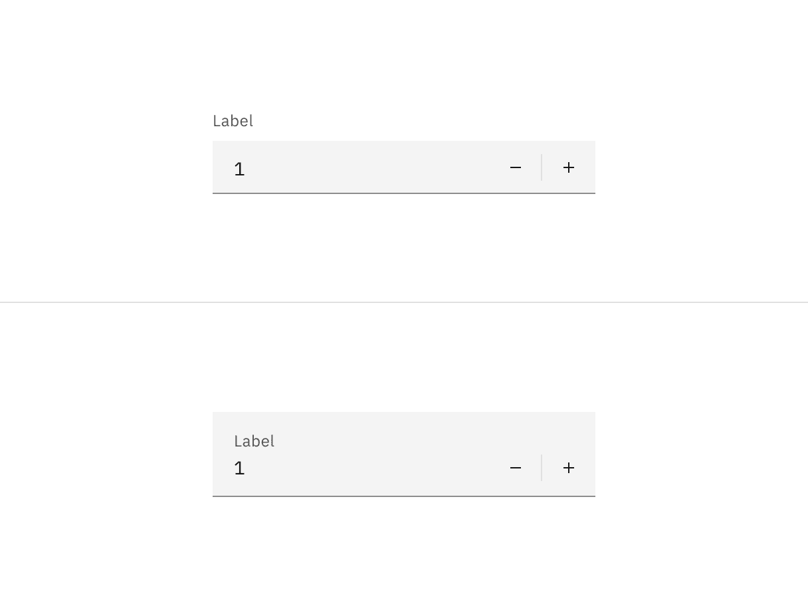

</Column>
</Row>

<Caption>
  A default style input is shown on the left and fluid style is on the right.
</Caption>

### Sizing

#### Default input heights

Number input has three sizes default input heights: **small**, **medium**, and
**large**. The width varies in size based on content, layout, and design.

| Size        | Height (px/rem) | Use case                                                                                                                                              |
| ----------- | --------------- | ----------------------------------------------------------------------------------------------------------------------------------------------------- |
| Small (sm)  | 32 / 2          | Use when space is constricted or when placing a number input in a form that is long and complex.                                                      |
| Medium (md) | 40 / 2.5        | This is the default size and the most commonly used size. When in doubt, use the medium size.                                                         |
| Large (lg)  | 48 / 3          | Use when there is a lot of space to work with. The large size is typically used in simple forms or when a number input is placed by itself on a page. |

<Row>
<Column colLg={8}>

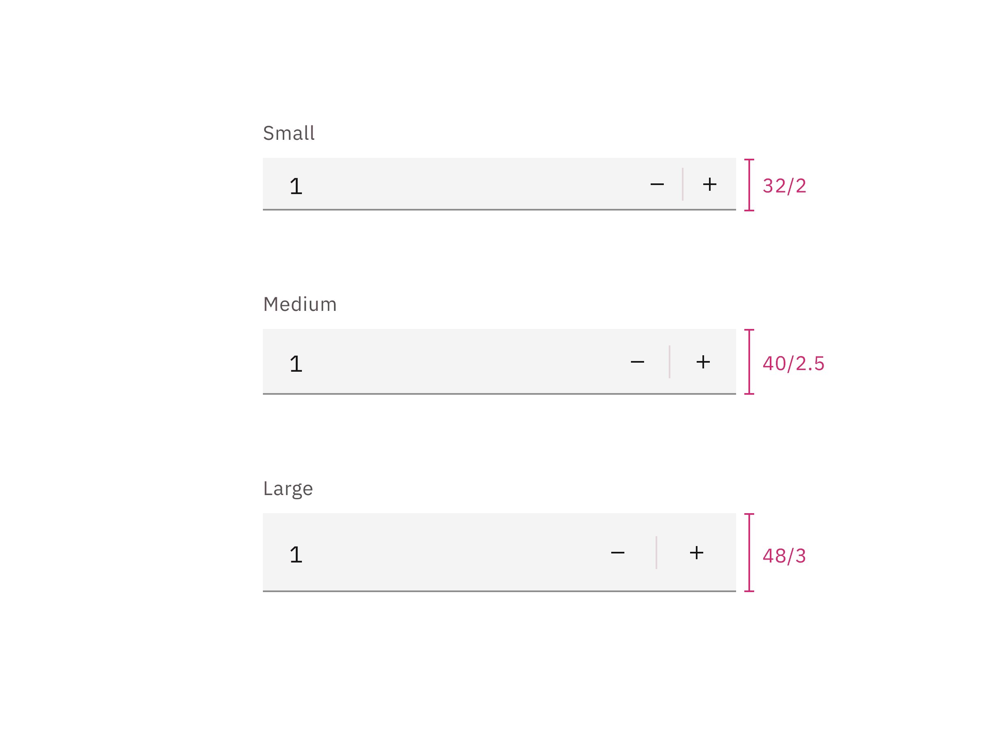

</Column>
</Row>

#### Fluid input heights

There is only one fluid input height and it is visually larger than the default
heights. The input is a set height of 64px except when a warning or error
message has been added to the bottom.

<Row>
<Column colLg={8}>

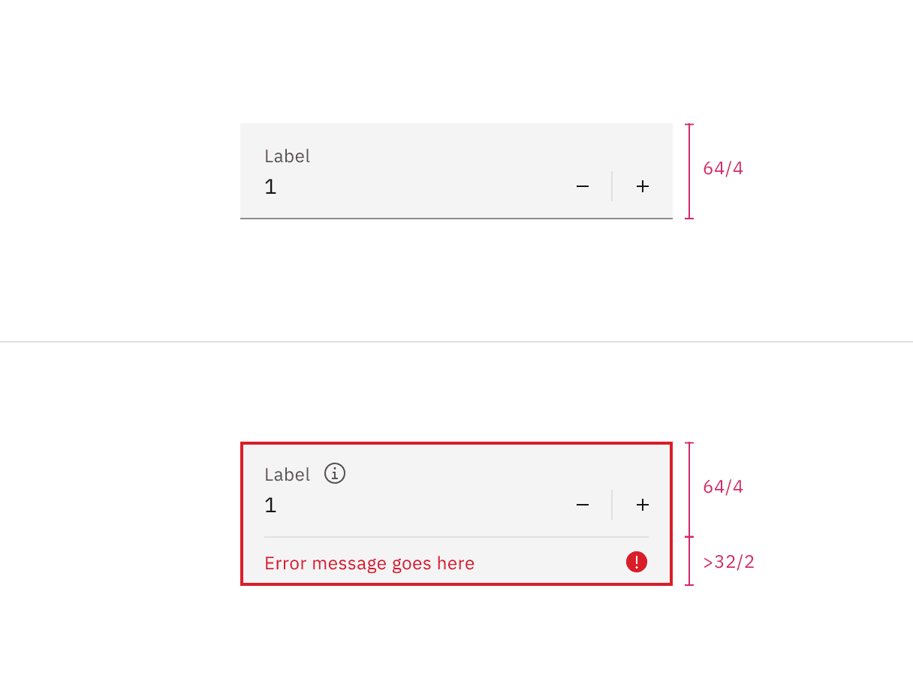

</Column>
</Row>

## Content

### Main elements

#### Label

- Always include a label so that users know how to complete the field
- Keep the label short and concise
- Use sentence-style capitalization for the label

<DoDontRow>
  <DoDont type="do" caption="Do include a label">

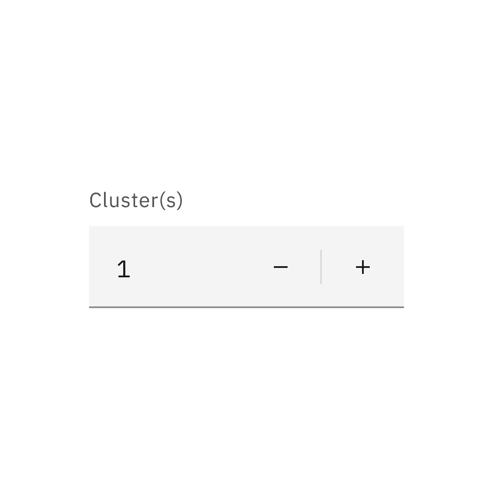

  </DoDont>
  <DoDont type="dont" caption="Do not hide a label that helps user understand the context of number input">

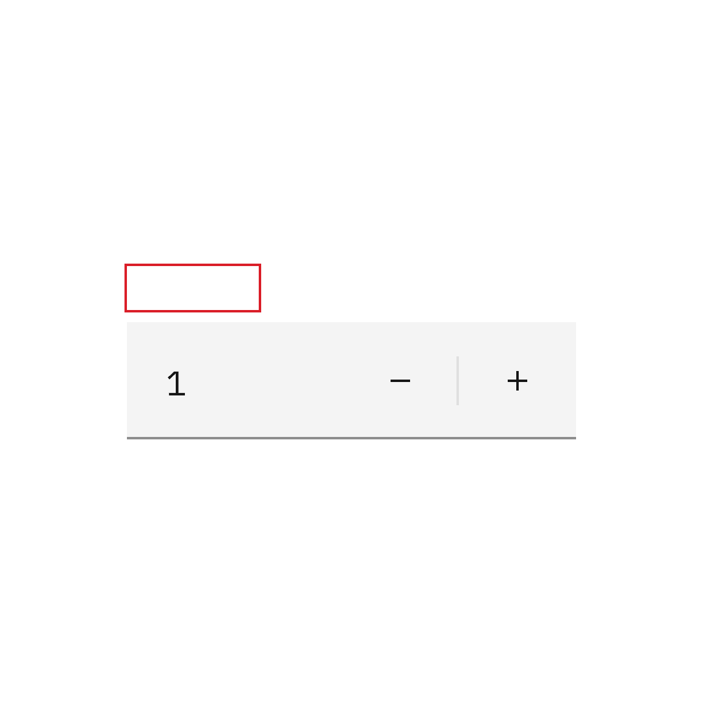

  </DoDont>
</DoDontRow>

#### Helper text

- Indicates the input value if it has a maximum or minimum
- Helper text is optional but if present will be replaced by warning and error
  messages when needed

#### Overflow content

Label, numeric value, and helper text should be short and not exceed two lines.

## Behaviors

### States

The number input has a series of states for both field and controls elements:
**enabled**, **hover**, **focus**, **error**, **warning**, **disabled**, and
**read-only**.

| State       | When to use                                                                                                                                                                                                                                                                                   |
| ----------- | --------------------------------------------------------------------------------------------------------------------------------------------------------------------------------------------------------------------------------------------------------------------------------------------- |
| _Enabled_   | When the number input is live but a user is not directly interacting with it. This is commonly referred to as the default or normal state of the component. An enabled number input field should contain a default value.                                                                     |
| _Hover_     | When a user's mouse cursor is hovering over the field or the button controls.                                                                                                                                                                                                                 |
| _Focus_     | When a user tabs to or clicks on the number input, the field or controls become focused, indicating the user has successfully navigated to the component.                                                                                                                                     |
| _Error_     | When the required number input has not been filled in. It can also be triggered due to a system error. This state requires a user response before data can be submitted or saved.                                                                                                             |
| _Warning_   | When you need to call the user's attention to an exception condition. The condition might not be an error but can cause problems if not resolved.                                                                                                                                             |
| _Disabled_  | When the user cannot interact with a component and all interactive functions have been removed. Unlike read-only states, disabled states are not focusable, are not read by screen readers, and do not need to pass visual contrast, making them inaccessible if they need to be interpreted. |
| _Skeleton_  | Use on an initial page load to indicate that the number input has not yet fully loaded.                                                                                                                                                                                                       |
| _Read-only_ | When the user can review but not modify the component. This state removes all interactive functions like the disabled state but can still be focusable, accessible by screen readers, and passes visual contrast for readability.                                                             |

<Row>
<Column colLg={8}>

<Tabs>

<Tab label="Default">

</Tab>

<Tab label="Fluid">

</Tab>

</Tabs>

</Column>
</Row>

### Interactions

#### Mouse

Users can click on the input field and change the value by typing inside the
input field. Users can also increase or decrease the values by pressing on the
add or subtract icon controls.

<Row>
<Column colLg={8}>

<Tabs>

<Tab label="Default">

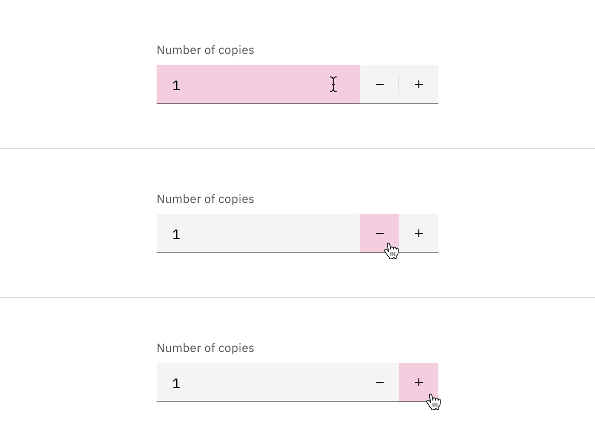

</Tab>

<Tab label="Fluid">

</Tab>

</Tabs>

</Column>
</Row>

#### Keyboard

Users can navigate to the number input field by pressing `Tab`. Users can then
increase the value by pressing `Up arrow` or decrease the value by pressing
`Down arrow`.

### Validation

#### Invalid

An error state is triggered if the data is invalid or a required field is left
empty. Error states have three visual indicators to signify invalid content: a
red border, an error icon indicator, and an error message.

<Row>
<Column colLg={8}>

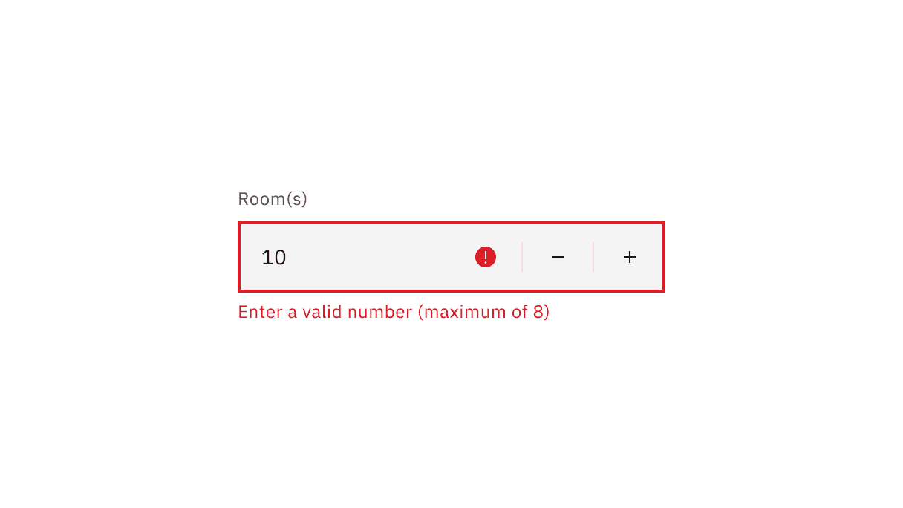

</Column>
</Row>

### Default values

Numeric input should always have a default. The default will usually be ‘1’.
Sometimes, you will have input value defaulted to ‘0’. For example, when booking
a hotel room, it may set the default number of adults as ‘1’ and the default
number of children as ‘0’.

<Row>
  <DoDont type="do" caption="Do set a clear default that most users are likely to select">

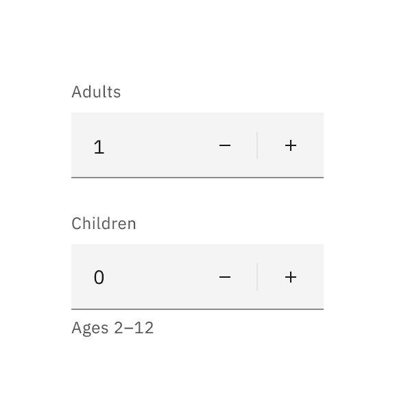

  </DoDont>
  <DoDont type="dont" caption="Do not leave value input blank">

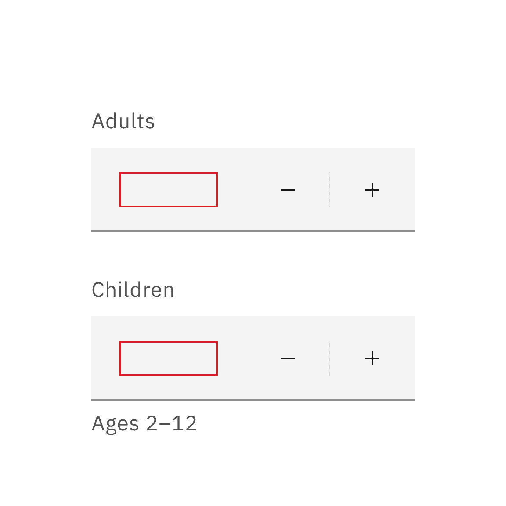

  </DoDont>
</Row>

## AI presence

Number input has a modification that takes on the AI visual styling when the AI
label is present in the input. The AI variant of number input functions the same
as the normal version except with the addition of the AI label which is both a
visual indicator and the trigger for the explainability popover.

For more information on designing for AI, see the
[Carbon for AI](/guidelines/carbon-for-ai/) guidelines.

<Row>
<Column colLg={8}>

<Tabs>

<Tab label="Default">

</Tab>

<Tab label="Fluid">

</Tab>

</Tabs>

</Column>
</Row>

### Revert to AI

A number input can toggle between the AI variant and the non-AI variant
depending on the user’s interaction. If the user manually overrides the
AI-suggested content then the input will change from the AI variant to the
non-AI variant. Once edited, the user should still be able to switch back to the
initially AI generated content via a revert to AI button.

<Row>
<Column colLg={8}>

<Tabs>

<Tab label="Default">

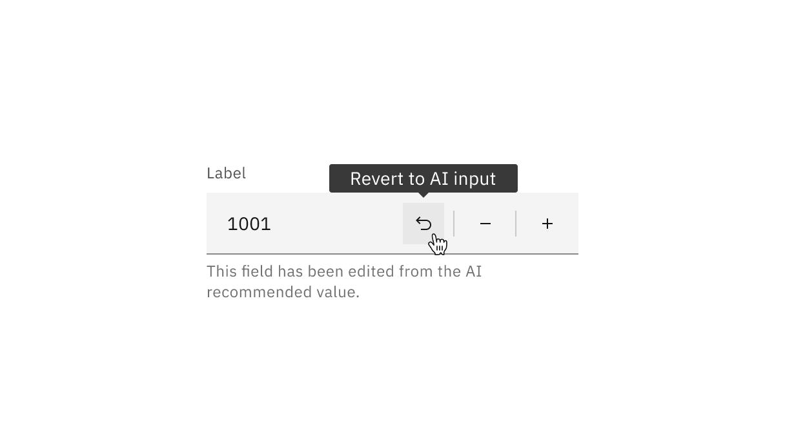

</Tab>

<Tab label="Fluid">

</Tab>

</Tabs>

</Column>
</Row>

## Related

- Use [slider](https://carbondesignsystem.com/components/slider/usage/) when
  numeric values are large or when there is a wide range of numeric options.
- When the exact value is important to specify within a wide range, use
  [text input](https://carbondesignsystem.com/components/text-input/usage/)
  instead.

## References

Yuxuan (Tammy) Zhou,
[Design Guidelines for Input Steppers](https://www.nngroup.com/articles/input-steppers/)
(Nielsen Norman Group, 2018)

## Feedback

Help us improve this component by providing feedback, asking questions, and
leaving any other comments on
[GitHub](https://github.com/carbon-design-system/carbon-website/issues/new?assignees=&labels=feedback&template=feedback.md).
